

  <strong>UNIVERSIDAD PERUANA DE CIENCIAS APLICADAS</strong>

  

  Ingeniería de Software  
  2026-10  
  1ASI0657-2610-7944 | Fundamentos de arquitectura de software
 
  NRC: 7944   
  Profesor: Abel Nehemias Rosales Caururu
   
  "Informe de Trabajo Final"  
  Startup:BodyMatch
   
  Producto:  BodyMatch AI
   

 

<strong>Relación de integrantes:</strong>

<table align="center">
  <thead>
    <tr>
      <th>Integrante</th>
      <th>Código</th>
    </tr>
  </thead>
  <tbody>
    <tr>
      <td>Pablo Antonio Geronimo Quispe</td>
      <td>U202313433</td>
    </tr>
    <tr>
      <td>Anyelo Bill Alejos Jesus</td>
      <td>U20231D149</td>
    </tr>
    <tr>
      <td>Piero Francesco Tenorio Medina</td>
      <td>U202318731
</td>
    </tr>
    <tr>
      <td>Marcia Victoria Melgarejo Gomez</td>
      <td>U20231C505</td>
    </tr>
    <tr>
      <td>Jorge Enrique Guevara Tejada</td>
      <td>U202316057</td>
    </tr>
  </tbody>
</table>

  

  <strong>Abril, 2026</strong>  
  <strong>URL del proyecto:</strong>

---

## Registro de Versiones del Informe

| Versión | Fecha      | Autor                          | Descripción                                                                 |
|---------|------------|--------------------------------|------------------------------------------------------------------------------|
| TB1     | 09/04/2026 | Pablo Antonio Geronimo Quispe  | Desarrollo de la carátula, tabla de contenidos y estructura general del informe. |
| TB1     | 15/04/2026 | Anyelo Bill Alejos Jesus       | Desarrollo del análisis competitivo, entrevistas y creación de User Personas, Empathy Maps y User Task Matrix. |
| TB1     | 16/04/2026 | Piero Francesco Tenorio Medina | Desarrollo de escenarios As Is - To Be, además del desarrollo del Product Backlog. |
| TB1     | 14/04/2026 | Jorge Enrique Guevara Tejada   | Desarrollo del Lean UX Process, incluyendo la elaboración del Problem Statement, Assumptions, Hypothesis y Lean UX Canvas. |
| TB1     | 16/04/2026 | Marcia Melgarejo Gomez         | Desarrollo de las Épicas y User Stories. |    
| Avn2 | 25/04/2026  | Piero Francesco Tenorio Medina | Avance del Diagrama de Clases |
|Avn2|27/04/2026| Piero Francesco Tenorio Medina | Avance de la Primera Versión del Diagrama de Clases  |

## Contenido

### Tabla de contenidos

- [Registro de Versiones del Informe](#registro-de-versiones-del-informe)
- [Project Report Collaboration Insights](#project-report-collaboration-insights)
- [Contenido](#contenido)
- [Tabla de contenidos](#tabla-de-contenidos)
- [Student Outcome](#student-outcome)

- [Capítulo I: Introducción](#capítulo-i-introducción)
  - [1.1. Startup Profile](#11-startup-profile)
    - [1.1.1. Descripción de la Startup](#111-descripción-de-la-startup)
    - [1.1.2. Perfiles de integrantes del equipo](#112-perfiles-de-integrantes-del-equipo)
  - [1.2. Solution Profile](#12-solution-profile)
    - [1.2.1. Nombre del producto](#121-nombre-del-producto)
    - [1.2.2. Antecedentes y problemática](#122-antecedentes-y-problemática)
    - [1.2.3. Lean UX Process](#123-lean-ux-process)
      - [1.2.3.1. Lean UX Problem Statement](#1231-lean-ux-problem-statement)
      - [1.2.3.2. Lean UX Assumptions](#1232-lean-ux-assumptions)
      - [1.2.3.3. Lean UX Hypothesis](#1233-lean-ux-hypothesis)
      - [1.2.3.4. Lean UX Canvas](#1234-lean-ux-canvas)
  - [1.3. Segmentos objetivo](#13-segmentos-objetivo)

- [Capítulo II: Requirements & Analysis](#capítulo-ii-requirements--analysis)
  - [2.1. Competidores](#21-competidores)
  - [2.2. Entrevistas](#22-entrevistas)
  - [2.3. Needfinding](#23-needfinding)
    - [2.3.1. User Personas](#231-user-personas)
    - [2.3.2. User Task Matrix](#232-user-task-matrix)
    - [2.3.3. Empathy Maps](#233-empathy-maps)
    - [2.3.4. As-Is Scenario Mapping](#234-as-is-scenario-mapping)

- [Capítulo III: Requirements Specification](#capítulo-iii-requirements-specification)
  - [3.1. To-Be Scenario Mapping](#31-to-be-scenario-mapping)
  - [3.2. User Stories](#32-user-stories)
  - [3.3. Impact Map](#33-impact-map)
  - [3.4. Product Backlog (Avance 1)](#34-product-backlog-avance-1)

- [Capítulo IV: Product Architecture Design](#capítulo-iv-product-architecture-design)
  - [4.1. Design Concepts, ViewPoints & ER Diagrams](#41-design-concepts-viewpoints--er-diagrams)
    - [4.1.1. Principles Statements](#411-principles-statements)
    - [4.1.2. Approaches Statements Architectural Styles & Patterns](#412-approaches-statements-architectural-styles--patterns)
    - [4.1.3. Context Diagram](#413-context-diagram)
    - [4.1.4. Approach Driven ViewPoints Diagrams](#414-approach-driven-viewpoints-diagrams)
    - [4.1.5. Relational/Non-Relational Database Diagram](#415-relationalnon-relational-database-diagram)
    - [4.1.6. Design Patterns](#416-design-patterns)
    - [4.1.7. Tactics](#417-tactics)
  - [4.2. Architectural Drivers](#42-architectural-drivers)
    - [4.2.1. Design Purpose](#421-design-purpose)
    - [4.2.2. Primary Functionality](#422-primary-functionality)
    - [4.2.3. Quality Attribute Scenarios](#423-quality-attribute-scenarios)
    - [4.2.4. Constraints](#424-constraints)
    - [4.2.5. Architectural Concerns](#425-architectural-concerns)
  - [4.3. ADD Iterations](#43-add-iterations)
    - [4.3.X. Iteration N](#43x-iteration-n)
      - [4.3.X.1. Architectural Design Backlog N](#43x1-architectural-design-backlog-n)
      - [4.3.X.2. Establish Iteration Goal](#43x2-establish-iteration-goal)
      - [4.3.X.3. Refine System Elements](#43x3-refine-system-elements)
      - [4.3.X.4. Choose Design Concepts](#43x4-choose-design-concepts)
      - [4.3.X.5. Instantiate Architectural Elements](#43x5-instantiate-architectural-elements)
      - [4.3.X.6. Sketch Views & Record Decisions](#43x6-sketch-views--record-decisions)
      - [4.3.X.7. Analysis & Review (Kanban)](#43x7-analysis--review-kanban)

- [Capítulo V: Product Implementation, Validation & Deployment](#capítulo-v-product-implementation-validation--deployment)
  - [5.1. Testing Suites & General Patterns](#51-testing-suites--general-patterns)
    - [5.1.1. Backend Testing Suite](#511-backend-testing-suite)
    - [5.1.2. Pattern-Based Backend Applications](#512-pattern-based-backend-applications)
    - [5.1.3. Custom Software Library](#513-custom-software-library)
    - [5.1.4. Refactoring Report](#514-refactoring-report)

  - [5.2. Software Configuration Management](#52-software-configuration-management)
    - [5.2.1. Development Environment](#521-development-environment)
    - [5.2.2. Source Code Management](#522-source-code-management)
    - [5.2.3. Style Guide & Conventions](#523-style-guide--conventions)
    - [5.2.4. Deployment Configuration](#524-deployment-configuration)

  - [5.3. Microservices Implementation](#53-microservices-implementation)
    - [Sprint 1](#sprint-1)
    - [Sprint 2](#sprint-2)
    - [Sprint 3](#sprint-3)
    - [Sprint 4](#sprint-4)

  - [5.4. Microservices Deployment](#54-microservices-deployment)
    - [5.4.1. Cloud Architecture Diagram](#541-cloud-architecture-diagram)
    - [5.4.2. Cloud Deployment (TF1)](#542-cloud-deployment-tf1)

- [Conclusiones](#conclusiones)
- [Conclusiones y recomendaciones](#conclusiones-y-recomendaciones)
- [Video About-The-Team](#video-about-the-team)
- [Referencias Bibliográficas](#referencias-bibliográficas)
- [Anexos](#anexos)
- [Links](#links)
## Student Outcome

ABET - EAC - Student Outcome 7 Criterio: La capacidad de adquirir y aplicar nuevos conocimientos según sea necesario, utilizando estrategias de aprendizaje apropiadas.

| Criterio específico | Acciones realizadas | Conclusiones |
|--------------------|---------------------|--------------|
| Actualiza conceptos y conocimientos necesarios para su desarrollo profesional y en especial para su proyecto en soluciones de software |  **Geronimo Quispe, Pablo Antonio** **TB1:** Investigué metodologías ágiles, centrándome en Scrum, para aplicarlas en la planificación del proyecto. Esto me permitió mejorar la organización del equipo y entender cómo adaptar estos marcos de trabajo a equipos pequeños y tareas técnicas dentro de un entorno real de desarrollo.  **Tenorio Medina, Piero Francesco** **TB1:** Para poder desarrollar lo establecido, se tuvo que hacer una investigación sobre las herramientas y las metodologías a utilizar. Esto permitió organizar de manera efectiva las prioridades del equipo a la hora de implementar las funcionalidades.  **Guevara Tejada, Jorge Enrique** **TB1:** Para el desarrollo del Lean UX Process, investigué conceptos clave como Problem Statement, Assumptions, Hypothesis y Lean UX Canvas, lo que permitió estructurar correctamente la propuesta centrada en el usuario y mejorar la toma de decisiones basadas en validación.  **Alejos Jesus, Anyelo Bill** **TB1:** Para el desarrollo completo del Capítulo II, investigué metodologías de Requirements Elicitation y análisis competitivo. Apliqué herramientas avanzadas de diseño UX como Uxpressia para la creación de User Personas, Empathy Maps y la User Task Matrix. Esto me permitió sintetizar los hallazgos de las entrevistas y el análisis de mercado en una estructura de requisitos técnica y funcional que sirve como base para el desarrollo de la solución BodyMatch AI.  **Melgarejo Gomez, Marcia Victoria** **TB1:** Para el desarrollo del Requirements Specification, investigué y reforcé conceptos clave como User Stories, criterios de aceptación y estructura de requerimientos, lo que permitió definir de manera clara y organizada las funcionalidades del sistema. | **TB1:** Durante esta fase, el equipo demostró su capacidad para adquirir nuevos conocimientos y aplicarlos en el desarrollo del proyecto, fortaleciendo competencias técnicas relevantes para una solución escalable y funcional. |
| Reconoce la necesidad del aprendizaje permanente para el desempeño profesional y el desarrollo de proyectos en soluciones de software |  **Geronimo Quispe, Pablo Antonio** **TB1:** Acepté la necesidad de seguir aprendiendo para responder a las exigencias del proyecto, por lo que estudié liderazgo técnico, gestión de tiempos y coordinación en equipos ágiles.  **Tenorio Medina, Piero Francesco** **TB1:** Para esta entrega se aceptó el hecho de que se debe seguir aprendiendo y reforzando conceptos ya vistos en la formación universitaria. Esto permite que se trabaje de manera efectiva en proyectos a futuro que requieran una ardua tarea de investigación.  **Guevara Tejada, Jorge Enrique** **TB1:** Comprendí la importancia de actualizar constantemente mis conocimientos en metodologías centradas en el usuario como Lean UX, reforzando mi capacidad de análisis y adaptación para contribuir de manera efectiva en proyectos de desarrollo de software.  **Alejos Jesus, Anyelo Bill** **TB1:** Comprendí la importancia de la actualización constante al investigar las tendencias actuales en IA y la gestión de asesorías fitness. Este proceso de Needfinding y mapeo de escenarios me enseñó que para proponer software innovador es indispensable aprender sobre el dominio del problema de forma continua, asegurando que los requerimientos definidos sigan siendo relevantes ante los cambios tecnológicos y las expectativas del mercado.  **Melgarejo Gomez, Marcia Victoria** **TB1:** Durante la elaboración de las User Stories, identifiqué la importancia de seguir aprendiendo continuamente sobre técnicas de levantamiento de requerimientos y buenas prácticas en desarrollo de software, ya que esto contribuye a mejorar la calidad de las soluciones propuestas. | **TB1:** El equipo desarrolló una actitud profesional orientada al aprendizaje constante, adaptándose a nuevas herramientas y fortaleciendo competencias esenciales en desarrollo de software. |

## Capítulo I: Introducción

### 1.1. Startup Profile

El perfil de la startup es un pilar fundamental para articular la identidad y la hoja de ruta de            una nueva empresa. Este apartado desglosa no solo su ambición y los principios que rigen sus acciones, sino que también clarifica su oferta única y cómo se distingue en el panorama competitivo. En esta sección, se detallarán los componentes cruciales que definen el carácter de la startup, incluyendo su génesis, los impulsos que motivaron su fundación, el desafío específico que se propone abordar y cómo su perspectiva innovadora le otorga una ventaja competitiva. Asimismo, se explorarán sus objetivos a corto, mediano y largo plazo, junto con las tácticas empleadas para su expansión y consolidación en su nicho de mercado. Entender estos aspectos es vital para apreciar el potencial inherente al perfil de la startup y la influencia que puede ejercer en su ecosistema.

#### 1.1.1. Descripción de la Startup

BodyMatch  es una startup tecnológica enfocada en mejorar la calidad de vida de las personas mediante el ejercicio físico, conectando usuarios con entrenadores (coaches) especializados a través de una plataforma digital inteligente.
La solución responde a la creciente necesidad de contar con acompañamiento personalizado en el ámbito del fitness, ofreciendo un ecosistema donde los usuarios pueden encontrar coaches según sus objetivos, características y nivel de experiencia, facilitando así una experiencia adaptada y accesible.
A través de la plataforma, los usuarios pueden explorar perfiles de entrenadores, agendar sesiones, comunicarse en tiempo real y recibir retroalimentación continua. Por otro lado, los coaches obtienen mayor visibilidad, herramientas digitales para gestionar sus servicios y la posibilidad de ampliar su alcance profesional.

## Misión
Empoderar a las personas y a los entrenadores mediante una plataforma tecnológica accesible, inteligente y personalizada que facilite la conexión, el aprendizaje y la mejora continua en el ámbito del ejercicio físico.

## Visión
Ser la plataforma líder en Peru en entrenamiento digital inteligente, integrando inteligencia artificial, profesionales del fitness y usuarios en un ecosistema que promueva el bienestar y el desarrollo físico de manera sostenible.

#### 1.1.2. Perfiles de integrantes del equipo

| Foto | Miembros del equipo | Código de Estudiante | Descripción |
| :---: | :--- | :--- | :--- |
|  | Pablo Antonio Geronimo Quispe | U202314304 | Soy Pablo, estudiante de Ingeniería de Software en el 7mo ciclo. Me caracterizo por ser una persona responsable, disciplinada y comprometida con las actividades que asumo. Tengo experiencia en trabajo en equipo y conocimientos en bases de datos, lo cual aporta al desarrollo de proyectos. Además, cuento con conocimientos en Java y JavaScript, permitiéndome contribuir tanto en backend como frontend. |
|  | Piero Francesco Tenorio Medina | U202318731 | Soy estudiante de Ingeniería de Software en la UPC. Me considero una persona comprometida, responsable y proactiva en el trabajo en equipo. Tengo experiencia en desarrollo de interfaces web con HTML, CSS y JavaScript, lo que me permite aportar en soluciones visuales y funcionales. Busco seguir aprendiendo y mejorar mis habilidades para contribuir al éxito del proyecto. |
|  | Marcia Victoria Melgarejo Gomez | U20231C505 | Soy Marcia Melgarejo, estudiante de Ingeniería de Software en cuarto ciclo. Me apasiona la tecnología y su impacto en la sociedad. Me caracterizo por ser curiosa, persistente y colaborativa. Mi objetivo es seguir desarrollando mis habilidades en programación para resolver problemas de manera eficiente. |
|  | Anyelo Bill Alejos Jesus | U20231D149 | Soy Anyelo Alejos, estudiante de Ingeniería de Software en séptimo ciclo. Tengo conocimientos en C++ y Python, lo que me permite desarrollar soluciones de manera eficiente. Me considero una persona responsable, comprometida y con iniciativa, enfocada en aportar al logro de los objetivos del equipo. |
|  | Jorge Enrique Guevara Tejada | U202316057 | Soy un estudiante responsable y comprometido con el trabajo en equipo. Me esfuerzo constantemente por mejorar mis habilidades y superar desafíos académicos. Busco no solo un buen rendimiento, sino también aportar de manera significativa al éxito del equipo en cada proyecto. |

### 1.2. Solution Profile
BodyMatch AI es una aplicación móvil que ofrece un ecosistema integral de entrenamiento personalizado, conectando a usuarios con entrenadores especializados mediante una plataforma digital inteligente.
La solución permite a los usuarios descubrir coaches según sus objetivos y nivel físico, facilitando el acceso a entrenamiento personalizado, seguimiento de progreso y comunicación directa con profesionales. Al mismo tiempo, proporciona a los entrenadores un entorno donde pueden gestionar sus servicios, interactuar con sus clientes y ampliar su alcance profesional.
Un componente clave de la solución es la integración de inteligencia artificial, que permite analizar videos de ejercicios enviados por los usuarios y generar retroalimentación automatizada sobre la ejecución, identificando errores y oportunidades de mejora.
La plataforma adapta sus funcionalidades según el tipo de usuario, diferenciando la experiencia entre usuarios y coaches, e incorporando herramientas de monitoreo que permiten evaluar el progreso y optimizar el entrenamiento de manera continua.
Con esta solución, BodyMatch AI proporciona un entorno digital completo que combina entrenamiento personalizado, interacción profesional y análisis inteligente, permitiendo mejorar la calidad del ejercicio y alcanzar resultados sostenibles.

#### 1.2.1	Nombre del producto

El nombre del producto es BodyMatch AI, una aplicación móvil diseñada para ofrecer un ecosistema integral de entrenamiento físico personalizado. El término “BodyMatch” hace referencia a la capacidad de la plataforma para conectar a los usuarios con entrenadores que se ajusten a sus objetivos, características y nivel físico, logrando una “compatibilidad” óptima en el proceso de entrenamiento.

Por otro lado, el componente “AI” destaca el uso de tecnología avanzada dentro de la solución, permitiendo el análisis automatizado de ejercicios mediante video, la generación de retroalimentación técnica y la personalización del entrenamiento.

En conjunto, el nombre BodyMatch AI refleja la propuesta de valor de la aplicación: integrar inteligencia artificial y acompañamiento profesional para ofrecer una experiencia de entrenamiento más eficiente, personalizada y accesible.

#### 1.2.2 Antecedentes y problemática

El sedentarismo y la incorrecta práctica de ejercicio físico han generado un incremento significativo en problemas de salud como la obesidad, lesiones musculares y trastornos cardiovasculares, los cuales se encuentran entre las principales preocupaciones de salud pública a nivel global. Muchas personas intentan mejorar su condición física por cuenta propia, pero carecen de orientación adecuada, lo que deriva en ejecuciones incorrectas, falta de constancia y resultados poco efectivos.

Por otro lado, los entrenadores personales (coaches) enfrentan limitaciones para expandir su alcance profesional, ya que dependen principalmente de redes sociales o plataformas no especializadas que no les permiten gestionar adecuadamente a sus clientes, ofrecer seguimiento estructurado ni monetizar eficientemente sus servicios. Esta situación restringe tanto el crecimiento profesional de los coaches como el acceso de los usuarios a entrenamiento de calidad.

En este contexto surge BodyMatch AI, una aplicación móvil que responde a ambas necesidades mediante un ecosistema digital que permite a los usuarios encontrar coaches adecuados a su perfil, recibir acompañamiento personalizado y obtener retroalimentación automatizada mediante inteligencia artificial sobre la ejecución de sus ejercicios, mientras que los entrenadores cuentan con una plataforma especializada para gestionar sus servicios, interactuar con clientes y ampliar su impacto profesional.

 Para comprender mejor el problema, se utiliza la técnica de las 5 W's y 2 H's:

 **What:**
El problema principal radica en la dificultad que tienen muchas personas para realizar ejercicios de forma correcta y segura sin la guía adecuada, así como en la falta de plataformas especializadas que permitan a los entrenadores gestionar eficientemente su práctica profesional. Las soluciones actuales suelen ser genéricas, no personalizadas y carecen de herramientas que analicen la ejecución real del usuario, lo que limita el progreso y aumenta el riesgo de lesiones.

 **When:**
Este problema se ha intensificado en los últimos años, especialmente en el contexto post-pandemia, donde se incrementó el interés por la salud y el ejercicio en casa. La digitalización de los servicios de entrenamiento ha crecido, pero muchas soluciones no han evolucionado lo suficiente para ofrecer experiencias personalizadas ni herramientas inteligentes de análisis, generando una brecha entre la demanda y la calidad de las soluciones disponibles.

**Where:**
La problemática afecta tanto a entornos urbanos como rurales. En zonas urbanas, los usuarios tienen acceso a múltiples opciones digitales pero enfrentan desinformación y falta de personalización. En zonas rurales, el acceso a entrenadores profesionales es limitado, lo que hace aún más relevante contar con soluciones digitales que conecten a usuarios con coaches de manera remota. Los entrenadores, independientemente de su ubicación, enfrentan dificultades similares para gestionar su práctica profesional.

 **Who**
El problema impacta principalmente a dos segmentos: por un lado, los usuarios, es decir, personas que buscan mejorar su condición física desde principiantes hasta nivel intermedio incluyendo quienes desean entrenar desde casa o perfeccionar su técnica; y por otro lado, los coaches, como entrenadores personales y profesionales del fitness que necesitan herramientas digitales para aumentar su visibilidad, gestionar mejor a sus clientes y ofrecer sus servicios de manera más eficiente.

**Why:**
La causa principal es la falta de soluciones tecnológicas especializadas que integren personalización, acompañamiento profesional y análisis inteligente del desempeño físico. Muchas aplicaciones se enfocan solo en rutinas genéricas, sin considerar la ejecución real del ejercicio ni brindar retroalimentación efectiva. Asimismo, los entrenadores carecen de plataformas que les permitan escalar su negocio de manera estructurada y profesional.

**How:**
Mediante una plataforma digital dual que conecta usuarios y coaches dentro de un ecosistema inteligente. Los usuarios pueden crear perfiles personalizados, explorar entrenadores, agendar sesiones y enviar videos de sus ejercicios. Estos videos son analizados mediante inteligencia artificial, que genera feedback detallado sobre la técnica, errores y mejoras. Por su parte, los coaches disponen de herramientas para gestionar clientes, comunicarse, brindar asesoría personalizada y monetizar sus servicios.

 **How Much:**
En el Perú, el sobrepeso y la obesidad afectan a más del 60% de la población adulta, lo que equivale aproximadamente a más de 15 millones de personas, incrementando significativamente el riesgo de enfermedades crónicas como diabetes tipo 2 e hipertensión.

Según el Ministerio de Salud, el sedentarismo afecta a más del 50% de los peruanos, especialmente en zonas urbanas, donde los estilos de vida poco activos se han incrementado debido al trabajo remoto y el uso intensivo de tecnología.

A nivel global, la Organización Mundial de la Salud indica que la inactividad física es uno de los principales factores de riesgo de mortalidad, contribuyendo a más de 5 millones de muertes al año.

En América Latina, se estima que alrededor del 39% de la población es insuficientemente activa, lo que refleja una tendencia creciente hacia hábitos poco saludables.

En el ámbito digital, el mercado de aplicaciones de fitness ha experimentado un crecimiento acelerado, proyectándose como una industria de miles de millones de dólares a nivel global, impulsada por la demanda de soluciones de entrenamiento remoto y personalizado.

En el Perú, existe una comunidad creciente de profesionales del fitness, con miles de entrenadores personales independientes, muchos de los cuales dependen de redes sociales para captar clientes, sin contar con herramientas especializadas para gestionar su negocio.

#### 1.2.3	Lean UX Process
##### 1.2.3.1. Lean UX Problem Statements
El principal desafío para los usuarios radica en la dificultad de ejecutar correctamente los ejercicios físicos sin la supervisión de un profesional, lo que frecuentemente genera lesiones, bajo rendimiento y frustración al no alcanzar los resultados esperados. Muchas personas entrenan de manera autodidacta apoyándose en contenido genérico (videos o apps), pero sin un análisis real de su técnica, lo que limita su progreso y aumenta el riesgo de daño físico.

Por otro lado, los entrenadores personales enfrentan limitaciones importantes en su práctica profesional, ya que dependen de redes sociales o herramientas poco especializadas para gestionar a sus clientes. Esto dificulta el seguimiento personalizado, la corrección técnica a distancia y la posibilidad de escalar su negocio o monetizar de forma estructurada sus servicios.

**Pregunta de Investigación Integrada:**
¿Cómo podemos crear un ecosistema digital que permita a los usuarios mejorar su técnica y rendimiento físico de manera segura, constante y personalizada, mientras que los entrenadores puedan optimizar la gestión de sus clientes, ampliar su alcance profesional y ofrecer un seguimiento más efectivo, todo a través de BodyMatch AI?

**Domain:**
BodyMatch AI se enfoca en el entrenamiento físico personalizado, la corrección técnica mediante inteligencia artificial y la gestión profesional de entrenadores. Es una solución dual que integra análisis automatizado de ejercicios con acompañamiento humano, permitiendo a los usuarios mejorar su rendimiento físico y a los coaches optimizar su práctica profesional mediante herramientas digitales especializadas.

**Customer Segments:**
Personas de distintas edades interesadas en mejorar su condición física, ya sea para objetivos de salud, estética o rendimiento deportivo, incluyendo usuarios que entrenan en casa o en gimnasio.  
Entrenadores personales (coaches) y profesionales del fitness que buscan herramientas tecnológicas para gestionar clientes, mejorar su servicio y expandir su alcance en el mercado digital.

**Pain Points:**
Usuarios: dificultad para ejecutar ejercicios correctamente, falta de retroalimentación en tiempo real, miedo a lesionarse, baja motivación y uso de soluciones genéricas poco efectivas.  
Coaches: falta de plataformas especializadas, dificultad para dar seguimiento remoto, dependencia de redes sociales para captar clientes, escasas herramientas de gestión y monetización.

**Gap:**
Actualmente, el mercado no ofrece una solución integral que combine análisis técnico de ejercicios mediante inteligencia artificial con interacción directa con entrenadores reales. Tampoco existen plataformas robustas enfocadas en facilitar la gestión profesional de coaches dentro de un ecosistema digital especializado.

**Visión / Strategy:**
Posicionar a BodyMatch AI como una plataforma líder en entrenamiento inteligente en Perú, integrando tecnología de inteligencia artificial con acompañamiento humano. La estrategia se basa en ofrecer un ecosistema híbrido que combine personalización, seguridad técnica y herramientas profesionales para entrenadores.

**Initial Segments:**
Personas que entrenan por cuenta propia y buscan mejorar su técnica y resultados.  
Coaches que desean digitalizar sus servicios, captar más clientes y gestionar su práctica de forma más eficiente.

##### 1.2.3.2 Lean UX Assumptions.

*Business Assumptions*

Creemos que nuestros clientes, tanto usuarios como entrenadores, necesitan una forma más efectiva, segura y personalizada de entrenar y gestionar el entrenamiento físico. Los usuarios buscan resultados reales sin poner en riesgo su salud, mientras que los coaches necesitan herramientas que les permitan escalar su impacto profesional.

Estas necesidades pueden resolverse mediante una aplicación móvil que utilice inteligencia artificial para analizar la técnica de los ejercicios en video y que, además, permita la conexión directa con entrenadores profesionales dentro de un mismo ecosistema digital.

Nuestros clientes iniciales serán personas que entrenan de manera independiente y desean mejorar su rendimiento físico, así como entrenadores personales que buscan digitalizar su servicio y aumentar su base de clientes.

El valor más importante para los usuarios es la posibilidad de recibir corrección técnica precisa y personalizada, mientras que para los entrenadores es contar con herramientas que les permitan gestionar clientes, comunicarse eficientemente y generar ingresos.

Los usuarios podrán acceder a beneficios como seguimiento de progreso, feedback automatizado, recomendaciones personalizadas y contacto directo con coaches. Por su parte, los entrenadores podrán utilizar herramientas de gestión, comunicación, visibilidad y monetización.

Planeamos adquirir clientes mediante estrategias digitales enfocadas en redes sociales como TikTok e Instagram, mostrando contenido educativo sobre técnica correcta y prevención de lesiones, además de alianzas con gimnasios locales.

El modelo de ingresos se basará en suscripciones premium, comisiones por conexión entre usuarios y coaches, y servicios adicionales dentro del marketplace.

Nuestra competencia estará conformada por aplicaciones de fitness tradicionales, sin embargo, nos diferenciaremos al ofrecer un enfoque híbrido que combina inteligencia artificial con acompañamiento humano.

Nuestros principales riesgos son la baja adopción inicial y la percepción de que la inteligencia artificial no es suficientemente precisa o útil para los usuarios.

Para mitigar estos riesgos, implementaremos procesos de onboarding guiado, mejoras continuas en los algoritmos, pruebas con usuarios reales y retroalimentación constante.

*Suposiciones críticas:*
* Que los usuarios estén dispuestos a pagar por un servicio que mejore su técnica y reduzca el riesgo de lesiones.
* Que los entrenadores adopten la plataforma como una herramienta principal para su trabajo.
* Que exista suficiente demanda de entrenamiento digital personalizado en el mercado local.
* Que la inteligencia artificial sea percibida como confiable y útil en la práctica real.

---

*User Assumptions*

*1. ¿Quién será nuestro usuario?*

* Segmento 1: Personas interesadas en mejorar su rendimiento físico, desde principiantes hasta usuarios avanzados, que buscan optimizar su técnica, evitar lesiones y alcanzar objetivos como ganar masa muscular, mejorar su condición física o mantener un estilo de vida saludable.
* Segmento 2: Entrenadores personales (coaches) y profesionales del fitness que necesitan herramientas digitales especializadas para gestionar sus clientes, brindar seguimiento remoto, mejorar la calidad de sus asesorías y expandir su alcance profesional en el entorno digital.

---

*2. ¿Dónde encaja nuestro producto en su vida?*

* Usuarios individuales: Se integra directamente en su rutina diaria de entrenamiento, ya sea en casa o en el gimnasio, funcionando como una guía inteligente que les permite ejecutar correctamente sus ejercicios, monitorear su progreso y tomar decisiones más seguras sobre su entrenamiento.
* Profesionales: Se integra en su práctica profesional como una herramienta central para la gestión de clientes, comunicación, seguimiento del desempeño físico y organización de sus servicios, facilitando la digitalización de su trabajo.

---

*3. ¿Qué problemas resuelve nuestro producto?*

* Usuarios: Dificultad para ejecutar ejercicios correctamente, falta de supervisión técnica, riesgo de lesiones, uso de rutinas genéricas poco efectivas y ausencia de retroalimentación personalizada durante el entrenamiento.
* Profesionales: Limitaciones de herramientas actuales para seguimiento remoto, dificultad para gestionar múltiples clientes de manera eficiente, dependencia de redes sociales para captar usuarios y falta de plataformas que permitan monetizar sus servicios de forma estructurada.

---

*4. ¿Cómo y cuándo es usado nuestro producto?*

* Usuarios individuales: Principalmente durante sus entrenamientos diarios, utilizando la aplicación para grabar ejercicios, recibir análisis de técnica mediante IA, revisar recomendaciones y seguir rutinas personalizadas; el acceso se realiza mayormente desde dispositivos móviles.
* Profesionales: Durante su jornada laboral, utilizando la plataforma para gestionar clientes, revisar el desempeño de los usuarios, comunicarse directamente con ellos, brindar asesorías personalizadas y analizar métricas de progreso; con acceso tanto desde dispositivos móviles como computadoras.

---

*5. ¿Qué características son importantes?*

* Usuarios: Análisis de técnica mediante inteligencia artificial, personalización de rutinas según objetivos, seguimiento del progreso físico, retroalimentación automática y acceso directo a entrenadores certificados.
* Profesionales: Herramientas de gestión de clientes, comunicación directa con usuarios, monitoreo del desempeño, organización de servicios, opciones de monetización y acceso a métricas que permitan mejorar la calidad de sus asesorías.

---

*6. ¿Cómo luce y se comporta nuestro producto?*

* Interfaz diferenciada según el tipo de usuario, intuitiva y fácil de usar para ambos segmentos, que permita a los usuarios visualizar su progreso, recibir feedback claro y a los entrenadores gestionar eficientemente su cartera de clientes.
* Carga rápida, navegación fluida y diseño optimizado para dispositivos móviles, asegurando una experiencia cómoda durante el entrenamiento, con funcionalidades específicas adaptadas a las necesidades de cada tipo de usuario.

##### 1.2.3.3. Lean UX Hypothesis Statements.

Creemos que, sí ofrecemos una funcionalidad de análisis de técnica mediante inteligencia artificial que evalúe los ejercicios a partir de videos, los usuarios tendrán mayor confianza al entrenar de manera autónoma. Esta confianza se reflejará en un uso más frecuente de la aplicación, especialmente durante sus rutinas. Sabremos que esta hipótesis es válida cuando observemos que los usuarios utilizan la función de análisis al menos tres veces por semana durante el primer mes de uso.
Creemos que, si proporcionamos retroalimentación automática detallada sobre errores en la ejecución de los ejercicios, los usuarios podrán corregir su técnica de forma progresiva, reduciendo el riesgo de lesiones y mejorando sus resultados. Validaremos esta hipótesis cuando identifiquemos una disminución en los errores recurrentes y un aumento en la precisión de ejecución en evaluaciones posteriores.
Creemos que, al integrar comunicación directa entre usuarios y entrenadores dentro de la plataforma, se fortalecerá la relación entre ambos, lo que incrementará la retención y el compromiso con el entrenamiento. Sabremos que esta hipótesis se cumple cuando la tasa de retención de usuarios activos supere el 70% después de los primeros tres meses.
Creemos que, si ofrecemos a los entrenadores herramientas especializadas para la gestión de clientes, seguimiento de progreso y organización de servicios, aumentará significativamente la adopción de la plataforma por parte de este segmento. Esta hipótesis será validada cuando al menos el 60% de los entrenadores registrados utilicen activamente estas herramientas en su primer mes.
Creemos que, al incluir opciones de monetización como suscripciones, asesorías personalizadas y servicios premium, los entrenadores estarán más motivados a formar parte del ecosistema y a utilizar la plataforma de manera constante. Sabremos que esto es cierto cuando más del 40% de los coaches activen alguna funcionalidad de pago dentro de los primeros dos meses.
Creemos que, si incorporamos herramientas de seguimiento del progreso físico (como métricas, historial de entrenamientos y evolución), los usuarios desarrollarán mayor compromiso con sus objetivos. Validaremos esta hipótesis cuando observemos un incremento del 30% en la frecuencia de uso de la aplicación durante el primer mes.

##### 1.2.2.4. Lean UX Canvas.

    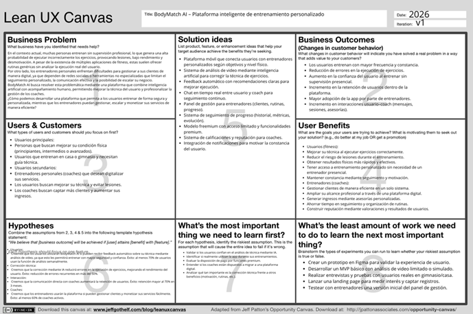

Link: 
### 1.3. Segmentos objetivo.

Los siguientes segmentos clave permiten establecer una base sólida para el desarrollo y posicionamiento de BodyMatch AI como un ecosistema integral de entrenamiento inteligente. La selección de estos segmentos busca generar sinergia entre usuarios que desean mejorar su rendimiento físico mediante el uso de tecnología y entrenadores que buscan profesionalizar, optimizar y escalar sus servicios en un entorno digital.

---

## Segmento objetivo 1: Jóvenes adultos interesados en el fitness

| Aspectos demográficos | Aspectos geográficos | Aspectos psicográficos |
|----------------------|--------------------|------------------------|
| Sexo: Masculino y femenino, sin distinción, con creciente participación de ambos en actividades fitness. | Nacionalidad: Principalmente usuarios dentro del Perú. | Motivaciones: Interés por mejorar su apariencia física, salud y rendimiento deportivo; búsqueda de resultados visibles y medibles. |
| Edades: Entre 18 y 35 años, principalmente jóvenes en etapa universitaria o inicio de vida laboral. | Ubicación: Mayor concentración en zonas urbanas como Lima Metropolitana, Arequipa, Trujillo y Piura. | Estilo de vida: Activo o en transición hacia hábitos saludables, con interés en combinar tecnología y fitness. |
| Nivel socioeconómico: A, B y C, con capacidad de acceso a servicios digitales y suscripciones. | Acceso a tecnología: Alta disponibilidad de smartphones, conexión a internet móvil y uso frecuente de aplicaciones móviles. | Preocupaciones: Miedo a lesionarse por mala técnica, falta de orientación profesional, uso de rutinas genéricas que no generan resultados. |
| Ocupación: Estudiantes universitarios, jóvenes profesionales, freelancers o emprendedores. | Espacios de entrenamiento: Gimnasios, hogares o parques. | Adaptación tecnológica: Alta, acostumbrados al uso de apps, redes sociales y contenido digital. |
| Ingresos: Variables, con disposición a invertir en bienestar personal. | | Interés por personalización: Muy alto, valoran soluciones adaptadas a sus objetivos y nivel físico. |

**Sustento:**  
Este segmento representa una de las principales audiencias del fitness digital en el Perú. Su alta adopción tecnológica y exposición constante a contenido en redes sociales facilita la integración de soluciones móviles basadas en inteligencia artificial, especialmente en contextos urbanos donde el acceso a gimnasios y aplicaciones de salud es mayor.

---

## Segmento objetivo 2: Entrenadores Personales (Coaches)

| Aspectos demográficos | Aspectos geográficos | Aspectos psicográficos |
|----------------------|--------------------|------------------------|
| Sexo: Masculino y femenino, con presencia equilibrada en el sector fitness. | Nacionalidad: Principalmente dentro del Perú. | Motivaciones: Expandir su alcance profesional, captar más clientes y generar mayores ingresos mediante canales digitales. |
| Edades: Entre 22 y 45 años, en etapa activa de desarrollo profesional. | Ubicación: Zonas urbanas y suburbanas con presencia de gimnasios y centros deportivos como Lima, Arequipa y Trujillo. | Estilo de vida: Enfocado en el rendimiento físico, la disciplina y el desarrollo profesional continuo. |
| Nivel socioeconómico: B y C, con ingresos variables según cartera de clientes. | Acceso a tecnología: Alto acceso a smartphones, laptops y redes sociales. | Preocupaciones: Limitaciones para gestionar clientes, dificultad para seguimiento remoto y dependencia de redes sociales. |
| Ocupación: Entrenadores personales, coaches fitness, instructores de gimnasio o independientes. | Entorno laboral: Gimnasios, entrenamiento independiente, asesorías remotas o híbridas. | Adaptación tecnológica: Media-alta, con interés en herramientas digitales. |
| Ingresos: Variables según sesiones y asesorías personalizadas. | | Interés por personalización: Alto, buscan diferenciar sus servicios y fidelizar clientes. |

**Sustento:**  
El crecimiento del sector fitness en el Perú ha impulsado la digitalización de los servicios de entrenamiento. Los entrenadores personales muestran una creciente necesidad de plataformas que les permitan gestionar clientes de forma eficiente, ampliar su alcance y profesionalizar sus servicios en un entorno cada vez más competitivo y digitalizado.

## Capítulo II: Requirements Elicitation & Analysis

### 2.1. Competidores.

#### 2.1.1. Análisis competitivo

En esta sección realizaremos un análisis competitivo sobre distintos actores en el mercado que cumplen funciones similares a las de nuestra plataforma dentro del rubro del fitness y el entrenamiento personal digital. De esta forma, podremos conocer nuestra posición frente a competidores directos e indirectos como Freeletics, Zing Coach y Peloton.

**Competitive analysis landscape**

**¿Por qué llevar a cabo este análisis?**  
Identificar las brechas competitivas en el mercado de fitness digital para posicionar a BodyMatch AI como la solución líder en corrección técnica mediante IA y gestión de coaches en el mercado local.

---

|                           | BodyMatch AI | Freeletics | Zing Coach | Peloton App |
|---------------------------|--------------|------------|------------|-------------|
| **Perfil**                |              |            |            |             |
| Overview                  | Plataforma que conecta usuarios con coaches, usando IA para analizar técnica mediante video. | App de fitness basada en algoritmos de IA (The Coach) para rutinas HIIT. | Entrenador virtual que usa "Zing Vision" para monitorear movimiento por cámara. | App de clases premium en vivo y bajo demanda con coaches de élite. |
| Ventaja competitiva   ¿Qué valor ofrece a los clientes? | Enfoque híbrido: Precisión de IA para evitar lesiones + gestión directa de un coach humano. | Algoritmo de IA muy maduro que permite entrenar en cualquier lugar sin equipo. | Tecnología de visión artificial avanzada para corrección de postura 100% autónoma. | Experiencia de "estudio" en casa con coaches celebridades y alta motivación. |
| **Perfil de Marketing**   |              |            |            |             |
| Mercado objetivo          | Usuarios que buscan seguridad técnica y coaches que quieren digitalizar su gestión. | Personas que buscan autonomía total y transformación física con HIIT. | Entusiastas de la tecnología que valoran los datos biométricos y precisión técnica. | Usuarios que buscan motivación grupal, música y calidad de producción de élite. |
| Estrategias de marketing  | Social Media (TikTok/IG) enfocado en seguridad técnica y profesionalismo accesible. | Branding global masivo "No Excuses" y amplia red de embajadores mundiales. | Promoción de "Zing Vision" y gamificación basada en el "Zing Skill Score". | Alianzas con artistas musicales y uso de instructores como influencers de estilo de vida. |
| **Perfil de Producto**    |              |            |            |             |
| Productos & Servicios     | IA de análisis de video, Marketplace de coaches y herramientas de gestión para entrenadores. | Planes HIIT personalizados, guías de audio-coaching y planes de nutrición. | Evaluación de forma física por cámara, conteo de reps y análisis metabólico. | Clases de fuerza, yoga y cardio con música exclusiva y comunidad activa. |
| Precios & Costos          | Free: Rutinas básicas. Premium: Análisis IA ilimitado y contacto con coaches. | Premium: S/ 45 - S/ 60 al mes (suscripciones trimestrales/anuales). | Premium: $15 - $20 USD mensuales para desbloquear visión artificial. | Premium: $12.99 - $24.00 USD mensuales según nivel de acceso y métricas. |
| Canales de distribución   (Web y/o Móvil) | App móvil (iOS y Android). | App móvil (iOS y Android). | App móvil (iOS y Android). | App móvil, Web y plataformas de Smart TV. |
| **Análisis SWOT**         |              |            |            |             |
| Fortalezas                | Corrección en tiempo real e interfaz que conecta con profesionales reales. | Marca consolidada y base de datos de usuarios global. | Innovación en visión artificial y precisión en datos técnicos. | Comunidad fiel y alta calidad en contenido audiovisual. |
| Debilidades               | Marca nueva en el mercado y fase de aprendizaje inicial de la IA. | Falta de feedback visual/video para corregir la postura técnica. | Costo elevado para LatAm y requiere entorno muy controlado para la cámara. | Bajo enfoque en la corrección técnica individual de los movimientos. |
| Oportunidades             | Crecimiento del fitness digital en Perú y alianzas con gimnasios locales. | Expansión con IA predictiva sobre la salud general del usuario. | Auge de los "wearables" y mercado de fisioterapia digital. | Crecimiento en el mercado de bienestar integral y nuevos dispositivos. |
| Amenazas                  | Competencia con marcas ya posicionadas y cambios rápidos en tecnología IA. | Apps gratuitas o de bajo costo con rutinas similares. | Regulaciones de privacidad de datos biométricos y captura de video. | Regreso masivo de los usuarios a los gimnasios físicos tradicionales. |

**Sustento:**  
El crecimiento del sector fitness en el Perú ha impulsado la digitalización de los servicios de entrenamiento. Los entrenadores personales muestran una creciente necesidad de plataformas que les permitan gestionar clientes de forma eficiente, ampliar su alcance y profesionalizar sus servicios en un entorno cada vez más competitivo y digitalizado.

#### 2.1.2. Estrategias y tácticas frente a competidores.

Frente a competidores como Freeletics y Zing Coach, BodyMatch AI se centrará en la corrección de técnica por IA y el contacto con coaches locales como su mayor diferencial. Estratégicamente, nos posicionaremos en redes sociales mediante demostraciones cortas de prevención de lesiones y seguridad al entrenar. Tácticamente, buscaremos alianzas con gimnasios peruanos y ofreceremos un modelo freemium donde el primer análisis de video sea gratuito para captar usuarios. Mantener una interfaz ágil y soporte directo asegurará nuestra ventaja en el mercado local.

### 2.2. Entrevistas.
#### 2.2.1. Diseño de entrevistas.

*Preguntas Generales*

- ¿Qué tan importante consideras la actividad física dentro de tu estilo de vida actual?
- ¿Utilizas herramientas digitales (apps, YouTube, smartwatches) para guiar tus entrenamientos?

---

**Segmento 1: Jóvenes adultos interesados en el fitness**

- ¿Cómo es tu rutina de entrenamiento actual y dónde sueles practicarla (casa o gimnasio)?
- ¿Alguna vez has sentido miedo de lesionarte o has tenido dudas sobre si estás haciendo un ejercicio correctamente? ¿Cómo lo resolviste?
- ¿Cuáles son tus objetivos principales al entrenar? (ej. ganar masa muscular, salud, estética).
- ¿Has usado apps de entrenamiento antes? ¿Qué fue lo que más te gustó y qué sentiste que le faltaba?
- Si una app pudiera analizar tus videos y corregir tu postura al instante, ¿sentirías más confianza al entrenar solo?
- ¿Estarías dispuesto a pagar por una suscripción que incluya corrección por IA y contacto con coaches certificados? ¿Qué te motivaría a hacerlo?

---

 **Segmento 2: Entrenadores Personales (Coaches)**

- ¿Cómo gestionas actualmente los planes de entrenamiento y el seguimiento de tus clientes?
- ¿Cuánto tiempo de tu jornada laboral estimas que dedicas a tareas administrativas y revisión manual de videos en comparación con la planificación real de entrenamientos?
- ¿Cuál es el mayor reto que enfrentas al asesorar a alguien de forma remota, especialmente respecto a su técnica?
- ¿De qué manera mantienes el compromiso y la motivación de tus alumnos remotos para evitar que abandonen sus rutinas por falta de supervisión constante?
- ¿Qué herramientas utilizas para captar nuevos clientes y dar visibilidad a tus servicios?
- ¿Qué valor diferencial consideras que aporta tu asesoría personalizada frente a las rutinas o videos gratuitos que los usuarios encuentran en internet?
- ¿Qué tan importante es para ti contar con un registro histórico de las cargas y métricas de rendimiento (volumen, peso, RPE) de tus alumnos para ajustar sus planes?
- ¿Qué opinas sobre el uso de Inteligencia Artificial como apoyo para supervisar la ejecución de los ejercicios de tus alumnos?
- ¿Qué funcionalidades te gustaría encontrar en una plataforma para que te facilite el cobro y la organización de tus asesorías?
- Si BodyMatch AI te permitiera automatizar correcciones básicas y conectarte con más clientes, ¿te interesaría formar parte de la plataforma? ¿Por qué?

#### 2.2.2. Registro de entrevistas.

**Segmento 1: Jóvenes Adultos interesados en el fitness**
**Entrevista 1**

 

Stefanny Paucar es una estudiante de 18 años residente de Villa María que busca mejorar su estilo de vida a través de la actividad física. Considera que el ejercicio es fundamental para desarrollar hábitos saludables, aunque actualmente entrena de forma empírica en casa siguiendo videos de YouTube y saliendo a correr con sus mascotas.
Su principal dificultad radica en la incertidumbre sobre su técnica; menciona sentir miedo a lesionarse y dudas constantes al intentar imitar movimientos de internet sin supervisión. Aunque no ha utilizado aplicaciones de fitness anteriormente, se muestra muy interesada en una herramienta tecnológica que le brinde autonomía.
Stephanie destaca que la función de análisis de video por inteligencia artificial le daría la confianza necesaria para ser más independiente en sus entrenamientos. Finalmente, afirma que estaría dispuesta a pagar por una suscripción premium de BodyMatch AI siempre que la plataforma demuestre ser eficaz y le ayude a alcanzar su objetivo estético de bajar de peso de manera segura.

| Detalle | Información |
|--------|------------|
| Entrevistador | Pablo geronimo |
| Entrevistado | Stefanny Paucar |
| Edad | 18 |
| Duración | 5:25 |
| Enlace | https://youtu.be/c5XLtFcafWM |

---

**Entrevista 2**

 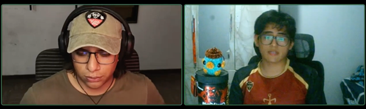
Alexander Moreno es un joven de 20 años con una trayectoria destacada en el Powerlifting desde 2025. Para él, la actividad física es el pilar de su estilo de vida, enfocándose en la sobrecarga progresiva y el método Heavy Duty (alto peso e intensidad). A pesar de su experiencia, admite que persisten dudas sobre la técnica correcta para evitar lesiones, las cuales suele resolver consultando a compañeros o buscando en su celular.
Aunque ha utilizado herramientas como Fitia y smartwatches, su experiencia previa con apps de entrenamiento ha sido negativa debido al exceso de anuncios y la falta de claridad en las instrucciones. Alexander valora positivamente la propuesta de BodyMatch AI, señalando que el análisis de video por inteligencia artificial sería una herramienta de gran utilidad para sus sesiones de entrenamiento en solitario.
Finalmente, manifiesta su disposición a pagar por una suscripción premium, siempre que el precio sea adecuado y facilite el acceso directo a información de coaches certificados, lo cual considera fundamental para seguir optimizando su progreso en fuerza y masa muscular.

| Detalle | Información |
|--------|------------|
| Entrevistador | Anyelo Bill Alejos Jesus |
| Entrevistado | Alexander Moreno Yactayo |
| Edad | 20 |
| Duración | 3:54 |
| Enlace | https://www.youtube.com/watch?v=jkUrHRdu5Sk |

---

**Entrevista 3**

 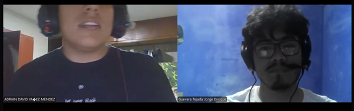

Adrián Yañez es un joven deportista que entrena en el gimnasio entre 4 a 5 veces por semana, viendo el ejercicio como una herramienta clave para su salud mental y liberación de estrés. Aunque utiliza YouTube y smartwatches para monitorear sus calorías, siente que sus rutinas actuales carecen de un control de progreso formal y de una personalización real que se adapte a su nivel.  
El punto crítico en la experiencia de Adrián es la inseguridad al realizar ejercicios complejos como el peso muerto o las sentadillas; admite que el miedo a lesionarse limita su progreso, llevándolo incluso a evitar ciertos movimientos. Critica las aplicaciones actuales por ser "muy genéricas" y por no ofrecer retroalimentación en tiempo real sobre la ejecución física.  
Adrián afirma que la propuesta de BodyMatch AI de corregir la postura mediante inteligencia artificial le otorgaría la seguridad necesaria para entrenar solo y probar ejercicios nuevos. Se muestra dispuesto a pagar por una suscripción premium, siempre que la herramienta sea precisa, fácil de usar y ofrezca resultados visibles que complementen o reemplacen la necesidad de un entrenador físico.

| Detalle | Información |
|--------|------------|
| Entrevistador | Jorge Guevara |
| Entrevistado | Adrian Yañez |
| Edad | 23 |
| Duración | 4:32 |
| Enlace | https://youtu.be/upfe2c_R2q0 |

---

**Segmento 2: Entrenadores Personales (Coaches)**

**Entrevista 1**

 

Antonio Guevara es un entrenador que considera la actividad física como un pilar fundamental tanto en su vida personal como profesional. Actualmente gestiona sus asesorías de forma manual mediante Excel y WhatsApp, lo que le genera dificultades en la centralización de la información y una falta de constancia en el seguimiento debido al tiempo que consume la revisión de mensajes dispersos. Identifica la corrección técnica remota como su mayor desafío, destacando la imposibilidad de brindar feedback en tiempo real y el riesgo de lesiones que esto conlleva para sus clientes.  
Para la captación de clientes, depende de su constancia en redes sociales y recomendaciones boca a boca, pero reconoce la falta de un canal estructurado. Considera que la inteligencia artificial sería un complemento ideal para automatizar correcciones básicas y escalar su servicio sin sacrificar la calidad de la atención. Antonio busca una plataforma integral que centralice la gestión, los pagos y las métricas de rendimiento, y ve en BodyMatch AI una oportunidad clave para diferenciarse tecnológicamente e impulsar su crecimiento profesional.

| Detalle | Información |
|--------|------------|
| Entrevistador | Jorge Guevara |
| Entrevistado | Antonio Guevara |
| Edad | 25 |
| Duración | 5:15 |
| Enlace | https://www.youtube.com/watch?v=N_bbs6ibxkA |

---

**Entrevista 2**

 

Adrian es un entrenador de 25 años que enfoca sus asesorías de manera personalizada, adaptando las rutinas según los objetivos y las posibles lesiones de cada cliente. Actualmente, dedica entre dos a tres horas de su jornada laboral a tareas administrativas y de revisión, un tiempo que considera significativo. Su mayor desafío en la asesoría remota no es solo la técnica, sino la gestión de las expectativas de los clientes, quienes suelen buscar resultados inmediatos y descuidan pilares básicos como la alimentación y el descanso, responsabilizando erróneamente al coach.  
Para captar clientes, Adrian combina el uso de WhatsApp e Instagram con una estrategia basada en la fidelización y el "boca a boca", priorizando la construcción de una relación de amistad con sus alumnos. Considera que, aunque internet está saturado de información, su valor diferencial reside en la corrección técnica específica que un video genérico no puede ofrecer. Adrian ve con muy buenos ojos la implementación de la Inteligencia Artificial como un apoyo motivador y técnico, y señala que funcionalidades como los pagos directos (sin capturas de pantalla) y una lista de control de actividad de los alumnos serían herramientas clave para facilitar su trabajo. Se muestra interesado en BodyMatch AI por la facilidad que le brindaría para comunicarse y llegar de forma más eficiente a sus clientes.

| Detalle | Información |
|--------|------------|
| Entrevistador | Anyelo Alejos |
| Entrevistado | Adrian Huisa |
| Edad | 24 |
| Duración | 5:153 |
| Enlace | https://youtu.be/0V8fsOUzfPY |

---

**Entrevista 3**

Diego seminario es un preparador de culturismo de 26 años para quien la disciplina y la excelencia física son la base de su identidad. Aunque utiliza herramientas digitales para el registro de cargas, enfrenta una carga administrativa abrumadora al supervisar manualmente a más de 50 atletas mediante videos recibidos por redes sociales. Su principal conflicto es la falta de inmediatez. El retraso de hasta 48 horas en el feedback técnico es un "bache peligroso" que compromete el progreso y la seguridad de sus alumnos de alto rendimiento.  
Javier identifica la inteligencia artificial como el "siguiente nivel" de la industria, especialmente para garantizar la conexión mente-músculo y los ángulos de ejecución correctos sin necesidad de su presencia física constante. Para el BodyMatch AI representa la oportunidad de posicionarse como un coach premium, permitiéndole delegar la supervisión técnica básica para enfocarse en tareas de mayor valor como la estrategia nutricional y los ajustes finos de la preparación competitiva. Además, subraya la importancia de contar con herramientas visuales de progresión de cargas para validar la efectividad de sus asesorías.

| Detalle | Información |
|--------|------------|
| Entrevistador | Anyelo Alejos |
| Entrevistado | Diego seminario |
| Edad | 26 |
| Duración | 6:14 |
| Enlace | https://youtu.be/qI0G5MozYRU |

#### 2.2.3. Análisis de entrevistas.

**Segmento 1: Jóvenes Adultos interesados en el fitness**

Tras analizar las respuestas de los tres participantes (una principiante, un usuario intermedio y un deportista avanzado), se han identificado patrones críticos que definen la necesidad de nuestra solución:

**Prioridad del ejercicio y salud mental**  
El 100% de los entrevistados considera la actividad física como un pilar fundamental en su vida. Mientras que para Stephanie y Alexander el enfoque es la salud y el rendimiento, Adrián añade un componente emocional, utilizando el entrenamiento como una vía de escape para el estrés.

**La brecha de la técnica: Inseguridad y miedo a lesiones**  
Este es el hallazgo más relevante. A pesar de los distintos niveles de experiencia, el 100% experimenta dudas sobre la ejecución correcta de sus ejercicios.

- Usuarios en casa (Stephanie): Sienten "miedo" de lesionarse al imitar videos sin supervisión.  
- Usuarios de gimnasio (Alexander y Adrián): A pesar de usar pesos altos, necesitan recurrir a terceros o a búsquedas rápidas en el móvil para validar su técnica en movimientos complejos como el peso muerto.  

| Comportamiento | % Coincidencia | Perfiles |
|---------------|---------------|----------|
| Dudas sobre la postura correcta | 66% | Todos |
| Miedo explícito a sufrir lesiones | 33% | Stephanie y Adrián |
| Abandono de ejercicios por inseguridad | 66% | Adrián |

**El uso de YouTube como "entrenador sustituto"**  
El 66% de los entrevistados (Stephanie y Adrián) utiliza YouTube como su principal fuente de guía técnica. Sin embargo, ambos coinciden en que esta plataforma es unidireccional; les da la información, pero no les confirma si lo están replicando bien, lo que genera una "falsa sensación de seguridad".

**Descontento con las soluciones digitales actuales**  
Alexander y Adrián, quienes ya han probado aplicaciones de fitness, reportan experiencias negativas por dos razones principales:

- Exceso de publicidad: Interrumpe el flujo del entrenamiento.  
- Falta de personalización: Sienten que las apps son "genéricas" y no ofrecen feedback en tiempo real, limitándose a ser cronómetros o diarios de rutinas.  

**Validación del análisis por IA y Marketplace de Coaches**  
La propuesta de valor de BodyMatch AI fue recibida con entusiasmo unánime:

- Confianza e Independencia: Los tres participantes coinciden en que la corrección por IA les daría la "seguridad" necesaria para entrenar solos sin temor a equivocarse.  
- Valor del Factor Humano: Para los perfiles más avanzados (Alexander y Adrián), el contacto con un coach certificado es el motivador principal para realizar un pago.  

**Disposición económica**  
El 100% de los entrevistados está dispuesto a pagar por una suscripción premium. Las condiciones para este pago son:

- Eficacia real: Que la IA realmente detecte errores.  
- Precio competitivo: Un costo accesible para el mercado local.  
- Facilidad de uso: Una interfaz limpia y rápida.  

---

**Segmento 2: Entrenadores Personales (Coaches)**

Con base en las entrevistas realizadas a los tres profesionales del fitness, se identifican las siguientes tendencias, necesidades y puntos críticos en su labor como entrenadores:

**Descentralización y "Caos Administrativo"**  
El 100% de los coaches entrevistados gestiona sus asesorías de forma fragmentada. No cuentan con una plataforma única, lo que genera una carga operativa innecesaria.

- Herramientas actuales: Excel, WhatsApp, Notion y Google Drive.  
- Impacto: Antonio y Carlos coinciden en que la dispersión de archivos (enviar un PDF por un lado y corregir por otro) quita tiempo valioso y genera desorden, dificultando un seguimiento constante y profesional.  

**El "Cuello de Botella" de la Técnica Remota**  
Este es el punto de dolor más crítico compartido por los tres perfiles. Existe una incapacidad física de corregir en tiempo real, lo que compromete la seguridad del cliente:

- Feedback tardío: Javier y Antonio señalan que el desfase de tiempo (el usuario entrena un día y el coach corrige al siguiente) rompe el ciclo de aprendizaje y aumenta el riesgo de lesiones.  
- Tedio operativo: El 100% considera que descargar, revisar y comentar videos de forma manual es una tarea agotadora que limita la cantidad de alumnos que pueden atender.  

| Reto identificado | % Coincidencia | Impacto en el Coach |
|------------------|---------------|---------------------|
| Falta de corrección técnica instantánea | 100% | Retraso en el progreso del cliente. |
| Gestión manual de archivos de video | 100% | Saturación de tiempo y falta de escalabilidad. |
| Dificultad para interpretar movimientos | 66% | Riesgo de que el cliente automatice errores. |

**Dependencia Crítica de los Algoritmos de Redes Sociales**  
Aunque el 100% utiliza Instagram y TikTok para captar clientes, todos sienten la presión de ser "creadores de contenido" antes que entrenadores:

- Falta de Vitrina Profesional: Mateo y Javier mencionan que dependen totalmente de su constancia publicando para tener visibilidad.  
- Necesidad de Centralización: Buscan un canal más estructurado (Marketplace) donde sus certificaciones y resultados reales tengan más peso que el algoritmo de una red social.  

**La IA como "Asistente Estratégico", no como Reemplazo**  
Un hallazgo fundamental es que ningún coach ve la tecnología como una amenaza. Por el contrario, el 100% la percibe como el siguiente paso lógico en su evolución profesional:

- Filtrado Técnico: Coinciden en que la IA debería encargarse de las correcciones básicas (ángulos, postura de espalda, profundidad) para que ellos puedan enfocarse en la programación avanzada y la motivación personalizada.  

**Gestión Financiera y Métricas de Rendimiento**  
Existe un rechazo unánime hacia la gestión de cobros manual (pedir capturas de pantalla, transferencias bancarias, etc.):

- Funcionalidades deseadas: El 100% solicita pasarelas de pago automatizadas y, sobre todo, gráficos de progreso (cargas, repeticiones, peso) para visualizar el rendimiento del cliente de forma rápida y visual, algo que actualmente no pueden hacer de forma integrada.  

**Disposición de Adopción de BodyMatch AI**  
El interés en unirse a la plataforma es del 100%. Los coaches ven en la aplicación tres beneficios claros:

- Diferenciación: Posicionarse como entrenadores "tecnológicos" frente a la competencia tradicional.  
- Optimización del Tiempo: Ahorrar horas en revisión de video.  
- Escalabilidad: Capacidad de manejar carteras de clientes más grandes manteniendo la calidad del servicio técnico.

### 2.3. Needfinding.

#### 2.3.1. User Personas.

Para la creación de los User Persona de cada segmento, partimos de las entrevistas realizadas, las cuales nos sirvieron como base para identificar patrones, necesidades y motivaciones reales de los usuarios. A partir de estos hallazgos, construimos representaciones ficticias pero fundamentadas en la realidad, que reflejan el perfil, objetivos y frustraciones de cada segmento clave.

**Segmento 1: Jóvenes Adultos interesados en el fitness**

  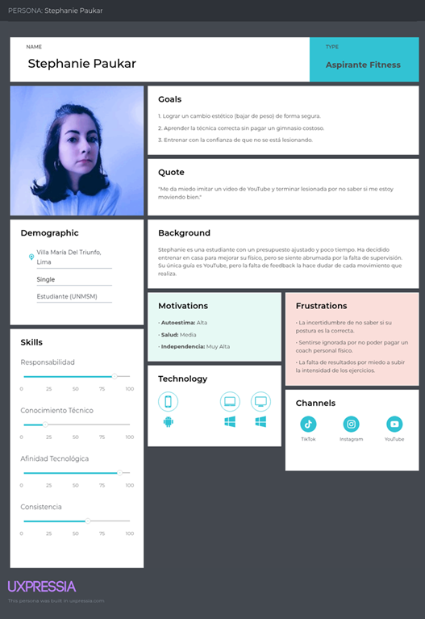

**Segmento 2: Entrenadores Personales (Coaches)**

  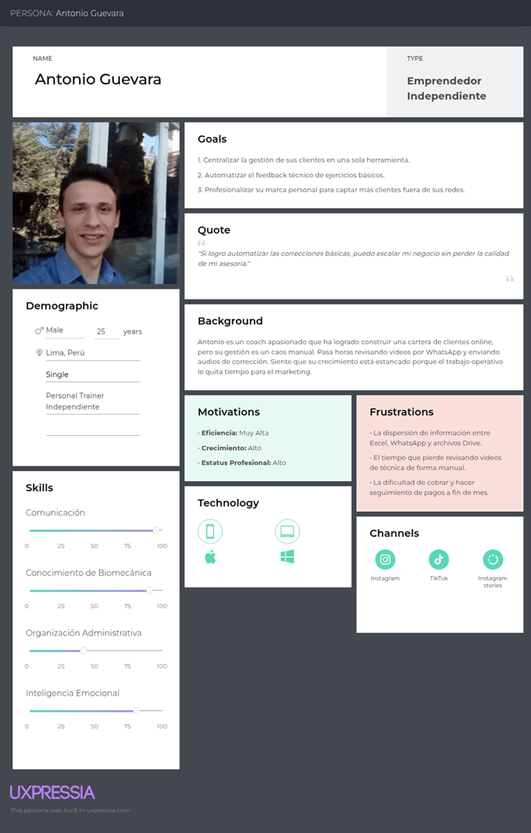

#### 2.3.2. User Task Matrix.
**Tareas / User Persona**

| Tareas / User Persona        | Stephanie Paukar (Frec.) | Stephanie Paukar (Imp.) | Antonio Guevara (Frec.) | Antonio Guevara (Imp.) |
|-----------------------------|--------------------------|--------------------------|--------------------------|--------------------------|
| Registrar entrenamientos    | Alta                     | Alta                     | N/A                      | N/A                      |
| Grabar videos de técnica    | Alta                     | Alta                     | N/A                      | N/A                      |
| Revisar correcciones IA     | Alta                     | Alta                     | Media                    | Alta                     |
| Diseñar rutinas/planes      | N/A                      | N/A                      | Alta                     | Alta                     |
| Analizar videos de alumnos  | N/A                      | N/A                      | Alta                     | Alta                     |
| Gestionar pagos/cobros      | Baja                     | Media                    | Alta                     | Alta                     |
| Monitorear progreso         | Media                    | Alta                     | Alta                     | Alta                     |
| Comunicación directa        | Media                    | Alta                     | Alta                     | Alta                     |
| Buscar coaches / alumnos    | Baja                     | Alta                     | Alta                     | Alta                     |
| Configurar notificaciones   | Media                    | Media                    | Media                    | Media                    |

**Validación técnica como prioridad compartida:**  
Ambos usuarios otorgan una importancia Alta a la corrección de técnica y el uso de la IA, confirmando que es la funcionalidad nuclear de la aplicación.

**Stephanie Paukar (Enfoque en ejecución):**  
Sus tareas frecuentes e importantes se centran en la grabación y el feedback instantáneo, buscando seguridad y autonomía al entrenar sola.

**Antonio Guevara (Enfoque en gestión):**  
Sus tareas más críticas son el diseño de planes y el análisis masivo de sus alumnos, buscando herramientas que le permitan escalar su negocio y profesionalizar sus cobros.

**Sincronización necesaria:**  
La app debe garantizar una comunicación fluida y un sistema de monitoreo de progreso que sea fácil de alimentar por el alumno y rápido de auditar por el coach, optimizando el tiempo de ambos.

#### 2.3.3. Empathy Maps

El Empathy Mapping es una herramienta fundamental para profundizar en la experiencia del usuario, permitiéndonos entender no solo lo que hacen, sino lo que sienten y experimentan en su entorno real. A continuación, presentamos los mapas de empatía de los dos segmentos clave de nuestro proyecto BodyMatch AI:

**Segmento 1: Jóvenes adultos interesados en el fitness**

  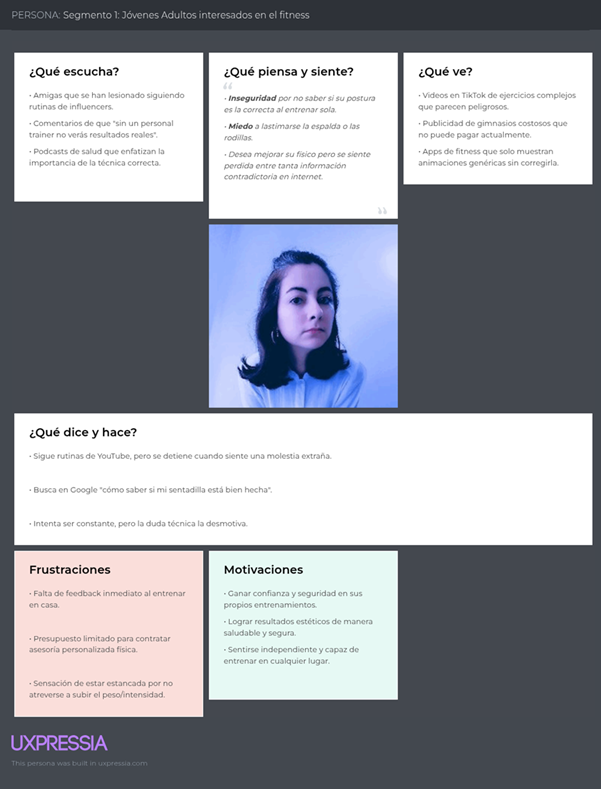

**Segmento 2: Entrenadores Personales (Coaches)**

  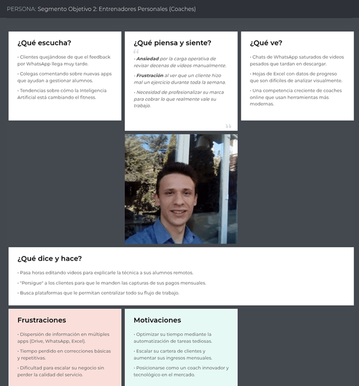

#### 2.3.4. As-Is Scenario Mapping

**Segmento 1: Jóvenes adultos interesados en el fitness**

  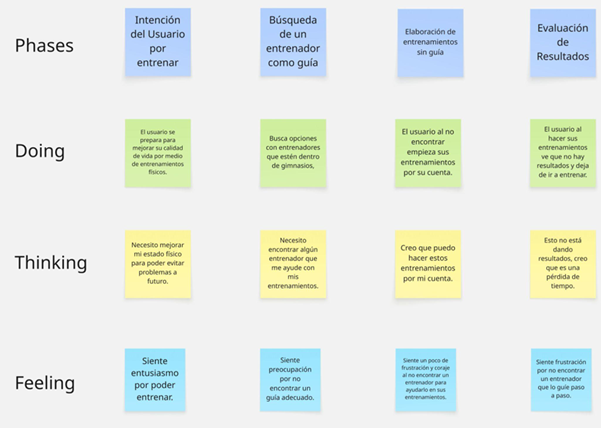

**Segmento 2: Entrenadores Personales (Coaches)**

  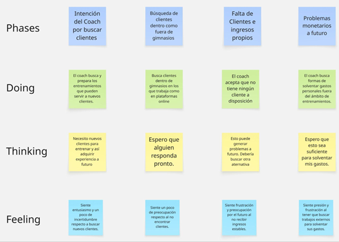

## Capítulo III: Requirements Specification

### 3.1. User Stories.

En esta sección se detallan todas las **User Stories** identificadas para la aplicación BodyMatch. Incluyen:  

Cada historia está estructurada para facilitar desarrollo ágil y validación iterativa.

---

**Epics**

**EP01: Gestión de acceso y perfil**  
Como usuario o coach, quiero registrarme, iniciar sesión y administrar mi perfil, para acceder de forma segura a la plataforma y personalizar mi experiencia.

| User Story ID | Título                              |
|---------------|-------------------------------------|
| US01          | Registro de usuario                 |
| US02          | Inicio de sesión                    |
| US03          | Recuperación de contraseña          |
| US04          | Cierre de sesión                    |
| US05          | Configuración de perfil y objetivos |

---

**EP02: Conexión entre usuarios y coaches**  
Como usuario, quiero encontrar coaches según mis objetivos físicos, para recibir entrenamiento personalizado.

| User Story ID | Título                           |
|---------------|----------------------------------|
| US06          | Búsqueda de coaches              |
| US07          | Visualización de perfil de coach |
| US08          | Reserva de sesión                |
| US09          | Chat con coach                   |
| US10          | Calificación del coach           |

---

**EP03: Análisis de ejercicios con IA**  
Como usuario, quiero recibir retroalimentación automática sobre mi técnica, para mejorar mis ejercicios y evitar lesiones.

| User Story ID | Título                         |
|---------------|--------------------------------|
| US11          | Subir vídeo del ejercicio      |
| US12          | Feedback automático con IA     |
| US13          | Historial de correcciones      |
| US14          | Recomendaciones de mejora      |

---

**EP04: Seguimiento de progreso físico**  
Como usuario, quiero visualizar mi progreso físico, para medir mis resultados y mantenerme motivado.

| User Story ID | Título                           |
|---------------|----------------------------------|
| US15          | Registro de métricas físicas     |
| US16          | Visualización de progreso        |
| US17          | Historial de entrenamientos      |
| US18          | Alertas de cumplimiento de rutina|

---

**EP05: Gestión profesional para coaches**  
Como coach, quiero gestionar mis clientes y sesiones, para brindar un mejor servicio y organizar mi trabajo.

| User Story ID | Título                          |
|---------------|---------------------------------|
| US19          | Gestión de clientes             |
| US20          | Programación de disponibilidad  |
| US21          | Seguimiento de progreso del cliente |
| US22          | Monetización de servicios       |

---

**EP06: Análisis nutricional inteligente mediante imagen**  
Como usuario, quiero subir una foto de mis alimentos para obtener automáticamente información nutricional (calorías, proteínas, carbohidratos, grasas, etc.), para poder llevar un mejor control de mi alimentación y complementar mi entrenamiento físico.

| User Story ID | Título                                      |
|---------------|----------------------------------------------|
| US23          | Subida de imagen de alimentos                |
| US24          | Reconocimiento de alimentos mediante IA      |
| US25          | Cálculo de valores nutricionales             |
| US26          | Visualización detallada de nutrientes        |
| US27          | Edición manual de alimentos detectados       |
| US28          | Registro en historial de comidas             |
| US29          | Seguimiento diario de consumo nutricional    |
| US30          | Recomendaciones nutricionales personalizadas |
| US31          | Integración con objetivos fitness            |
| US32          | Notificaciones y recordatorios de registro   |

| Epic / Story ID | Título | Descripción | Criterios de Aceptación | Relacionado con (Epic ID) |
|-----------------|--------|-------------|--------------------------|----------------------------|
| US01 | Registro de usuario | Como nuevo usuario o coach, quiero registrarme con mis datos personales para acceder a la plataforma. | Escenario 1: Registro exitoso usuario Dado que el usuario completa el formulario, cuando selecciona “usuario”, entonces el sistema lo redirige al dashboard.  Escenario 2: Registro exitoso coach Dado que el usuario selecciona “coach”, cuando completa el registro, entonces se redirige a configuración profesional.  Escenario 3: Datos incompletos Dado que faltan campos obligatorios, cuando intenta registrarse, entonces se muestra mensaje de error. | EP01 |
| US02 | Inicio de sesión | Como usuario registrado, quiero iniciar sesión para acceder a mi cuenta. | Escenario 1: Acceso exitoso Dado que ingresa credenciales correctas, cuando inicia sesión, entonces accede al sistema.  Escenario 2: Error de login Dado que los datos son incorrectos, cuando intenta ingresar, entonces se muestra error. | EP01 |
| US03 | Recuperación de contraseña | Como usuario, quiero recuperar mi contraseña en caso de olvido. | Escenario 1: Solicitud de recuperación Dado que el usuario solicita recuperación, cuando ingresa su correo, entonces recibe enlace o código.  Escenario 2: Restablecimiento exitoso Dado que recibe el enlace, cuando cambia contraseña, entonces se actualiza correctamente. | EP01 |
| US04 | Cierre de sesión | Como usuario, quiero cerrar sesión para proteger mi cuenta. | Escenario 1: Logout exitoso Dado que el usuario está en sesión, cuando selecciona cerrar sesión, entonces se cierra sesión.  Escenario 2: Acceso bloqueado Dado que cerró sesión, cuando intenta entrar, entonces se solicita login. | EP01 |
| US05 | Configuración de perfil | Como usuario, quiero definir mis objetivos físicos. | Escenario 1: Guardado inicial Dado que el usuario ingresa datos, cuando guarda perfil, entonces se almacenan objetivos.  Escenario 2: Actualización Dado que modifica datos, cuando guarda cambios, entonces se actualiza perfil. | EP01 |
| US06 | Búsqueda de coaches | Como usuario quiero buscar coaches según objetivos. | Escenario 1: Búsqueda por filtro Dado que usa filtros, cuando busca coaches, entonces se muestran resultados.  Escenario 2: Búsqueda por nombre Dado que ingresa nombre, cuando busca, entonces aparecen coincidencias.  Escenario 3: Sin resultados Dado que no hay coincidencias, cuando busca, entonces se muestra mensaje. | EP02 |
| US07 | Perfil de coach | Como usuario quiero ver información del coach. | Escenario 1: Visualización completa Dado que selecciona un coach, cuando entra al perfil, entonces ve experiencia, tarifas y reseñas. | EP02 |
| US08 | Reserva de sesión | Como usuario quiero reservar sesiones con coach. | Escenario 1: Reserva exitosa Dado que hay disponibilidad, cuando selecciona horario, entonces la sesión queda agendada. | EP02 |
| US09 | Chat con coach | Como usuario quiero comunicarme con mi coach. | Escenario 1: Envío de mensaje Dado que abre chat, cuando envía mensaje, entonces se entrega al coach.  Escenario 2: Respuesta Dado que el coach responde, cuando usuario abre chat, entonces ve mensaje.  Escenario 3: Historial Dado que existen mensajes, cuando entra al chat, entonces ve conversación completa. | EP02 |
| US10 | Calificación del coach | Como usuario quiero calificar al coach. | Escenario 1: Registro de reseña Dado que termina sesión, cuando califica, entonces se guarda reseña.  Escenario 2: Restricción Dado que no tuvo sesión, cuando intenta calificar, entonces se bloquea acción. | EP02 |
| US11 | Subir video | Como usuario quiero subir videos de ejercicios. | Escenario 1: Subida correcta Dado que selecciona video, cuando lo sube, entonces se carga archivo.  Escenario 2: Error formato Dado que archivo no es válido, cuando sube, entonces muestra error. | EP03 |
| US12 | Feedback IA | Como usuario quiero corrección automática de ejercicios. | Escenario 1: Análisis exitoso Dado que sube video, cuando IA procesa, entonces muestra errores técnicos.  Escenario 2: Recomendaciones claras Dado que termina análisis, cuando ve resultados, entonces recibe sugerencias. | EP03 |
| US13 | Historial correcciones | Como usuario quiero ver análisis anteriores. | Escenario 1: Lista historial Dado que tiene análisis previos, cuando entra a historial, entonces ve registros.  Escenario 2: Detalle Dado que selecciona registro, cuando abre, entonces ve video y feedback. | EP03 |
| US14 | Recomendaciones IA | Como usuario quiero mejoras personalizadas. | Escenario 1: Recomendaciones Dado que analiza ejercicio, cuando termina IA, entonces muestra mejoras.  Escenario 2: Seguimiento Dado que repite análisis, cuando hay progreso, entonces compara evolución. | EP03 |
| US15 | Registro métricas | Como usuario quiero registrar medidas físicas. | Escenario 1: Guardado Dado que ingresa datos, cuando guarda, entonces se registra información.  Escenario 2: Historial Dado que ya existen registros, cuando añade nuevos, entonces no se elimina historial. | EP04 |
| US16 | Progreso físico | Como usuario quiero ver gráficos de evolución. | Escenario 1: Visualización Dado que hay datos, cuando entra a progreso, entonces ve gráficos.  Escenario 2: Comparación Dado que selecciona fechas, cuando filtra, entonces ve evolución. | EP04 |
| US17 | Historial entrenamientos | Como usuario quiero ver mis entrenamientos. | Escenario 1: Lista Dado que entrenó antes, cuando entra historial, entonces ve sesiones.  Escenario 2: Detalle Dado que selecciona sesión, cuando abre, entonces ve información. | EP04 |
| US18 | Alertas rutina | Como usuario quiero recordatorios de entrenamiento. | Escenario 1: Notificación Dado que tiene rutina, cuando llega hora, entonces recibe alerta.  Escenario 2: Incumplimiento Dado que no entrena, cuando pasa tiempo, entonces recibe aviso. | EP04 |
| US19 | Gestión clientes | Como coach quiero administrar clientes. | Escenario 1: Lista clientes Dado que tiene alumnos, cuando entra módulo, entonces ve lista.  Escenario 2: Perfil cliente Dado que selecciona alumno, cuando abre perfil, entonces ve progreso. | EP05 |
| US20 | Disponibilidad | Como coach quiero definir horarios. | Escenario 1: Registro Dado que configura agenda, cuando guarda, entonces se publica disponibilidad.  Escenario 2: Edición Dado que modifica horarios, cuando actualiza, entonces cambia agenda. | EP05 |
| US21 | Seguimiento cliente | Como coach quiero ver progreso de clientes. | Escenario 1: Visualización Dado que selecciona cliente, cuando entra, entonces ve métricas.  Escenario 2: Comparación Dado que hay historial, cuando filtra fechas, entonces ve evolución. | EP05 |
| US22 | Monetización | Como coach quiero definir precios. | Escenario 1: Registro tarifa Dado que crea plan, cuando guarda, entonces se publica.  Escenario 2: Actualización Dado que cambia precio, cuando edita, entonces se actualiza. | EP05 |
| US23 | Subir imagen comida | Como usuario quiero subir fotos de comida. | Escenario 1: Subida correcta Dado que selecciona imagen, cuando carga, entonces se procesa.  Escenario 2: Error Dado que falla archivo, cuando sube, entonces muestra error. | EP06 |
| US24 | Reconocimiento IA | Como usuario quiero detección de alimentos. | Escenario 1: Identificación Dado que sube imagen, cuando IA procesa, entonces detecta alimentos.  Escenario 2: Error reconocimiento Dado que imagen no es clara, cuando analiza, entonces falla. | EP06 |
| US25 | Cálculo nutricional | Como usuario quiero macros y calorías. | Escenario 1: Cálculo correcto Dado que detecta alimentos, cuando procesa, entonces muestra valores.  Escenario 2: Error cálculo Dado que falla sistema, cuando procesa, entonces muestra error. | EP06 |
| US26 | Visualización nutrientes | Como usuario quiero gráficos nutricionales. | Escenario 1: Visualización Dado que hay datos, cuando entra, entonces ve gráficos.  Escenario 2: Sin datos Dado que no hay info, cuando entra, entonces muestra aviso. | EP06 |
| US27 | Edición alimentos | Como usuario quiero corregir alimentos detectados. | Escenario 1: Edición correcta Dado que IA detecta alimentos, cuando edita, entonces actualiza datos.  Escenario 2: Error Dado que falla guardado, cuando edita, entonces muestra error. | EP06 |
| US28 | Historial comidas | Como usuario quiero guardar comidas. | Escenario 1: Registro automático Dado que analiza comida, cuando termina, entonces guarda historial.  Escenario 2: Error guardado Dado que falla sistema, cuando guarda, entonces muestra error. | EP06 |
| US29 | Consumo diario | Como usuario quiero ver consumo diario. | Escenario 1: Resumen diario Dado que hay registros, cuando entra, entonces ve calorías.  Escenario 2: Sin datos Dado que no hay registros, cuando entra, entonces muestra aviso. | EP06 |
| US30 | Recomendaciones nutricionales | Como usuario quiero sugerencias personalizadas. | Escenario 1: Recomendación Dado que analiza consumo, cuando procesa, entonces sugiere mejoras.  Escenario 2: Sin datos Dado que no hay info, cuando procesa, entonces muestra mensaje. | EP06 |
| US31 | Integración fitness-nutrición | Como usuario quiero conectar dieta y entrenamiento. | Escenario 1: Integración Dado que tiene objetivos, cuando analiza datos, entonces relaciona dieta y fitness.  Escenario 2: Falta de datos Dado que no hay objetivos, cuando entra, entonces solicita configuración. | EP06 |
| US32 | Notificaciones nutricionales | Como usuario quiero recordatorios de comidas. | Escenario 1: Notificación Dado que activa recordatorios, cuando llega hora, entonces envía alerta.  Escenario 2: Desactivado Dado que está apagado, cuando llega hora, entonces no envía nada. | EP06 |

### 3.2. Impact Mapping.
El **Impact Map** es una herramienta visual que permite relacionar los objetivos de negocio con las personas involucradas, los impactos esperados, los entregables y las historias de usuario asociadas.  
Su objetivo es **visualizar de manera clara y estructurada cómo cada acción contribuye a los objetivos de la plataforma**, facilitando la planificación de funcionalidades y la alineación del equipo.

A continuación se presenta el Impact Map de **BodyMatch AI**:

**Segmento Objetivo 1: Jóvenes adultos interesados en el fitness**

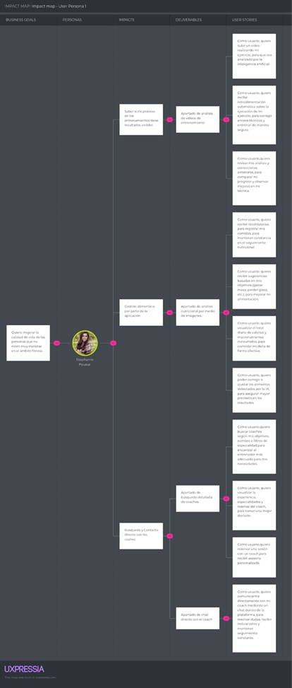

**Segmento Objetivo 1: Entrenadores Personales (Coaches)**

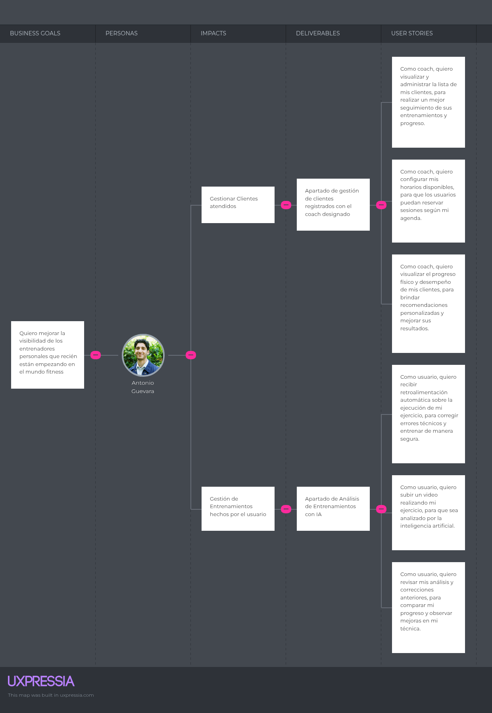

### 3.3. Product Backlog.

El **Product Backlog** es la lista priorizada de todas las funcionalidades, mejoras, correcciones y características previstas para la aplicación **BodyMatch AI **, incluyendo integración con dispositivos IoT (bebedor y báscula inteligentes) y el módulo de IA tipo coach nutricional.  

Este backlog permite al equipo de desarrollo:  

- Tener claridad sobre **qué funcionalidades se deben implementar** y en qué orden.  
- **Planificar sprints ágiles**, asignando tareas según prioridad y complejidad.  
- Mantener un registro del **estado de cada User Story** (Por Hacer, En Progreso, Hecho).  

**Columnas del Product Backlog:**

- **#Orden:** Número secuencial para organización de las historias.  
- **User Story ID:** Identificador único de la historia de usuario.  
- **Título:** Nombre resumido de la funcionalidad.  
- **Descripción:** Detalle de la necesidad desde la perspectiva del usuario o profesional de salud.  
- **Story Points:** Estimación de complejidad o esfuerzo requerido (1,2,3,5,8).  
- **Prioridad:** Alta / Media / Baja, para guiar la planificación de sprints.  
- **Estado:** Indica si la historia está *Por Hacer*, *En Progreso* o *Hecho*.  

A continuación se presenta el backlog completo con todas las User Stories definidas hasta el momento:

| Orden | User Story Id | Título | Descripción | Story Points |
|------|--------------|--------|-------------|--------------|
| 1 | US01 | Registro de usuario | Como nuevo usuario o coach, quiero registrarme con mis datos personales para acceder a la plataforma. | 1 |
| 2 | US02 | Inicio de sesión | Como usuario registrado, quiero iniciar sesión con correo y contraseña para acceder a mi cuenta. | 1 |
| 3 | US07 | Visualización de perfil de coach | Como usuario, quiero ver la experiencia y reseñas del coach para tomar una decisión. | 1 |
| 4 | US10 | Calificación del coach | Como usuario, quiero calificar al coach para compartir mi experiencia. | 1 |
| 5 | US15 | Registro de métricas físicas | Como usuario, quiero registrar mis medidas corporales para controlar mi evolución. | 1 |
| 6 | US23 | Subida de imagen de alimentos | Como usuario, quiero subir fotos de comida para análisis nutricional. | 1 |
| 7 | US27 | Edición manual de alimentos detectados | Como usuario, quiero corregir alimentos detectados por IA para mayor precisión. | 1 |
| 8 | US04 | Cierre de sesión | Como usuario o coach, quiero cerrar sesión para proteger mi cuenta. | 2 |
| 9 | US05 | Configuración de perfil y objetivos | Como usuario, quiero definir mis objetivos para recibir recomendaciones personalizadas. | 2 |
| 10 | US08 | Reserva de sesión | Como usuario, quiero reservar sesiones con un coach. | 2 |
| 11 | US13 | Historial de correcciones | Como usuario, quiero ver análisis anteriores para comparar progreso. | 2 |
| 12 | US16 | Visualización de progreso | Como usuario, quiero ver gráficos de progreso físico. | 2 |
| 13 | US17 | Historial de entrenamientos | Como usuario, quiero revisar mis entrenamientos para evaluar constancia. | 2 |
| 14 | US22 | Monetización de servicios | Como coach, quiero definir tarifas para monetizar mis servicios. | 2 |
| 15 | US28 | Registro en historial de comidas | Como usuario, quiero guardar automáticamente mis comidas. | 2 |
| 16 | US06 | Búsqueda de coaches | Como usuario, quiero buscar coaches según objetivos y filtros. | 3 |
| 17 | US11 | Subir video del ejercicio | Como usuario, quiero subir videos para análisis de técnica. | 3 |
| 18 | US18 | Alertas de cumplimiento de rutina | Como usuario, quiero recibir recordatorios de entrenamiento. | 3 |
| 19 | US21 | Seguimiento de progreso del cliente | Como coach, quiero ver el progreso de mis clientes. | 3 |
| 20 | US03 | Recuperación de contraseña | Como usuario o coach, quiero recuperar mi contraseña. | 3 |
| 21 | US19 | Gestión de clientes | Como coach, quiero administrar mis clientes. | 3 |
| 22 | US25 | Cálculo de valores nutricionales | Como usuario, quiero ver calorías y macronutrientes de mis comidas. | 3 |
| 23 | US31 | Integración con objetivos fitness | Como usuario, quiero relacionar nutrición con mis objetivos físicos. | 3 |
| 24 | US09 | Chat con coach | Como usuario, quiero comunicarme con mi coach en tiempo real. | 5 |
| 25 | US14 | Recomendaciones de mejora | Como usuario, quiero recibir recomendaciones personalizadas. | 5 |
| 26 | US20 | Programación de disponibilidad | Como coach, quiero definir mis horarios disponibles. | 5 |
| 27 | US26 | Visualización detallada de nutrientes | Como usuario, quiero ver gráficos nutricionales detallados. | 5 |
| 28 | US30 | Recomendaciones nutricionales personalizadas | Como usuario, quiero sugerencias según mis objetivos. | 5 |
| 29 | US32 | Notificaciones y recordatorios de registro | Como usuario, quiero recordatorios para registrar comidas. | 5 |
| 30 | US12 | Feedback automático con IA | Como usuario, quiero corrección automática de mis ejercicios. | 8 |
| 31 | US24 | Reconocimiento de alimentos mediante IA | Como usuario, quiero que la IA identifique alimentos en imágenes. | 8 |
| 32 | US29 | Seguimiento diario de consumo nutricional | Como usuario, quiero ver mi consumo diario de calorías y macros. | 8 |
A continuación se proporciona el link del Trello donde se puede visualizar de mejor forma el Product Backlog:

[Product Backlog en Trello]

## Capitulo IV: Requeriments Specification

### 4.1 Design Concepts, ViewPoints & ER Diagrams

En esta sección nos centramos en los conceptos de diseño, los diferentes puntos de vista que utilizaremos para poder comprender y comunicar la arquitectura. Con esto se espera diseñar los diagramas para modelar los datos de la aplicación.

#### 4.1.1 Principles Statements
Para el diseño del producto de arquitectura, como grupo debemos reconocer ciertos principios que nos ayuden a alcanzar nuestros objetivos:

- <b>Principios SOLID:</b> De estos aplicaremos cincos de los patrones de Diseño orientado a objetos para construir componentes y que sean fáciles de mantener a largo plazo dentro de cada microservicio.

  - <b>Single Responsibility Principle (SRP):</b> Cada clase que se crea tiene una única responsabilidad y una sola razón para cambiar.

  - <b>Open/Closed Principle (OCP):</b> Las clases creadas siempre tiene que estar abiertas a una extensión, pero ceradas a las modificaciones. Eso se refiere a que se puede añadir nuevas funcionalidades sin alterar el código.

  - <b>Liskov Substitution Principle (LSP):</b> Se debe mantener una sincronía entre la superclase y la subclase, ya que al compartir métodos deben mantener concordancia con su funcionamiento. 

  - <b>Interface Segregation Principle (ISP):</b> En el caso de que sea necesario, se deben crear interfaces para poder suplir las necesidades del código. Ya que al crear clases que dependen de una sola interfaz, no sabemos con certeza si esa clase pueda cumplir con todo lo implementado dentro de la interfaz. 

  - <b>Dependency Inversion Principle (DIP):</b> Al tener clases de alto nivel como de bajo nivel, no pueden depender una de otras directamente. Es claro que las clases de alto nivel son las que manejan las clase de bajo nivel, pero en el caso de que la clase de bajo nivel se vea afectada la clase de alto nivel también lo hará. Para ello se crea una interfaz de alto nivel que maneje la clase de bajo nivel. 

- <b>Domain-Driven Design(DDD):</b> Se adaptará los principios de DDD para alinear el diseño del proyecto a trabajar con el modelo del negocio: 
  - <b>Modelado Basado en Dominio:</b> El diseño de los microservicios se centrará en la lógica establecida de negocio.

  - <b>Límites de Contexto o Bounded Contexts:</b> Dentro del proyecto se definen límites explicitos para cada modelo de dominio, con esto se asegura la coherencia dentro de cada microservicio.

  - <b>Lenguaje Ubicuo o Ubiquitous Language:</b> Dentro de cada contexto se utilizará un lenguaje común y preciso, con esto se espera evitar malentendidos y asegurar que se refleje el modelo de la manera más fiel.

#### 4.1.2 Approaches Statements Architectural Styles & Patterns

<b>Approaches Statements</b>
- <b>Domain-Driven Design (DDD): </b> Se optará DDD como un enfoque principal para poder asegurar que la arquitectura de nuestra aplicación refleje fielmente el modelo del negocio.

- <b>Attribute-Driven Design (ADD): </b> Se utilizará ADD como una técnica para descomponer y planificar el diseño de la arquitectura de la aplicación. Se centra en identificar los atributos de calidad (quality attributes) crpticos para el exito del sistema.

<b>Architectural Styles & Patterns</b>

- <b> Estilo de la Arquitectura:</b> Para el desarrollo de nuestra aplicación usaremos de Arquitectura de Microservicios, donde nuestra aplicación se estructura como una colección de servicios organizados alrededor del negocio.

#### 4.1.3 Context Diagrams

#### 4.1.4 Approach Driven ViewPoints Diagram

<b>Diagrama de contenedores</b>

<b>Diagrama de Componentes</b> 

<b>Activities Diagrams</b>

<b>Diagramas de Estados</b>

<b>Diagrama de Clases</b>

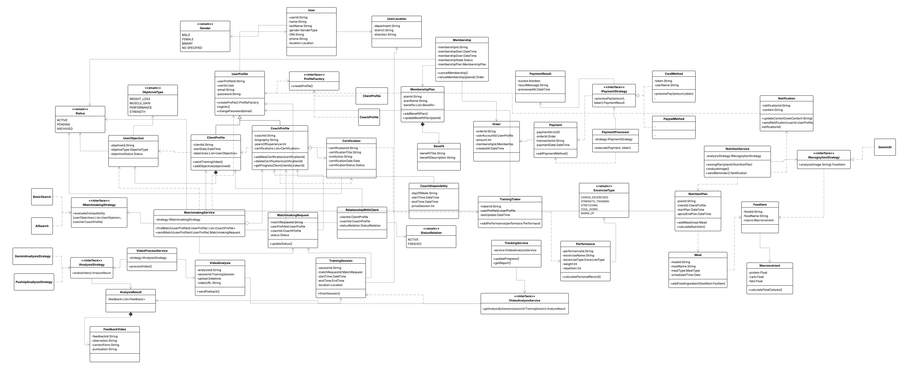

#### 4.1.5 Relational/Non Relational Database Diagram

#### 4.1.6 Design Patterns

- <b>Patron Strategy:</b> Con este patron de comportamiento, buscamos facilitar el acceso a distintos tipos de pagos sin la necesidad de hacer muchas clases para cada una de ellas. Con este patrón podremos cambiar entre proveedores sin llegar a tocar el código a profundidad.

- <b>Patrón Factory:</b> Este patrón creacioal nos permite utilizar interfaces para poder crear objetos en una superclase, miengras que las subclases puedan modificar el tipo de objeto creado. Con este patrón buscamos tener una visión a futuro en caso de que se quieran agregar muchos más tipos de perfiles. Además con este patrón se cumple uno de los principios SOLID "Open/Closed Principle", permitiendonos agregar cuantas clases querramos sin alterar significativamente el código.

## Conclusiones

* La aplicación del enfoque Lean UX permitió validar de manera efectiva las necesidades reales de los usuarios y coaches dentro del ámbito del fitness digital, orientando el diseño hacia una solución centrada en la experiencia del usuario y en la mejora de su calidad de vida mediante el ejercicio físico.

* El uso de herramientas de investigación como User Personas, Empathy Maps y Scenario Mapping facilitó la identificación de los principales puntos de dolor, tales como la falta de orientación en la ejecución de ejercicios y la limitada visibilidad de los entrenadores, proporcionando una base sólida para el diseño de la solución.

* La definición del Solution Profile permitió estructurar una propuesta clara, integrando funcionalidades clave como el matching entre usuarios y coaches, la mensajería directa y el uso de inteligencia artificial para el análisis de ejercicios, lo que representa un diferencial significativo frente a soluciones tradicionales.

 Recomendaciones

* Se recomienda continuar con un proceso de validación continua con usuarios reales (tanto usuarios finales como coaches), a fin de ajustar las funcionalidades y mejorar la experiencia en cada iteración del desarrollo.

* Es importante implementar un plan piloto con un grupo reducido de usuarios y entrenadores, lo que permitirá evaluar el desempeño de la plataforma en un entorno real y obtener métricas clave para su mejora.

* Se sugiere priorizar en las primeras fases de desarrollo el módulo de matching, mensajería y análisis de ejercicios con inteligencia artificial, debido a su alto impacto en la propuesta de valor del sistema.

* Se recomienda mejorar progresivamente el módulo de inteligencia artificial, iniciando con análisis básicos de movimiento y evolucionando hacia modelos más precisos que permitan detectar errores complejos en la ejecución de ejercicios.

* Es fundamental implementar estrategias de seguridad robustas, incluyendo autenticación mediante JWT y control de acceso basado en roles (RBAC), para proteger la información de los usuarios y garantizar la privacidad de los datos.

 Referencias Bibliográficas

* Ministerio de Salud del Perú. (2025). Semana de oro del Perú 2025: El 62% de la población peruana mayor de 15 años tiene exceso de peso. Recuperado de: https://www.gob.pe/institucion/minsa/noticias/1210470-semana-de-oro-del-peru-2025-el-62-de-la-poblacion-peruana-mayor-de-15-anos-tiene-exceso-de-peso

* Revista Retos. (2025). Actividad física y salud en contextos contemporáneos. Recuperado de: https://revistaretos.org/index.php/retos/article/view/117147

* Infobae. (2025). Obesidad en el Perú: El 73% del país tendrá un alto índice de masa corporal en 2025. Recuperado de: https://www.infobae.com/peru/2025/03/04/obesidad-en-el-peru-el-73-del-pais-tendra-un-alto-indice-de-masa-corporal-en-2025/

* Centro Nacional de Planeamiento Estratégico. (s.f.). Observatorio nacional: Indicadores de salud y bienestar. Recuperado de: https://observatorio.ceplan.gob.pe/ficha/t14

* Instituto Nacional de Estadística e Informática. (2017). Encuesta Demográfica y de Salud Familiar. Recuperado de: https://www.inei.gob.pe/media/MenuRecursivo/publicaciones_digitales/Est/Lib2017/libro.pdf
