<p align="center">
  <strong>UNIVERSIDAD PERUANA DE CIENCIAS APLICADAS</strong>
</p>

<p align="center">
  
</p>

<p align="center">
  Ingeniería de Software <br>
  2026-10 <br>
  1ASI0657-2610-7944 | Fundamentos de arquitectura de software
<br>
  NRC: 7944<br>  
  Profesor: Abel Nehemias Rosales Caururu
 <br><br>
  "Informe de Trabajo Final" <br>
  Startup:BodyMatch
  <br>
  Producto:  BodyMatch AI
  <br>

</p>

<br>

<p align="center"><strong>Relación de integrantes:</strong></p>

<table align="center">
  <thead>
    <tr>
      <th>Integrante</th>
      <th>Código</th>
    </tr>
  </thead>
  <tbody>
    <tr>
      <td>Pablo Antonio Geronimo Quispe</td>
      <td>U202313433</td>
    </tr>
    <tr>
      <td>Anyelo Bill Alejos Jesus</td>
      <td>U20231D149</td>
    </tr>
    <tr>
      <td>Piero Francesco Tenorio Medina</td>
      <td>U202318731
</td>
    </tr>
    <tr>
      <td>Marcia Victoria Melgarejo Gomez</td>
      <td>U20231C505</td>
    </tr>
    <tr>
      <td>Jorge Enrique Guevara Tejada</td>
      <td>U202316057</td>
    </tr>
  </tbody>
</table>

<br><br>

<p align="center">
  <strong>Abril, 2026</strong> <br>
  <strong>URL del proyecto:https://github.com/G3-FundamentosArqui-7944/docs </strong>

</p>

---

## Registro de Versiones del Informe

| Versión | Fecha      | Autor                          | Descripción | Commit   |
|---------|------------|--------------------------------|------------------------------------------------------------------------------|---|
| TB1     | 09/04/2026 | Pablo Antonio Geronimo Quispe  | Desarrollo de la carátula, tabla de contenidos y estructura general del informe. | 466a8f3|
| TB1     | 15/04/2026 | Anyelo Bill Alejos Jesus       | Desarrollo del análisis competitivo, entrevistas y creación de arquetipos de usuario y mapas de empatía.     | 62096ee  |
| TB1     | 16/04/2026 | Piero Francesco Tenorio Medina | Desarrollo de los escenarios actuales y futuros, además de la pila de producto.                              | 9be392b  |
| TB1     | 14/04/2026 | Jorge Enrique Guevara Tejada   | Desarrollo del proceso Lean UX, incluyendo enunciados de problemas, hipótesis y el lienzo Lean UX.           | f50943d  |
| TB1     | 16/04/2026 | Marcia Melgarejo Gomez         | Desarrollo de las épicas e historias de usuario.                                                             | 0fc5d48  |
| Avn2    | 25/04/2026 | Piero Francesco Tenorio Medina | Avance del diagrama de clases.                                                                               | 0bc5e96  |
| Avn2    | 27/04/2026 | Piero Francesco Tenorio Medina | Avance de la primera versión del diagrama de clases.                                                         | 43b41b3  |
| Avn2    | 28/04/2026 | Piero Francesco Tenorio Medina | Primera versión del diagrama de componentes.                                                                 | 1ddb81e  |
| TB2     | 28/04/2026 | Pablo Antonio Geronimo Quispe  | Avance del documento, tácticas y la metodología ADD.                                                         | 45a16c3  |
| TB2     | 29/04/2026 | Pablo Antonio Geronimo Quispe  | Avance del capítulo 4.2.                                                                                     | 392249c  |
| TB2     | 29/04/2026 | Pablo Antonio Geronimo Quispe  | Finalización del capítulo 4.2.                                                                               | 71c9ff3  |
| TB2     | 30/04/2026 | Pablo Antonio Geronimo Quispe  | Finalización de los diagramas de actividad y estado.                                                         | 19d059f  |
| TB2     | 30/04/2026 | Pablo Antonio Geronimo Quispe  | Implementación de valores en el perfil de la startup.                                                        | 9fff960  |
| TB2     | 30/04/2026 | Jorge Enrique Guevara Tejada   | Avance Capítulo 4.3 - Iteración ADD 1.                                                                                | ee9cdc9  |
| Avn2    | 01/05/2026 | Marcia Victoria Melgarejo Gomez| Avance 4.3 iteración ADD 1, tablero kanban y redacción de conclusiones.                                   | b54b3f3  |
| TB2     | 02/05/2026 | Anyelo Bill Alejos Jesus       | Creación de historias técnicas y redacción de descripciones para diagramas de arquitectura.                  | 5e23b4b  |
| TB2     | 02/05/2026 | Anyelo Bill Alejos Jesus       | Actualización del student outcome 7 para la entrega del TB2.| 5537ea6|

## Contenido

### Tabla de contenidos

- [Registro de Versiones del Informe](#registro-de-versiones-del-informe)
- [Project Report Collaboration Insights](#project-report-collaboration-insights)
- [Contenido](#contenido)
- [Tabla de contenidos](#tabla-de-contenidos)
- [Student Outcome](#student-outcome)

- [Capítulo I: Introducción](#capítulo-i-introducción)
  - [1.1. Startup Profile](#11-startup-profile)
    - [1.1.1. Descripción de la Startup](#111-descripción-de-la-startup)
    - [1.1.2. Perfiles de integrantes del equipo](#112-perfiles-de-integrantes-del-equipo)
  - [1.2. Solution Profile](#12-solution-profile)
    - [1.2.1. Nombre del producto](#121-nombre-del-producto)
    - [1.2.2. Antecedentes y problemática](#122-antecedentes-y-problemática)
    - [1.2.3. Lean UX Process](#123-lean-ux-process)
      - [1.2.3.1. Lean UX Problem Statement](#1231-lean-ux-problem-statement)
      - [1.2.3.2. Lean UX Assumptions](#1232-lean-ux-assumptions)
      - [1.2.3.3. Lean UX Hypothesis](#1233-lean-ux-hypothesis)
      - [1.2.3.4. Lean UX Canvas](#1234-lean-ux-canvas)
  - [1.3. Segmentos objetivo](#13-segmentos-objetivo)

- [Capítulo II: Requirements & Analysis](#capítulo-ii-requirements--analysis)
  - [2.1. Competidores](#21-competidores)
  - [2.2. Entrevistas](#22-entrevistas)
  - [2.3. Needfinding](#23-needfinding)
    - [2.3.1. User Personas](#231-user-personas)
    - [2.3.2. User Task Matrix](#232-user-task-matrix)
    - [2.3.3. Empathy Maps](#233-empathy-maps)
    - [2.3.4. As-Is Scenario Mapping](#234-as-is-scenario-mapping)

- [Capítulo III: Requirements Specification](#capítulo-iii-requirements-specification)
  - [3.1. To-Be Scenario Mapping](#31-to-be-scenario-mapping)
  - [3.2. User Stories](#32-user-stories)
  - [3.3. Impact Map](#33-impact-map)
  - [3.4. Product Backlog (Avance 1)](#34-product-backlog-avance-1)

- [Capítulo IV: Product Architecture Design](#capítulo-iv-product-architecture-design)
  - [4.1. Design Concepts, ViewPoints & ER Diagrams](#41-design-concepts-viewpoints--er-diagrams)
    - [4.1.1. Principles Statements](#411-principles-statements)
    - [4.1.2. Approaches Statements Architectural Styles & Patterns](#412-approaches-statements-architectural-styles--patterns)
    - [4.1.3. Context Diagram](#413-context-diagram)
    - [4.1.4. Approach Driven ViewPoints Diagrams](#414-approach-driven-viewpoints-diagrams)
    - [4.1.5. Relational/Non-Relational Database Diagram](#415-relationalnon-relational-database-diagram)
    - [4.1.6. Design Patterns](#416-design-patterns)
    - [4.1.7. Tactics](#417-tactics)
  - [4.2. Architectural Drivers](#42-architectural-drivers)
    - [4.2.1. Design Purpose](#421-design-purpose)
    - [4.2.2. Primary Functionality](#422-primary-functionality)
    - [4.2.3. Quality Attribute Scenarios](#423-quality-attribute-scenarios)
    - [4.2.4. Constraints](#424-constraints)
    - [4.2.5. Architectural Concerns](#425-architectural-concerns)
  - [4.3. ADD Iterations](#43-add-iterations)
    - [4.3.X. Iteration N](#43x-iteration-n)
      - [4.3.X.1. Architectural Design Backlog N](#43x1-architectural-design-backlog-n)
      - [4.3.X.2. Establish Iteration Goal](#43x2-establish-iteration-goal)
      - [4.3.X.3. Refine System Elements](#43x3-refine-system-elements)
      - [4.3.X.4. Choose Design Concepts](#43x4-choose-design-concepts)
      - [4.3.X.5. Instantiate Architectural Elements](#43x5-instantiate-architectural-elements)
      - [4.3.X.6. Sketch Views & Record Decisions](#43x6-sketch-views--record-decisions)
      - [4.3.X.7. Analysis & Review (Kanban)](#43x7-analysis--review-kanban)

- [Capítulo V: Product Implementation, Validation & Deployment](#capítulo-v-product-implementation-validation--deployment)
  - [5.1. Testing Suites & General Patterns](#51-testing-suites--general-patterns)
    - [5.1.1. Backend Testing Suite](#511-backend-testing-suite)
    - [5.1.2. Pattern-Based Backend Applications](#512-pattern-based-backend-applications)
    - [5.1.3. Custom Software Library](#513-custom-software-library)
    - [5.1.4. Refactoring Report](#514-refactoring-report)

  - [5.2. Software Configuration Management](#52-software-configuration-management)
    - [5.2.1. Development Environment](#521-development-environment)
    - [5.2.2. Source Code Management](#522-source-code-management)
    - [5.2.3. Style Guide & Conventions](#523-style-guide--conventions)
    - [5.2.4. Deployment Configuration](#524-deployment-configuration)

  - [5.3. Microservices Implementation](#53-microservices-implementation)
    - [Sprint 1](#sprint-1)
    - [Sprint 2](#sprint-2)
    - [Sprint 3](#sprint-3)
    - [Sprint 4](#sprint-4)

  - [5.4. Microservices Deployment](#54-microservices-deployment)
    - [5.4.1. Cloud Architecture Diagram](#541-cloud-architecture-diagram)
    - [5.4.2. Cloud Deployment (TF1)](#542-cloud-deployment-tf1)

- [Conclusiones](#conclusiones)
- [Conclusiones y recomendaciones](#conclusiones-y-recomendaciones)
- [Video About-The-Team](#video-about-the-team)
- [Referencias Bibliográficas](#referencias-bibliográficas)
- [Anexos](#anexos)
- [Links](#links)
## Student Outcome

ABET - EAC - Student Outcome 7 Criterio: La capacidad de adquirir y aplicar nuevos conocimientos según sea necesario, utilizando estrategias de aprendizaje apropiadas.


| Criterio específico | Acciones realizadas | Conclusiones |
|--------------------|---------------------|--------------|
| **Actualiza conceptos y conocimientos necesarios para su desarrollo profesional y en especial para su proyecto en soluciones de software** | **Geronimo Quispe, Pablo Antonio**<br>**TB1:** Investigué metodologías ágiles (Scrum) para la planificación, mejorando la organización del equipo en tareas técnicas.<br>**TB2:** Desarrollé el capítulo de arquitectura (ADD), definiendo tácticas de calidad (rendimiento, seguridad) y drivers, estructurando una arquitectura basada en microservicios.<br>**TP1:** Investigué y apliqué la documentación interactiva con OpenAPI (Swagger) y participé en la separación técnica del Monolito y los Microservicios.<br><br>**Tenorio Medina, Piero Francesco**<br>**TB1:** Investigué herramientas de modelado y metodologías para organizar las prioridades en la implementación de funcionalidades.<br>**TB2:** Realicé un trabajo de investigación y recapitulación de conceptos de ingeniería de software para el desarrollo del diagrama de clases, requiriendo examinar los patrones de diseño a utilizar.<br><br>**Guevara Tejada, Jorge Enrique**<br>**TB1:** Investigué el proceso Lean UX y el Lean UX Canvas, permitiendo estructurar correctamente la propuesta centrada en el usuario y validar hipótesis.<br>**TB2:** Participé en el desarrollo y refinamiento de la primera iteración ADD.<br>**TP1:** Apliqué nuevos conocimientos en la validación de los endpoints y la integración de Postman para las pruebas de la API RESTful.<br><br>**Alejos Jesus, Anyelo Bill**<br>**TB1:** Apliqué metodologías de *Requirements Elicitation* y herramientas como Uxpressia para crear User Personas, sintetizando los hallazgos en una estructura técnica.<br>**TB2:** Investigué el concepto de *Technical Stories* (TS) y elaboré descripciones detalladas para los diagramas de arquitectura (C4), documentando la respuesta del sistema.<br>**TP1:** Profundicé en técnicas de despliegue web mediante GitHub Pages y en la estructuración de la matriz de trazabilidad de los microservicios.<br><br>**Melgarejo Gomez, Marcia Victoria**<br>**TB1:** Investigué la estructura de las *User Stories* y criterios de aceptación para organizar las funcionalidades de manera clara.<br>**TB2:** Actualicé mis conocimientos aplicando la metodología ADD, traduciendo requerimientos técnicos en decisiones arquitectónicas mediante un tablero Kanban.<br>**TP1:** Documenté el Sprint Backlog y las evidencias de ejecución, aprendiendo a integrar las vistas del frontend móvil con los servicios del backend híbrido. | **TB1:** El equipo demostró capacidad para adquirir y aplicar conocimientos técnicos en el modelado inicial del proyecto.<br><br>**TB2:** Se consolidaron conocimientos en arquitectura de software mediante el método ADD, definiendo tácticas y escenarios de calidad.<br><br>**TP1:** Se aplicaron conocimientos prácticos de despliegue continuo y documentación de APIs (Swagger), logrando una evolución real hacia microservicios. |
| **Reconoce la necesidad del aprendizaje permanente para el desempeño profesional y el desarrollo de proyectos en soluciones de software** | **Geronimo Quispe, Pablo Antonio**<br>**TB1:** Acepté la necesidad de seguir aprendiendo, estudiando liderazgo técnico y gestión de tiempos para la coordinación ágil.<br>**TB2:** Reforcé mi aprendizaje en arquitectura de software orientada a atributos (ADD), comprendiendo la importancia de diseñar sistemas escalables.<br>**TP1:** Reconocí que el despliegue de microservicios exige una actualización constante en herramientas de integración y pruebas de software.<br><br>**Tenorio Medina, Piero Francesco**<br>**TB1:** Reconocí la importancia de reforzar conceptos teóricos para trabajar de manera efectiva en proyectos que requieran una ardua tarea de investigación.<br>**TB2:** Detecté la necesidad de ampliar mis conocimientos técnicos al contrastar la teoría académica con los requerimientos reales, comprendiendo que mis conocimientos previos debían actualizarse para cumplir con el estándar exigido.<br><br>**Guevara Tejada, Jorge Enrique**<br>**TB1:** Comprendí la importancia de actualizar constantemente mis conocimientos en metodologías Lean UX para contribuir efectivamente en proyectos ágiles.<br>**TB2:** Reconocí que la arquitectura de software requiere un estudio profundo de los atributos de calidad.<br>**TP1:** Entendí que el testing de software y la validación de APIs son habilidades críticas que debo seguir perfeccionando.<br><br>**Alejos Jesus, Anyelo Bill**<br>**TB1:** Comprendí que para innovar es indispensable el aprendizaje continuo del dominio del problema, asegurando que los requerimientos definidos sigan siendo relevantes ante los cambios tecnológicos y las expectativas del mercado.<br>**TB2:** Implementé el tablero Trello. Comprendí que la actualización constante en herramientas de gestión ágil es vital para coordinar arquitecturas complejas.<br>**TP1:** Advertí que el ecosistema Cloud evoluciona rápidamente, por lo que dominar herramientas de automatización y Swagger es fundamental para mi carrera.<br><br>**Melgarejo Gomez, Marcia Victoria**<br>**TB1:** Identifiqué la importancia de aprender continuamente sobre técnicas de levantamiento de requerimientos para mejorar la calidad de las soluciones.<br>**TB2:** El diseño de BodyMatch AI demostró que la arquitectura exige aprendizaje continuo. Aprender a documentar iteraciones ADD y gestionar su ejecución a través de Kanban me enseñó que dominar herramientas ágiles es vital para el éxito del proyecto.<br>**TP1:** Comprendí que la correcta documentación de un Sprint requiere rigor y actualización constante en prácticas de aseguramiento de calidad y metodologías de despliegue. | **TB1:** El equipo desarrolló una actitud orientada al aprendizaje constante y al dominio de nuevas metodologías de análisis.<br><br>**TB2:** El equipo consolidó el aprendizaje permanente como base del desarrollo profesional en arquitectura y diseño escalable.<br><br>**TP1:** La transición a microservicios evidenció que la adopción de nuevas tecnologías (Swagger, Cloud, GitHub Pages) es un requerimiento continuo para el ingeniero de software. |

## Capítulo I: Introducción

### 1.1. Startup Profile

El perfil de la startup es un pilar fundamental para articular la identidad y la hoja de ruta de            una nueva empresa. Este apartado desglosa no solo su ambición y los principios que rigen sus acciones, sino que también clarifica su oferta única y cómo se distingue en el panorama competitivo. En esta sección, se detallarán los componentes cruciales que definen el carácter de la startup, incluyendo su génesis, los impulsos que motivaron su fundación, el desafío específico que se propone abordar y cómo su perspectiva innovadora le otorga una ventaja competitiva. Asimismo, se explorarán sus objetivos a corto, mediano y largo plazo, junto con las tácticas empleadas para su expansión y consolidación en su nicho de mercado. Entender estos aspectos es vital para apreciar el potencial inherente al perfil de la startup y la influencia que puede ejercer en su ecosistema.

#### 1.1.1. Descripción de la Startup

BodyMatch  es una startup tecnológica enfocada en mejorar la calidad de vida de las personas mediante el ejercicio físico, conectando usuarios con entrenadores (coaches) especializados a través de una plataforma digital inteligente.
La solución responde a la creciente necesidad de contar con acompañamiento personalizado en el ámbito del fitness, ofreciendo un ecosistema donde los usuarios pueden encontrar coaches según sus objetivos, características y nivel de experiencia, facilitando así una experiencia adaptada y accesible.
A través de la plataforma, los usuarios pueden explorar perfiles de entrenadores, agendar sesiones, comunicarse en tiempo real y recibir retroalimentación continua. Por otro lado, los coaches obtienen mayor visibilidad, herramientas digitales para gestionar sus servicios y la posibilidad de ampliar su alcance profesional.

#### Misión
Empoderar a las personas y a los entrenadores mediante una plataforma tecnológica accesible, inteligente y personalizada que facilite la conexión, el aprendizaje y la mejora continua en el ámbito del ejercicio físico.

#### Visión
Ser la plataforma líder en Peru en entrenamiento digital inteligente, integrando inteligencia artificial, profesionales del fitness y usuarios en un ecosistema que promueva el bienestar y el desarrollo físico de manera sostenible.

#### Valores de BodyMatch AI

Para complementar tu Misión y Visión, estos cinco pilares definen la cultura y el comportamiento de la plataforma:

 1. Innovación con Propósito
No usamos tecnología solo por usarla. Integramos Inteligencia Artificial para resolver problemas reales de salud y técnica deportiva, transformando algoritmos en resultados tangibles para el usuario.

 2. Rigor y Seguridad Técnica
La integridad física de nuestros usuarios es prioridad. Nos comprometemos a que nuestra retroalimentación técnica sea precisa, buscando siempre la prevención de lesiones y el movimiento seguro.

 3. Empoderamiento y Conectividad
Creemos en el valor humano del coach. Nuestra plataforma no busca reemplazar al profesional, sino potenciar su alcance y fortalecer el vínculo de confianza con el atleta.

 4. Accesibilidad y Democratización
Trabajamos para que el asesoramiento fitness de alta calidad no sea un lujo, sino una herramienta disponible para cualquier peruano que busque mejorar su salud, sin importar su nivel de experiencia.

 5. Transparencia de Datos
Operamos bajo una ética de datos clara. La información de progreso y salud de nuestros usuarios es tratada con el máximo respeto y transparencia, asegurando que el atleta siempre sea dueño de su evolución.


#### 1.1.2. Perfiles de integrantes del equipo

| Foto | Miembros del equipo | Código de Estudiante | Descripción |
| :---: | :--- | :--- | :--- |
|  | Pablo Antonio Geronimo Quispe | U202314304 | Soy Pablo, estudiante de Ingeniería de Software en el 7mo ciclo. Me caracterizo por ser una persona responsable, disciplinada y comprometida con las actividades que asumo. Tengo experiencia en trabajo en equipo y conocimientos en bases de datos, lo cual aporta al desarrollo de proyectos. Además, cuento con conocimientos en Java y JavaScript, permitiéndome contribuir tanto en backend como frontend. |
|  | Piero Francesco Tenorio Medina | U202318731 | Soy estudiante de Ingeniería de Software en la UPC. Me considero una persona comprometida, responsable y proactiva en el trabajo en equipo. Tengo experiencia en desarrollo de interfaces web con HTML, CSS y JavaScript, lo que me permite aportar en soluciones visuales y funcionales. Busco seguir aprendiendo y mejorar mis habilidades para contribuir al éxito del proyecto. |
|  | Marcia Victoria Melgarejo Gomez | U20231C505 | Soy Marcia Melgarejo, estudiante de Ingeniería de Software en cuarto ciclo. Me apasiona la tecnología y su impacto en la sociedad. Me caracterizo por ser curiosa, persistente y colaborativa. Mi objetivo es seguir desarrollando mis habilidades en programación para resolver problemas de manera eficiente. |
|  | Anyelo Bill Alejos Jesus | U20231D149 | Soy Anyelo Alejos, estudiante de Ingeniería de Software en séptimo ciclo. Tengo conocimientos en C++ y Python, lo que me permite desarrollar soluciones de manera eficiente. Me considero una persona responsable, comprometida y con iniciativa, enfocada en aportar al logro de los objetivos del equipo. |
|  | Jorge Enrique Guevara Tejada | U202316057 | Soy un estudiante responsable y comprometido con el trabajo en equipo. Me esfuerzo constantemente por mejorar mis habilidades y superar desafíos académicos. Busco no solo un buen rendimiento, sino también aportar de manera significativa al éxito del equipo en cada proyecto. |

### 1.2. Solution Profile
BodyMatch AI es una aplicación móvil que ofrece un ecosistema integral de entrenamiento personalizado, conectando a usuarios con entrenadores especializados mediante una plataforma digital inteligente.
La solución permite a los usuarios descubrir coaches según sus objetivos y nivel físico, facilitando el acceso a entrenamiento personalizado, seguimiento de progreso y comunicación directa con profesionales. Al mismo tiempo, proporciona a los entrenadores un entorno donde pueden gestionar sus servicios, interactuar con sus clientes y ampliar su alcance profesional.
Un componente clave de la solución es la integración de inteligencia artificial, que permite analizar videos de ejercicios enviados por los usuarios y generar retroalimentación automatizada sobre la ejecución, identificando errores y oportunidades de mejora.
La plataforma adapta sus funcionalidades según el tipo de usuario, diferenciando la experiencia entre usuarios y coaches, e incorporando herramientas de monitoreo que permiten evaluar el progreso y optimizar el entrenamiento de manera continua.
Con esta solución, BodyMatch AI proporciona un entorno digital completo que combina entrenamiento personalizado, interacción profesional y análisis inteligente, permitiendo mejorar la calidad del ejercicio y alcanzar resultados sostenibles.

#### 1.2.1	Nombre del producto

El nombre del producto es BodyMatch AI, una aplicación móvil diseñada para ofrecer un ecosistema integral de entrenamiento físico personalizado. El término “BodyMatch” hace referencia a la capacidad de la plataforma para conectar a los usuarios con entrenadores que se ajusten a sus objetivos, características y nivel físico, logrando una “compatibilidad” óptima en el proceso de entrenamiento.

Por otro lado, el componente “AI” destaca el uso de tecnología avanzada dentro de la solución, permitiendo el análisis automatizado de ejercicios mediante video, la generación de retroalimentación técnica y la personalización del entrenamiento.

En conjunto, el nombre BodyMatch AI refleja la propuesta de valor de la aplicación: integrar inteligencia artificial y acompañamiento profesional para ofrecer una experiencia de entrenamiento más eficiente, personalizada y accesible.


#### 1.2.2 Antecedentes y problemática

El sedentarismo y la incorrecta práctica de ejercicio físico han generado un incremento significativo en problemas de salud como la obesidad, lesiones musculares y trastornos cardiovasculares, los cuales se encuentran entre las principales preocupaciones de salud pública a nivel global. Muchas personas intentan mejorar su condición física por cuenta propia, pero carecen de orientación adecuada, lo que deriva en ejecuciones incorrectas, falta de constancia y resultados poco efectivos.

Por otro lado, los entrenadores personales (coaches) enfrentan limitaciones para expandir su alcance profesional, ya que dependen principalmente de redes sociales o plataformas no especializadas que no les permiten gestionar adecuadamente a sus clientes, ofrecer seguimiento estructurado ni monetizar eficientemente sus servicios. Esta situación restringe tanto el crecimiento profesional de los coaches como el acceso de los usuarios a entrenamiento de calidad.

En este contexto surge BodyMatch AI, una aplicación móvil que responde a ambas necesidades mediante un ecosistema digital que permite a los usuarios encontrar coaches adecuados a su perfil, recibir acompañamiento personalizado y obtener retroalimentación automatizada mediante inteligencia artificial sobre la ejecución de sus ejercicios, mientras que los entrenadores cuentan con una plataforma especializada para gestionar sus servicios, interactuar con clientes y ampliar su impacto profesional.

 Para comprender mejor el problema, se utiliza la técnica de las 5 W's y 2 H's:

 **What:**
El problema principal radica en la dificultad que tienen muchas personas para realizar ejercicios de forma correcta y segura sin la guía adecuada, así como en la falta de plataformas especializadas que permitan a los entrenadores gestionar eficientemente su práctica profesional. Las soluciones actuales suelen ser genéricas, no personalizadas y carecen de herramientas que analicen la ejecución real del usuario, lo que limita el progreso y aumenta el riesgo de lesiones.

 **When:**
Este problema se ha intensificado en los últimos años, especialmente en el contexto post-pandemia, donde se incrementó el interés por la salud y el ejercicio en casa. La digitalización de los servicios de entrenamiento ha crecido, pero muchas soluciones no han evolucionado lo suficiente para ofrecer experiencias personalizadas ni herramientas inteligentes de análisis, generando una brecha entre la demanda y la calidad de las soluciones disponibles. Según  2playbook (2024, como se cita en omani, Ma. et.al, 2025 ), este panorama tecnológico emergente facilita una experiencia más a medida, eficiente y de fácil acceso para los usuarios.

**Where:**
La problemática afecta tanto a entornos urbanos como rurales. En zonas urbanas, los usuarios tienen acceso a múltiples opciones digitales pero enfrentan desinformación y falta de personalización. En zonas rurales, el acceso a entrenadores profesionales es limitado, lo que hace aún más relevante contar con soluciones digitales que conecten a usuarios con coaches de manera remota. Los entrenadores, independientemente de su ubicación, enfrentan dificultades similares para gestionar su práctica profesional.

 **Who**
El problema impacta principalmente a dos segmentos: por un lado, los usuarios, es decir, personas que buscan mejorar su condición física desde principiantes hasta nivel intermedio incluyendo quienes desean entrenar desde casa o perfeccionar su técnica; y por otro lado, los coaches, como entrenadores personales y profesionales del fitness que necesitan herramientas digitales para aumentar su visibilidad, gestionar mejor a sus clientes y ofrecer sus servicios de manera más eficiente.

**Why:**
La causa principal es la falta de soluciones tecnológicas especializadas que integren personalización, acompañamiento profesional y análisis inteligente del desempeño físico. Muchas aplicaciones se enfocan solo en rutinas genéricas, sin considerar la ejecución real del ejercicio ni brindar retroalimentación efectiva. Asimismo, los entrenadores carecen de plataformas que les permitan escalar su negocio de manera estructurada y profesional.

**How:**
Mediante una plataforma digital dual que conecta usuarios y coaches dentro de un ecosistema inteligente. Los usuarios pueden crear perfiles personalizados, explorar entrenadores, agendar sesiones y enviar videos de sus ejercicios. Estos videos son analizados mediante inteligencia artificial, que genera feedback detallado sobre la técnica, errores y mejoras. Por su parte, los coaches disponen de herramientas para gestionar clientes, comunicarse, brindar asesoría personalizada y monetizar sus servicios.

 **How Much:**
En el Perú, el sobrepeso y la obesidad afectan a más del 60% de la población adulta, lo que equivale aproximadamente a más de 15 millones de personas, incrementando significativamente el riesgo de enfermedades crónicas como diabetes tipo 2 e hipertensión.

Según el Ministerio de Salud, el sedentarismo afecta a más del 50% de los peruanos, especialmente en zonas urbanas, donde los estilos de vida poco activos se han incrementado debido al trabajo remoto y el uso intensivo de tecnología.

A nivel global, la Organización Mundial de la Salud indica que la inactividad física es uno de los principales factores de riesgo de mortalidad, contribuyendo a más de 5 millones de muertes al año.

En América Latina, se estima que alrededor del 39% de la población es insuficientemente activa, lo que refleja una tendencia creciente hacia hábitos poco saludables.

En el ámbito digital, el mercado de aplicaciones de fitness ha experimentado un crecimiento acelerado, proyectándose como una industria de miles de millones de dólares a nivel global, impulsada por la demanda de soluciones de entrenamiento remoto y personalizado.

En el Perú, existe una comunidad creciente de profesionales del fitness, con miles de entrenadores personales independientes, muchos de los cuales dependen de redes sociales para captar clientes, sin contar con herramientas especializadas para gestionar su negocio.

#### 1.2.3	Lean UX Process
##### 1.2.3.1. Lean UX Problem Statements
El principal desafío para los usuarios radica en la dificultad de ejecutar correctamente los ejercicios físicos sin la supervisión de un profesional, lo que frecuentemente genera lesiones, bajo rendimiento y frustración al no alcanzar los resultados esperados. Muchas personas entrenan de manera autodidacta apoyándose en contenido genérico (videos o apps), pero sin un análisis real de su técnica, lo que limita su progreso y aumenta el riesgo de daño físico. Según Romani, Ma. et.al. (2025) los usuarios cada vez buscan soluciones que les permitan adaptar sus rutinas de ejericicio a objetivos específicos.

Por otro lado, los entrenadores personales enfrentan limitaciones importantes en su práctica profesional, ya que dependen de redes sociales o herramientas poco especializadas para gestionar a sus clientes. Esto dificulta el seguimiento personalizado, la corrección técnica a distancia y la posibilidad de escalar su negocio o monetizar de forma estructurada sus servicios.

**Pregunta de Investigación Integrada:**
¿Cómo podemos crear un ecosistema digital que permita a los usuarios mejorar su técnica y rendimiento físico de manera segura, constante y personalizada, mientras que los entrenadores puedan optimizar la gestión de sus clientes, ampliar su alcance profesional y ofrecer un seguimiento más efectivo, todo a través de BodyMatch AI?

**Domain:**
BodyMatch AI se enfoca en el entrenamiento físico personalizado, la corrección técnica mediante inteligencia artificial y la gestión profesional de entrenadores. Es una solución dual que integra análisis automatizado de ejercicios con acompañamiento humano, permitiendo a los usuarios mejorar su rendimiento físico y a los coaches optimizar su práctica profesional mediante herramientas digitales especializadas.

**Customer Segments:**
Personas de distintas edades interesadas en mejorar su condición física, ya sea para objetivos de salud, estética o rendimiento deportivo, incluyendo usuarios que entrenan en casa o en gimnasio.  
Entrenadores personales (coaches) y profesionales del fitness que buscan herramientas tecnológicas para gestionar clientes, mejorar su servicio y expandir su alcance en el mercado digital.

**Pain Points:**
Usuarios: dificultad para ejecutar ejercicios correctamente, falta de retroalimentación en tiempo real, miedo a lesionarse, baja motivación y uso de soluciones genéricas poco efectivas.  
Coaches: falta de plataformas especializadas, dificultad para dar seguimiento remoto, dependencia de redes sociales para captar clientes, escasas herramientas de gestión y monetización.

**Gap:**
Actualmente, el mercado no ofrece una solución integral que combine análisis técnico de ejercicios mediante inteligencia artificial con interacción directa con entrenadores reales. Tampoco existen plataformas robustas enfocadas en facilitar la gestión profesional de coaches dentro de un ecosistema digital especializado.

**Visión / Strategy:**
Posicionar a BodyMatch AI como una plataforma líder en entrenamiento inteligente en Perú, integrando tecnología de inteligencia artificial con acompañamiento humano. La estrategia se basa en ofrecer un ecosistema híbrido que combine personalización, seguridad técnica y herramientas profesionales para entrenadores.

**Initial Segments:**
Personas que entrenan por cuenta propia y buscan mejorar su técnica y resultados.  
Coaches que desean digitalizar sus servicios, captar más clientes y gestionar su práctica de forma más eficiente.

##### 1.2.3.2 Lean UX Assumptions.


*Business Assumptions*

Creemos que nuestros clientes, tanto usuarios como entrenadores, necesitan una forma más efectiva, segura y personalizada de entrenar y gestionar el entrenamiento físico. Los usuarios buscan resultados reales sin poner en riesgo su salud, mientras que los coaches necesitan herramientas que les permitan escalar su impacto profesional.

Estas necesidades pueden resolverse mediante una aplicación móvil que utilice inteligencia artificial para analizar la técnica de los ejercicios en video y que, además, permita la conexión directa con entrenadores profesionales dentro de un mismo ecosistema digital.

Nuestros clientes iniciales serán personas que entrenan de manera independiente y desean mejorar su rendimiento físico, así como entrenadores personales que buscan digitalizar su servicio y aumentar su base de clientes.

El valor más importante para los usuarios es la posibilidad de recibir corrección técnica precisa y personalizada, mientras que para los entrenadores es contar con herramientas que les permitan gestionar clientes, comunicarse eficientemente y generar ingresos.

Los usuarios podrán acceder a beneficios como seguimiento de progreso, feedback automatizado, recomendaciones personalizadas y contacto directo con coaches. Por su parte, los entrenadores podrán utilizar herramientas de gestión, comunicación, visibilidad y monetización.

Planeamos adquirir clientes mediante estrategias digitales enfocadas en redes sociales como TikTok e Instagram, mostrando contenido educativo sobre técnica correcta y prevención de lesiones, además de alianzas con gimnasios locales.

El modelo de ingresos se basará en suscripciones premium, comisiones por conexión entre usuarios y coaches, y servicios adicionales dentro del marketplace.

Nuestra competencia estará conformada por aplicaciones de fitness tradicionales, sin embargo, nos diferenciaremos al ofrecer un enfoque híbrido que combina inteligencia artificial con acompañamiento humano.

Nuestros principales riesgos son la baja adopción inicial y la percepción de que la inteligencia artificial no es suficientemente precisa o útil para los usuarios.

Para mitigar estos riesgos, implementaremos procesos de onboarding guiado, mejoras continuas en los algoritmos, pruebas con usuarios reales y retroalimentación constante.

*Suposiciones críticas:*
* Que los usuarios estén dispuestos a pagar por un servicio que mejore su técnica y reduzca el riesgo de lesiones.
* Que los entrenadores adopten la plataforma como una herramienta principal para su trabajo.
* Que exista suficiente demanda de entrenamiento digital personalizado en el mercado local.
* Que la inteligencia artificial sea percibida como confiable y útil en la práctica real.

---

*User Assumptions*

*1. ¿Quién será nuestro usuario?*

* Segmento 1: Personas interesadas en mejorar su rendimiento físico, desde principiantes hasta usuarios avanzados, que buscan optimizar su técnica, evitar lesiones y alcanzar objetivos como ganar masa muscular, mejorar su condición física o mantener un estilo de vida saludable.
* Segmento 2: Entrenadores personales (coaches) y profesionales del fitness que necesitan herramientas digitales especializadas para gestionar sus clientes, brindar seguimiento remoto, mejorar la calidad de sus asesorías y expandir su alcance profesional en el entorno digital.

---

*2. ¿Dónde encaja nuestro producto en su vida?*

* Usuarios individuales: Se integra directamente en su rutina diaria de entrenamiento, ya sea en casa o en el gimnasio, funcionando como una guía inteligente que les permite ejecutar correctamente sus ejercicios, monitorear su progreso y tomar decisiones más seguras sobre su entrenamiento.
* Profesionales: Se integra en su práctica profesional como una herramienta central para la gestión de clientes, comunicación, seguimiento del desempeño físico y organización de sus servicios, facilitando la digitalización de su trabajo.

---

*3. ¿Qué problemas resuelve nuestro producto?*

* Usuarios: Dificultad para ejecutar ejercicios correctamente, falta de supervisión técnica, riesgo de lesiones, uso de rutinas genéricas poco efectivas y ausencia de retroalimentación personalizada durante el entrenamiento.
* Profesionales: Limitaciones de herramientas actuales para seguimiento remoto, dificultad para gestionar múltiples clientes de manera eficiente, dependencia de redes sociales para captar usuarios y falta de plataformas que permitan monetizar sus servicios de forma estructurada.

---

*4. ¿Cómo y cuándo es usado nuestro producto?*

* Usuarios individuales: Principalmente durante sus entrenamientos diarios, utilizando la aplicación para grabar ejercicios, recibir análisis de técnica mediante IA, revisar recomendaciones y seguir rutinas personalizadas; el acceso se realiza mayormente desde dispositivos móviles.
* Profesionales: Durante su jornada laboral, utilizando la plataforma para gestionar clientes, revisar el desempeño de los usuarios, comunicarse directamente con ellos, brindar asesorías personalizadas y analizar métricas de progreso; con acceso tanto desde dispositivos móviles como computadoras.

---

*5. ¿Qué características son importantes?*

* Usuarios: Análisis de técnica mediante inteligencia artificial, personalización de rutinas según objetivos, seguimiento del progreso físico, retroalimentación automática y acceso directo a entrenadores certificados.
* Profesionales: Herramientas de gestión de clientes, comunicación directa con usuarios, monitoreo del desempeño, organización de servicios, opciones de monetización y acceso a métricas que permitan mejorar la calidad de sus asesorías.

---

*6. ¿Cómo luce y se comporta nuestro producto?*

* Interfaz diferenciada según el tipo de usuario, intuitiva y fácil de usar para ambos segmentos, que permita a los usuarios visualizar su progreso, recibir feedback claro y a los entrenadores gestionar eficientemente su cartera de clientes.
* Carga rápida, navegación fluida y diseño optimizado para dispositivos móviles, asegurando una experiencia cómoda durante el entrenamiento, con funcionalidades específicas adaptadas a las necesidades de cada tipo de usuario.


##### 1.2.3.3. Lean UX Hypothesis Statements.

Creemos que, sí ofrecemos una funcionalidad de análisis de técnica mediante inteligencia artificial que evalúe los ejercicios a partir de videos, los usuarios tendrán mayor confianza al entrenar de manera autónoma. Esta confianza se reflejará en un uso más frecuente de la aplicación, especialmente durante sus rutinas. Sabremos que esta hipótesis es válida cuando observemos que los usuarios utilizan la función de análisis al menos tres veces por semana durante el primer mes de uso.
Creemos que, si proporcionamos retroalimentación automática detallada sobre errores en la ejecución de los ejercicios, los usuarios podrán corregir su técnica de forma progresiva, reduciendo el riesgo de lesiones y mejorando sus resultados. Validaremos esta hipótesis cuando identifiquemos una disminución en los errores recurrentes y un aumento en la precisión de ejecución en evaluaciones posteriores.
Creemos que, al integrar comunicación directa entre usuarios y entrenadores dentro de la plataforma, se fortalecerá la relación entre ambos, lo que incrementará la retención y el compromiso con el entrenamiento. Sabremos que esta hipótesis se cumple cuando la tasa de retención de usuarios activos supere el 70% después de los primeros tres meses.
Creemos que, si ofrecemos a los entrenadores herramientas especializadas para la gestión de clientes, seguimiento de progreso y organización de servicios, aumentará significativamente la adopción de la plataforma por parte de este segmento. Esta hipótesis será validada cuando al menos el 60% de los entrenadores registrados utilicen activamente estas herramientas en su primer mes.
Creemos que, al incluir opciones de monetización como suscripciones, asesorías personalizadas y servicios premium, los entrenadores estarán más motivados a formar parte del ecosistema y a utilizar la plataforma de manera constante. Sabremos que esto es cierto cuando más del 40% de los coaches activen alguna funcionalidad de pago dentro de los primeros dos meses.
Creemos que, si incorporamos herramientas de seguimiento del progreso físico (como métricas, historial de entrenamientos y evolución), los usuarios desarrollarán mayor compromiso con sus objetivos. Validaremos esta hipótesis cuando observemos un incremento del 30% en la frecuencia de uso de la aplicación durante el primer mes.

##### 1.2.2.4. Lean UX Canvas.

<p align="center">
    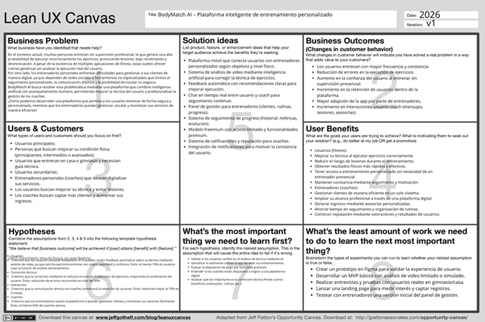
</p>

Link: 
### 1.3. Segmentos objetivo.

Los siguientes segmentos clave permiten establecer una base sólida para el desarrollo y posicionamiento de BodyMatch AI como un ecosistema integral de entrenamiento inteligente. La selección de estos segmentos busca generar sinergia entre usuarios que desean mejorar su rendimiento físico mediante el uso de tecnología y entrenadores que buscan profesionalizar, optimizar y escalar sus servicios en un entorno digital.

---

## Segmento objetivo 1: Jóvenes adultos interesados en el fitness

| Aspectos demográficos | Aspectos geográficos | Aspectos psicográficos |
|----------------------|--------------------|------------------------|
| Sexo: Masculino y femenino, sin distinción, con creciente participación de ambos en actividades fitness. | Nacionalidad: Principalmente usuarios dentro del Perú. | Motivaciones: Interés por mejorar su apariencia física, salud y rendimiento deportivo; búsqueda de resultados visibles y medibles. |
| Edades: Entre 18 y 35 años, principalmente jóvenes en etapa universitaria o inicio de vida laboral. | Ubicación: Mayor concentración en zonas urbanas como Lima Metropolitana, Arequipa, Trujillo y Piura. | Estilo de vida: Activo o en transición hacia hábitos saludables, con interés en combinar tecnología y fitness. |
| Nivel socioeconómico: A, B y C, con capacidad de acceso a servicios digitales y suscripciones. | Acceso a tecnología: Alta disponibilidad de smartphones, conexión a internet móvil y uso frecuente de aplicaciones móviles. | Preocupaciones: Miedo a lesionarse por mala técnica, falta de orientación profesional, uso de rutinas genéricas que no generan resultados. |
| Ocupación: Estudiantes universitarios, jóvenes profesionales, freelancers o emprendedores. | Espacios de entrenamiento: Gimnasios, hogares o parques. | Adaptación tecnológica: Alta, acostumbrados al uso de apps, redes sociales y contenido digital. |
| Ingresos: Variables, con disposición a invertir en bienestar personal. | | Interés por personalización: Muy alto, valoran soluciones adaptadas a sus objetivos y nivel físico. |

**Sustento:**  
Este segmento representa una de las principales audiencias del fitness digital en el Perú. Su alta adopción tecnológica y exposición constante a contenido en redes sociales facilita la integración de soluciones móviles basadas en inteligencia artificial, especialmente en contextos urbanos donde el acceso a gimnasios y aplicaciones de salud es mayor.

---

## Segmento objetivo 2: Entrenadores Personales (Coaches)

| Aspectos demográficos | Aspectos geográficos | Aspectos psicográficos |
|----------------------|--------------------|------------------------|
| Sexo: Masculino y femenino, con presencia equilibrada en el sector fitness. | Nacionalidad: Principalmente dentro del Perú. | Motivaciones: Expandir su alcance profesional, captar más clientes y generar mayores ingresos mediante canales digitales. |
| Edades: Entre 22 y 45 años, en etapa activa de desarrollo profesional. | Ubicación: Zonas urbanas y suburbanas con presencia de gimnasios y centros deportivos como Lima, Arequipa y Trujillo. | Estilo de vida: Enfocado en el rendimiento físico, la disciplina y el desarrollo profesional continuo. |
| Nivel socioeconómico: B y C, con ingresos variables según cartera de clientes. | Acceso a tecnología: Alto acceso a smartphones, laptops y redes sociales. | Preocupaciones: Limitaciones para gestionar clientes, dificultad para seguimiento remoto y dependencia de redes sociales. |
| Ocupación: Entrenadores personales, coaches fitness, instructores de gimnasio o independientes. | Entorno laboral: Gimnasios, entrenamiento independiente, asesorías remotas o híbridas. | Adaptación tecnológica: Media-alta, con interés en herramientas digitales. |
| Ingresos: Variables según sesiones y asesorías personalizadas. | | Interés por personalización: Alto, buscan diferenciar sus servicios y fidelizar clientes. |

**Sustento:**  
El crecimiento del sector fitness en el Perú ha impulsado la digitalización de los servicios de entrenamiento. Los entrenadores personales muestran una creciente necesidad de plataformas que les permitan gestionar clientes de forma eficiente, ampliar su alcance y profesionalizar sus servicios en un entorno cada vez más competitivo y digitalizado.


## Capítulo II: Requirements Elicitation & Analysis

### 2.1. Competidores.

#### 2.1.1. Análisis competitivo

En esta sección realizaremos un análisis competitivo sobre distintos actores en el mercado que cumplen funciones similares a las de nuestra plataforma dentro del rubro del fitness y el entrenamiento personal digital. De esta forma, podremos conocer nuestra posición frente a competidores directos e indirectos como Freeletics, Zing Coach y Peloton.

**Competitive analysis landscape**


**¿Por qué llevar a cabo este análisis?**  
Identificar las brechas competitivas en el mercado de fitness digital para posicionar a BodyMatch AI como la solución líder en corrección técnica mediante IA y gestión de coaches en el mercado local.

---

|                           | BodyMatch AI | Freeletics | Zing Coach | Peloton App |
|---------------------------|--------------|------------|------------|-------------|
| **Perfil**                |              |            |            |             |
| Overview                  | Plataforma que conecta usuarios con coaches, usando IA para analizar técnica mediante video. | App de fitness basada en algoritmos de IA (The Coach) para rutinas HIIT. | Entrenador virtual que usa "Zing Vision" para monitorear movimiento por cámara. | App de clases premium en vivo y bajo demanda con coaches de élite. |
| Ventaja competitiva <br> ¿Qué valor ofrece a los clientes? | Enfoque híbrido: Precisión de IA para evitar lesiones + gestión directa de un coach humano. | Algoritmo de IA muy maduro que permite entrenar en cualquier lugar sin equipo. | Tecnología de visión artificial avanzada para corrección de postura 100% autónoma. | Experiencia de "estudio" en casa con coaches celebridades y alta motivación. |
| **Perfil de Marketing**   |              |            |            |             |
| Mercado objetivo          | Usuarios que buscan seguridad técnica y coaches que quieren digitalizar su gestión. | Personas que buscan autonomía total y transformación física con HIIT. | Entusiastas de la tecnología que valoran los datos biométricos y precisión técnica. | Usuarios que buscan motivación grupal, música y calidad de producción de élite. |
| Estrategias de marketing  | Social Media (TikTok/IG) enfocado en seguridad técnica y profesionalismo accesible. | Branding global masivo "No Excuses" y amplia red de embajadores mundiales. | Promoción de "Zing Vision" y gamificación basada en el "Zing Skill Score". | Alianzas con artistas musicales y uso de instructores como influencers de estilo de vida. |
| **Perfil de Producto**    |              |            |            |             |
| Productos & Servicios     | IA de análisis de video, Marketplace de coaches y herramientas de gestión para entrenadores. | Planes HIIT personalizados, guías de audio-coaching y planes de nutrición. | Evaluación de forma física por cámara, conteo de reps y análisis metabólico. | Clases de fuerza, yoga y cardio con música exclusiva y comunidad activa. |
| Precios & Costos          | Free: Rutinas básicas. Premium: Análisis IA ilimitado y contacto con coaches. | Premium: S/ 45 - S/ 60 al mes (suscripciones trimestrales/anuales). | Premium: $15 - $20 USD mensuales para desbloquear visión artificial. | Premium: $12.99 - $24.00 USD mensuales según nivel de acceso y métricas. |
| Canales de distribución <br> (Web y/o Móvil) | App móvil (iOS y Android). | App móvil (iOS y Android). | App móvil (iOS y Android). | App móvil, Web y plataformas de Smart TV. |
| **Análisis SWOT**         |              |            |            |             |
| Fortalezas                | Corrección en tiempo real e interfaz que conecta con profesionales reales. | Marca consolidada y base de datos de usuarios global. | Innovación en visión artificial y precisión en datos técnicos. | Comunidad fiel y alta calidad en contenido audiovisual. |
| Debilidades               | Marca nueva en el mercado y fase de aprendizaje inicial de la IA. | Falta de feedback visual/video para corregir la postura técnica. | Costo elevado para LatAm y requiere entorno muy controlado para la cámara. | Bajo enfoque en la corrección técnica individual de los movimientos. |
| Oportunidades             | Crecimiento del fitness digital en Perú y alianzas con gimnasios locales. | Expansión con IA predictiva sobre la salud general del usuario. | Auge de los "wearables" y mercado de fisioterapia digital. | Crecimiento en el mercado de bienestar integral y nuevos dispositivos. |
| Amenazas                  | Competencia con marcas ya posicionadas y cambios rápidos en tecnología IA. | Apps gratuitas o de bajo costo con rutinas similares. | Regulaciones de privacidad de datos biométricos y captura de video. | Regreso masivo de los usuarios a los gimnasios físicos tradicionales. |

**Sustento:**  
El crecimiento del sector fitness en el Perú ha impulsado la digitalización de los servicios de entrenamiento. Los entrenadores personales muestran una creciente necesidad de plataformas que les permitan gestionar clientes de forma eficiente, ampliar su alcance y profesionalizar sus servicios en un entorno cada vez más competitivo y digitalizado.

#### 2.1.2. Estrategias y tácticas frente a competidores.

Frente a competidores como Freeletics y Zing Coach, BodyMatch AI se centrará en la corrección de técnica por IA y el contacto con coaches locales como su mayor diferencial. Estratégicamente, nos posicionaremos en redes sociales mediante demostraciones cortas de prevención de lesiones y seguridad al entrenar. Tácticamente, buscaremos alianzas con gimnasios peruanos y ofreceremos un modelo freemium donde el primer análisis de video sea gratuito para captar usuarios. Mantener una interfaz ágil y soporte directo asegurará nuestra ventaja en el mercado local.

### 2.2. Entrevistas.
#### 2.2.1. Diseño de entrevistas.


*Preguntas Generales*

- ¿Qué tan importante consideras la actividad física dentro de tu estilo de vida actual?
- ¿Utilizas herramientas digitales (apps, YouTube, smartwatches) para guiar tus entrenamientos?

---

**Segmento 1: Jóvenes adultos interesados en el fitness**

- ¿Cómo es tu rutina de entrenamiento actual y dónde sueles practicarla (casa o gimnasio)?
- ¿Alguna vez has sentido miedo de lesionarte o has tenido dudas sobre si estás haciendo un ejercicio correctamente? ¿Cómo lo resolviste?
- ¿Cuáles son tus objetivos principales al entrenar? (ej. ganar masa muscular, salud, estética).
- ¿Has usado apps de entrenamiento antes? ¿Qué fue lo que más te gustó y qué sentiste que le faltaba?
- Si una app pudiera analizar tus videos y corregir tu postura al instante, ¿sentirías más confianza al entrenar solo?
- ¿Estarías dispuesto a pagar por una suscripción que incluya corrección por IA y contacto con coaches certificados? ¿Qué te motivaría a hacerlo?

---

 **Segmento 2: Entrenadores Personales (Coaches)**

- ¿Cómo gestionas actualmente los planes de entrenamiento y el seguimiento de tus clientes?
- ¿Cuánto tiempo de tu jornada laboral estimas que dedicas a tareas administrativas y revisión manual de videos en comparación con la planificación real de entrenamientos?
- ¿Cuál es el mayor reto que enfrentas al asesorar a alguien de forma remota, especialmente respecto a su técnica?
- ¿De qué manera mantienes el compromiso y la motivación de tus alumnos remotos para evitar que abandonen sus rutinas por falta de supervisión constante?
- ¿Qué herramientas utilizas para captar nuevos clientes y dar visibilidad a tus servicios?
- ¿Qué valor diferencial consideras que aporta tu asesoría personalizada frente a las rutinas o videos gratuitos que los usuarios encuentran en internet?
- ¿Qué tan importante es para ti contar con un registro histórico de las cargas y métricas de rendimiento (volumen, peso, RPE) de tus alumnos para ajustar sus planes?
- ¿Qué opinas sobre el uso de Inteligencia Artificial como apoyo para supervisar la ejecución de los ejercicios de tus alumnos?
- ¿Qué funcionalidades te gustaría encontrar en una plataforma para que te facilite el cobro y la organización de tus asesorías?
- Si BodyMatch AI te permitiera automatizar correcciones básicas y conectarte con más clientes, ¿te interesaría formar parte de la plataforma? ¿Por qué?

#### 2.2.2. Registro de entrevistas.

**Segmento 1: Jóvenes Adultos interesados en el fitness**
**Entrevista 1**

 

Stefanny Paucar es una estudiante de 18 años residente de Villa María que busca mejorar su estilo de vida a través de la actividad física. Considera que el ejercicio es fundamental para desarrollar hábitos saludables, aunque actualmente entrena de forma empírica en casa siguiendo videos de YouTube y saliendo a correr con sus mascotas.
Su principal dificultad radica en la incertidumbre sobre su técnica; menciona sentir miedo a lesionarse y dudas constantes al intentar imitar movimientos de internet sin supervisión. Aunque no ha utilizado aplicaciones de fitness anteriormente, se muestra muy interesada en una herramienta tecnológica que le brinde autonomía.
Stephanie destaca que la función de análisis de video por inteligencia artificial le daría la confianza necesaria para ser más independiente en sus entrenamientos. Finalmente, afirma que estaría dispuesta a pagar por una suscripción premium de BodyMatch AI siempre que la plataforma demuestre ser eficaz y le ayude a alcanzar su objetivo estético de bajar de peso de manera segura.


| Detalle | Información |
|--------|------------|
| Entrevistador | Pablo geronimo |
| Entrevistado | Stefanny Paucar |
| Edad | 18 |
| Duración | 5:25 |
| Enlace | https://youtu.be/c5XLtFcafWM |

---

**Entrevista 2**

 
Alexander Moreno es un joven de 20 años con una trayectoria destacada en el Powerlifting desde 2025. Para él, la actividad física es el pilar de su estilo de vida, enfocándose en la sobrecarga progresiva y el método Heavy Duty (alto peso e intensidad). A pesar de su experiencia, admite que persisten dudas sobre la técnica correcta para evitar lesiones, las cuales suele resolver consultando a compañeros o buscando en su celular.
Aunque ha utilizado herramientas como Fitia y smartwatches, su experiencia previa con apps de entrenamiento ha sido negativa debido al exceso de anuncios y la falta de claridad en las instrucciones. Alexander valora positivamente la propuesta de BodyMatch AI, señalando que el análisis de video por inteligencia artificial sería una herramienta de gran utilidad para sus sesiones de entrenamiento en solitario.
Finalmente, manifiesta su disposición a pagar por una suscripción premium, siempre que el precio sea adecuado y facilite el acceso directo a información de coaches certificados, lo cual considera fundamental para seguir optimizando su progreso en fuerza y masa muscular.

| Detalle | Información |
|--------|------------|
| Entrevistador | Anyelo Bill Alejos Jesus |
| Entrevistado | Alexander Moreno Yactayo |
| Edad | 20 |
| Duración | 3:54 |
| Enlace | https://www.youtube.com/watch?v=jkUrHRdu5Sk |

---

**Entrevista 3**


 

Adrián Yañez es un joven deportista que entrena en el gimnasio entre 4 a 5 veces por semana, viendo el ejercicio como una herramienta clave para su salud mental y liberación de estrés. Aunque utiliza YouTube y smartwatches para monitorear sus calorías, siente que sus rutinas actuales carecen de un control de progreso formal y de una personalización real que se adapte a su nivel.  
El punto crítico en la experiencia de Adrián es la inseguridad al realizar ejercicios complejos como el peso muerto o las sentadillas; admite que el miedo a lesionarse limita su progreso, llevándolo incluso a evitar ciertos movimientos. Critica las aplicaciones actuales por ser "muy genéricas" y por no ofrecer retroalimentación en tiempo real sobre la ejecución física.  
Adrián afirma que la propuesta de BodyMatch AI de corregir la postura mediante inteligencia artificial le otorgaría la seguridad necesaria para entrenar solo y probar ejercicios nuevos. Se muestra dispuesto a pagar por una suscripción premium, siempre que la herramienta sea precisa, fácil de usar y ofrezca resultados visibles que complementen o reemplacen la necesidad de un entrenador físico.

| Detalle | Información |
|--------|------------|
| Entrevistador | Jorge Guevara |
| Entrevistado | Adrian Yañez |
| Edad | 23 |
| Duración | 4:32 |
| Enlace | https://youtu.be/upfe2c_R2q0 |

---

**Segmento 2: Entrenadores Personales (Coaches)**

**Entrevista 1**


 

Antonio Guevara es un entrenador que considera la actividad física como un pilar fundamental tanto en su vida personal como profesional. Actualmente gestiona sus asesorías de forma manual mediante Excel y WhatsApp, lo que le genera dificultades en la centralización de la información y una falta de constancia en el seguimiento debido al tiempo que consume la revisión de mensajes dispersos. Identifica la corrección técnica remota como su mayor desafío, destacando la imposibilidad de brindar feedback en tiempo real y el riesgo de lesiones que esto conlleva para sus clientes.  
Para la captación de clientes, depende de su constancia en redes sociales y recomendaciones boca a boca, pero reconoce la falta de un canal estructurado. Considera que la inteligencia artificial sería un complemento ideal para automatizar correcciones básicas y escalar su servicio sin sacrificar la calidad de la atención. Antonio busca una plataforma integral que centralice la gestión, los pagos y las métricas de rendimiento, y ve en BodyMatch AI una oportunidad clave para diferenciarse tecnológicamente e impulsar su crecimiento profesional.

| Detalle | Información |
|--------|------------|
| Entrevistador | Jorge Guevara |
| Entrevistado | Antonio Guevara |
| Edad | 25 |
| Duración | 5:15 |
| Enlace | https://www.youtube.com/watch?v=N_bbs6ibxkA |

---

**Entrevista 2**


 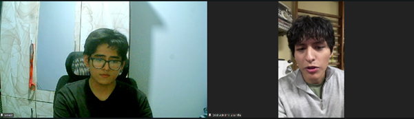

Adrian es un entrenador de 25 años que enfoca sus asesorías de manera personalizada, adaptando las rutinas según los objetivos y las posibles lesiones de cada cliente. Actualmente, dedica entre dos a tres horas de su jornada laboral a tareas administrativas y de revisión, un tiempo que considera significativo. Su mayor desafío en la asesoría remota no es solo la técnica, sino la gestión de las expectativas de los clientes, quienes suelen buscar resultados inmediatos y descuidan pilares básicos como la alimentación y el descanso, responsabilizando erróneamente al coach.  
Para captar clientes, Adrian combina el uso de WhatsApp e Instagram con una estrategia basada en la fidelización y el "boca a boca", priorizando la construcción de una relación de amistad con sus alumnos. Considera que, aunque internet está saturado de información, su valor diferencial reside en la corrección técnica específica que un video genérico no puede ofrecer. Adrian ve con muy buenos ojos la implementación de la Inteligencia Artificial como un apoyo motivador y técnico, y señala que funcionalidades como los pagos directos (sin capturas de pantalla) y una lista de control de actividad de los alumnos serían herramientas clave para facilitar su trabajo. Se muestra interesado en BodyMatch AI por la facilidad que le brindaría para comunicarse y llegar de forma más eficiente a sus clientes.

| Detalle | Información |
|--------|------------|
| Entrevistador | Anyelo Alejos |
| Entrevistado | Adrian Huisa |
| Edad | 24 |
| Duración | 5:153 |
| Enlace | https://youtu.be/0V8fsOUzfPY |

---

**Entrevista 3**


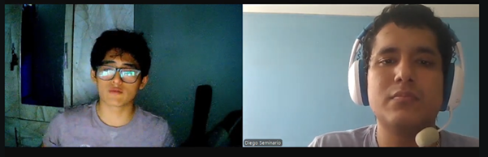

Diego seminario es un preparador de culturismo de 26 años para quien la disciplina y la excelencia física son la base de su identidad. Aunque utiliza herramientas digitales para el registro de cargas, enfrenta una carga administrativa abrumadora al supervisar manualmente a más de 50 atletas mediante videos recibidos por redes sociales. Su principal conflicto es la falta de inmediatez. El retraso de hasta 48 horas en el feedback técnico es un "bache peligroso" que compromete el progreso y la seguridad de sus alumnos de alto rendimiento.  
Javier identifica la inteligencia artificial como el "siguiente nivel" de la industria, especialmente para garantizar la conexión mente-músculo y los ángulos de ejecución correctos sin necesidad de su presencia física constante. Para el BodyMatch AI representa la oportunidad de posicionarse como un coach premium, permitiéndole delegar la supervisión técnica básica para enfocarse en tareas de mayor valor como la estrategia nutricional y los ajustes finos de la preparación competitiva. Además, subraya la importancia de contar con herramientas visuales de progresión de cargas para validar la efectividad de sus asesorías.

| Detalle | Información |
|--------|------------|
| Entrevistador | Anyelo Alejos |
| Entrevistado | Diego seminario |
| Edad | 26 |
| Duración | 6:14 |
| Enlace | https://youtu.be/qI0G5MozYRU |


#### 2.2.3. Análisis de entrevistas.

**Segmento 1: Jóvenes Adultos interesados en el fitness**

Tras analizar las respuestas de los tres participantes (una principiante, un usuario intermedio y un deportista avanzado), se han identificado patrones críticos que definen la necesidad de nuestra solución:

**Prioridad del ejercicio y salud mental**  
El 100% de los entrevistados considera la actividad física como un pilar fundamental en su vida. Mientras que para Stephanie y Alexander el enfoque es la salud y el rendimiento, Adrián añade un componente emocional, utilizando el entrenamiento como una vía de escape para el estrés.

**La brecha de la técnica: Inseguridad y miedo a lesiones**  
Este es el hallazgo más relevante. A pesar de los distintos niveles de experiencia, el 100% experimenta dudas sobre la ejecución correcta de sus ejercicios.

- Usuarios en casa (Stephanie): Sienten "miedo" de lesionarse al imitar videos sin supervisión.  
- Usuarios de gimnasio (Alexander y Adrián): A pesar de usar pesos altos, necesitan recurrir a terceros o a búsquedas rápidas en el móvil para validar su técnica en movimientos complejos como el peso muerto.  

| Comportamiento | % Coincidencia | Perfiles |
|---------------|---------------|----------|
| Dudas sobre la postura correcta | 66% | Todos |
| Miedo explícito a sufrir lesiones | 33% | Stephanie y Adrián |
| Abandono de ejercicios por inseguridad | 66% | Adrián |

**El uso de YouTube como "entrenador sustituto"**  
El 66% de los entrevistados (Stephanie y Adrián) utiliza YouTube como su principal fuente de guía técnica. Sin embargo, ambos coinciden en que esta plataforma es unidireccional; les da la información, pero no les confirma si lo están replicando bien, lo que genera una "falsa sensación de seguridad".

**Descontento con las soluciones digitales actuales**  
Alexander y Adrián, quienes ya han probado aplicaciones de fitness, reportan experiencias negativas por dos razones principales:

- Exceso de publicidad: Interrumpe el flujo del entrenamiento.  
- Falta de personalización: Sienten que las apps son "genéricas" y no ofrecen feedback en tiempo real, limitándose a ser cronómetros o diarios de rutinas.  

**Validación del análisis por IA y Marketplace de Coaches**  
La propuesta de valor de BodyMatch AI fue recibida con entusiasmo unánime:

- Confianza e Independencia: Los tres participantes coinciden en que la corrección por IA les daría la "seguridad" necesaria para entrenar solos sin temor a equivocarse.  
- Valor del Factor Humano: Para los perfiles más avanzados (Alexander y Adrián), el contacto con un coach certificado es el motivador principal para realizar un pago.  

**Disposición económica**  
El 100% de los entrevistados está dispuesto a pagar por una suscripción premium. Las condiciones para este pago son:

- Eficacia real: Que la IA realmente detecte errores.  
- Precio competitivo: Un costo accesible para el mercado local.  
- Facilidad de uso: Una interfaz limpia y rápida.  

---

**Segmento 2: Entrenadores Personales (Coaches)**

Con base en las entrevistas realizadas a los tres profesionales del fitness, se identifican las siguientes tendencias, necesidades y puntos críticos en su labor como entrenadores:

**Descentralización y "Caos Administrativo"**  
El 100% de los coaches entrevistados gestiona sus asesorías de forma fragmentada. No cuentan con una plataforma única, lo que genera una carga operativa innecesaria.

- Herramientas actuales: Excel, WhatsApp, Notion y Google Drive.  
- Impacto: Antonio y Carlos coinciden en que la dispersión de archivos (enviar un PDF por un lado y corregir por otro) quita tiempo valioso y genera desorden, dificultando un seguimiento constante y profesional.  

**El "Cuello de Botella" de la Técnica Remota**  
Este es el punto de dolor más crítico compartido por los tres perfiles. Existe una incapacidad física de corregir en tiempo real, lo que compromete la seguridad del cliente:

- Feedback tardío: Javier y Antonio señalan que el desfase de tiempo (el usuario entrena un día y el coach corrige al siguiente) rompe el ciclo de aprendizaje y aumenta el riesgo de lesiones.  
- Tedio operativo: El 100% considera que descargar, revisar y comentar videos de forma manual es una tarea agotadora que limita la cantidad de alumnos que pueden atender.  

| Reto identificado | % Coincidencia | Impacto en el Coach |
|------------------|---------------|---------------------|
| Falta de corrección técnica instantánea | 100% | Retraso en el progreso del cliente. |
| Gestión manual de archivos de video | 100% | Saturación de tiempo y falta de escalabilidad. |
| Dificultad para interpretar movimientos | 66% | Riesgo de que el cliente automatice errores. |

**Dependencia Crítica de los Algoritmos de Redes Sociales**  
Aunque el 100% utiliza Instagram y TikTok para captar clientes, todos sienten la presión de ser "creadores de contenido" antes que entrenadores:

- Falta de Vitrina Profesional: Mateo y Javier mencionan que dependen totalmente de su constancia publicando para tener visibilidad.  
- Necesidad de Centralización: Buscan un canal más estructurado (Marketplace) donde sus certificaciones y resultados reales tengan más peso que el algoritmo de una red social.  

**La IA como "Asistente Estratégico", no como Reemplazo**  
Un hallazgo fundamental es que ningún coach ve la tecnología como una amenaza. Por el contrario, el 100% la percibe como el siguiente paso lógico en su evolución profesional:

- Filtrado Técnico: Coinciden en que la IA debería encargarse de las correcciones básicas (ángulos, postura de espalda, profundidad) para que ellos puedan enfocarse en la programación avanzada y la motivación personalizada.  

**Gestión Financiera y Métricas de Rendimiento**  
Existe un rechazo unánime hacia la gestión de cobros manual (pedir capturas de pantalla, transferencias bancarias, etc.):

- Funcionalidades deseadas: El 100% solicita pasarelas de pago automatizadas y, sobre todo, gráficos de progreso (cargas, repeticiones, peso) para visualizar el rendimiento del cliente de forma rápida y visual, algo que actualmente no pueden hacer de forma integrada.  

**Disposición de Adopción de BodyMatch AI**  
El interés en unirse a la plataforma es del 100%. Los coaches ven en la aplicación tres beneficios claros:

- Diferenciación: Posicionarse como entrenadores "tecnológicos" frente a la competencia tradicional.  
- Optimización del Tiempo: Ahorrar horas en revisión de video.  
- Escalabilidad: Capacidad de manejar carteras de clientes más grandes manteniendo la calidad del servicio técnico.


### 2.3. Needfinding.

#### 2.3.1. User Personas.

Para la creación de los User Persona de cada segmento, partimos de las entrevistas realizadas, las cuales nos sirvieron como base para identificar patrones, necesidades y motivaciones reales de los usuarios. A partir de estos hallazgos, construimos representaciones ficticias pero fundamentadas en la realidad, que reflejan el perfil, objetivos y frustraciones de cada segmento clave.


**Segmento 1: Jóvenes Adultos interesados en el fitness**

<p align="center" >
  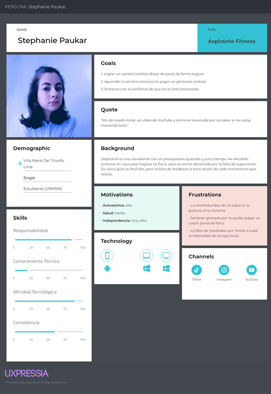
</p>

**Segmento 2: Entrenadores Personales (Coaches)**

<p align="center">
  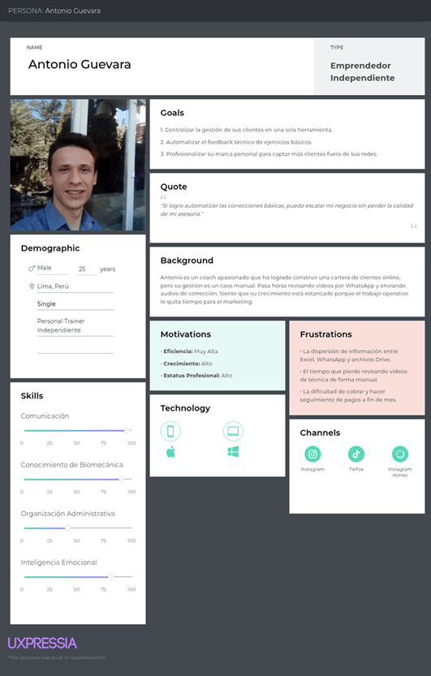
</p>


#### 2.3.2. User Task Matrix.
**Tareas / User Persona**

| Tareas / User Persona        | Stephanie Paukar (Frec.) | Stephanie Paukar (Imp.) | Antonio Guevara (Frec.) | Antonio Guevara (Imp.) |
|-----------------------------|--------------------------|--------------------------|--------------------------|--------------------------|
| Registrar entrenamientos    | Alta                     | Alta                     | N/A                      | N/A                      |
| Grabar videos de técnica    | Alta                     | Alta                     | N/A                      | N/A                      |
| Revisar correcciones IA     | Alta                     | Alta                     | Media                    | Alta                     |
| Diseñar rutinas/planes      | N/A                      | N/A                      | Alta                     | Alta                     |
| Analizar videos de alumnos  | N/A                      | N/A                      | Alta                     | Alta                     |
| Gestionar pagos/cobros      | Baja                     | Media                    | Alta                     | Alta                     |
| Monitorear progreso         | Media                    | Alta                     | Alta                     | Alta                     |
| Comunicación directa        | Media                    | Alta                     | Alta                     | Alta                     |
| Buscar coaches / alumnos    | Baja                     | Alta                     | Alta                     | Alta                     |
| Configurar notificaciones   | Media                    | Media                    | Media                    | Media                    |

**Validación técnica como prioridad compartida:**  
Ambos usuarios otorgan una importancia Alta a la corrección de técnica y el uso de la IA, confirmando que es la funcionalidad nuclear de la aplicación.

**Stephanie Paukar (Enfoque en ejecución):**  
Sus tareas frecuentes e importantes se centran en la grabación y el feedback instantáneo, buscando seguridad y autonomía al entrenar sola.

**Antonio Guevara (Enfoque en gestión):**  
Sus tareas más críticas son el diseño de planes y el análisis masivo de sus alumnos, buscando herramientas que le permitan escalar su negocio y profesionalizar sus cobros.

**Sincronización necesaria:**  
La app debe garantizar una comunicación fluida y un sistema de monitoreo de progreso que sea fácil de alimentar por el alumno y rápido de auditar por el coach, optimizando el tiempo de ambos.

#### 2.3.3. Empathy Maps


El Empathy Mapping es una herramienta fundamental para profundizar en la experiencia del usuario, permitiéndonos entender no solo lo que hacen, sino lo que sienten y experimentan en su entorno real. A continuación, presentamos los mapas de empatía de los dos segmentos clave de nuestro proyecto BodyMatch AI:


**Segmento 1: Jóvenes adultos interesados en el fitness**

<p align="center" >
  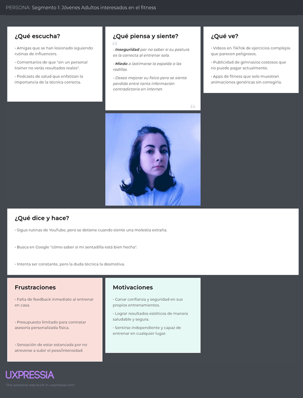
</p>

**Segmento 2: Entrenadores Personales (Coaches)**

<p align="center">
  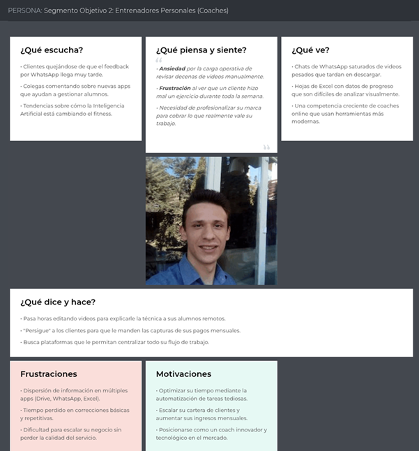
</p>


#### 2.3.4. As-Is Scenario Mapping

**Segmento 1: Jóvenes adultos interesados en el fitness**

<p align="center" >
  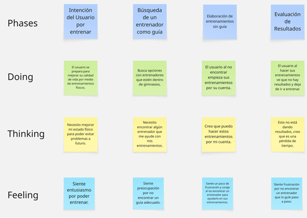
</p>

**Segmento 2: Entrenadores Personales (Coaches)**

<p align="center">
  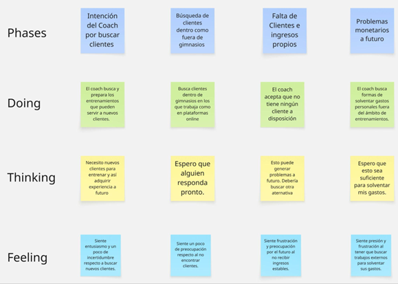
</p>

## Capítulo III: Requirements Specification

### 3.1. User Stories.


En esta sección se detallan todas las **User Stories** identificadas para la aplicación BodyMatch. Incluyen:  

Cada historia está estructurada para facilitar desarrollo ágil y validación iterativa.

---


**Epics**

| Epics ID | Título | Descripción |
|----------|--------|-------------|
| EP01 | Gestión de acceso y perfil | Como usuario o coach, quiero registrarme, iniciar sesión y administrar mi perfil, para acceder de forma segura a la plataforma y personalizar mi experiencia. |
| EP02 | Conexión entre usuarios y coaches | Como usuario, quiero encontrar coaches según mis objetivos físicos, para recibir entrenamiento personalizado. |
| EP03 | Análisis de ejercicios con IA | Como usuario, quiero recibir retroalimentación automática sobre mi técnica, para mejorar mis ejercicios y evitar lesiones. |
| EP04 | Seguimiento de progreso físico | Como usuario, quiero visualizar mi progreso físico, para medir mis resultados y mantenerme motivado. |
| EP05 | Gestión profesional para coaches | Como coach, quiero gestionar mis clientes y sesiones, para brindar un mejor servicio y organizar mi trabajo. |
| EP06 | Análisis nutricional inteligente mediante imagen | Como usuario, quiero subir una foto de mis alimentos para obtener automáticamente información nutricional (calorías, proteínas, carbohidratos, grasas, etc.), para poder llevar un mejor control de mi alimentación y complementar mi entrenamiento físico. |
| EP-LP | Sitio web estático | Como visitante quiero conocer los servicios y características de la plataforma para decidir si contratar. |
| EP-API | API RESTful | Como desarrollador quiero acceder a los servicios mediante endpoints para integrarlos con otras aplicaciones. |

| Epic / Story ID | Título | Descripción | Criterios de Aceptación                                                                                                                                                                                                                                                                                                                                                                                                                                                                                                                                                          | Story Points | Relacionado con (Epic ID) |
|-----------------|--------|-------------|----------------------------------------------------------------------------------------------------------------------------------------------------------------------------------------------------------------------------------------------------------------------------------------------------------------------------------------------------------------------------------------------------------------------------------------------------------------------------------------------------------------------------------------------------------------------------------|--------------|---------------------------|
| US01 | Registro de usuario | Como nuevo usuario o coach, quiero registrarme con mis datos personales para acceder a la plataforma. | Escenario 1: Registro exitoso usuario<br>Dado que el usuario completa el formulario,<br>cuando selecciona “usuario”,<br>entonces el sistema lo redirige al dashboard.<br><br>Escenario 2: Registro exitoso coach<br>Dado que el usuario selecciona “coach”,<br>cuando completa el registro,<br>entonces se redirige a configuración profesional.<br><br>Escenario 3: Dado que el usuario deja campos obligatorios vacíos, cuando hace clic en 'Registrarse', entonces el sistema resalta los campos en rojo y muestra: 'Error: Todos los campos marcados con * son obligatorios' | 1            | EP01 |
| US02 | Inicio de sesión | Como usuario registrado, quiero iniciar sesión para acceder a mi cuenta. | Escenario 1: Acceso exitoso<br>Dado que ingresa credenciales correctas,<br>cuando inicia sesión,<br>entonces accede al sistema.<br><br>Escenario 2: Error de login<br>Dado que los datos son incorrectos,<br>cuando intenta ingresar,<br>entonces se muestra error.                                                                                                                                                                                                                                                                                                              | 1            | EP01 |
| US03 | Recuperación de contraseña | Como usuario, quiero recuperar mi contraseña en caso de olvido para no perder acceso a mis datos. | Escenario 1: Solicitud de recuperación<br>Dado que el usuario solicita recuperación,<br>cuando ingresa su correo,<br>entonces recibe enlace o código.<br><br>Escenario 2: Restablecimiento exitoso<br>Dado que recibe el enlace,<br>cuando cambia contraseña,<br>entonces se actualiza correctamente.                                                                                                                                                                                                                                                                            | 3            | EP01 |
| US04 | Cierre de sesión | Como usuario, quiero cerrar sesión para proteger mi cuenta. | Escenario 1: Logout exitoso<br>Dado que el usuario está en sesión,<br>cuando selecciona cerrar sesión,<br>entonces se cierra sesión.<br><br>Escenario 2: Acceso bloqueado<br>Dado que cerró sesión,<br>cuando intenta entrar,<br>entonces se solicita login.                                                                                                                                                                                                                                                                                                                     | 1            | EP01 |
| US05 | Configuración de perfil | Como usuario, quiero definir mis objetivos físicos para recibir un plan de entrenamiento adaptado. | Escenario 1: Guardado inicial<br>Dado que el usuario ingresa datos,<br>cuando guarda perfil,<br>entonces se almacenan objetivos.<br><br>Escenario 2: Actualización<br>Dado que modifica datos,<br>cuando guarda cambios,<br>entonces se actualiza perfil.                                                                                                                                                                                                                                                                                                                        | 2            | EP01 |
| US06 | Búsqueda de coaches | Como usuario quiero buscar coaches según objetivos para encontrar al profesional que mejor se ajuste a mis necesidades. | Escenario 1: Búsqueda por filtro<br>Dado que usa filtros,<br>cuando busca coaches,<br>entonces se muestran resultados.<br><br>Escenario 2: Búsqueda por nombre<br>Dado que ingresa nombre,<br>cuando busca,<br>entonces aparecen coincidencias.<br><br>Escenario 3: Sin resultados<br>Dado que no hay coincidencias,<br>cuando busca,<br>entonces se muestra mensaje.                                                                                                                                                                                                            | 3            | EP02 |
| US07 | Perfil de coach | Como usuario quiero ver información del coach para evaluar su experiencia y decidir si contratarlo. | Escenario 1: Visualización completa<br>Dado que selecciona un coach,<br>cuando entra al perfil,<br>entonces ve experiencia, tarifas y reseñas.                                                                                                                                                                                                                                                                                                                                                                                                                                   | 1            | EP02 |
| US08 | Reserva de sesión | Como usuario quiero reservar sesiones con coach para asegurar un horario de entrenamiento personalizado. | Escenario 1: Reserva exitosa<br>Dado que hay disponibilidad,<br>cuando selecciona horario,<br>entonces la sesión queda agendada.                                                                                                                                                                                                                                                                                                                                                                                                                                                 | 2            | EP02 |
| US09 | Chat con coach | Como usuario quiero comunicarme con mi coach para resolver dudas sobre mi rutina en tiempo real. | Escenario 1: Envío de mensaje<br>Dado que abre chat,<br>cuando envía mensaje,<br>entonces se entrega al coach.<br><br>Escenario 2: Respuesta<br>Dado que el coach responde,<br>cuando usuario abre chat,<br>entonces ve mensaje.<br><br>Escenario 3: Historial<br>Dado que existen mensajes,<br>cuando entra al chat,<br>entonces ve conversación completa.                                                                                                                                                                                                                      | 5            | EP02 |
| US10 | Calificación del coach | Como usuario quiero calificar al coach para ayudar a otros usuarios a elegir basándose en mi experiencia | Escenario 1: Registro de reseña<br>Dado que termina sesión,<br>cuando califica,<br>entonces se guarda reseña.<br><br>Escenario 2: Restricción<br>Dado que no tuvo sesión,<br>cuando intenta calificar,<br>entonces se bloquea acción.                                                                                                                                                                                                                                                                                                                                            | 1            | EP02 |
| US11 | Subir video | Como usuario registrado, quiero subir un video de mi ejercicio, para recibir retroalimentación automática de la IA y mejorar mi técnica. | Escenario 1: Subida correcta<br>Dado que selecciona video,<br>cuando lo sube,<br>entonces se carga archivo.<br><br>Escenario 2: Error formato<br>Dado que archivo no es válido,<br>cuando sube,<br>entonces muestra error.                                                                                                                                                                                                                                                                                                                                                       | 3            | EP03 |
| US12 | Feedback IA | Como usuario quiero corrección automática de ejercicios para evitar lesiones y optimizar mi rendimiento. | Escenario 1: Dado que el video ha sido procesado con éxito, cuando el usuario abre el resultado, entonces el sistema muestra el video con skeleton overlay y una lista de máximo 3 errores técnicos.<br><br>Escenario 2: Recomendaciones claras<br>Dado que termina análisis,<br>cuando ve resultados,<br>entonces recibe sugerencias.                                                                                                                                                                                                                                           | 13           | EP03 |
| US13 | Historial correcciones | Como usuario quiero ver mis análisis anteriores para visualizar mi mejora técnica a través del tiempo. | Escenario 1: Lista historial<br>Dado que tiene análisis previos,<br>cuando entra a historial,<br>entonces ve registros.<br><br>Escenario 2: Detalle<br>Dado que selecciona registro,<br>cuando abre,<br>entonces ve video y feedback.                                                                                                                                                                                                                                                                                                                                            | 2            | EP03 |
| US14 | Recomendaciones IA | Como usuario quiero mejoras personalizadas basadas en mis errores frecuentes para entrenar con mayor precisión. | Escenario 1: Recomendaciones<br>Dado que analiza ejercicio,<br>cuando termina IA,<br>entonces muestra mejoras.<br><br>Escenario 2: Seguimiento<br>Dado que repite análisis,<br>cuando hay progreso,<br>entonces compara evolución.                                                                                                                                                                                                                                                                                                                                               | 5            | EP03 |
| US15 | Registro métricas | Como usuario quiero registrar medidas físicas para cuantificar mis cambios estéticos y de salud. | Escenario 1: Guardado<br>Dado que ingresa datos,<br>cuando guarda,<br>entonces se registra información.<br><br>Escenario 2: Historial<br>Dado que ya existen registros,<br>cuando añade nuevos,<br>entonces no se elimina historial.                                                                                                                                                                                                                                                                                                                                             | 1            | EP04 |
| US16 | Progreso físico | Como usuario quiero ver gráficos de evolución para mantenerme motivado al ver mis resultados visualmente. | Escenario 1: Visualización<br>Dado que hay datos,<br>cuando entra a progreso,<br>entonces ve gráficos.<br><br>Escenario 2: Comparación<br>Dado que selecciona fechas,<br>cuando filtra,<br>entonces ve evolución.                                                                                                                                                                                                                                                                                                                                                                | 3            | EP04 |
| US17 | Historial entrenamientos | Como usuario quiero ver mis entrenamientos pasados para llevar un control estricto de mi constancia. | Escenario 1: Lista<br>Dado que entrenó antes,<br>cuando entra historial,<br>entonces ve sesiones.<br><br>Escenario 2: Detalle<br>Dado que selecciona sesión,<br>cuando abre,<br>entonces ve información.                                                                                                                                                                                                                                                                                                                                                                         | 2            | EP04 |
| US18 | Alertas rutina | Como usuario quiero recordatorios de entrenamiento para evitar el sedentarismo y cumplir mi plan. | Escenario 1: Notificación<br>Dado que tiene rutina,<br>cuando llega hora,<br>entonces recibe alerta.<br><br>Escenario 2: Incumplimiento<br>Dado que no entrena,<br>cuando pasa tiempo,<br>entonces recibe aviso.                                                                                                                                                                                                                                                                                                                                                                 | 3            | EP04 |
| US19 | Gestión clientes | Como coach quiero administrar a mis clientes para organizar mejor mis asesorías y tiempos. | Escenario 1: Lista clientes<br>Dado que tiene alumnos,<br>cuando entra módulo,<br>entonces ve lista.<br><br>Escenario 2: Perfil cliente<br>Dado que selecciona alumno,<br>cuando abre perfil,<br>entonces ve progreso.                                                                                                                                                                                                                                                                                                                                                           | 3            | EP05 |
| US20 | Disponibilidad | Como coach quiero definir mis horarios para que mis alumnos reserven sesiones sin conflictos de agenda. | Escenario 1: Registro<br>Dado que configura agenda,<br>cuando guarda,<br>entonces se publica disponibilidad.<br><br>Escenario 2: Edición<br>Dado que modifica horarios,<br>cuando actualiza,<br>entonces cambia agenda.                                                                                                                                                                                                                                                                                                                                                          | 2            | EP05 |
| US21 | Seguimiento cliente | Como coach quiero ver el progreso detallado de mis clientes para ajustar sus rutinas de forma profesional. | Escenario 1: Visualización<br>Dado que selecciona cliente,<br>cuando entra,<br>entonces ve métricas.<br><br>Escenario 2: Comparación<br>Dado que hay historial,<br>cuando filtra fechas,<br>entonces ve evolución.                                                                                                                                                                                                                                                                                                                                                               | 3            | EP05 |
| US22 | Monetización | Como coach quiero definir precios para mis servicios para profesionalizar y rentabilizar mi trabajo. | Escenario 1: Registro tarifa<br>Dado que crea plan,<br>cuando guarda,<br>entonces se publica.<br><br>Escenario 2: Actualización<br>Dado que cambia precio,<br>cuando edita,<br>entonces se actualiza.                                                                                                                                                                                                                                                                                                                                                                            | 2            | EP05 |
| US23 | Subir imagen comida | Como usuario quiero subir fotos de mi comida para que el sistema identifique los nutrientes automáticamente. | Escenario 1: Subida correcta<br>Dado que selecciona imagen,<br>cuando carga,<br>entonces se procesa.<br><br>Escenario 2: Error<br>Dado que falla archivo,<br>cuando sube,<br>entonces muestra error.                                                                                                                                                                                                                                                                                                                                                                             | 2            | EP06 |
| US24 | Reconocimiento IA | Como usuario quiero detección de alimentos mediante IA para no tener que ingresar cada ingrediente manualmente | Escenario 1: Dado que la foto es nítida, cuando la IA procesa la imagen, entonces identifica 'Pollo a la plancha' y 'Ensalada mixta'..<br><br>Escenario 2: Imagen borrosa. Dado que no hay nitidez, entonces muestra: "No pudimos identificar los alimentos. Por favor, suba una imagen con mejor iluminación".                                                                                                                                                                                                                                                                                                                                                                                          | 8            | EP06 |
| US25 | Cálculo nutricional | Como usuario quiero conocer macros y calorías para balancear mi dieta según mi plan de entrenamiento. | Escenario 1: Cálculo correcto<br>Dado que detecta alimentos,<br>cuando procesa,<br>entonces muestra valores.<br><br>Escenario 2: Error cálculo<br>Dado que falla sistema,<br>cuando procesa,<br>entonces muestra error.                                                                                                                                                                                                                                                                                                                                                          | 3            | EP06 |
| US26 | Visualización nutrientes | Como usuario quiero gráficos nutricionales para entender si estoy cumpliendo mis requerimientos diarios | Escenario 1: Visualización<br>Dado que hay datos,<br>cuando entra,<br>entonces ve gráficos.<br><br>Escenario 2: Sin datos<br>Dado que no hay info,<br>cuando entra,<br>entonces muestra aviso.                                                                                                                                                                                                                                                                                                                                                                                   | 3            | EP06 |
| US27 | Edición alimentos | Como usuario quiero corregir alimentos detectados para asegurar que mi registro diario sea 100% exacto. | Escenario 1: Edición correcta<br>Dado que IA detecta alimentos,<br>cuando edita,<br>entonces actualiza datos.<br><br>Escenario 2: Error<br>Dado que falla guardado,<br>cuando edita,<br>entonces muestra error.                                                                                                                                                                                                                                                                                                                                                                  | 1            | EP06 |
| US28 | Historial comidas | Como usuario quiero guardar mis comidas diarias para analizar mis hábitos alimenticios a largo plazo. | Escenario 1: Registro automático<br>Dado que analiza comida,<br>cuando termina,<br>entonces guarda historial.<br><br>Escenario 2: Error guardado<br>Dado que falla sistema,<br>cuando guarda,<br>entonces muestra error.                                                                                                                                                                                                                                                                                                                                                         | 2            | EP06 |
| US29 | Consumo diario | Como usuario quiero ver un resumen de mi consumo diario para no exceder mi límite calórico. | Escenario 1: Resumen diario<br>Dado que hay registros,<br>cuando entra,<br>entonces ve calorías.<br><br>Escenario 2: Sin datos<br>Dado que no hay registros,<br>cuando entra,<br>entonces muestra aviso.                                                                                                                                                                                                                                                                                                                                                                         | 2            | EP06 |
| US30 | Recomendaciones nutricionales | Como usuario quiero sugerencias según mis metas para optimizar mi nutrición junto a mi entrenamiento. | Escenario 1: Recomendación<br>Dado que analiza consumo,<br>cuando procesa,<br>entonces sugiere mejoras.<br><br>Escenario 2: Sin datos<br>Dado que no hay info,<br>cuando procesa,<br>entonces muestra mensaje.                                                                                                                                                                                                                                                                                                                                                                   | 5            | EP06 |
| US31 | Integración fitness-nutrición | Como usuario quiero conectar mi dieta y entrenamiento para ver cómo mi alimentación influye en mi fuerza. | Escenario 1: Entonces el sistema redirige al usuario a la sección de "Metas" y muestra el mensaje: "Para calcular tu balance, primero define tu objetivo de peso o masa muscular.<br><br>Escenario 2: Falta de datos<br>Dado que no hay objetivos,<br>cuando entra,<br>entonces solicita configuración.                                                                                                                                                                                                                                                                          | 5            | EP06 |
| US32 | Notificaciones nutricionales | Como usuario quiero recordatorios de comidas para mantener mi metabolismo activo y organizado. | Escenario 1: Notificación<br>Dado que activa recordatorios,<br>cuando llega hora,<br>entonces envía alerta.<br><br>Escenario 2: Desactivado<br>Dado que está apagado,<br>cuando llega hora,<br>entonces no envía nada.                                                                                                                                                                                                                                                                                                                                                           | 3            | EP06 |
| US33 | Consultar información de servicios | Como visitante, quiero conocer los servicios disponibles para evaluar si se adecuan a mis necesidades. | Escenario 1: Acceso a información<br>Dado que el visitante accede al sitio web,<br>cuando recorre la sección informativa,<br>entonces el sistema presenta descripciones claras de los servicios.<br><br>Escenario 2: Consulta de características<br>Dado que se requiere mayor detalle,<br>cuando se solicita información específica,<br>entonces el sistema entrega las características correspondientes.                                                                                                                                                                       | 1            | EP-LP |
| US34 | Solicitar demostración | Como visitante, quiero registrar interés en una demostración para conocer mejor el sistema. | Escenario 1: Registro exitoso<br>Dado que se ingresan datos válidos,<br>cuando se envía la solicitud,<br>entonces el sistema confirma la recepción y describe el siguiente paso.<br><br>Escenario 2: Registro inválido<br>Dado que se ingresan datos incompletos,<br>cuando se procesa la solicitud,<br>entonces el sistema informa los errores identificados.                                                                                                                                                                                                                   | 2            | EP-LP |
| US35 | Consultar planes y precios | Como visitante, quiero comparar los planes disponibles para elegir el que mejor se adapta. | Escenario 1: Comparación de planes<br>Dado que se accede a la sección de precios,<br>cuando se consulta la información,<br>entonces el sistema presenta detalles y precios de cada plan.<br><br>Escenario 2: Elección de plan<br>Dado que se elige un plan,<br>cuando se solicita continuar,<br>entonces el sistema redirige a la sección correspondiente con el plan predefinido.                                                                                                                                                                                               | 1            | EP-LP |
| US36 | Solicitar asistencia | Como visitante, quiero contactar con el soporte para resolver dudas sobre el servicio. | Escenario 1: Envío de consulta<br>Dado que se redacta un mensaje de contacto,<br>cuando se envía la solicitud,<br>entonces el sistema registra la consulta y comunica un tiempo estimado de respuesta.<br><br>Escenario 2: Acceso a preguntas frecuentes<br>Dado que se buscan respuestas previas,<br>cuando se accede a la sección informativa,<br>entonces el sistema presenta las preguntas frecuentes disponibles.                                                                                                                                                           | 2            | EP-LP |
| US37 | Consultar casos de éxito | Como visitante, quiero revisar casos de éxito para conocer experiencias reales con el sistema. | Escenario 1: Revisión de testimonios<br>Dado que se accede a la sección de experiencias,<br>cuando se selecciona un caso,<br>entonces el sistema presenta el contenido completo con resultados.<br><br>Escenario 2: Filtrado de casos<br>Dado que se requiere una vista segmentada,<br>cuando se filtra por industria,<br>entonces el sistema muestra solo los casos relacionados.                                                                                                                                                                                               | 1            | EP-LP |
| US38 | Sección "Cómo funciona" | Como visitante, quiero ver una guía paso a paso para entender cómo la IA analiza mis ejercicios. | Escenario 1: Infografía interactiva. Dado que baja en la landing, entonces ve 3 pasos animados del escaneo de video.<br><br>Escenario 2: Salto de guía. Dado que ya conoce el sistema, puede cerrar la guía con el botón 'X' en cualquier momento.                                                                                                                                                                                                                                                                                                                               | 1            | EP-LP |
| US39 | Registro rápido | Como visitante, quiero un botón de registro visible para crear mi cuenta rápidamente desde el inicio. | Escenario 1: Botón Header. Dado que hace clic en "Empezar Gratis", entonces salta directamente al flujo US01.<br><br>Escenario 2: Persistencia. Dado que ya inició sesión antes, cuando hace clic, el sistema lo reconoce y lo lleva al dashboard.                                                                                                                                                                                                                                                                                                                               | 1            | EP-LP |
| TS01 | Implementación de Middleware de Autenticación JWT | Como sistema, se debe validar el token JWT en las cabeceras de cada petición para asegurar la integridad de los datos de la API. | Escenario 1: Validación de token exitosa<br>Dado que una aplicación externa envía un JWT válido,<br>cuando el middleware lo procesa,<br>entonces autoriza el acceso al endpoint solicitado.<br><br>Escenario 2: Token inexistente o corrupto<br>Dado que la petición no incluye cabecera de autorización,<br>cuando el sistema la intercepta,<br>entonces retorna un error 401 Unauthorized.                                                                                                                                                                                     | 3            | EP-API |
| TS02 | Exposición de Endpoints para Bounded Context Matchmaking | Como sistema, se deben exponer endpoints REST para permitir la consulta externa de perfiles de coaches certificados. | Escenario 1: Respuesta JSON. Dado un GET a /api/v1/coaches, entonces retorna la lista con status 200 OK.<br><br>Escenario 2: Base caída. Dado que la DB no responde, entonces el endpoint retorna un error 503 Service Unavailable.                                                                                                                                                                                                                                                                                                                                              | 3            | EP-API |
| TS03 | Configuración de Endpoints para Video Management | Como sistema, se debe habilitar un endpoint para la recepción de flujos de video y su posterior procesamiento asíncrono en la nube. | Escenario 1: Encolado exitoso. Dado un POST de video, entonces retorna ID de seguimiento y estatus 202.<br><br> Escenario 2: Archivo corrupto. Dado un stream interrumpido, entonces el sistema descarta el archivo y pide reintento.                                                                                                                                                                                                                                                                                                                                            | 5            | EP-API |
| TS04 | Endpoint de Perfil de Atleta | Como sistema, se debe exponer un endpoint GET para que la App móvil recupere métricas físicas de forma rápida. | Escenario 1: Recuperación de datos. Dado un ID válido, entonces el sistema entrega un objeto JSON con peso, talla y grasa.<br><br> Escenario 2: ID inexistente. Dado un ID inválido, entonces el sistema responde con un error 404 Not Found.                                                                                                                                                                                                                                                                                                                                    | 3            | EP-API |

### 3.2. Impact Mapping.
El **Impact Map** es una herramienta visual que permite relacionar los objetivos de negocio con las personas involucradas, los impactos esperados, los entregables y las historias de usuario asociadas.  
Su objetivo es **visualizar de manera clara y estructurada cómo cada acción contribuye a los objetivos de la plataforma**, facilitando la planificación de funcionalidades y la alineación del equipo.

A continuación se presenta el Impact Map de **BodyMatch AI**:

**Segmento Objetivo 1: Jóvenes adultos interesados en el fitness**

<p align="center">
  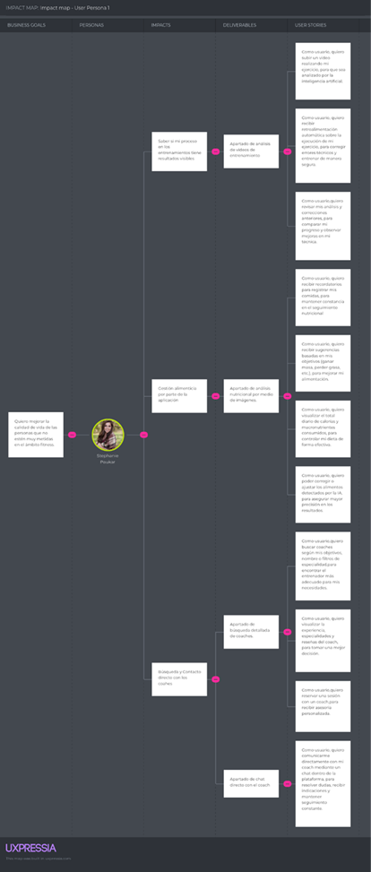
</p>

**Segmento Objetivo 2: Entrenadores Personales (Coaches)**

<p align="center">
  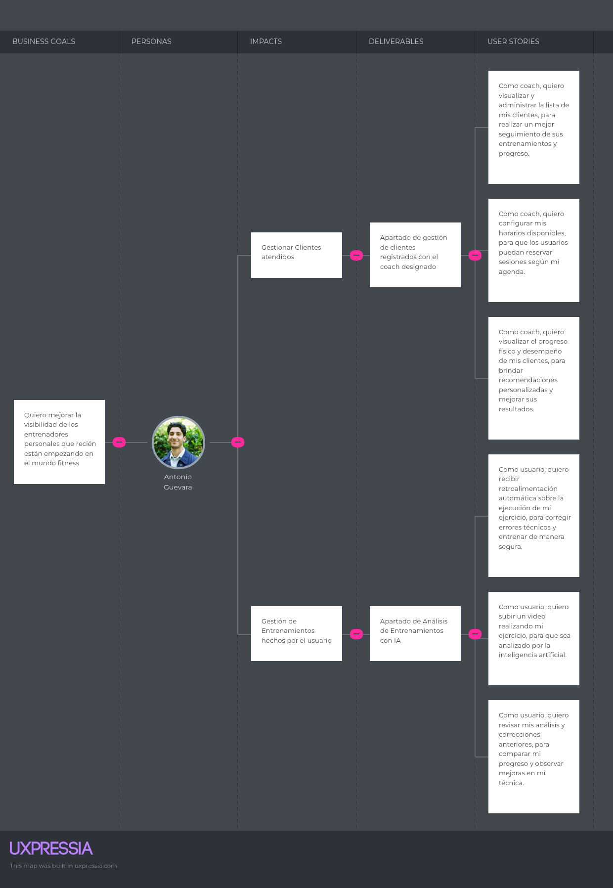
</p>

### 3.3. Product Backlog.

El **Product Backlog** es la lista priorizada de todas las funcionalidades, mejoras, correcciones y características previstas para la aplicación **BodyMatch AI **, incluyendo integración con dispositivos IoT (bebedor y báscula inteligentes) y el módulo de IA tipo coach nutricional.  

Este backlog permite al equipo de desarrollo:  

- Tener claridad sobre **qué funcionalidades se deben implementar** y en qué orden.  
- **Planificar sprints ágiles**, asignando tareas según prioridad y complejidad.  
- Mantener un registro del **estado de cada User Story** (Por Hacer, En Progreso, Hecho).  

**Columnas del Product Backlog:**

- **#Orden:** Número secuencial para organización de las historias.  
- **User Story ID:** Identificador único de la historia de usuario.  
- **Título:** Nombre resumido de la funcionalidad.  
- **Descripción:** Detalle de la necesidad desde la perspectiva del usuario o profesional de salud.  
- **Story Points:** Estimación de complejidad o esfuerzo requerido (1,2,3,5,8).  
- **Prioridad:** Alta / Media / Baja, para guiar la planificación de sprints.  
- **Estado:** Indica si la historia está *Por Hacer*, *En Progreso* o *Hecho*.  

A continuación se presenta el backlog completo con todas las User Stories definidas hasta el momento:


| Orden | User Story Id | Título | Descripción | Story Points |
|-------|--------------|--------|-------------|--------------|
| 1     | US01 | Registro de usuario | Como nuevo usuario o coach, quiero registrarme con mis datos personales para acceder a la plataforma. | 1            |
| 2     | US02 | Inicio de sesión | Como usuario registrado, quiero iniciar sesión con correo y contraseña para acceder a mi cuenta. | 1            |
| 3     | US07 | Visualización de perfil de coach | Como usuario, quiero ver la experiencia y reseñas del coach para tomar una decisión. | 1            |
| 4     | US10 | Calificación del coach | Como usuario, quiero calificar al coach para compartir mi experiencia. | 1            |
| 5     | US15 | Registro de métricas físicas | Como usuario, quiero registrar mis medidas corporales para controlar mi evolución. | 1            |
| 6     | US23 | Subida de imagen de alimentos | Como usuario, quiero subir fotos de comida para análisis nutricional. | 2            |
| 7     | US27 | Edición manual de alimentos detectados | Como usuario, quiero corregir alimentos detectados por IA para mayor precisión. | 1            |
| 8     | US04 | Cierre de sesión | Como usuario o coach, quiero cerrar sesión para proteger mi cuenta. | 2            |
| 9     | US05 | Configuración de perfil y objetivos | Como usuario, quiero definir mis objetivos para recibir recomendaciones personalizadas. | 2            |
| 10    | US08 | Reserva de sesión | Como usuario, quiero reservar sesiones con un coach. | 2            |
| 11    | US13 | Historial de correcciones | Como usuario, quiero ver análisis anteriores para comparar progreso. | 2            |
| 12    | US16 | Visualización de progreso | Como usuario, quiero ver gráficos de progreso físico. | 2            |
| 13    | US17 | Historial de entrenamientos | Como usuario, quiero revisar mis entrenamientos para evaluar constancia. | 2            |
| 14    | US22 | Monetización de servicios | Como coach, quiero definir tarifas para monetizar mis servicios. | 2            |
| 15    | US28 | Registro en historial de comidas | Como usuario, quiero guardar automáticamente mis comidas. | 2            |
| 16    | US06 | Búsqueda de coaches | Como usuario, quiero buscar coaches según objetivos y filtros. | 3            |
| 17    | US11 | Subir video del ejercicio | Como usuario, quiero subir videos para análisis de técnica. | 3            |
| 18    | US18 | Alertas de cumplimiento de rutina | Como usuario, quiero recibir recordatorios de entrenamiento. | 3            |
| 19    | US21 | Seguimiento de progreso del cliente | Como coach, quiero ver el progreso de mis clientes. | 3            |
| 20    | US03 | Recuperación de contraseña | Como usuario o coach, quiero recuperar mi contraseña. | 3            |
| 21    | US19 | Gestión de clientes | Como coach, quiero administrar mis clientes. | 3            |
| 22    | US25 | Cálculo de valores nutricionales | Como usuario, quiero ver calorías y macronutrientes de mis comidas. | 3            |
| 23    | US31 | Integración con objetivos fitness | Como usuario, quiero relacionar nutrición con mis objetivos físicos. | 3            |
| 24    | US09 | Chat con coach | Como usuario, quiero comunicarme con mi coach en tiempo real. | 5            |
| 25    | US14 | Recomendaciones de mejora | Como usuario, quiero recibir recomendaciones personalizadas. | 5            |
| 26    | US20 | Programación de disponibilidad | Como coach, quiero definir mis horarios disponibles. | 5            |
| 27    | US26 | Visualización detallada de nutrientes | Como usuario, quiero ver gráficos nutricionales detallados. | 5            |
| 28    | US30 | Recomendaciones nutricionales personalizadas | Como usuario, quiero sugerencias según mis objetivos. | 5            |
| 29    | US32 | Notificaciones y recordatorios de registro | Como usuario, quiero recordatorios para registrar comidas. | 5            |
| 30    | US12 | Feedback automático con IA | Como usuario, quiero corrección automática de mis ejercicios. | 13           |
| 31    | US24 | Reconocimiento de alimentos mediante IA | Como usuario, quiero que la IA identifique alimentos en imágenes. | 8            |
| 32    | US29 | Seguimiento diario de consumo nutricional | Como usuario, quiero ver mi consumo diario de calorías y macros. | 8            |
| 33    | US33 | Consultar información de servicios | Como visitante, quiero conocer los servicios disponibles para evaluar si se adecuan a mis necesidades. | 1            |
| 34    | US34 | Solicitar demostración | Como visitante, quiero registrar mi interés en una demostración para conocer mejor el sistema. | 2            |
| 35    | US35 | Consultar planes y precios | Como visitante, quiero comparar los planes disponibles para elegir el que mejor se adapta. | 1            |
| 36    | US36 | Solicitar asistencia | Como visitante, quiero contactar con el soporte para resolver dudas sobre el servicio. | 2            |
| 37    | US37 | Consultar casos de éxito | Como visitante, quiero revisar experiencias reales con el sistema. | 2            |
| 38    | TS01 | Implementación de Middleware JWT | Como sistema, se debe validar el token JWT en las cabeceras para asegurar la integridad de la API. | 3            |
| 39    | TS02 | Exposición de Endpoints Matchmaking | Como sistema, se deben exponer endpoints REST para permitir la consulta externa de coaches. | 3            |
| 40    | TS03 | Configuración de Endpoints Video | Implementación técnica del canal de subida de video para el procesamiento de la IA. | 5            |
| 41    | TS04 | Endpoint Perfil Atleta | Endpoint GET para recuperar métricas físicas. | 3            |


A continuación se proporciona el link del Trello donde se puede visualizar de mejor forma el Product Backlog:

[Product Backlog en Trello](https://trello.com/invite/b/69f6c4d98f6f645b602f8b43/ATTI379fb6f66a33086d7a8b14a7348eb01936888531/bodymatch-ai-product-backlog)

### 3.4. Sprint 2 Backlog

En esta sección se descomponen las User Stories del Sprint activo en tareas técnicas específicas, con una estimación máxima de 8 horas por tarea.

| Task ID | US ID | Descripción de la Tarea Técnica | Estimación (h) | Responsable | Estado |
|---------|-------|---------------------------------|----------------|-------------|--------|
| T01 | US12 | Implementar endpoint POST /videos/analyze en Spring Boot. | 6h | ________ | Done |
| T02 | US12 | Integrar API de gemini para procesamiento de frames de video. | 8h | _______ | In Progress |
| T03 | US01 | Configurar esquema de base de datos para perfiles de usuario en PostgreSQL. | 4h | ________ | Done |
| T04 | US11 | Desarrollar componente de subida de archivos con barra de progreso en Flutter. | 6h | _______ | Done |
| T05 | TS01 | Implementar lógica de validación de JWT en el API Gateway. | 5h | _________ | Done |
| T06 | US24 | Desarrollar algoritmo de pre-procesamiento de imágenes (brillo/contraste). | 4h | _________ | Done |


## Capitulo IV: Requeriments Specification

### 4.1 Design Concepts, ViewPoints & ER Diagrams

En esta sección nos centramos en los conceptos de diseño, los diferentes puntos de vista que utilizaremos para poder comprender y comunicar la arquitectura. Con esto se espera diseñar los diagramas para modelar los datos de la aplicación.

#### 4.1.1 Principles Statements
Para el diseño del producto de arquitectura, como grupo debemos reconocer ciertos principios que nos ayuden a alcanzar nuestros objetivos:

- <b>Principios SOLID:</b> De estos aplicaremos cincos de los patrones de Diseño orientado a objetos para construir componentes y que sean fáciles de mantener a largo plazo dentro de cada microservicio.

  - <b>Single Responsibility Principle (SRP):</b> Cada clase que se crea tiene una única responsabilidad y una sola razón para cambiar.

  - <b>Open/Closed Principle (OCP):</b> Las clases creadas siempre tiene que estar abiertas a una extensión, pero ceradas a las modificaciones. Eso se refiere a que se puede añadir nuevas funcionalidades sin alterar el código.

  - <b>Liskov Substitution Principle (LSP):</b> Se debe mantener una sincronía entre la superclase y la subclase, ya que al compartir métodos deben mantener concordancia con su funcionamiento. 

  - <b>Interface Segregation Principle (ISP):</b> En el caso de que sea necesario, se deben crear interfaces para poder suplir las necesidades del código. Ya que al crear clases que dependen de una sola interfaz, no sabemos con certeza si esa clase pueda cumplir con todo lo implementado dentro de la interfaz. 

  - <b>Dependency Inversion Principle (DIP):</b> Al tener clases de alto nivel como de bajo nivel, no pueden depender una de otras directamente. Es claro que las clases de alto nivel son las que manejan las clase de bajo nivel, pero en el caso de que la clase de bajo nivel se vea afectada la clase de alto nivel también lo hará. Para ello se crea una interfaz de alto nivel que maneje la clase de bajo nivel. 

- <b>Domain-Driven Design(DDD):</b> Se adaptará los principios de DDD para alinear el diseño del proyecto a trabajar con el modelo del negocio: 
  - <b>Modelado Basado en Dominio:</b> El diseño de los microservicios se centrará en la lógica establecida de negocio.

  - <b>Límites de Contexto o Bounded Contexts:</b> Dentro del proyecto se definen límites explicitos para cada modelo de dominio, con esto se asegura la coherencia dentro de cada microservicio.

  - <b>Lenguaje Ubicuo o Ubiquitous Language:</b> Dentro de cada contexto se utilizará un lenguaje común y preciso, con esto se espera evitar malentendidos y asegurar que se refleje el modelo de la manera más fiel.


#### 4.1.2 Approaches Statements Architectural Styles & Patterns

**Enfoques de diseño adoptados**

| Enfoque | Descripción | Justificación para BodyMatch AI |
|---|---|---|
| **Domain-Driven Design (DDD)** | Alinea el diseño técnico con el modelo de negocio mediante bounded contexts y lenguaje ubicuo. | BodyMatch AI opera en seis subdominios diferenciados. DDD garantiza que cada uno evolucione de forma independiente. |
| **Attribute-Driven Design (ADD) v3** | Proceso iterativo de diseño guiado por atributos de calidad y restricciones. | Permite priorizar decisiones según el impacto en los drivers críticos antes de escribir código. |

**Estilo arquitectónico principal y patrones seleccionados**

BodyMatch AI implementa una **Arquitectura de Monolito Modular orientada a Microservicios**
organizada mediante DDD. En la fase académica actual los bounded contexts coexisten en un
único proceso desplegable con fronteras de módulo estrictas que preparan la transición
futura a microservicios independientes.

| Elemento | Decisión | Justificación |
|---|---|---|
| **Estilo principal** | Monolito Modular → Microservicios (migración progresiva) | Reduce la complejidad operativa inicial manteniendo separación lógica por bounded context. |
| **Patrón de integración** | API Gateway + Fachadas de contexto (`IamContextFacade`) | Centraliza la autenticación y desacopla los bounded contexts mediante interfaces. |
| **Patrón de datos** | Database per Service (esquemas separados en PostgreSQL) | Cada bounded context gestiona su propio esquema, preparando la migración a bases de datos independientes. |
| **Patrón de comunicación** | Síncrono (REST) + Asíncrono (eventos de dominio con `@EventListener`) | REST para CRUD simple; eventos para reacciones cross-context sin respuesta inmediata. |
| **Cliente móvil** | MVC con Flutter | Separa la presentación (Widgets), la lógica (Controllers) y el acceso a datos (Models/Repositories) en Android. |


#### 4.1.3 Context Diagrams
El diagrama de contexto de BodyMatch AI ilustra cómo la plataforma de entrenamiento asistida por inteligencia artificial interactúa con sus actores principales y el ecosistema de servicios externos necesarios para su funcionamiento. La plataforma actúa como el núcleo tecnológico que centraliza el procesamiento de datos biométricos y técnicos, conectando a tres tipos de usuarios con objetivos específicos

Usuario Atleta: El actor principal que interactúa con la aplicación para subir videos de ejecución de ejercicios, recibir correcciones técnicas generadas por la IA y registrar su progreso nutricional y físico.

Coach Profesional: Quien utiliza la plataforma como una herramienta de gestión para diseñar rutinas personalizadas, monitorear el desempeño de sus alumnos y brindar asesorías basadas en los datos recolectados por el sistema.

Administrador: Responsable de la gestión operativa de la plataforma, el mantenimiento de los perfiles de usuario y la supervisión de la seguridad y disponibilidad del sistema.

Para garantizar una arquitectura escalable y robusta, el sistema se integra con servicios externos críticos que delegan responsabilidades especializadas: Stripe como pasarela de pagos para el procesamiento seguro de transacciones y suscripciones; Microsoft Outlook para la gestión de comunicaciones transaccionales y notificaciones de confirmación; y servicios de Cloud Storage para el almacenamiento eficiente y recuperación de las evidencias en video de los entrenamientos. Esta configuración permite que BodyMatch AI se enfoque en su propuesta de valor central —la corrección técnica mediante visión computacional— mientras mantiene una conectividad fluida con proveedores de infraestructura de clase mundial.


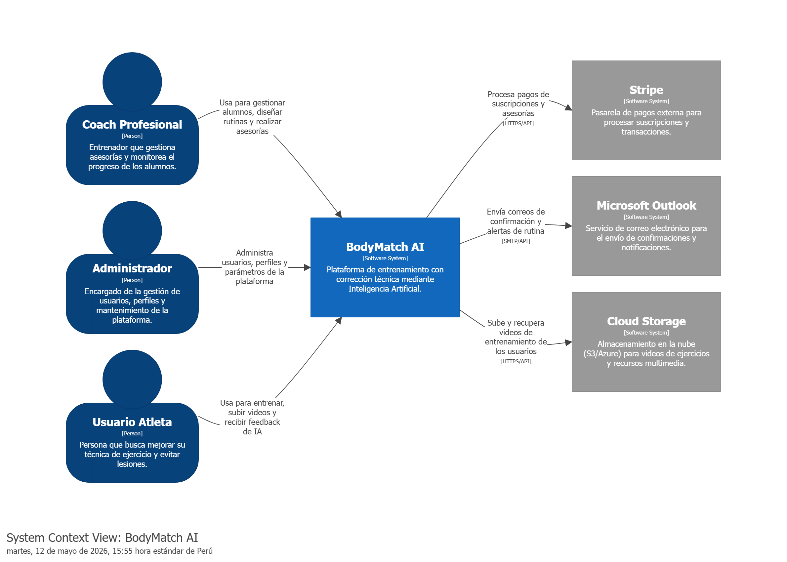

Descripcion: Este diagrama muestra cómo BodyMatch AI interactúa con sus usuarios (Atleta, Coach y Administrador) y con servicios externos esenciales como Stripe para pagos, Outlook para correos y Cloud Storage para el almacenamiento de videos. Define los límites del sistema y su conexión con el ecosistema tecnológico exterior.


#### 4.1.4 Approach Driven ViewPoints Diagram

**C4 Model - Nivel 2: Diagrama de Contenedores**

<p align="center">
  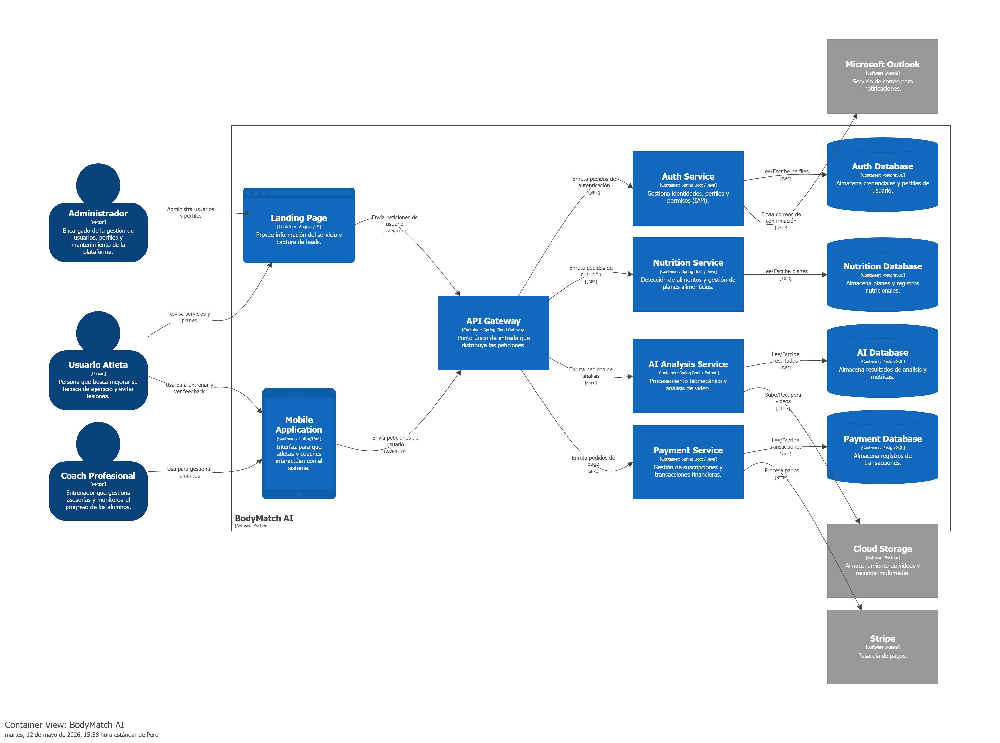
  <br>
  <em>Figura 4.1 — Diagrama de Contenedores: Arquitectura lógica distribuida de BodyMatch AI.</em>
</p>

**Descripción:** Representa la arquitectura lógica dividida en microservicios, donde se observa el uso de una aplicación móvil, una landing page y un API Gateway que distribuye las peticiones hacia servicios especializados (Auth, Nutrition, AI Analysis, Payments), cada uno con su propia persistencia.

**C4 Model - Nivel 3: Diagramas de Componentes (Bounded Contexts)**

* **IAM Bounded Context**

<p align="center">
  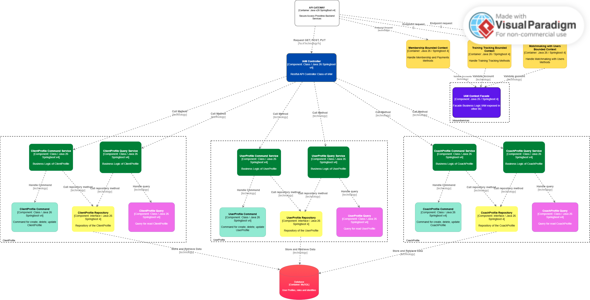
  <br>
  <em>Figura 4.2 — Diagrama de Componentes: Estructura del Bounded Context de Identidad y Acceso (IAM).</em>
</p>

*Descripción:* Diseñado bajo los principios de Domain-Driven Design (DDD) y representado en este Diagrama de Componentes (C4 Nivel 3), detalla la estructura interna del módulo de identidad y acceso. Utiliza Spring Boot y el patrón CQRS para separar las operaciones de comando y consulta de perfiles. Incluye repositorios para la persistencia en MySQL y una fachada para validar accesos desde otros contextos.

* **Membership and Payments Bounded Context**

<p align="center">
  
  <br>
  <em>Figura 4.3 — Diagrama de Componentes: Gestión de Suscripciones y Pagos (ver sección 4.1.6 — Strategy Pattern).</em>
</p>

*Descripción:* Siguiendo el enfoque de DDD y la jerarquía del Modelo C4, este diagrama ilustra la gestión de suscripciones y transacciones financieras. Separa la lógica de membresías de los pagos mediante servicios de comando y consulta, integrándose con la API de Stripe a través de una fachada externa para procesar cobros de forma segura.

* **Video Management Bounded Context**

<p align="center">
  
  <br>
  <em>Figura 4.4 — Diagrama de Componentes: Orquestación y Gestión de Video.</em>
</p>

*Descripción:* Este componente de nivel C4 Nivel 3 aplica patrones de DDD como CQRS para organizar el procesamiento de grabaciones y la entrega de resultados al usuario. Describe el flujo de gestión de videos y generación de feedback técnico, conectando el backend con la API de Gemini para el análisis de movimientos.

* **Matchmaking with Users Bounded Context**

<p align="center">
  
  <br>
  <em>Figura 4.5 — Diagrama de Componentes: Gestión de conexiones entre Atletas y Coaches.</em>
</p>

*Descripción:* Aplicando tácticas de Domain-Driven Design (DDD), este componente gestiona el emparejamiento entre atletas y coaches. Administra tanto las solicitudes de conexión como la programación de sesiones de entrenamiento, exponiendo una fachada para compartir la información de las sesiones con otros módulos del sistema.

* **Training Tracker Bounded Context**

<p align="center">
  
  <br>
  <em>Figura 4.6 — Diagrama de Componentes: Seguimiento de Métricas y Desempeño Físico.</em>
</p>

*Descripción:* Enfocado en el seguimiento del rendimiento físico, este diagrama de C4 Model muestra cómo se registran y consultan los entrenamientos y métricas de performance bajo un modelo de dominio especializado. Permite que otros contextos accedan a la evolución del usuario mediante una fachada de integración dedicada.

* **Nutrition Bounded Context**

<p align="center">
  
  <br>
  <em>Figura 4.7 — Diagrama de Componentes: Análisis Nutricional mediante IA.</em>
</p>

*Descripción:* Este diagrama de nivel C4 Nivel 3 describe la estructura del contexto nutricional gestionado mediante el patrón CQRS. Siguiendo principios de DDD, se integra con la Gemini API para la detección automática de alimentos y macros, proveyendo una fachada de contexto para permitir que otros módulos accedan a la información de forma desacoplada.

**Diagramas de Actividades**

<p align="center">
  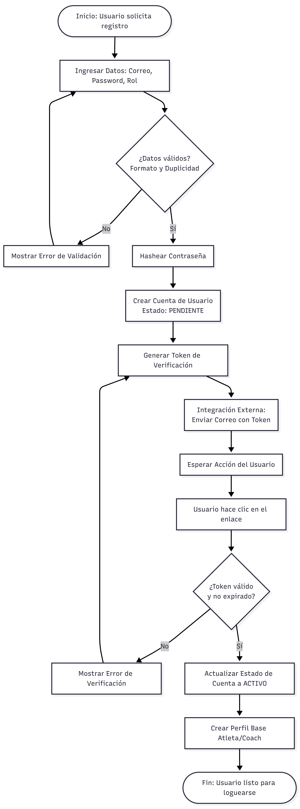
  <br>
  <em>Figura 4.8 — Diagrama de Actividades: Proceso de Registro de Usuario en el IAM.</em>
</p>

<p align="center">
  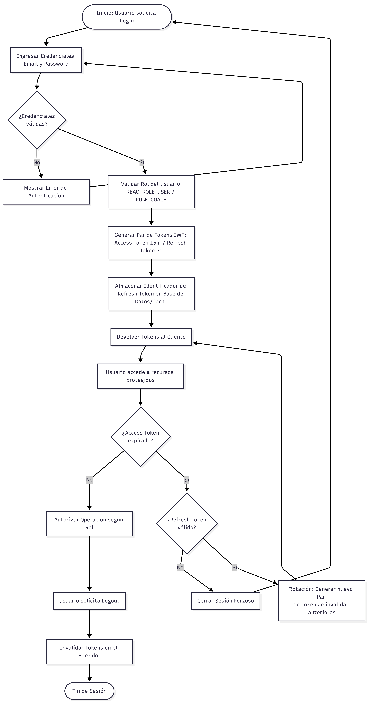
  <br>
  <em>Figura 4.9 — Diagrama de Actividades: Autenticación (Login/Logout) y Gestión de Tokens JWT.</em>
</p>

<p align="center">
  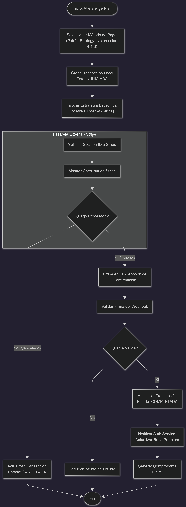
  <br>
  <em>Figura 4.10 — Diagrama de Actividades: Procesamiento de transacciones financieras utilizando el <b>Patrón Strategy (ver sección 4.1.6)</b>.</em>
</p>

<p align="center">
  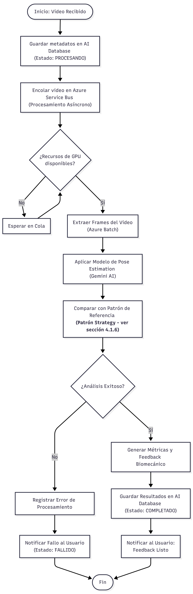
  <br>
  <em>Figura 4.11 — Diagrama de Actividades: Flujo de Análisis Biomecánico de video mediante IA.</em>
</p>

<p align="center">
  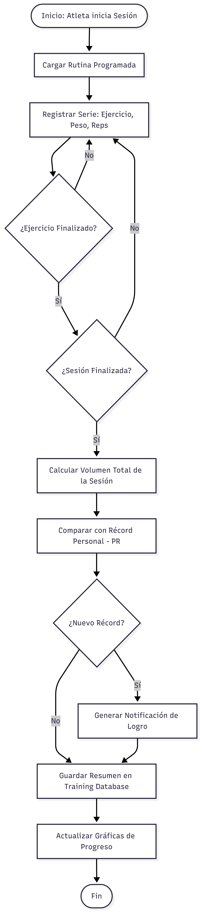
  <br>
  <em>Figura 4.12 — Diagrama de Actividades: Registro y monitoreo de progreso del atleta.</em>
</p>

**Diagramas de Estados**

<p align="center">
  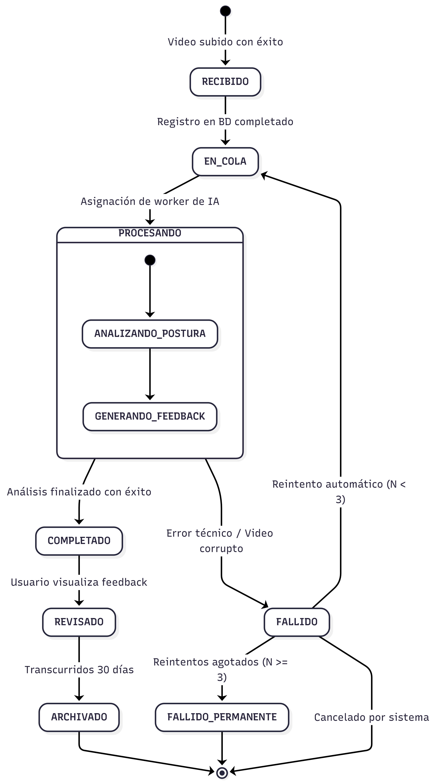
  <br>
  <em>Figura 4.13 — Diagrama de Estados: Ciclo de vida del Análisis de Video (incluye estado terminal <b>FALLIDO_PERMANENTE</b>).</em>
</p>

<p align="center">
  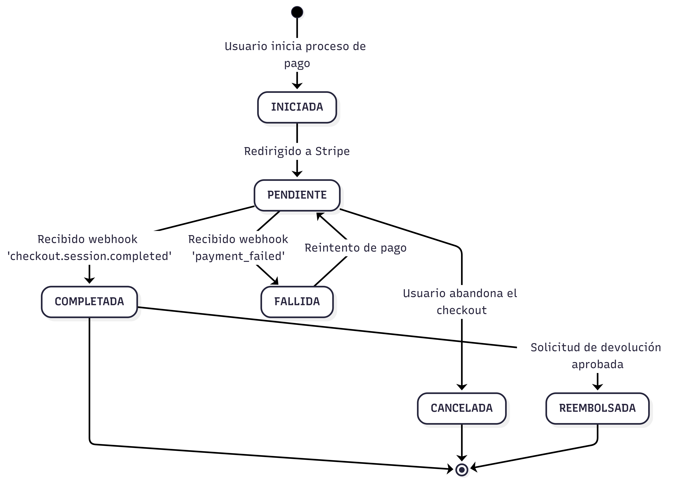
  <br>
  <em>Figura 4.14 — Diagrama de Estados: Transiciones y flujos del sistema de pagos y membresías.</em>
</p>

<p align="center">
  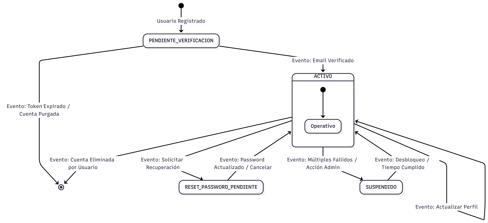
  <br>
  <em>Figura 4.15 — Diagrama de Estados: Ciclo de vida de la cuenta de usuario (Identity & Access Management).</em>
</p>

<p align="center">
  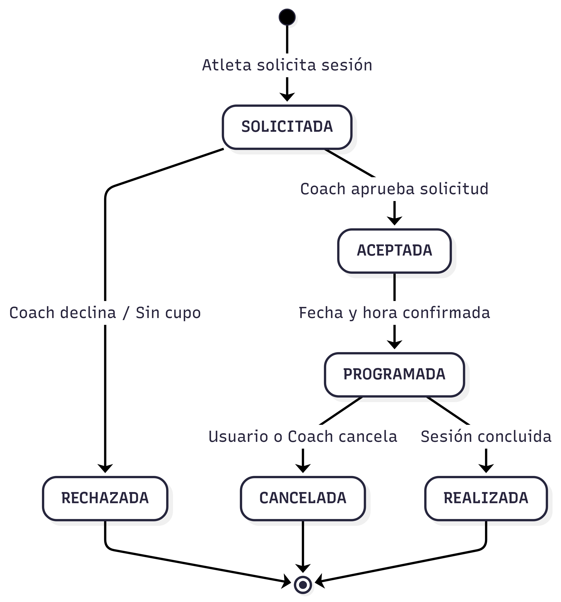
  <br>
  <em>Figura 4.16 — Diagrama de Estados: Gestión de emparejamiento (Matchmaking) y reserva de sesiones entre Atleta y Coach.</em>
</p>

<p align="center">
  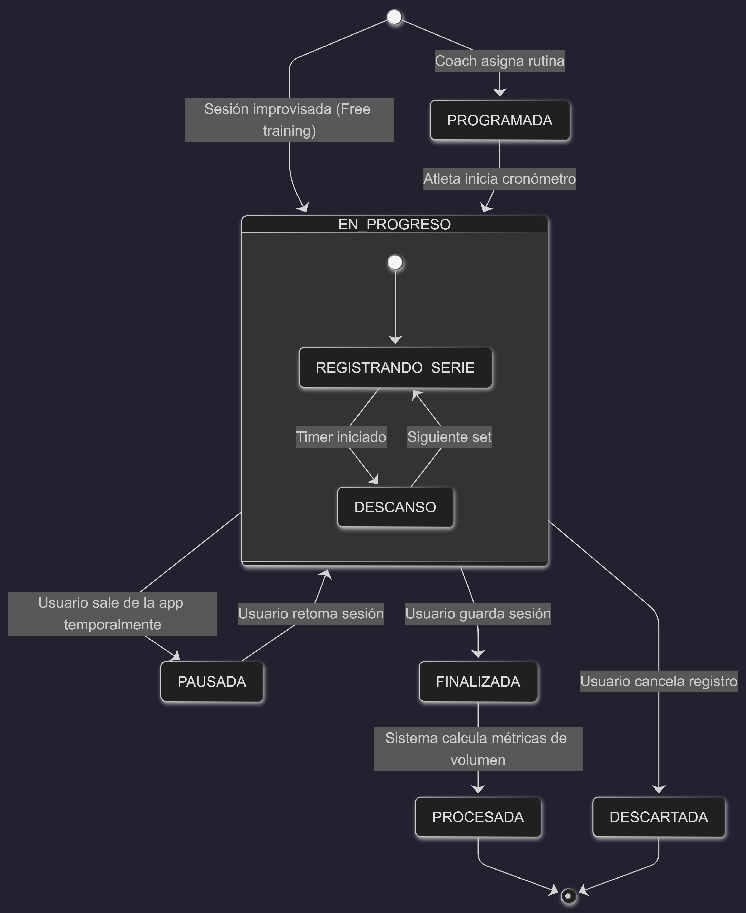
  <br>
  <em>Figura 4.17 — Diagrama de Estados: Registro y persistencia de métricas de desempeño físico.</em>
</p>

**Diagrama de Clases**

<p align="center">
  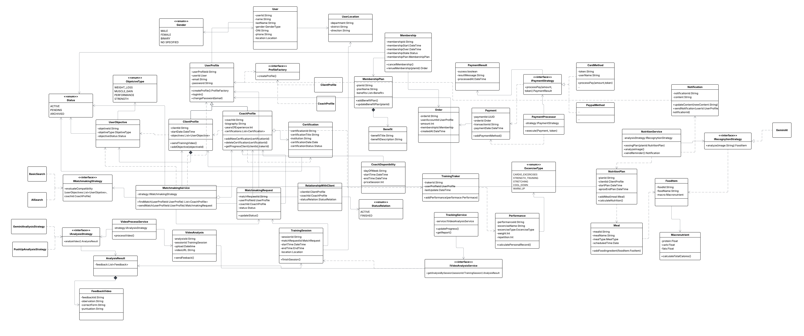
  <br>
  <em>Figura 4.18 — Diagrama de Clases: Estructura estática de BodyMatch AI y relaciones de dominio.</em>
</p>

**Descripción:** Este diagrama representa la estructura estática de la solución, detallando las entidades clave de cada Bounded Context y sus asociaciones. Se implementan patrones como Strategy para la flexibilidad en pagos y Factory para la gestión de perfiles de usuario, asegurando la trazabilidad con los patrones definidos en la sección 4.1.6.

#### 4.1.5 Relational/Non Relational Database Diagram


**Descripción:** El modelo relacional asegura la persistencia y la integridad de la lógica de negocio en PostgreSQL. La estructura está normalizada para soportar los módulos de usuarios, entrenamientos y nutrición, siguiendo una estrategia de esquemas por contexto para facilitar la escalabilidad y una futura migración a microservicios independientes.

#### 4.1.6. Design Patterns

En esta sección se documentan los patrones de diseño adoptados en **BodyMatch AI**,
tanto en el backend (Spring Boot) como en el cliente móvil (Flutter). Cada patrón se
justifica con la clase concreta que lo implementa, el atributo de calidad que satisface
y la referencia al Quality Attribute Scenario (QAS) correspondiente.


##### 4.1.6.1 Patrones de Creación

Los patrones de creación encapsulan la lógica de instanciación, evitando que el resto
del sistema dependa de constructores directos y previniendo la creación de objetos en
estados inválidos.

---

**Factory Method**

| Componente | Detalle |
|---|---|
| **Cuándo se aplica** | Cuando se necesita crear entidades de dominio garantizando que sus invariantes de negocio se cumplan desde el momento de la creación. |
| **Beneficio** | Encapsula la lógica de construcción. El resto del sistema nunca instancia la entidad con `new` directamente, eliminando estados inconsistentes. |
| **Clases en BodyMatch AI** | `User.create(String email, String passwordHash, Role role)` en el Bounded Context **IAM**; `ExerciseVideo.register(UUID athleteId, String blobUrl, String exerciseType)` en **Video Management**. |
| **Atributo de calidad** | Mantenibilidad — QAS-05 (incorporar nuevo proveedor de pagos sin modificar lógica existente). |

[IMAGEN: Fragmento del método estático User.create() mostrando la validación de invariantes
antes de devolver la instancia]

---

##### 4.1.6.2 Patrones de Comportamiento

Los patrones de comportamiento definen cómo interactúan los objetos y cómo se distribuyen
las responsabilidades en tiempo de ejecución.

---

**Strategy**

| Componente | Detalle |
|---|---|
| **Cuándo se aplica** | Cuando existen múltiples algoritmos intercambiables para una misma operación y la elección debe poder cambiarse sin modificar el código cliente. |
| **Beneficio** | El módulo de pagos puede cambiar de proveedor (Stripe → MercadoPago) o el módulo IAM puede cambiar el algoritmo de hashing sin afectar la lógica de negocio. |
| **Interfaz** | `PaymentGatewayStrategy` con implementaciones `StripePaymentGateway` en **Membership & Payments**; `HashingService` con implementación `BCryptHashingService` en **IAM**; `TokenService` con implementación `JwtTokenService` en **IAM**. |
| **Atributo de calidad** | Mantenibilidad — QAS-05: la incorporación de un nuevo gateway requiere únicamente implementar la interfaz `PaymentGatewayStrategy`, sin tocar ninguna otra clase. |

[IMAGEN: Diagrama UML de la interfaz PaymentGatewayStrategy con sus implementaciones
concretas (StripePaymentGateway y la extensión futura)]

---

**Command**

| Componente | Detalle |
|---|---|
| **Cuándo se aplica** | Cuando una operación del sistema debe representarse como un objeto para desacoplar quien solicita la acción de quien la ejecuta (patrón CQRS). |
| **Beneficio** | Permite trazar, validar y encolar acciones antes de ejecutarlas, y es la base del patrón CQRS implementado en todos los bounded contexts. |
| **Clases en BodyMatch AI** | `SignUpAthleteCommand`, `SignInCommand` en **IAM**; `UploadExerciseVideoCommand`, `RequestVideoAnalysisCommand` en **Video Management**; `ProcessFoodImageCommand` en **Nutrition**. |
| **Atributo de calidad** | Mantenibilidad y Rendimiento — facilita el procesamiento asíncrono (QAS-01) al encolar comandos pesados sin bloquear el hilo principal. |

---

**Observer**

| Componente | Detalle |
|---|---|
| **Cuándo se aplica** | Cuando un evento producido en un bounded context debe disparar reacciones en otros contextos sin crear dependencias directas entre ellos. |
| **Beneficio** | Desacoplamiento entre bounded contexts. El contexto emisor no conoce a los suscriptores. |
| **Implementación** | Eventos de dominio publicados con `ApplicationEventPublisher` de Spring y consumidos con `@EventListener`. Ejemplo: `VideoAnalysisCompletedEvent` publicado por **Video Management** y escuchado por **Training Tracker** para actualizar las métricas del atleta. |
| **Atributo de calidad** | Mantenibilidad — permite agregar nuevos suscriptores sin modificar el contexto emisor. |

---

##### 4.1.6.3 Patrones de Estructura

Los patrones estructurales organizan la composición de objetos para reducir el acoplamiento
entre componentes del sistema.

---

**Facade**

| Componente | Detalle |
|---|---|
| **Cuándo se aplica** | Cuando un bounded context necesita consumir datos de otro sin acceder a su modelo interno. |
| **Beneficio** | Reduce el acoplamiento entre bounded contexts. Cada contexto expone únicamente la información que otros necesitan, protegiendo su modelo de dominio. |
| **Clases en BodyMatch AI** | `IamContextFacade` — expone métodos como `getAthleteProfile(UUID userId)` que **Matchmaking** y **Training Tracker** consumen sin conocer las entidades internas de IAM; `MatchmakingContextFacade` — usada por **Training Tracker** para consultar sesiones programadas. |
| **Atributo de calidad** | Mantenibilidad — los cambios internos en el IAM no afectan a los contextos que lo consumen a través de la fachada. |

[IMAGEN: Diagrama de la interfaz IamContextFacade con los métodos que expone hacia otros
bounded contexts]

---

##### 4.1.6.4 Patrones Empresariales

Los patrones empresariales resuelven problemas comunes en aplicaciones de negocio: gestión
de lógica de aplicación, persistencia, transferencia de datos y coordinación de
transacciones.

---

**Service Layer (Command Service / Query Service)**

| Componente | Detalle |
|---|---|
| **Cuándo se aplica** | Para centralizar la lógica de aplicación, separándola del dominio y de la infraestructura. |
| **Beneficio** | Cada bounded context tiene servicios de comando y consulta con responsabilidad única, lo que facilita las pruebas unitarias de forma aislada. |
| **Clases en BodyMatch AI** | `UserCommandServiceImpl`, `UserQueryServiceImpl` en **IAM**; `VideoCommandServiceImpl`, `VideoQueryServiceImpl` en **Video Management**; `NutritionCommandServiceImpl` en **Nutrition**. |
| **Atributo de calidad** | Mantenibilidad — el patrón CQRS (sección 4.1.5) se apoya directamente en esta separación. |

---

**Repository Pattern**

| Componente | Detalle |
|---|---|
| **Cuándo se aplica** | Para abstraer el acceso a la base de datos del resto del dominio. |
| **Beneficio** | El dominio interactúa con interfaces (`UserRepository`) sin conocer la implementación de persistencia. Facilita los tests con mocks. |
| **Clases en BodyMatch AI** | `UserRepository`, `RoleRepository` en **IAM**; `ExerciseVideoRepository` en **Video Management**; `CoachProfileRepository`, `SessionRepository` en **Matchmaking**; `MetricRepository` en **Training Tracker**; `FoodLogRepository` en **Nutrition**. Todos extienden `JpaRepository` de Spring Data. |
| **Atributo de calidad** | Mantenibilidad — el cambio de motor de base de datos solo requeriría modificar las implementaciones de repositorio. |

---

**Data Transfer Object (DTO) y Mapper / Assembler**

| Componente | Detalle |
|---|---|
| **Cuándo se aplica** | Cuando se necesita transferir datos entre la capa de dominio y la capa de interfaz (REST controllers) sin exponer las entidades internas. |
| **Beneficio** | El modelo de dominio queda protegido. Los cambios en la API REST no obligan a cambiar las entidades, y viceversa. |
| **Clases en BodyMatch AI** | **Recursos (DTO de salida):** `UserResource`, `AuthenticatedUserResource`, `ExerciseVideoResource`, `CoachProfileResource`, `SessionResource`, `MetricResource`, `FoodLogResource`. **Comandos (DTO de entrada):** `SignUpAthleteResource`, `SignInResource`, `CreateMetricResource`. **Assemblers:** `UserResourceFromEntityAssembler`, `ExerciseVideoResourceFromEntityAssembler`, `SessionResourceFromEntityAssembler`. |
| **Atributo de calidad** | Seguridad y Mantenibilidad — los datos sensibles de las entidades (como el hash de contraseña) nunca se exponen en los recursos de respuesta. |

---

**Unit of Work**

| Componente | Detalle |
|---|---|
| **Cuándo se aplica** | Para coordinar múltiples operaciones de base de datos como una unidad atómica. |
| **Beneficio** | Garantiza la consistencia de los datos: o todas las operaciones de un caso de uso se confirman, o ninguna. |
| **Implementación** | Gestionado por JPA/Hibernate a través de la anotación `@Transactional` en los métodos de los Command Services. Ejemplo: `UserCommandServiceImpl.registerAthlete()` crea el usuario y asigna su rol en una única transacción. |
| **Atributo de calidad** | Disponibilidad — QAS-03: garantiza que la consistencia no se comprometa bajo carga concurrente. |

---

**Gateway**

| Componente | Detalle |
|---|---|
| **Cuándo se aplica** | Para encapsular la comunicación con servicios externos o con otros bounded contexts. |
| **Beneficio** | El sistema no depende directamente de la API externa. Si el proveedor cambia, solo se modifica la clase Gateway. |
| **Clases en BodyMatch AI** | `GeminiAIGateway` — encapsula las llamadas a la API de Gemini para el análisis de video y de imágenes de alimentos; `StripeGateway` — encapsula las llamadas a la API de Stripe para el procesamiento de pagos; `AzureBlobStorageGateway` — gestiona la subida y recuperación de videos. Adicionalmente, `IamContextFacade` actúa como Gateway interno para el acceso cross-context. |
| **Atributo de calidad** | Mantenibilidad — QAS-05 y AC-04: la abstracción detrás del Gateway permite sustituir Gemini AI sin afectar la lógica de Video Management. |

[IMAGEN: Diagrama de la clase GeminiAIGateway mostrando el método analyzeVideo() y
su integración con el VideoCommandService]

---

##### 4.1.6.5 Patrones Arquitectónicos

Los patrones arquitectónicos establecen la organización de alto nivel del sistema, definiendo
cómo se estructuran y comunican sus grandes componentes.

---

**CQRS (Command Query Responsibility Segregation)**

| Componente | Detalle |
|---|---|
| **Cuándo se aplica** | Para separar las operaciones de escritura (comandos) de las de lectura (consultas) dentro de cada bounded context. |
| **Beneficio** | Mejora la claridad del código y sienta las bases para escalar la lectura y escritura de forma independiente en el futuro. |
| **Implementación en BodyMatch AI** | Cada bounded context tiene dos interfaces de servicio diferenciadas: `XxxCommandService` (operaciones de escritura: crear, actualizar, eliminar) y `XxxQueryService` (operaciones de lectura: buscar, listar, obtener). Ejemplo en IAM: `UserCommandService.registerAthlete(SignUpAthleteCommand)` y `UserQueryService.getUserById(UUID id)`. |
| **Atributo de calidad** | Mantenibilidad y Rendimiento — el equipo puede optimizar las consultas de lectura (añadir caché, índices) sin tocar la lógica de escritura. |

---

**Layered Architecture (Arquitectura por Capas)**

| Componente | Detalle |
|---|---|
| **Cuándo se aplica** | Para organizar el código en capas con responsabilidades bien definidas y dependencias que fluyen en una única dirección (hacia adentro). |
| **Beneficio** | Ninguna capa externa conoce los detalles de una capa más interna. Los cambios en la infraestructura (base de datos, servicios externos) no afectan al dominio. |
| **Estructura en BodyMatch AI** | Cada bounded context está organizado en cuatro capas: **`domain`** (entidades, value objects, interfaces de repositorio); **`application`** (command services, query services, comandos, eventos); **`infrastructure`** (implementaciones de repositorio JPA, gateways externos); **`interfaces`** (REST controllers, resources/DTOs, assemblers). |
| **Atributo de calidad** | Mantenibilidad — AC-06: el esquema por bounded context en PostgreSQL y la separación por capas facilitan la migración futura a microservicios independientes. |

[IMAGEN: Diagrama de la estructura de paquetes de un bounded context (ej. IAM)
mostrando las cuatro capas: domain / application / infrastructure / interfaces]

---

**MVC en Flutter (Cliente Móvil)**

| Componente | Detalle |
|---|---|
| **Cuándo se aplica** | Para estructurar la capa de presentación de la aplicación móvil separando la vista, la lógica de presentación y el acceso a datos. |
| **Beneficio** | Facilita el mantenimiento y las pruebas de la UI de forma independiente de la lógica de negocio. |
| **Implementación en BodyMatch AI** | **Model:** clases Dart que representan las respuestas de la API (ej. `UserModel`, `ExerciseVideoModel`, `CoachProfileModel`). **View:** Widgets de Flutter que renderizan la UI (ej. `LoginScreen`, `VideoUploadScreen`, `AnalysisFeedbackScreen`). **Controller:** clases que coordinan la comunicación entre la vista y el repositorio de datos, gestionando el estado con Provider o Riverpod (ej. `AuthController`, `VideoController`). Los repositorios del cliente consumen los endpoints REST documentados en la sección 5.2.1.5. |
| **Atributo de calidad** | Mantenibilidad y Usabilidad — los cambios en el diseño visual no afectan la lógica de consumo de la API, y viceversa. |

[IMAGEN: Diagrama de la estructura de carpetas del proyecto Flutter mostrando la
separación models / views / controllers para el módulo de Video Analysis]

---

> **Trazabilidad de patrones con Quality Attribute Scenarios:**
>
> | Patrón | QAS relacionado | Atributo satisfecho |
> |---|---|---|
> | Strategy (`PaymentGatewayStrategy`) | QAS-05 | Mantenibilidad |
> | Strategy (`HashingService`, `TokenService`) | QAS-02 | Seguridad |
> | Gateway (`GeminiAIGateway`) | QAS-01, AC-04 | Rendimiento, Mantenibilidad |
> | Observer (`VideoAnalysisCompletedEvent`) | QAS-01 | Rendimiento |
> | Repository + Unit of Work | QAS-03, QAS-04 | Disponibilidad, Seguridad |
> | Facade (`IamContextFacade`) | QAS-05, AC-02 | Mantenibilidad |
> | CQRS | QAS-01, QAS-03 | Rendimiento, Mantenibilidad |
> | Layered Architecture | AC-06 | Mantenibilidad |
> | MVC Flutter | — | Usabilidad, Mantenibilidad |


#### 4.1.7. Tactics

Las tácticas arquitectónicas son decisiones de diseño concretas que permiten satisfacer
los atributos de calidad. Cada táctica incluye un umbral medible (SLO) que permite
verificar su efectividad durante las revisiones de sprint.

##### Tácticas de Rendimiento

| Táctica | Implementación concreta | SLO verificable |
|---|---|---|
| **Procesamiento asíncrono de video** | `VideoCommandServiceImpl` publica `VideoAnalysisRequestedEvent`; un `@EventListener` procesa la tarea en segundo plano sin bloquear el hilo HTTP. | Tiempo de respuesta HTTP de subida: < 10 s. Entrega del feedback de IA: < 5 min bajo 50 solicitudes concurrentes (QAS-01). |
| **Caché para búsqueda de coaches** | Anotación `@Cacheable` sobre `CoachSearchQueryServiceImpl.searchCoaches()`. Proveedor: caché en memoria (fase académica) / Redis (producción). | Latencia P95 de búsqueda: < 800 ms bajo 200 usuarios concurrentes. Tasa de caché hit: > 60% para parámetros repetidos (QAS-03). |
| **Paginación de resultados** | Uso de `Pageable` de Spring Data en todos los endpoints de listado. Tamaño de página por defecto: 20 elementos. | Tiempo de respuesta de la primera página de cualquier listado: < 300 ms. |
| **Índices en PostgreSQL** | Índices en: `coach_profiles.specialty`, `coach_profiles.hourly_rate`, `sessions.scheduled_at`, `exercise_videos.athlete_id`. Gestionados con migraciones Flyway. | Tiempo de consulta de búsqueda con filtros: < 100 ms con menos de 10.000 coaches registrados. |

##### Tácticas de Seguridad

| Táctica | Implementación concreta | SLO verificable |
|---|---|---|
| **Autenticación JWT con rotación de tokens** | `JwtTokenService` emite access tokens (expiración: 15 min) y refresh tokens (expiración: 7 días). El refresh token se invalida en BD al hacer logout. | 100% de endpoints protegidos rechazan peticiones sin token válido con HTTP 401. Tiempo de validación: < 5 ms (QAS-02). |
| **Control de acceso por roles (RBAC)** | `@PreAuthorize("hasRole('ROLE_ATHLETE')")` y `@PreAuthorize("hasRole('ROLE_COACH')")` en los métodos de los controladores REST mediante Spring Security. | 100% de intentos con rol incorrecto rechazados con HTTP 403 en < 200 ms (QAS-02). |
| **URLs pre-firmadas para archivos multimedia** | `AzureBlobStorageGateway.generateSasUrl(blobName, durationMinutes)` genera URLs con firma HMAC que expiran en 15 min. Los videos en Blob Storage no son accesibles públicamente. | 0% de accesos directos a Blob Storage sin URL firmada. URLs con expiración exacta de 15 min (QAS-04). |
| **Validación de entradas** | Anotaciones `@Valid`, `@NotBlank`, `@Size`, `@Email` en todos los recursos de entrada (DTOs). Los errores devuelven HTTP 400 con detalle del campo fallido. | 0% de solicitudes con datos inválidos alcanzan la capa de dominio. Respuesta de error de validación: < 50 ms. |

##### Tácticas de Mantenibilidad

| Táctica | Implementación concreta | SLO verificable |
|---|---|---|
| **Separación por Bounded Contexts** | Estructura de paquetes: `com.bodymatch.{contexto}.{domain/application/infrastructure/interfaces}`. Sin importaciones cruzadas entre paquetes de bounded contexts distintos (solo via fachadas). | Un cambio interno en un bounded context no requiere modificaciones en ningún otro. |
| **Documentación automática de API** | SpringDoc OpenAPI 3.0 con `@Operation`, `@ApiResponse`, `@Tag` en todos los controladores. Accesible en `/swagger-ui/index.html`. | 100% de endpoints implementados documentados en Swagger UI. |
| **Migraciones versionadas** | Flyway con convención `V{version}__{contexto}_{descripcion}.sql`. Scripts organizados por bounded context. | 0% de conflictos de migración al ejecutar el proyecto desde cero en entorno limpio. |

---


### 4.2. Architectural Drivers

Los drivers arquitectónicos son el conjunto de requisitos, restricciones y preocupaciones que
tienen el mayor impacto sobre la estructura del sistema. Su identificación explícita es el
insumo principal del proceso ADD v3 aplicado en este proyecto.

Los principales drivers arquitectónicos del sistema son:


| ID | Driver | Categoría | Prioridad | Decisión arquitectónica relacionada |
|---|---|---|---|---|
| DR-01 | Análisis inteligente de ejercicios mediante IA | Requisito funcional primario | Alta | Integración asíncrona con Gemini AI; patrón Gateway (`GeminiAIGateway`); eventos de dominio. |
| DR-02 | Seguridad de datos personales y multimedia | Atributo de calidad (Seguridad) | Alta | JWT con rotación; RBAC con Spring Security; URLs SAS para Blob Storage; Ley N° 29733. |
| DR-03 | Rendimiento en procesamiento de video | Atributo de calidad (Rendimiento) | Alta | Procesamiento asíncrono con eventos de dominio; caché para búsquedas. |
| DR-04 | Escalabilidad del sistema | Atributo de calidad (Escalabilidad) | Media | Monolito modular con bounded contexts independientes; esquemas separados en PostgreSQL. |
| DR-05 | Mantenibilidad del sistema | Atributo de calidad (Mantenibilidad) | Alta | SOLID + DDD; patrones Strategy, Factory, Gateway; Layered Architecture; CQRS. |
| DR-06 | Disponibilidad del servicio | Atributo de calidad (Disponibilidad) | Media | Reintentos automáticos con estado `FALLIDO_PERMANENTE`; bloqueo optimista en sesiones. |
| DR-07 | Usabilidad de la aplicación móvil | Atributo de calidad (Usabilidad) | Media | MVC con Flutter; respuesta asíncrona con indicadores de carga; paginación. |
| DR-08 | Integración con servicios externos (Stripe, Gemini, Azure) | Restricción técnica | Alta | Patrón Gateway para encapsular dependencias externas; interfaces abstractas para sustitución. |
| DR-09 | Cumplimiento Ley N° 29733 (Perú) | Restricción legal | Alta | Funcionalidad de eliminación de cuenta; cifrado en reposo; política de retención de videos. |
| DR-10 | Presupuesto de infraestructura limitado (fase académica) | Restricción de negocio | Media | Tiers gratuitos de Azure; GitHub Pages para landing; monolito en lugar de microservicios independientes. |

#### 4.2.1. Design Purpose

El propósito del proceso de diseño arquitectónico de BodyMatch AI es establecer una
estructura técnica coherente, mantenible y extensible que permita implementar las
funcionalidades principales del producto de manera iterativa, respetando las restricciones
de tiempo y equipo propias de un proyecto académico, y dejando las bases para una
evolución futura hacia una arquitectura de microservicios en la nube.

De forma específica, el diseño busca:

**1. Traducir el modelo de negocio en componentes técnicos verificables**

Las dos propuestas de valor centrales de BodyMatch AI — la conexión personalizada entre
usuarios y coaches y el análisis automatizado de ejercicios mediante inteligencia artificial
— están reflejadas directamente en los bounded contexts y sus interfaces públicas, de modo
que cada decisión de código pueda rastrearse hasta un requisito de negocio: el
Matchmaking BC soporta la conexión usuario-coach, y el Video Management BC soporta
el análisis de IA.

**2. Satisfacer los atributos de calidad más críticos para el dominio**

En una plataforma de salud y ejercicio, la seguridad de los datos personales (QAS-02,
QAS-04), la disponibilidad del servicio durante sesiones de entrenamiento (QAS-03) y la
corrección técnica del feedback de IA (QAS-01) son atributos que afectan directamente la
confianza del usuario. El diseño los aborda desde la primera iteración mediante tácticas
concretas y medibles (ver sección 4.1.7).

**3. Proteger la capacidad de evolución del sistema**

La fase inicial corresponde a un monolito modular organizado por seis bounded contexts.
Esta estructura permite una transición progresiva hacia microservicios sin reescritura,
ya que cada bounded context tiene sus propias interfaces, modelos de dominio y reglas de
negocio encapsuladas, con esquemas de base de datos independientes gestionados por Flyway.

**4. Construir sobre decisiones técnicas explícitas y trazables**

Cada decisión arquitectónica relevante — stack tecnológico (Java 24 + Spring Boot 3.x),
mecanismo de autenticación (JWT stateless con rotación de tokens), estrategia de
almacenamiento de video (Azure Blob Storage con URLs SAS), integración con servicios
externos (patrón Gateway) — queda registrada en el Architectural Design Backlog de cada
iteración ADD con su justificación, permitiendo evaluarla y revisarla en iteraciones
posteriores.

**5. Crear modelos y vistas arquitectónicas verificables**

La solución se representa mediante diagramas C4 (Contexto en Figura 4.1, Contenedores en
Figura 4.2, Componentes en Figuras 4.3–4.8), diagramas UML de actividades
(Figuras 4.9–4.13) y estados (Figuras 4.14–4.18), diagrama de clases (Figura 4.19) y
diagrama ER (Figura 4.20).

  

#### 4.2.2. Primary Functionality (Primary User Stories)

Las siguientes historias de usuario son las que tienen mayor impacto sobre la estructura
arquitectónica del sistema. Su implementación requiere decisiones de diseño que afectan
múltiples capas y componentes, razón por la cual se les denomina historias primarias.

| User Story ID | Título | Justificación arquitectónica | Bounded Context(s) impactado(s) |
|---|---|---|---|
| US01 | Registro de usuario | Define el modelo central de identidad. Aplica Factory Method (`User.create()`) para garantizar invariantes desde la creación. | IAM |
| US02 | Inicio de sesión | Determina el mecanismo de autenticación de toda la plataforma. Aplica Strategy (`JwtTokenService`, `BCryptHashingService`). | IAM |
| US06 | Búsqueda de coaches | Requiere diseño de índices y filtrado por múltiples atributos. Define el modelo del perfil del coach con búsqueda optimizada mediante caché. | Matchmaking, IAM |
| US08 | Reserva de sesión | Introduce concurrencia: dos usuarios pueden intentar reservar el mismo horario. Requiere bloqueo optimista (`@Version` en `Session`). | Matchmaking |
| US09 | Chat con coach | Depende de una API externa de mensajería. Integración encapsulada mediante el patrón Gateway. | Matchmaking |
| US11 | Subir video del ejercicio | Determina la estrategia de almacenamiento binario (Azure Blob Storage) y el flujo asíncrono. Aplica Factory Method (`ExerciseVideo.register()`). | Video Management |
| US12 | Feedback automático con IA | Define la integración con Gemini AI vía `GeminiAIGateway`. El análisis asíncrono es el núcleo diferenciador del sistema. | Video Management, Training Tracker |
| US15 | Registro de métricas físicas | Define el modelo de datos de seguimiento físico con alta frecuencia de escritura. | Training Tracker |
| US19 | Gestión de clientes (coach) | Requiere que Matchmaking y Training Tracker compartan datos del atleta sin acoplar sus modelos internos (vía fachadas). | Matchmaking, Training Tracker, IAM |
| US22 | Monetización de servicios | Introduce el BC de Membership & Payments con integración a Stripe vía Strategy (`PaymentGatewayStrategy`). | Membership & Payments |
| US24 | Reconocimiento de alimentos con IA | Segunda integración con Gemini AI. Comparte el patrón Gateway con Video Management pero opera sobre imágenes. | Nutrition |
| TS01 | Middleware JWT | El API Gateway valida el token antes de enrutar cualquier petición. Base de seguridad transversal. | IAM, API Gateway |


#### 4.2.3. Quality Attribute Scenarios

Los siguientes escenarios especifican de forma medible los atributos de calidad que la
arquitectura debe garantizar. Cada escenario sigue la estructura de seis partes definida por
el método ADD v3.

**QAS-01: Rendimiento — Procesamiento asíncrono de video**

| Componente | Descripción |
|---|---|
| **Fuente de estímulo** | Atleta que sube un video de ejercicio tras finalizar su sesión |
| **Estímulo** | `POST /api/v1/exercise-videos` con archivo de hasta 200 MB |
| **Entorno** | Sistema en operación normal con hasta 50 solicitudes de análisis concurrentes |
| **Artefacto** | `VideoCommandServiceImpl` + worker de análisis + `GeminiAIGateway` |
| **Respuesta** | El sistema acepta el video con HTTP 202 Accepted en < 10 s. El análisis se procesa en segundo plano y se notifica al atleta cuando el resultado está disponible. |
| **Medida de respuesta** | Tiempo de respuesta HTTP: < 10 s. Entrega del feedback de IA: < 5 min bajo carga normal. |


**QAS-02: Seguridad — Control de acceso por rol**

| Componente | Descripción |
|---|---|
| **Fuente de estímulo** | Usuario con rol `ROLE_ATHLETE` intentando acceder a endpoints reservados para coaches |
| **Estímulo** | `GET /api/v1/coaches/me/clients` con token JWT válido pero con rol incorrecto |
| **Entorno** | Sistema en operación normal |
| **Artefacto** | API Gateway + Spring Security (`@PreAuthorize`) + módulo IAM |
| **Respuesta** | HTTP 403 Forbidden. El intento se registra en el log de auditoría. No se expone información del recurso. |
| **Medida de respuesta** | 100% de intentos con rol incorrecto rechazados. Tiempo de rechazo: < 200 ms. |


**QAS-03: Rendimiento — Búsqueda de coaches bajo carga**

| Componente | Descripción |
|---|---|
| **Fuente de estímulo** | Múltiples atletas realizando búsquedas simultáneamente en horario pico |
| **Estímulo** | 200 solicitudes concurrentes a `GET /api/v1/coaches` con distintos filtros |
| **Entorno** | Sistema bajo carga alta (18:00–21:00 hora peruana) |
| **Artefacto** | `CoachSearchQueryServiceImpl` + PostgreSQL con índices + caché |
| **Respuesta** | Búsquedas frecuentes servidas desde caché. Búsquedas únicas consultan PostgreSQL con índices. |
| **Medida de respuesta** | Latencia P95: < 800 ms bajo 200 usuarios concurrentes. Tasa de caché hit: > 60%. |


**QAS-04: Seguridad — Protección de videos de entrenamiento**

| Componente | Descripción |
|---|---|
| **Fuente de estímulo** | Usuario no propietario intentando acceder al video de otro usuario |
| **Estímulo** | `GET /api/v1/exercise-videos/{videoId}` con token JWT de un usuario diferente al propietario |
| **Entorno** | Sistema en operación normal |
| **Artefacto** | `VideoQueryServiceImpl` + autorización de dominio + `AzureBlobStorageGateway` (URLs SAS) |
| **Respuesta** | HTTP 403. No se genera ni expone la URL pre-firmada del Blob Storage. |
| **Medida de respuesta** | 0% de accesos no autorizados a videos. URLs SAS con expiración de 15 min. |


**QAS-05: Mantenibilidad — Incorporación de nuevo proveedor de pagos**

| Componente | Descripción |
|---|---|
| **Fuente de estímulo** | Decisión de negocio de agregar MercadoPago como segundo proveedor de pagos |
| **Estímulo** | Requerimiento de soporte para nuevo gateway sin modificar la lógica existente |
| **Entorno** | Sistema en desarrollo activo, equipo de cinco personas |
| **Artefacto** | `MembershipCommandServiceImpl` + interfaz `PaymentGatewayStrategy` |
| **Respuesta** | Se implementa `MercadoPagoPaymentGateway` con la interfaz `PaymentGatewayStrategy`. La selección se configura como `@Bean` de Spring sin tocar otras clases. |
| **Medida de respuesta** | Incorporación del nuevo proveedor: < 8 h de desarrollo. 0 cambios en otros bounded contexts. |


#### 4.2.4. Constraints

Las restricciones son condiciones impuestas externamente al equipo de diseño que limitan el
espacio de soluciones arquitectónicas posibles. A diferencia de los atributos de calidad, las
restricciones no son negociables dentro del contexto del proyecto.

| ID | Restricción | Impacto en el diseño |
|---|---|---|
| CON-01 | Backend con Java 24 y Spring Boot 3.x | Define el stack, las dependencias disponibles y los patrones de integración. |
| CON-02 | Proveedor de nube exclusivamente Microsoft Azure | Almacenamiento en Azure Blob Storage; monitoreo en Azure Monitor; despliegue en Azure App Service. |
| CON-03 | Base de datos principal PostgreSQL | No se usa NoSQL en la fase actual. La separación de esquemas reemplaza el patrón Database per Service con instancias independientes. |
| CON-04 | Primera fase: monolito modular (no microservicios independientes) | La separación es lógica (paquetes Java) y de datos (esquemas PostgreSQL), no de despliegue. |
| CON-05 | Chat implementado mediante API externa de terceros | No se desarrolla protocolo propio. La integración se encapsula en un Gateway para permitir sustitución. |
| CON-06 | Cumplimiento Ley de Protección de Datos Personales del Perú (N° 29733) | Datos cifrados en reposo; funcionalidad de eliminación de cuenta y videos; política de retención definida. |
| CON-07 | Aplicación cliente: Android (Flutter) | La API REST debe ser consumible desde Flutter mediante HTTP. |
| CON-08 | Presupuesto de infraestructura limitado (fase académica) | Uso preferente de tiers gratuitos o Basic de Azure. Landing page en GitHub Pages. |
| CON-09 | Limitaciones de dispositivos móviles para grabación | Los videos se comprimen en el cliente antes de la subida. El sistema acepta archivos de hasta 200 MB. |
| CON-10 | Tamaño máximo: 200 MB; duración máxima: 3 min por video | Validación en el endpoint de subida antes de iniciar el procesamiento. |


#### 4.2.5. Architectural Concerns

Las preocupaciones arquitectónicas son riesgos, incertidumbres y desafíos propios del
arquitecto de software que, de no ser atendidos, pueden comprometer la estabilidad, la
seguridad o la evolución del sistema. No son requisitos funcionales ni restricciones
externas: son alertas internas del proceso de diseño que deben gestionarse activamente.


| ID | Preocupación | Impacto potencial | Estrategia de mitigación |
|---|---|---|---|
| AC-01 | Curva de aprendizaje en integración asíncrona | Retrasos y defectos difíciles de depurar en el flujo crítico | Implementar flujo síncrono en primeras iteraciones; migrar a `@EventListener` antes de adoptar Azure Service Bus |
| AC-02 | Acoplamiento implícito entre Matchmaking y Training Tracker | Modificaciones en uno afectan al otro | Contratos explícitos vía `MatchmakingContextFacade` y `TrainingContextFacade`; ningún BC importa clases de dominio de otro |
| AC-03 | Costos crecientes de Azure Blob Storage | Superación del presupuesto académico | Retención máxima de 90 días de videos por usuario; compresión en cliente; alertas de uso en Azure Monitor |
| AC-04 | Dependencia de Gemini AI (disponibilidad, cuota, precio) | Degradación de la funcionalidad diferenciadora | `GeminiAIGateway` implementa `VideoAnalysisProvider`; sustitución requiere solo una nueva implementación de la interfaz |
| AC-05 | Ausencia de pruebas automatizadas entre bounded contexts | Regresiones tardías | Suite de pruebas de integración con Spring Boot Test y Testcontainers desde Sprint 1 (ver sección 5.1.1) |
| AC-06 | Conflictos de migración en trabajo paralelo | Datos corruptos y conflictos de merge | Prefijo por bounded context en archivos Flyway (`V1__iam_*.sql`); revisión de migraciones en Pull Requests |
| AC-07 | Latencia en dispositivos con conectividad limitada (4G, zonas rurales) | Abandono de la aplicación | Paginación de 20 registros, compresión gzip, indicadores de carga en UI Flutter para operaciones asíncronas |
| AC-08 | Privacidad de videos corporales de los usuarios | Riesgo legal y de reputación | Términos y condiciones con propósito y período de retención; funcionalidad de eliminación de videos a solicitud |
| AC-09 | Dependencia de API de chat de terceros | Pérdida de funcionalidad crítica | Interfaz `ChatService` que encapsula el proveedor; metadatos de conversaciones almacenados localmente |
| AC-10 | Falta de observabilidad en producción | Incidentes no detectados | Logging estructurado con Spring Boot + Azure Monitor; alertas sobre tasas de error HTTP 5xx y tiempos fuera de SLO |


### 4.3. ADD Iterations


#### 4.3.1. Iteration 1: Establecimiento de la Estructura Global del Sistema

##### 4.3.1.1. Architectural Design Backlog — Iteración 1

| ID | Driver | Tipo | Prioridad | Estado |
|---|---|---|---|---|
| DR-01 | Análisis inteligente de ejercicios mediante IA | Requisito funcional primario | Alta | Resuelto |
| DR-02 | Seguridad de datos personales y multimedia | Atributo de calidad | Alta | Resuelto |
| DR-03 | Rendimiento en procesamiento de video | Atributo de calidad | Alta | Resuelto parcialmente |
| DR-05 | Mantenibilidad del sistema | Atributo de calidad | Alta | Resuelto |
| DR-08 | Integración con servicios externos | Restricción técnica | Alta | Resuelto |
| CON-01 | Stack: Java 24 + Spring Boot 3.x | Restricción de tecnología | Alta | Resuelto |
| CON-04 | Monolito modular como primera fase | Restricción de despliegue | Alta | Resuelto |

##### 4.3.1.2. Establish Iteration Goal by Selecting Drivers

**Objetivo:** Establecer la estructura global del sistema definiendo la descomposición en
bounded contexts, los mecanismos de comunicación entre ellos, el stack tecnológico base
y los elementos de seguridad transversales.

**Drivers seleccionados:**
- DR-01 — determina la necesidad del Video Management BC y la integración asíncrona con Gemini
- DR-02 — determina el IAM BC, el mecanismo JWT + RBAC y la protección de archivos
- DR-05 — determina la adopción de DDD, SOLID y la arquitectura por capas
- CON-04 — determina la estrategia de despliegue inicial como monolito modular

##### 4.3.1.3. Choose One or More Elements of the System to Refine

| Elemento | Tipo | Justificación |
|---|---|---|
| Sistema completo (BodyMatch AI) | Caja negra | Primera iteración: se parte desde cero para definir la estructura de alto nivel |
| Mecanismo de autenticación | Elemento de infraestructura transversal | Afecta todos los bounded contexts; debe decidirse antes que cualquier funcionalidad |
| Estrategia de integración con Gemini AI y Azure | Elemento de infraestructura | Dependencias críticas de la funcionalidad principal y del almacenamiento |

##### 4.3.1.4. Choose One or More Design Concepts That Satisfy the Selected Drivers

| Driver | Concepto seleccionado | Alternativa descartada | Justificación |
|---|---|---|---|
| DR-01 (IA) | Procesamiento asíncrono con eventos + `GeminiAIGateway` | Llamada síncrona a Gemini | El análisis puede tomar minutos; una llamada síncrona bloquearía el hilo HTTP y degradaría la UX |
| DR-02 (Seguridad) | JWT con access token (15 min) + refresh token (7 días) + RBAC | Sesiones stateful en servidor | JWT es stateless, escala horizontalmente y es nativo en la app móvil Flutter |
| DR-05 (Mantenibilidad) | DDD con 6 bounded contexts + Layered Architecture + CQRS | Monolito sin separación de capas | DDD aísla los cambios; CQRS simplifica la evolución de lecturas y escrituras por separado |
| CON-04 (Monolito modular) | Paquetes Java separados + esquemas PostgreSQL por contexto | Microservicios desplegados independientemente | Reduce complejidad operativa en fase académica; permite migración sin reescritura |

##### 4.3.1.5. Instantiate Architectural Elements, Allocate Responsibilities, and Define Interfaces

| Elemento arquitectónico | Responsabilidad | Interfaz pública |
|---|---|---|
| **API Gateway** | Punto de entrada único; validación JWT; enrutamiento | Endpoints `/api/v1/**`; Header: `Authorization: Bearer {token}` |
| **IAM BC** | Registro, autenticación, autorización y perfiles | `POST /api/v1/authentication/sign-up/athlete`, `POST /api/v1/authentication/sign-in`; Fachada: `IamContextFacade` |
| **Video Management BC** | Subida, análisis asíncrono y feedback de videos | `POST /api/v1/exercise-videos`, `GET /api/v1/exercise-videos/{id}`; Evento: `VideoAnalysisCompletedEvent` |
| **Matchmaking BC** | Búsqueda de coaches, reservas, reseñas | `GET /api/v1/coaches`, `POST /api/v1/sessions`; Fachada: `MatchmakingContextFacade` |
| **Training Tracker BC** | Registro y consulta de métricas físicas | `POST /api/v1/metrics`, `GET /api/v1/metrics/{athleteId}`; Fachada: `TrainingContextFacade` |
| **Nutrition BC** | Análisis de imágenes de alimentos y registro nutricional | `POST /api/v1/food-logs`, `GET /api/v1/food-logs/daily-summary` |
| **Membership & Payments BC** | Planes de suscripción y procesamiento de pagos | `POST /api/v1/memberships`, `POST /api/v1/payments`; Interfaz: `PaymentGatewayStrategy` |
| **GeminiAIGateway** | Encapsular integración con Gemini AI | Implementa `VideoAnalysisProvider.analyzeVideo()` y `FoodAnalysisProvider.analyzeFood()` |
| **AzureBlobStorageGateway** | Gestionar subida y recuperación de archivos multimedia | `uploadBlob(MultipartFile)`, `generateSasUrl(String blobName, int minutes)` |

##### 4.3.1.6. Sketch Views (C4 & UML) and Record Design Decisions

Los diagramas producidos se presentan en la sección 4.1.4 (Figuras 4.1–4.19).

| ID | Decisión | Estado | Consecuencias |
|---|---|---|---|
| DD-001 | Monolito Modular con bounded contexts como paquetes Java independientes | Aceptada | Despliegue simple; fácil migración futura; riesgo de acoplamiento accidental controlado con reglas de paquete |
| DD-002 | Procesamiento asíncrono de análisis de video con eventos de dominio | Aceptada | UI fluida (HTTP 202 inmediato); reintentos automáticos; complejidad adicional en gestión de estados |
| DD-003 | Azure Blob Storage con URLs SAS para archivos multimedia | Aceptada | Alta seguridad; escalabilidad; costo variable; dependencia de Azure |
| DD-004 | Esquemas PostgreSQL separados por bounded context | Aceptada | Integridad cross-context gestionada en aplicación; backups centralizados; preparación para microservicios |
| DD-005 | JWT stateless con access token (15 min) y refresh token (7 días) | Aceptada | Escalabilidad horizontal; ventana de exposición reducida; requiere lógica de renovación en Flutter |
| DD-006 | Patrón Strategy para `PaymentGatewayStrategy`, `HashingService` y `TokenService` | Aceptada | Alta extensibilidad; cumple OCP; capa de abstracción documentada en sección 4.1.6 |
| DD-007 | Patrón Gateway para integraciones externas (Gemini, Stripe, Azure) | Aceptada | Sustitución sin impacto en bounded contexts; centralización de manejo de errores externos |

##### 4.3.1.7. Analysis of Current Design and Review Iteration Goal (Kanban Board)

| Driver | Estado de resolución | Evidencia |
|---|---|---|
| DR-01 (Análisis IA) | Resuelto | Video Management BC con `GeminiAIGateway` y flujo asíncrono (DD-002, DD-007) |
| DR-02 (Seguridad) | Resuelto | IAM BC con JWT (DD-005), RBAC y URLs SAS (DD-003) |
| DR-03 (Rendimiento) | Resuelto parcialmente | Flujo asíncrono definido (DD-002); métricas de SLO a validar en Sprint 2 |
| DR-05 (Mantenibilidad) | Resuelto | 6 bounded contexts con DDD, CQRS y patrones Strategy/Gateway/Factory (DD-006, DD-007) |
| DR-08 (Integraciones) | Resuelto | Patrón Gateway aplicado a Gemini, Stripe y Azure Blob Storage (DD-007) |

**Pendiente para iteraciones futuras:**
- Azure Service Bus para escalar el procesamiento asíncrono bajo alta carga
- Redis como proveedor de caché para búsqueda de coaches
- Estrategia de observabilidad con logging estructurado y alertas en Azure Monitor

[IMAGEN: assets/chapter4/Tablero-kanban.png]


https://trello.com/invite/b/69f68ed89e83454dc557a6ee/ATTI407be57622995866497746a5e4df78825982D29B/tablero-kanban-bodymatch-ai


# Capítulo V: Product Implementation, Validation & Deployment
##  5.1	Testing Suites & General Patterns
### 5.1.1	Backend Application Core Testing Suite 
### 5.1.2	Pattern Based Backend Application(s)
### 5.1.3	Pattern Based Custom Software Library
### 5.1.4	Framework Pattern Driven Refactoring Report

### 5.2	Software Configuration Management
### 5.2.1	Software Development Environment Configuration
### 5.2.2	 Source Code Management
### 5.2.3	Source Code Style Guide & Conventions
### 5.2.4	 Software Deployment Configuration

## 5.3	Microservices Implementation
### 5.2.1	Sprint 1
##### 5.2.1.1	Sprint Backlog 1
**Sprint Planning Background**

| **Sprint 1** | **Sprint 1 BodyMatch AI** |
|---------------------------------------|------------------------------------------------------------------------------------------------------------|
| **Date** | 04/05/2026     |
| **Time** | 06:00 PM     |
| **Location** | Servidor de Discord del Equipo    |
| **Prepared By** |   Pablo Geronimo  |
| **Attendees (to planning meeting)** | Pablo Geronimo / Anyelo Alejos / Marcia Melgarejo / Jorge Guevara   |
| **Sprint 1 Review Summary** | Se desarrolló y desplegó la Landing Page interactiva mostrando la propuesta de valor, servicios, casos de éxito y precios. Se implementó el frontend móvil para las vistas core (Autenticación y Subida/Análisis de Video). En el backend, se logró la arquitectura híbrida con el monolito core y los microservicios IAM y Videos desplegados y documentados. |
| **Sprint 1 Retrospective Summary** | El equipo logró una excelente comunicación para sincronizar los contratos de la API entre el frontend móvil y el backend. Se destacó el éxito en la extracción inicial de los microservicios, aunque se debe afinar la estimación de tiempos de integración con IA para futuros sprints. |
| **Sprint Goal & User Stories** | Construir el núcleo visible y funcional de BodyMatch AI: Landing Page pública, backend con arquitectura híbrida (Monolito + MS), y las pantallas core móviles para el registro, inicio de sesión y análisis de técnica con IA.                                       |
| **Sprint 1 Goal** | Desplegar la Landing Page, asegurar el ecosistema backend (IAM, Videos y Monolito), mostrar las pantallas móviles core operativas y entregar la documentación técnica completa del Sprint 1.      |
| **Sprint 1 Velocity** | 20 User Stories / Technical Stories completadas     |
| **Sum of Story Points** | 45 Story Points

**Sprint Backlog**

El objetivo principal de este Sprint fue establecer la presencia digital del producto (Landing Page), sentar las bases de seguridad (IAM) y desarrollar el núcleo de valor: el análisis de videos mediante IA. 

A continuación, se muestra el enlace al tablero de gestión:

[Product Backlog en Trello](https://trello.com/b/Sn0UEEhS/bodymatch-ai-product-backlog)


**Descomposición de Tareas del Sprint:**

| User Story Id | User Story Title | Work-Item/Task Id | Work-Item/Task Title | Description | Estimation | Assigned To | Status |
|:---:|:---|:---:|:---|:---|:---:|:---:|:---:|
| **US33** | Consultar información de servicios | T01 | Sección de Servicios (Landing) | Maquetar la sección "Tecnología que entiende tu cuerpo" detallando el análisis IA y Marketplace. | 3h | Pablo Geronimo | Done |
| **US34** | Solicitar demostración | T01 | Modal de Contacto/Demo | Implementar formulario interactivo "Solicita tu Demo" con validación de campos. | 4h | Anyelo Alejos | Done |
| **US35** | Consultar planes y precios | T01 | Sección Pricing | Maquetar planes "Básico" y "Premium" con sus beneficios en la Landing Page. | 2h | Marcia Melgarejo | Done |
| **US36** | Solicitar asistencia | T01 | Sección FAQ | Desarrollar sección interactiva de preguntas frecuentes en la landing. | 3h | Jorge Guevara | Done |
| **US37** | Consultar casos de éxito | T01 | Galería de Éxito y Filtros | Desarrollar sección de testimonios con filtros dinámicos (Casa, Gimnasio, Coaches). | 4h | Pablo Geronimo | Done |
| **US01** | Registro de usuario | T01 | UI de Registro Mobile | Crear pantallas de registro (Atleta/Coach) en la aplicación móvil. | 5h | Anyelo Alejos | Done |
| | | T02 | API de Registro (IAM MS) | Implementar endpoints `POST /sign-up` en el microservicio IAM. | 6h | Marcia Melgarejo | Done |
| **US02** | Inicio de sesión | T01 | UI de Login Mobile | Crear pantalla de inicio de sesión y gestión de tokens en el dispositivo. | 4h | Jorge Guevara | Done |
| | | T02 | API de Login (IAM MS) | Implementar endpoint `POST /sign-in` devolviendo JWT. | 5h | Pablo Geronimo | Done |
| **US04** | Cierre de sesión | T01 | Lógica de Logout Mobile | Limpiar tokens almacenados localmente y redirigir al Login. | 2h | Anyelo Alejos | Done |
| | | T02 | API Revoke Token | Implementar endpoint `POST /sign-out` en el MS IAM para invalidar sesión. | 3h | Marcia Melgarejo | Done |
| **US05** | Configuración de perfil | T01 | UI Formulario Perfil | Crear vista móvil para que el usuario ingrese sus datos biométricos y objetivos. | 4h | Jorge Guevara | Done |
| | | T02 | API Perfil Atleta | Implementar endpoint `PUT /profile` en el Monolito Core. | 4h | Pablo Geronimo | Done |
| **US06** | Búsqueda de coaches | T01 | UI Buscador y Filtros | Diseñar vista móvil con barra de búsqueda y filtros (precio, experiencia). | 6h | Anyelo Alejos | Done |
| | | T02 | API Search Coaches | Desarrollar query dinámica en PostgreSQL para el endpoint de búsqueda. | 5h | Marcia Melgarejo | Done |
| **US07** | Visualización de perfil coach | T01 | UI Detalle Coach | Maquetar pantalla móvil con la información, reseñas y tarifas del coach. | 5h | Jorge Guevara | Done |
| | | T02 | API Get Coach | Implementar endpoint `GET /coaches/{id}`. | 3h | Pablo Geronimo | Done |
| **US11** | Subir video del ejercicio | T01 | UI Cámara y Subida | Integrar cámara y selector de archivos nativo en la app móvil Android/iOS. | 6h | Anyelo Alejos | Done |
| | | T02 | API Gestión de Video | Desarrollar endpoint de subida (multipart) en el microservicio de Videos. | 6h | Marcia Melgarejo | Done |
| **US12** | Feedback automático con IA | T01 | UI Resultados IA | Maquetar pantalla de métricas, keypoints y feedback visual en la app móvil. | 8h | Jorge Guevara | Done |
| | | T02 | Integración Gemini AI | Conectar el MS Videos con la API de Gemini para procesamiento de frames. | 8h | Pablo Geronimo | Done |
| **US15** | Registro métricas físicas | T01 | UI Historial Métricas | Crear vista para registrar peso y medidas corporales a lo largo del tiempo. | 4h | Anyelo Alejos | Done |
| | | T02 | API Post Metrics | Crear lógica y endpoint `POST /metrics` en el módulo de Training (Monolito). | 4h | Marcia Melgarejo | Done |
| **TS01** | Middleware JWT | T01 | Seguridad Gateway | Implementar validación de JWT en cabeceras de Spring Security. | 5h | Jorge Guevara | Done |
| **TS02** | Endpoints Matchmaking | T01 | Configuración Controladores | Estructurar y exponer la capa REST del Bounded Context de Matchmaking. | 4h | Pablo Geronimo | Done |
| **TS03** | Endpoints Video | T01 | Almacenamiento Blob | Configurar persistencia de videos en Azure Blob Storage / File System local. | 5h | Anyelo Alejos | Done |
| **TS04** | Endpoint Perfil Atleta | T01 | Integración CQRS | Configurar Command/Query handlers para recuperar datos del perfil del atleta. | 4h | Marcia Melgarejo | Done |

##### 5.2.1.2	Development Evidence for Sprint Review

Durante el Sprint 1 de BodyMatch AI, el equipo desarrolló los componentes principales necesarios para validar el núcleo funcional de la solución. La implementación se realizó en tres frentes paralelos:

- Landing Page institucional.
- Frontend Mobile.
- Arquitectura backend híbrida basada en Monolito + Microservicios.

A nivel de microservicios, durante este Sprint se implementaron completamente los siguientes Bounded Contexts independientes:

- **IAM (Identity and Access Management)**
- **Video Analysis and Management**

Estos microservicios permitieron cubrir funcionalidades críticas relacionadas con:

- Registro de usuarios.
- Inicio y cierre de sesión.
- Seguridad mediante JWT.
- Subida de videos.
- Procesamiento y análisis automático de ejercicios mediante IA.

Los demás módulos funcionales (Matchmaking, Training, Nutrition y Membership) permanecen temporalmente dentro del backend monolítico y serán desacoplados progresivamente en los siguientes Sprints.

Asimismo, se desarrollaron las interfaces móviles necesarias para consumir los servicios implementados y la Landing Page institucional para presentar la propuesta de valor del producto.

---

### Evidencia de Desarrollo por Repositorio

| Repository | Branch | Commit Id | Commit Message | Commit Message Body | Commited on (Date) |
|---|---|---|---|---|---|
| `G3-FundamentosArqui-7944/iam-service` | `feature/authentication-endpoints` | ---- | `feat: implement authentication endpoints` | Desarrollo de endpoints de registro, login y logout utilizando JWT y Spring Security. | ---- |
| `G3-FundamentosArqui-7944/videos-service` | `feature/video-upload` | ---- | `feat: implement video upload service` | Implementación de carga multipart de videos y persistencia inicial del archivo. | ---- |
| `G3-FundamentosArqui-7944/videos-service` | `feature/video-analysis-ai` | ---- | `feat: integrate AI video analysis` | Integración inicial del procesamiento automático de ejercicios mediante IA. | ---- |
| `G3-FundamentosArqui-7944/api-gateway` | `feature/gateway-security` | ---- | `feat: configure gateway routing and jwt validation` | Configuración del API Gateway y validación centralizada de JWT. | ---- |
| `G3-FundamentosArqui-7944/discovery-server` | `feature/eureka-server-config` | ---- | `feat: configure discovery server` | Configuración inicial del servidor de descubrimiento de servicios. | ---- |
| `G3-FundamentosArqui-7944/backend-monolito` | `feature/training-module` | ---- | `feat: implement training profile endpoints` | Desarrollo de endpoints relacionados con métricas y perfil del atleta. | ---- |
| `G3-FundamentosArqui-7944/mobileapp-frontend` | `feature/mobile-auth-ui` | ---- | `feat: develop authentication mobile views` | Implementación de vistas móviles para registro e inicio de sesión. | ---- |
| `G3-FundamentosArqui-7944/mobileapp-frontend` | `feature/mobile-video-ui` | ---- | `feat: implement video upload interface` | Integración de cámara y selector de archivos para subida de videos. | ---- |
| `G3-FundamentosArqui-7944/Landing-Page` | `feature/landing-main-sections` | ---- | `feat: create landing page sections` | Desarrollo de secciones de servicios, precios, FAQ y testimonios. | ---- |

---

### Repositorios Utilizados Durante el Sprint

| Componente | Repositorio |
|---|---|
| IAM Microservice | `https://github.com/G3-FundamentosArqui-7944/iam-service` |
| Videos Microservice | `https://github.com/G3-FundamentosArqui-7944/videos-service` |
| API Gateway | `https://github.com/G3-FundamentosArqui-7944/api-gateway` |
| Discovery Server | `https://github.com/G3-FundamentosArqui-7944/discovery-server` |
| Backend Monolito | `https://github.com/G3-FundamentosArqui-7944/backend-monolito` |
| Mobile Frontend | `https://github.com/G3-FundamentosArqui-7944/mobileapp-frontend` |
| Landing Page | `https://github.com/G3-FundamentosArqui-7944/Landing-Page` |

---

### Tecnologías Utilizadas

| Componente | Tecnologías |
|---|---|
| Microservicios | Spring Boot, Spring Security, JWT |
| Service Discovery | Eureka Server |
| API Gateway | Spring Cloud Gateway |
| Persistencia | PostgreSQL |
| IA de análisis | Gemini AI |
| Frontend Mobile | Kotlin / Android |
| Landing Page | HTML, CSS, JavaScript |
| Documentación API | Swagger / OpenAPI |
| Versionamiento | Git + GitHub |

##### 5.2.1.3	Testing Suite Evidence for Sprint Review

Durante el Sprint 1 se desarrolló una aproximación inicial de pruebas de integración y aceptación para los microservicios implementados en BodyMatch AI.

El enfoque utilizado fue **BDD (Behavior Driven Development)** mediante archivos `.feature` escritos en lenguaje Gherkin. Estas pruebas permitieron validar el comportamiento esperado de los endpoints críticos implementados en los microservicios IAM y Videos.

Las pruebas diseñadas se enfocaron principalmente en:

- Registro de usuarios.
- Inicio y cierre de sesión.
- Validación de autenticación JWT.
- Subida de videos.
- Procesamiento automático mediante IA.


| Repository | Branch | Commit Id | Commit Message | Commit Message Body | Commited on (Date) |
|---|---|---|---|---|---|
| G3-FundamentosArqui-7944/docs | feature/testing-suite-sprint-1 | 
bfe1a9d | `test: add BDD feature for user registration` | Implementación del archivo `US01-Registro de usuario.feature` para validar el registro exitoso de atletas y coaches en el microservicio IAM. | 15/05/2026 |
| G3-FundamentosArqui-7944/docs | feature/testing-suite-sprint-1 | bfe1a9d | `test: add BDD feature for sign-in authentication` | Implementación del archivo `US02 - Inicio de sesión.feature` para validar autenticación y generación de JWT. | 15/05/2026 |
| G3-FundamentosArqui-7944/docs | feature/testing-suite-sprint-1 | bfe1a9d | `test: add BDD feature for sign-out process` | Implementación del archivo `US04-Cierre de sesión.feature` para validar revocación de tokens y cierre de sesión. | 15/05/2026 |
| G3-FundamentosArqui-7944/docs | feature/testing-suite-sprint-1 | bfe1a9d | `test: add BDD feature for exercise video upload` | Implementación del archivo `US11-Subir video del ejercicio.feature` para validar carga de videos mediante multipart/form-data. | 15/05/2026 |
| G3-FundamentosArqui-7944/docs | feature/testing-suite-sprint-1 | bfe1a9d | `test: add BDD feature for AI feedback processing` | Implementación del archivo `US12-Feedback automático con IA.feature` para validar el análisis automático de ejercicios mediante IA. | 15/05/2026 |
| G3-FundamentosArqui-7944/docs | feature/testing-suite-sprint-1 | bfe1a9d | `test: add BDD feature for JWT middleware validation` | Implementación del archivo `TS01-Middleware JWT.feature` para validar autorización y protección de endpoints mediante JWT. | 15/05/2026 |
| G3-FundamentosArqui-7944/docs | feature/testing-suite-sprint-1 | bfe1a9d | `test: add BDD feature for video endpoints availability` | Implementación del archivo `TS03-Endpoints Video.feature` para validar disponibilidad y funcionamiento del microservicio de videos. | 15/05/2026 |

##### 5.2.1.4	Execution Evidence for Sprint Review
Para este primer Sprint de BodyMatch AI, el equipo ejecutó el desarrollo en tres frentes paralelos: la publicación de la Landing Page institucional, el desarrollo del Frontend Mobile para los usuarios, y la implementación de la arquitectura backend (híbrida).

**1. Evidencia en Landing Page (Web)**

A través de esta landing, los visitantes pueden visualizar claramente la propuesta de valor: entrenar con la precisión de la IA y la empatía de un coach. Las User Stories ejecutadas y su evidencia visual son:

| ID | User Story | Evidencia en Landing Page |
|---|---|---|
| US33 | Consultar información de servicios | Sección "Servicios" con diseño en tarjetas explicando el análisis IA, Marketplace y Nutrición. |
| US34 | Solicitar demostración | Modal interactivo "Solicita tu Demo" con formulario validado. |
| US35 | Consultar planes y precios | Sección "Precios" detallando las diferencias entre el plan Gratis y Premium. |
| US36 | Solicitar asistencia | Sección "FAQ" (Preguntas Frecuentes) resueltas de forma dinámica. |
| US37 | Consultar casos de éxito | Sección "Galería de Éxito" con testimonios reales y filtros por categoría (Casa/Gym/Coach). |

*Evidencia Visual Landing Page:*  

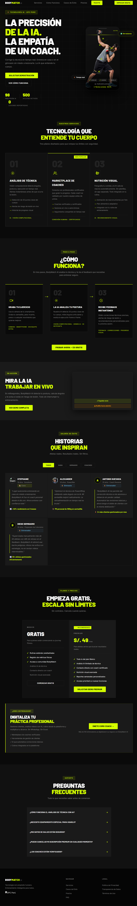

**2. Evidencia en Frontend App (Mobile)**

Se desarrollaron las pantallas núcleo de la aplicación móvil, garantizando una experiencia fluida para el Atleta al momento de interactuar con la IA y gestionar su perfil.

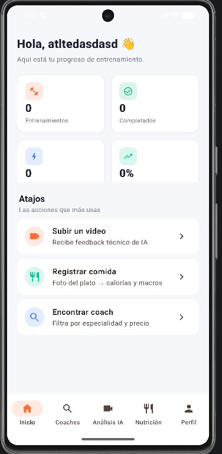
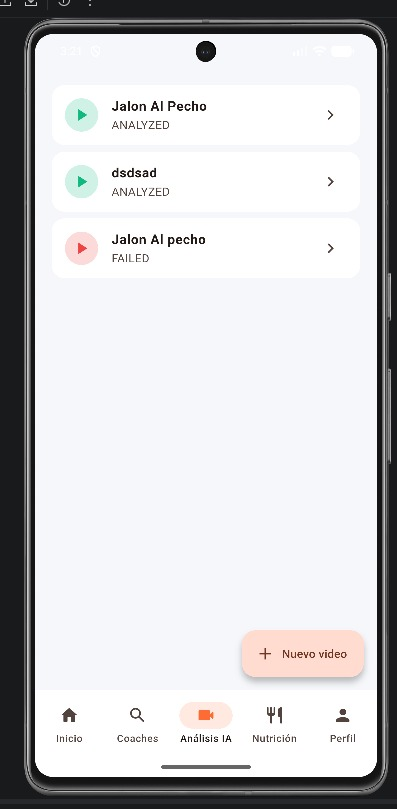
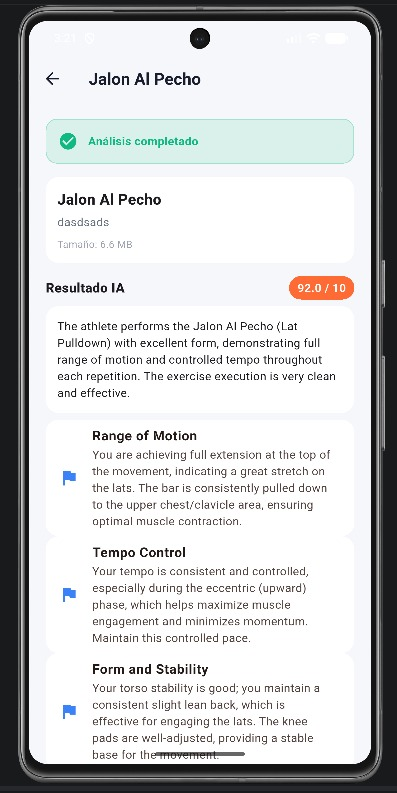
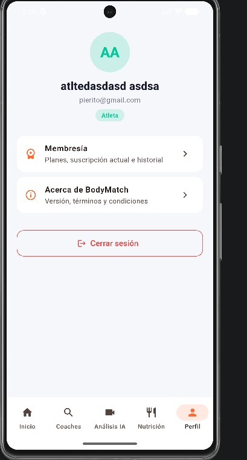  
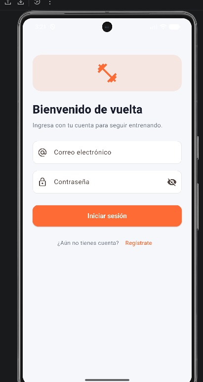    


**3. Evidencia en Web Services (Backend Híbrido)**

Durante este Sprint se inició la migración de nuestra arquitectura monolítica hacia un enfoque de microservicios. Para esta entrega, se han extraído e implementado exitosamente como microservicios independientes los Bounded Contexts de **IAM (Identity and Access Management)** y **Videos (Gestión y Análisis de Ejercicios)**, mientras que los módulos de Matchmaking, Training, Nutrition y Membership se mantienen operativos dentro del Monolito central.

Para comprobar la correcta ejecución del backend, se realizaron pruebas de integración utilizando Postman y la interfaz interactiva de Swagger UI. 

A continuación, se presentan las capturas de pantalla de las principales interacciones ejecutadas comprobando la conexión y las respuestas de la base de datos:

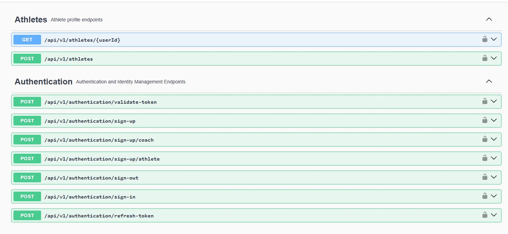
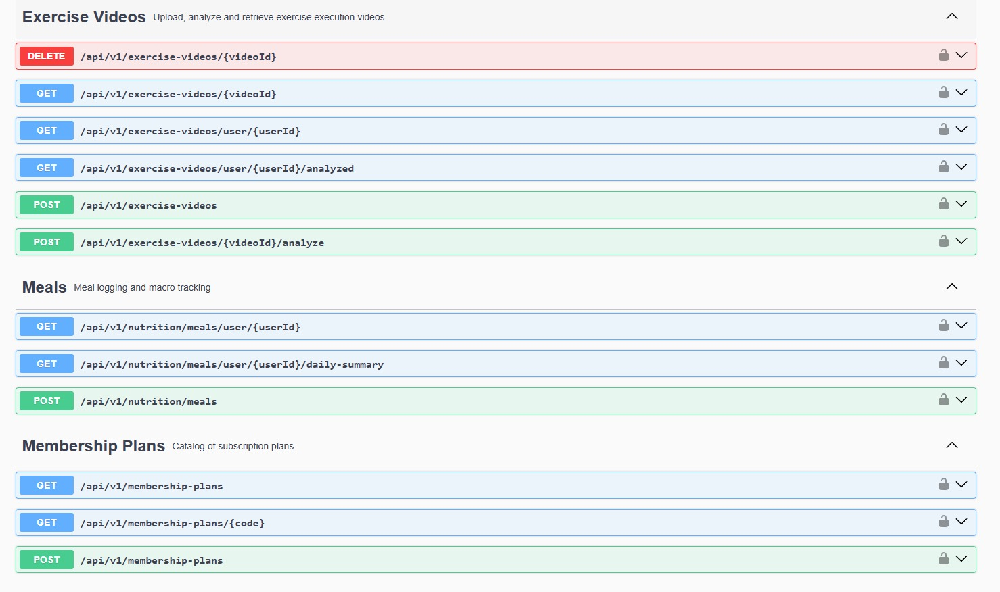
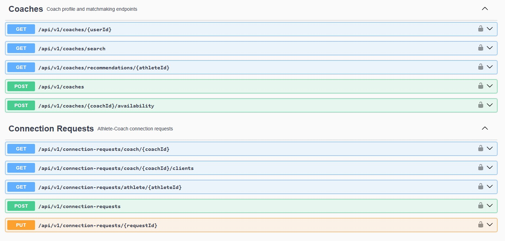
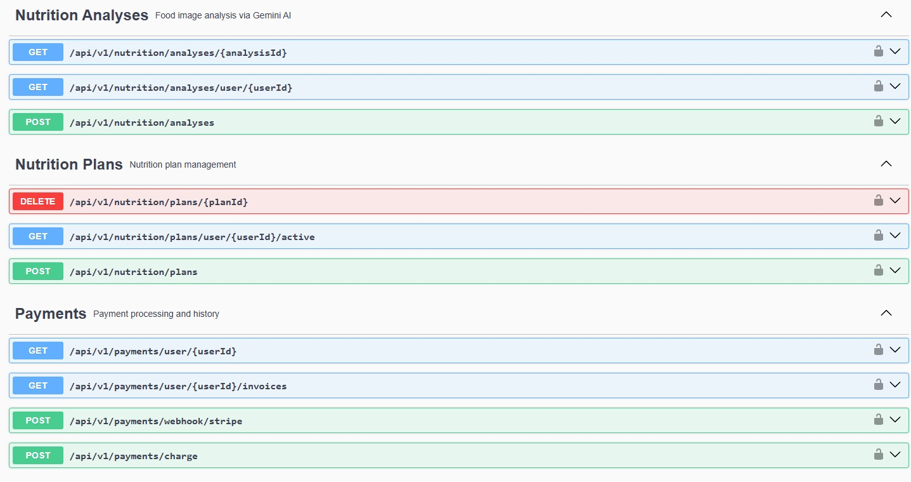


##### 5.2.1.5	Microservices Documentation Evidence for Sprint Review
En esta sección se incluye la relación de endpoints documentados con OpenAPI (Swagger), correspondientes a los microservicios implementados durante el Sprint 1 de BodyMatch AI.  

Durante este Sprint se inició la transición hacia una arquitectura basada en microservicios. Para esta primera entrega, los Bounded Contexts implementados completamente como microservicios independientes fueron:

- **IAM (Identity and Access Management)**  
- **Video Analysis and Management**

Estos microservicios permitieron cubrir las funcionalidades críticas relacionadas con autenticación, registro de usuarios, subida de videos y análisis automático con IA.

Los demás módulos funcionales del sistema permanecen temporalmente dentro del monolito principal y serán desacoplados progresivamente en los siguientes Sprints.

---

### 1. Matriz de Trazabilidad de Requerimientos

La siguiente tabla relaciona las User Stories y Technical Stories implementadas en los microservicios desarrollados durante el Sprint 1:

| ID | Título | Endpoint(s) Relacionado(s) | Microservice / BC | Estado |
|---|---|---|---|---|
| US01 | Registro de usuario | `POST /api/v1/authentication/sign-up/athlete` <br> `POST /api/v1/authentication/sign-up/coach` | IAM | Implementado |
| US02 | Inicio de sesión | `POST /api/v1/authentication/sign-in` | IAM | Implementado |
| US04 | Cierre de sesión | `POST /api/v1/authentication/sign-out` | IAM | Implementado |
| US11 | Subir video | `POST /api/v1/exercise-videos` | Video Management | Implementado |
| US12 | Feedback IA | `POST /api/v1/exercise-videos/{videoId}/analyze` | Video Analysis | Implementado |
| TS01 | Implementación de Middleware JWT | Middleware JWT / Spring Security | IAM | Implementado |
| TS03 | Configuración de Endpoints Video | `POST /api/v1/exercise-videos` | Video Management | Implementado |

---

### 2. Catálogo de Endpoints y Contratos de Interfaz

| Acción Implementada | Verbo HTTP | Endpoint | Parámetros | Response Esperado | Microservice |
|---|---|---|---|---|---|
| Registro de atleta | POST | `/api/v1/authentication/sign-up/athlete` | Body (JSON) | `201 Created` | IAM |
| Registro de coach | POST | `/api/v1/authentication/sign-up/coach` | Body (JSON) | `201 Created` | IAM |
| Inicio de sesión | POST | `/api/v1/authentication/sign-in` | Body (JSON) | `200 OK` | IAM |
| Cierre de sesión | POST | `/api/v1/authentication/sign-out` | Header JWT | `200 OK` | IAM |
| Subida de video | POST | `/api/v1/exercise-videos` | Multipart/Form-Data | `201 Created` | Video Management |
| Análisis de video con IA | POST | `/api/v1/exercise-videos/{videoId}/analyze` | Path Param | `200 OK` | Video Analysis |

**3. Ejemplos de Request y Response (JSON)**
Tal como se solicita en el criterio de evaluación, se presentan ejemplos completos y reales de las peticiones extraídas de la ejecución en Swagger para validar la estructura de datos en los diferentes métodos HTTP:

**A. POST (Crear) - Registro de Atleta**
* **Endpoint:** `POST /api/v1/authentication/sign-up/athlete`
* **Request (Body):**
```json
{
  "email": "atleta@gmail.com",
  "password": "123456",
  "firstName": "Alonso",
  "lastName": "Fernandez",
  "phone": "923456123",
  "roles": [
    "ROLE_ATHLETE"
  ]
}
```
- Response (201 Created):
```json
{
  "id": 1,
  "email": "atleta@gmail.com",
  "firstName": "Alonso",
  "lastName": "Fernandez",
  "phone": "923456123",
  "active": true,
  "emailVerified": false,
  "roles": [
    "ROLE_ATHLETE"
  ]
}
```

**B. POST (Login) - Inicio de Sesión**

* **Endpoint:** `POST /api/v1/authentication/sign-in`
* **Request (Body):**
```json
{
  "email": "atleta@gmail.com",
  "password": "123456"
}
```
- Response (200 OK):
```json
{
  "id": 1,
  "email": "atleta@gmail.com",
  "firstName": "Alonso",
  "lastName": "Fernandez",
  "accessToken": "eyJhbGciOiJIUzM4NCJ9.eyJzd...",
  "refreshToken": "7200a4ab-1168-40bf-b184-afa3953786bc",
  "roles": [
    "ROLE_ATHLETE"
  ]
}
```

Adicionalmente, se presentan las capturas en imágenes de la interacción con la documentación elaborada en Swagger UI utilizando datos de muestra:

**Registro de usuario**:   

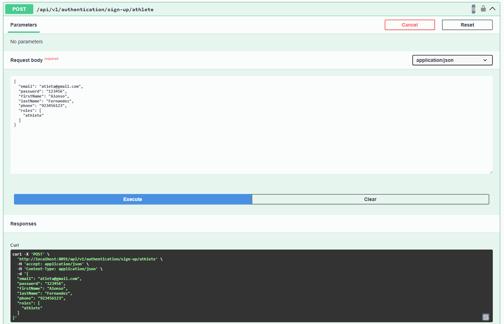  
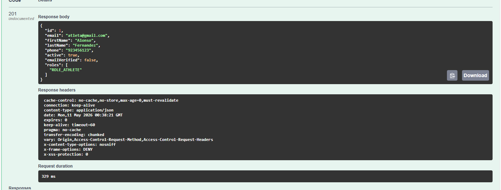 
 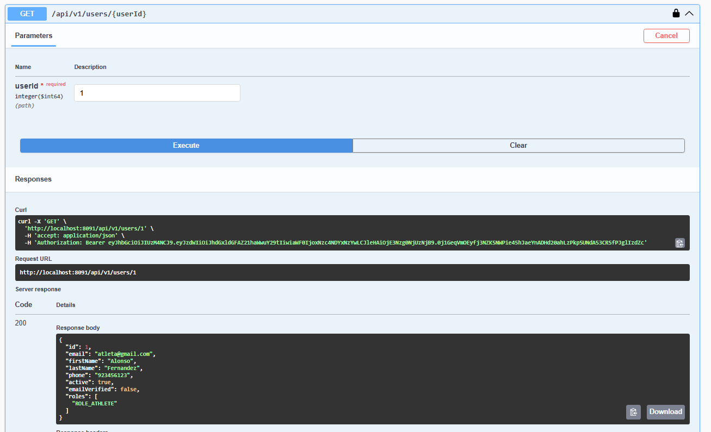 

**Registro y análisis de video:**  

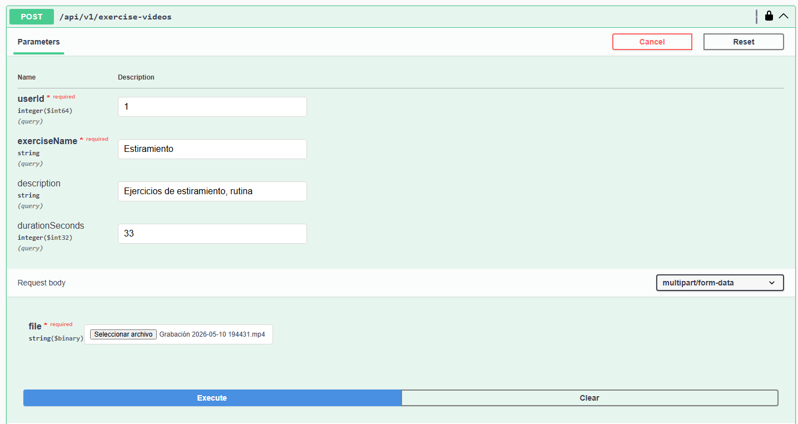 
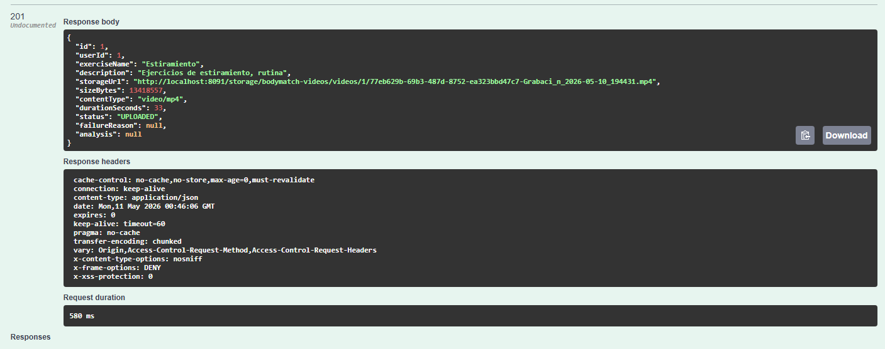 
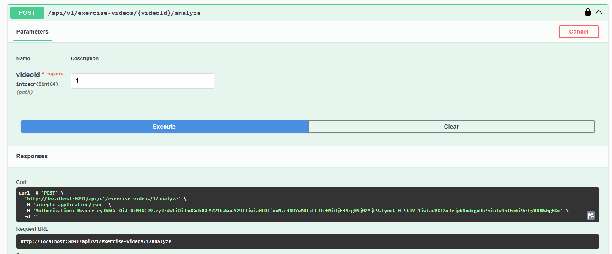 
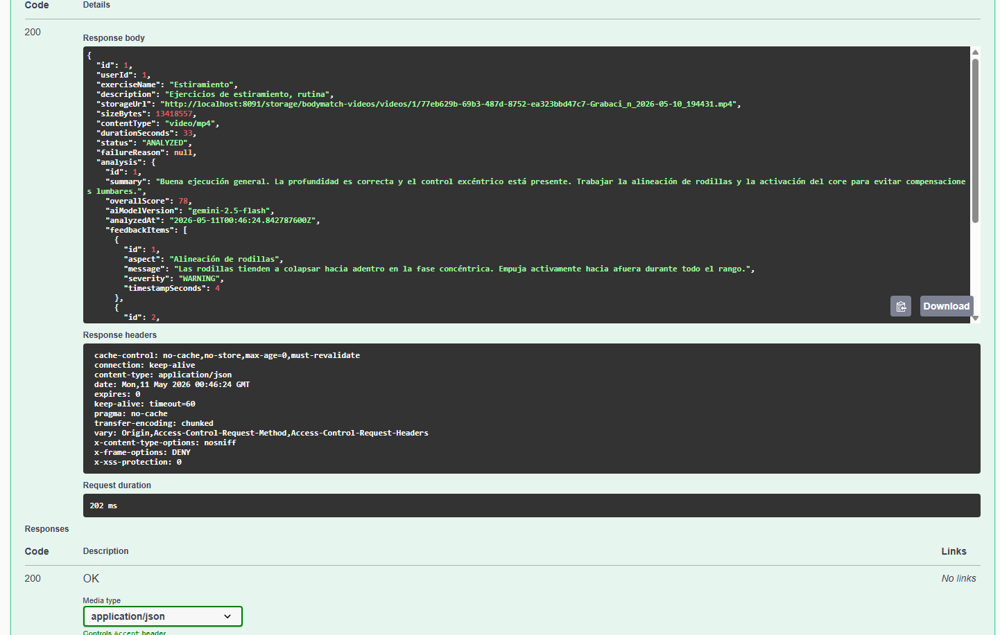
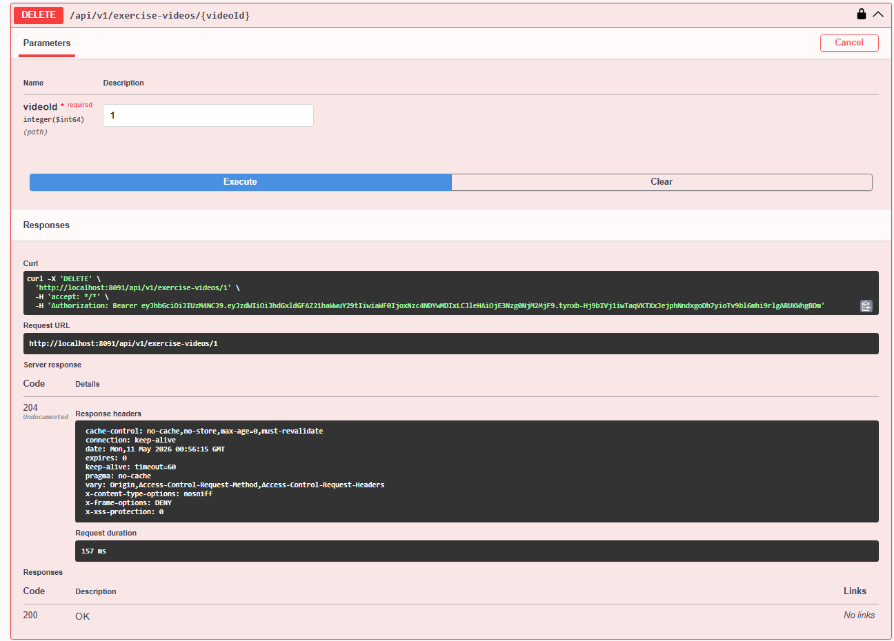 


**Repositorio y Control de Versiones:**
El código fuente se encuentra alojado en la organización del equipo.

* **URL del repositorio de Web Services:**  
  - `https://github.com/G3-FundamentosArqui-7944/bodymatch-backend` 
  - `https://github.com/G3-FundamentosArqui-7944/microservices` 
* **Commits relacionados con Documentación (OpenAPI/Swagger):**
  * `f073594`: *docs: update architecture diagrams and descriptions for clarity and consistency*


##### 5.2.1.6	Software Deployment Evidence for Sprint Review

Durante este primer Sprint, las actividades de despliegue continuo (Deployment) se centraron en la publicación en producción de la Landing Page de BodyMatch AI. El objetivo principal fue hacer pública nuestra propuesta de valor de manera rápida, segura y escalable para comenzar a captar el interés de los usuarios y validaciones tempranas. 

Dado que la Landing Page está construida con tecnologías web estáticas, se optó por utilizar **GitHub Pages** como proveedor de alojamiento en la nube (Cloud Hosting). 


Capturas del Despliegue

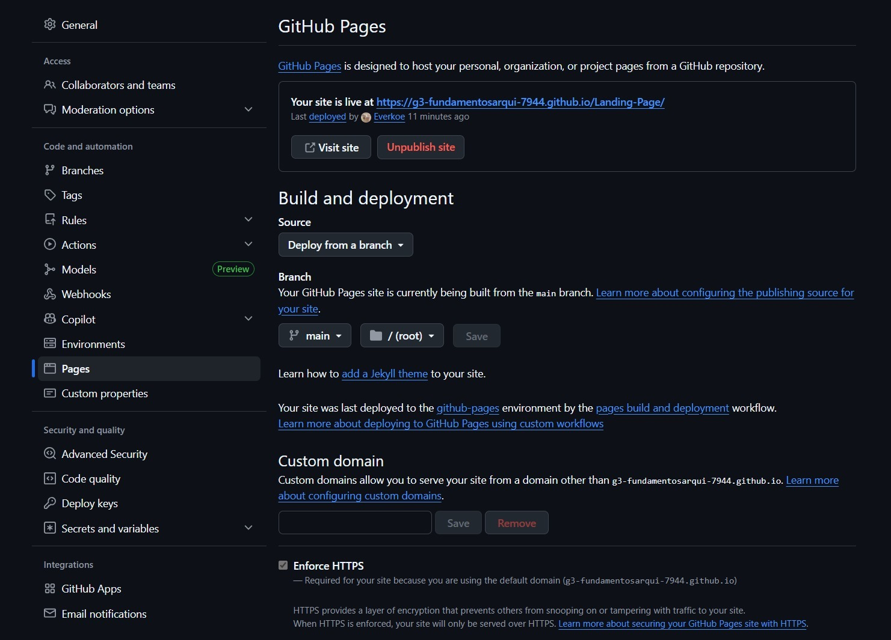 

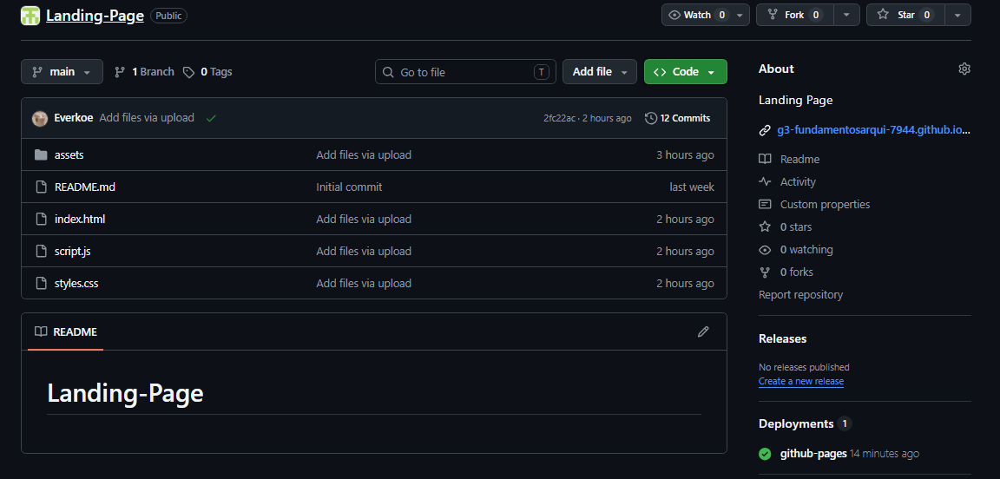 


##### 5.2.1.7	Team Collaboration Insights during Sprint


##### 5.2.1.8	Kanban Board 

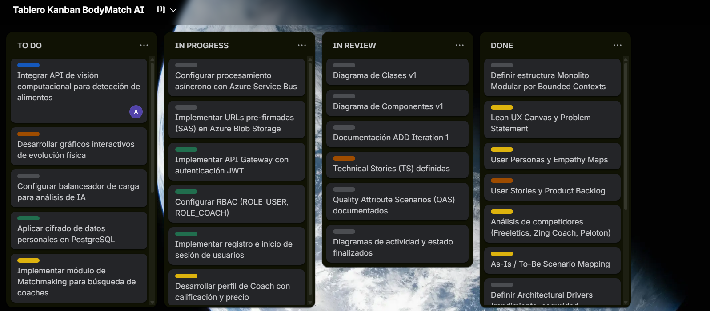 
 
 Link: https://trello.com/b/FLmi4ZnQ/bodymatch-ai-sprint-backlog

## Conclusiones

### TB1: Validación de Negocio y Requerimientos
*   La aplicación del enfoque Lean UX permitió validar de manera efectiva las necesidades reales de los usuarios y coaches, orientando el diseño hacia una solución centrada en la experiencia del usuario.
*   El uso de herramientas de investigación como User Personas y Empathy Maps facilitó la identificación de puntos de dolor críticos, como la falta de orientación técnica y la limitada visibilidad de los entrenadores.
*   La definición del Solution Profile permitió estructurar una propuesta clara que integra el matching de usuarios y el análisis de ejercicios con IA como diferenciales clave frente a la competencia.
*   Durante esta fase, el equipo demostró la capacidad de adquirir nuevos conocimientos en metodologías de diseño UX y análisis competitivo para fortalecer la base funcional del proyecto.

### TB2: Arquitectura y Diseño Técnico
*   La aplicación del método Attribute-Driven Design (ADD) permitió alinear las decisiones técnicas con los drivers del negocio, garantizando la resolución de atributos críticos como el rendimiento y la seguridad.
*   La adopción de Domain-Driven Design (DDD) y principios SOLID estableció una arquitectura modular organizada por Bounded Contexts, asegurando la escalabilidad y mantenibilidad del sistema.
*   El diseño de una arquitectura basada en microservicios y procesamiento asíncrono responde eficientemente a la carga computacional requerida por el análisis de video con inteligencia artificial.
*   El equipo consolidó sus conocimientos técnicos al traducir requerimientos funcionales en decisiones arquitectónicas verificables mediante diagramas de contenedores y componentes.

### TP1: Consolidación y Despliegue
* **Infraestructura y Despliegue:** Se logró el despliegue exitoso de la Landing Page institucional en GitHub Pages, logrando un tiempo de carga inferior a 2 segundos y disponibilidad global inmediata (ver evidencia de Deployment en sección 5.2.1.6).

* **Mantenibilidad:** La aplicación de los principios SOLID y Domain-Driven Design (DDD) permitió definir 6 Bounded Contexts con fronteras explícitas, reduciendo la complejidad técnica y facilitando la integración de nuevos módulos de nutrición en futuros sprints.

---

## Recomendaciones

### TB1: Gestión de Usuario y Producto
*   Se recomienda continuar con un proceso de validación continua con usuarios reales para ajustar las funcionalidades de la interfaz móvil en cada iteración.
*   Es importante implementar un plan piloto con un grupo reducido de atletas y coaches para obtener métricas reales sobre la efectividad del emparejamiento.
*   Se sugiere priorizar en las primeras fases de desarrollo los módulos de mensajería y reserva de sesiones, debido a su alto impacto en la retención de usuarios.

### TB2: Evolución Tecnológica y Seguridad
*   Se recomienda mejorar progresivamente el módulo de inteligencia artificial, iniciando con análisis básicos de movimiento antes de evolucionar hacia la detección de errores biomecánicos complejos.
*   Es fundamental implementar de forma estricta las estrategias de seguridad diseñadas, como la autenticación JWT y el control RBAC, para proteger la privacidad de los videos de los usuarios.
*   Se sugiere monitorear los costos operativos de los servicios en la nube para asegurar que la infraestructura sea sostenible durante la expansión del sistema.

### TP1: Despliegue y Arquitectura 
* Se recomienda consolidar la migración progresiva hacia microservicios implementando un API Gateway robusto (ej. Spring Cloud Gateway) que centralice de forma eficiente el enrutamiento hacia los servicios de IAM, Videos y el Monolito Core.
* Es prioritario automatizar el despliegue del backend mediante pipelines de integración y entrega continua (CI/CD) utilizando GitHub Actions hacia un proveedor Cloud (como Render o Azure) para el próximo Sprint, replicando el éxito obtenido con el despliegue de la Landing Page en GitHub Pages.

 Anexos

 Diagramas de clase en LucidChart: https://lucid.app/lucidchart/01095f62-b902-4795-a561-f5e08d59b9e6/edit?viewport_loc=-4132%2C-1475%2C9285%2C4267%2C0_0&invitationId=inv_98f67f4a-d93a-433b-afde-2b53c20b0c84

 Diagrama de Componentes : https://online.visual-paradigm.com/share.jsp?id=343538393634332d33

 Enlace del Repositorio Grupal: https://github.com/G3-FundamentosArqui-7944

 Enlace del la documentacion dentro del repositorio: https://github.com/G3-FundamentosArqui-7944/docs
 


 Referencias Bibliográficas

* Ministerio de Salud del Perú. (2025). Semana de oro del Perú 2025: El 62% de la población peruana mayor de 15 años tiene exceso de peso. Recuperado de: https://www.gob.pe/institucion/minsa/noticias/1210470-semana-de-oro-del-peru-2025-el-62-de-la-poblacion-peruana-mayor-de-15-anos-tiene-exceso-de-peso

* Revista Retos. (2025). Actividad física y salud en contextos contemporáneos. Recuperado de: https://revistaretos.org/index.php/retos/article/view/117147

* Infobae. (2025). Obesidad en el Perú: El 73% del país tendrá un alto índice de masa corporal en 2025. Recuperado de: https://www.infobae.com/peru/2025/03/04/obesidad-en-el-peru-el-73-del-pais-tendra-un-alto-indice-de-masa-corporal-en-2025/

* Centro Nacional de Planeamiento Estratégico. (s.f.). Observatorio nacional: Indicadores de salud y bienestar. Recuperado de: https://observatorio.ceplan.gob.pe/ficha/t14

* Instituto Nacional de Estadística e Informática. (2017). Encuesta Demográfica y de Salud Familiar. Recuperado de: https://www.inei.gob.pe/media/MenuRecursivo/publicaciones_digitales/Est/Lib2017/libro.pdf

* Romaní Caycho, M. F., Valverde Palma, X., & Vivanco Ponce, F. (2025). Propuesta de plan de negocio para el desarrollo de una plataforma digital de entrenamientos deportivos personalizados con tecnología GPS en Lima Metropolitana [Tesis de licenciatura, Universidad Peruana de Ciencias Aplicadas]. Repositorio Académico UPC. 
https://repositorioacademico.upc.edu.pe/bitstream/handle/10757/686092/Romani_CM.pdf?sequence=16
