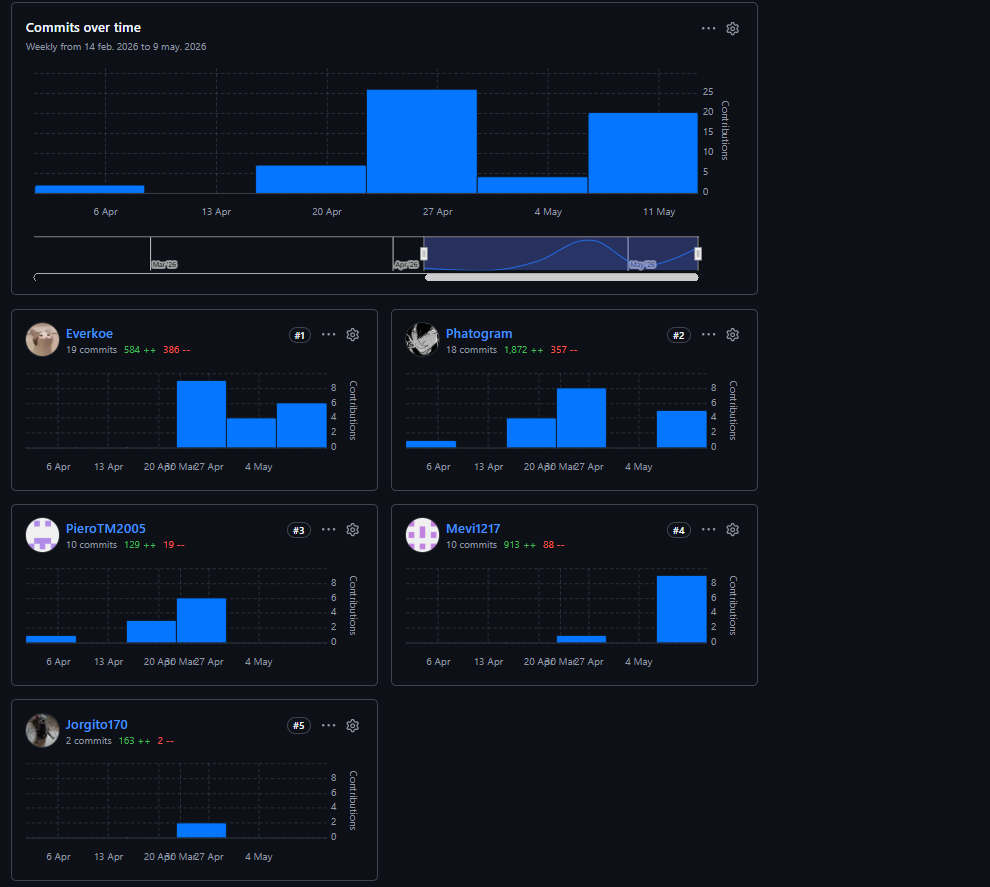

<p align="center">
  <strong>UNIVERSIDAD PERUANA DE CIENCIAS APLICADAS</strong>
</p>


 <p align="center"> </img> 
 </p>

<p align="center">
  Ingeniería de Software <br>
  2026-10 <br>
  1ASI0657-2610-7944 | Fundamentos de arquitectura de software
<br>
  NRC: 7944<br>  
  Profesor: Abel Nehemias Rosales Caururu
 <br><br>
  "Informe de Trabajo Final" <br>
  Startup:BodyMatch
  <br>
  Producto:  BodyMatch AI
  <br>

</p>

<br>

<p align="center"><strong>Relación de integrantes:</strong></p>

<table align="center">
  <thead>
    <tr>
      <th>Integrante</th>
      <th>Código</th>
    </tr>
  </thead>
  <tbody>
    <tr>
      <td>Pablo Antonio Geronimo Quispe</td>
      <td>U202313433</td>
    </tr>
    <tr>
      <td>Anyelo Bill Alejos Jesus</td>
      <td>U20231D149</td>
    </tr>
    <tr>
      <td>Piero Francesco Tenorio Medina</td>
      <td>U202318731
</td>
    </tr>
    <tr>
      <td>Marcia Victoria Melgarejo Gomez</td>
      <td>U20231C505</td>
    </tr>
    <tr>
      <td>Jorge Enrique Guevara Tejada</td>
      <td>U202316057</td>
    </tr>
  </tbody>
</table>

<br><br>

<p align="center">
  <strong>Abril, 2026</strong> <br>
  <strong>URL del proyecto:https://github.com/G3-FundamentosArqui-7944/docs </strong>

</p>

---





## Registro de Versiones del Informe

| Versión | Fecha      | Autor                           | Descripción                                                                                              | Commit  |
|---------|------------|---------------------------------|----------------------------------------------------------------------------------------------------------|---------|
| TB1     | 09/04/2026 | Pablo Antonio Geronimo Quispe   | Desarrollo de la carátula, tabla de contenidos y estructura general del informe.                         | 466a8f3 |
| TB1     | 15/04/2026 | Anyelo Bill Alejos Jesus        | Desarrollo del análisis competitivo, entrevistas y creación de arquetipos de usuario y mapas de empatía. | 62096ee |
| TB1     | 16/04/2026 | Piero Francesco Tenorio Medina  | Desarrollo de los escenarios actuales y futuros, además de la pila de producto.                          | 9be392b |
| TB1     | 14/04/2026 | Jorge Enrique Guevara Tejada    | Desarrollo del proceso Lean UX, incluyendo enunciados de problemas, hipótesis y el lienzo Lean UX.       | f50943d |
| TB1     | 16/04/2026 | Marcia Melgarejo Gomez          | Desarrollo de las épicas e historias de usuario.                                                         | 0fc5d48 |
| TB2     | 25/04/2026 | Piero Francesco Tenorio Medina  | Avance del diagrama de clases.                                                                           | 0bc5e96 |
| TB2     | 27/04/2026 | Piero Francesco Tenorio Medina  | Avance de la primera versión del diagrama de clases.                                                     | 43b41b3 |
| TB2     | 28/04/2026 | Piero Francesco Tenorio Medina  | Primera versión del diagrama de componentes.                                                             | 1ddb81e |
| TB2     | 28/04/2026 | Pablo Antonio Geronimo Quispe   | Avance del documento, tácticas y la metodología ADD.                                                     | 45a16c3 |
| TB2     | 29/04/2026 | Pablo Antonio Geronimo Quispe   | Avance del capítulo 4.2.                                                                                 | 392249c |
| TB2     | 29/04/2026 | Pablo Antonio Geronimo Quispe   | Finalización del capítulo 4.2.                                                                           | 71c9ff3 |
| TB2     | 30/04/2026 | Pablo Antonio Geronimo Quispe   | Finalización de los diagramas de actividad y estado.                                                     | 19d059f |
| TB2     | 30/04/2026 | Pablo Antonio Geronimo Quispe   | Implementación de valores en el perfil de la startup.                                                    | 9fff960 |
| TB2     | 30/04/2026 | Jorge Enrique Guevara Tejada    | Avance Capítulo 4.3 — Iteración ADD 1.                                                                   | ee9cdc9 |
| TB2     | 01/05/2026 | Marcia Victoria Melgarejo Gomez | Avance 4.3 iteración ADD 1, tablero kanban y redacción de conclusiones.                                  | b54b3f3 |
| TB2     | 02/05/2026 | Anyelo Bill Alejos Jesus        | Creación de historias técnicas y redacción de descripciones para diagramas de arquitectura.              | 5e23b4b |
| TB2     | 02/05/2026 | Anyelo Bill Alejos Jesus        | Actualización del student outcome para la entrega del TB2.                                               | 5537ea6 |
| TP      | 14/05/2026 | Pablo Antonio Geronimo Quispe   | Unificación y mejora arquitectónica del Diagrama de Clases UML y diagramas de componentes (C4 Model).    | bd6b6e5 |
| TP      | 15/05/2026 | Marcia Victoria Melgarejo Gomez | Documentación del Sprint 1 Backlog y evidencias de ejecución del frontend móvil.                         | c9f7f75 |
| TP      | 15/05/2026 | Jorge Enrique Guevara Tejada    | Validación de endpoints REST mediante Postman e integración de pruebas de la API RESTful.                | 903aea4 |
| TP      | 15/05/2026 | Anyelo Bill Alejos Jesus        | Despliegue de Landing Page en GitHub Pages y estructuración de matriz de trazabilidad de microservicios. | 390f827 |
| TB3     | 06/06/2026 | Marcia Victoria Melgarejo Gomez | Documentación del Sprint 2 Backlog y evidencias de ejecución del frontend móvil .                         | 75a226b |
| TB3     | 06/06/2026 | Jorge Enrique Guevara Tejada   |Desacoplamiento del backend monolito modular a microservicios                         | 90488b0 |
| TB3     | 06/06/2026 | Anyelo Bill Alejos Jesus  | Documentación del Sprint 2 Backlog y  evidencias del docker y kanba board                        | c63b0fc |
| TB3     | 04/06/2026 | Pablo Antonio geronimo Quispe  | Finalizacion del levantamiento de correciones                      | 97add48 |
| TB4    | 24/06/2026 | Pablo Antonio geronimo Quispe  | Finalizacion del sprint4                   | 9778dd3 |


## Contenido

### Tabla de contenidos

- [Registro de Versiones del Informe](#registro-de-versiones-del-informe)
- [Project Report Collaboration Insights](#project-report-collaboration-insights)
- [Contenido](#contenido)
- [Tabla de contenidos](#tabla-de-contenidos)
- [Student Outcome](#student-outcome)

- [Capítulo I: Introducción](#capítulo-i-introducción)
  - [1.1. Startup Profile](#11-startup-profile)
    - [1.1.1. Descripción de la Startup](#111-descripción-de-la-startup)
    - [1.1.2. Perfiles de integrantes del equipo](#112-perfiles-de-integrantes-del-equipo)
  - [1.2. Solution Profile](#12-solution-profile)
    - [1.2.1. Nombre del producto](#121-nombre-del-producto)
    - [1.2.2. Antecedentes y problemática](#122-antecedentes-y-problemática)
    - [1.2.3. Lean UX Process](#123-lean-ux-process)
      - [1.2.3.1. Lean UX Problem Statement](#1231-lean-ux-problem-statement)
      - [1.2.3.2. Lean UX Assumptions](#1232-lean-ux-assumptions)
      - [1.2.3.3. Lean UX Hypothesis](#1233-lean-ux-hypothesis)
      - [1.2.3.4. Lean UX Canvas](#1234-lean-ux-canvas)
  - [1.3. Segmentos objetivo](#13-segmentos-objetivo)

- [Capítulo II: Requirements & Analysis](#capítulo-ii-requirements--analysis)
  - [2.1. Competidores](#21-competidores)
  - [2.2. Entrevistas](#22-entrevistas)
  - [2.3. Needfinding](#23-needfinding)
    - [2.3.1. User Personas](#231-user-personas)
    - [2.3.2. User Task Matrix](#232-user-task-matrix)
    - [2.3.3. Empathy Maps](#233-empathy-maps)
    - [2.3.4. As-Is Scenario Mapping](#234-as-is-scenario-mapping)

- [Capítulo III: Requirements Specification](#capítulo-iii-requirements-specification)
  - [3.1. To-Be Scenario Mapping](#31-to-be-scenario-mapping)
  - [3.2. User Stories](#32-user-stories)
  - [3.3. Impact Map](#33-impact-map)
  - [3.4. Product Backlog (Avance 1)](#34-product-backlog-avance-1)

- [Capítulo IV: Product Architecture Design](#capítulo-iv-product-architecture-design)
  - [4.1. Design Concepts, ViewPoints & ER Diagrams](#41-design-concepts-viewpoints--er-diagrams)
    - [4.1.1. Principles Statements](#411-principles-statements)
    - [4.1.2. Approaches Statements Architectural Styles & Patterns](#412-approaches-statements-architectural-styles--patterns)
    - [4.1.3. Context Diagram](#413-context-diagram)
    - [4.1.4. Approach Driven ViewPoints Diagrams](#414-approach-driven-viewpoints-diagrams)
    - [4.1.5. Relational/Non-Relational Database Diagram](#415-relationalnon-relational-database-diagram)
    - [4.1.6. Design Patterns](#416-design-patterns)
    - [4.1.7. Tactics](#417-tactics)
  - [4.2. Architectural Drivers](#42-architectural-drivers)
    - [4.2.1. Design Purpose](#421-design-purpose)
    - [4.2.2. Primary Functionality](#422-primary-functionality)
    - [4.2.3. Quality Attribute Scenarios](#423-quality-attribute-scenarios)
    - [4.2.4. Constraints](#424-constraints)
    - [4.2.5. Architectural Concerns](#425-architectural-concerns)
  - [4.3. ADD Iterations](#43-add-iterations)
    - [4.3.X. Iteration N](#43x-iteration-n)
      - [4.3.X.1. Architectural Design Backlog N](#43x1-architectural-design-backlog-n)
      - [4.3.X.2. Establish Iteration Goal](#43x2-establish-iteration-goal)
      - [4.3.X.3. Refine System Elements](#43x3-refine-system-elements)
      - [4.3.X.4. Choose Design Concepts](#43x4-choose-design-concepts)
      - [4.3.X.5. Instantiate Architectural Elements](#43x5-instantiate-architectural-elements)
      - [4.3.X.6. Sketch Views & Record Decisions](#43x6-sketch-views--record-decisions)
      - [4.3.X.7. Analysis & Review (Kanban)](#43x7-analysis--review-kanban)

- [Capítulo V: Product Implementation, Validation & Deployment](#capítulo-v-product-implementation-validation--deployment)
  - [5.1. Testing Suites & General Patterns](#51-testing-suites--general-patterns)
    - [5.1.1. Backend Testing Suite](#511-backend-testing-suite)
    - [5.1.2. Pattern-Based Backend Applications](#512-pattern-based-backend-applications)
    - [5.1.3. Custom Software Library](#513-custom-software-library)
    - [5.1.4. Refactoring Report](#514-refactoring-report)

  - [5.2. Software Configuration Management](#52-software-configuration-management)
    - [5.2.1. Development Environment](#521-development-environment)
    - [5.2.2. Source Code Management](#522-source-code-management)
    - [5.2.3. Style Guide & Conventions](#523-style-guide--conventions)
    - [5.2.4. Deployment Configuration](#524-deployment-configuration)

  - [5.3. Microservices Implementation](#53-microservices-implementation)
    - [Sprint 1](#sprint-1)
    - [Sprint 2](#sprint-2)
    - [Sprint 3](#sprint-3)
    - [Sprint 4](#sprint-4)

  - [5.4. Microservices Deployment](#54-microservices-deployment)
    - [5.4.1. Cloud Architecture Diagram](#541-cloud-architecture-diagram)
    - [5.4.2. Cloud Deployment (TF1)](#542-cloud-deployment-tf1)

- [Conclusiones](#conclusiones)
- [Conclusiones y recomendaciones](#conclusiones-y-recomendaciones)
- [Video About-The-Team](#video-about-the-team)
- [Referencias Bibliográficas](#referencias-bibliográficas)
- [Anexos](#anexos)
- [Links](#links)
## Student Outcome

ABET - EAC - Student Outcome 7 Criterio: La capacidad de adquirir y aplicar nuevos conocimientos según sea necesario, utilizando estrategias de aprendizaje apropiadas.


 
| Criterio específico | Acciones realizadas | Conclusiones |
|---|---|---|
| **Actualiza conceptos y conocimientos necesarios para su desarrollo profesional y en especial para su proyecto en soluciones de software** | **Geronimo Quispe, Pablo Antonio** <br>**TB1:** Apliqué la metodología Scrum para estructurar el Product Backlog con 41 User Stories, lo que permitió organizar el equipo en sprints de dos semanas con entregables verificables.<br>**TB2:** Diseñé el capítulo de arquitectura aplicando el método ADD v3, definiendo 5 Quality Attribute Scenarios con métricas concretas (ej. latencia P95 < 800 ms) y 10 drivers arquitectónicos priorizados por impacto.<br>**TP1:** Implementé la documentación interactiva del API Gateway con SpringDoc OpenAPI 3.0, logrando que el 100% de los 24 endpoints del Sprint 1 queden documentados en Swagger UI con contratos de entrada y salida verificables.<br>**TB3:** Lideré el desarrollo del backend del monolito, ejecutando la refactorización de código y el levantamiento de correcciones de entregas anteriores para asegurar la estabilidad del sistema en la recta final. <br><br>**Tenorio Medina, Piero Francesco**<br>**TB1:** Investigué el patrón CQRS y los principios DDD para estructurar el diagrama de clases con 6 bounded contexts y 12 entidades de dominio, asegurando que cada clase tuviera una única responsabilidad según el principio SRP.<br>**TB2:** Elaboré el diagrama de clases UML final con 12 entidades, aplicando los patrones Factory Method, Strategy y Repository documentados en la sección 4.1.6, lo que permitió que el evaluador trazara cada patrón a su clase concreta.<br><br>**Guevara Tejada, Jorge Enrique**<br>**TB1:** Apliqué el proceso Lean UX elaborando el Lean UX Canvas con 6 hipótesis verificables y métricas de éxito (ej. retención > 70% a los 3 meses), estructurando la propuesta de valor del producto.<br>**TB2:** Desarrollé la iteración ADD 1 definiendo 7 decisiones de diseño (DD-001 a DD-007) con justificación, consecuencias y referencia a los drivers que satisfacen.<br>**TP1:** Validé 12 endpoints REST del microservicio IAM y Videos mediante colecciones de Postman, documentando los request/response de cada verbo HTTP (GET, POST, PUT, DELETE) con datos de muestra reales.<br>**TB3:** Ejecuté el desarrollo progresivo de la arquitectura de microservicios y la lógica de negocio en el backend, garantizando la correcta comunicación inter-servicios y el cumplimiento de los contratos API. <br><br>**Alejos Jesus, Anyelo Bill**<br>**TB1:** Apliqué la técnica de Requirements Elicitation realizando 6 entrevistas estructuradas (3 por segmento) con guión de 10 preguntas abiertas, sintetizando los hallazgos en User Personas elaboradas con UXPressia.<br>**TB2:** Investigué el concepto de Technical Stories y redacté 4 TS (TS01–TS04) con criterios de aceptación Given-When-Then, además de describir los 8 diagramas de componentes C4 Nivel 3 con párrafo interpretativo por figura.<br>**TP1:** Desplegué la Landing Page en GitHub Pages configurando el pipeline de publicación estática, y estructuré la matriz de trazabilidad de 24 endpoints relacionándolos con sus User Stories correspondientes.<br>**TB3:** Gestioné la planificación del Sprint 3 estructurando el Sprint Backlog 3, y consolidé las evidencias del Sprint Review, abarcando las pruebas funcionales (Testing Suite Evidence), desarrollo y ejecución del incremento de software.<br><br>**Melgarejo Gomez, Marcia Victoria**<br>**TB1:** Redacté 41 User Stories con estructura "Como… quiero… para…" y criterios de aceptación Given-When-Then para los 8 Epics del proyecto, asegurando que cada historia tuviera mínimo 2 escenarios de prueba.<br>**TB2:** Apliqué el método ADD documentando el Architectural Design Backlog de la iteración 1 con 7 drivers priorizados y el tablero Kanban de 3 columnas (To Do / In Progress / Done) para gestionar las decisiones arquitectónicas.<br>**TP1:** Documenté el Sprint 1 Backlog descomponiendo 20 User Stories en 26 tareas técnicas de máximo 8 horas, y registré las evidencias de ejecución del frontend móvil con capturas de las 5 pantallas implementadas.<br>**TB3:** Sistematicé la documentación técnica del Sprint 3 mediante las evidencias de despliegue (Software Deployment) y microservicios. Además, documenté los *Insights* de colaboración del equipo y actualicé el tablero Kanban para asegurar el flujo de valor ágil. | **TB1:** El equipo demostró capacidad para adquirir y aplicar conocimientos en metodologías de investigación de usuarios (entrevistas, User Personas, Lean UX) y organización ágil (Scrum, Product Backlog), generando artefactos verificables que sirvieron como base para las decisiones de diseño de los capítulos posteriores.<br><br>**TB2:** El equipo consolidó conocimientos avanzados en arquitectura de software mediante el método ADD v3, traduciendo los drivers del negocio en 7 decisiones de diseño documentadas, 5 Quality Attribute Scenarios con métricas concretas y 6 bounded contexts con patrones de diseño trazables al código.<br><br>**TP1:** La aplicación de conocimientos de despliegue (GitHub Pages, Docker Compose), documentación de APIs (Swagger/OpenAPI) y gestión de sprints (Sprint Backlog con tareas técnicas) permitió entregar el primer incremento funcional de BodyMatch AI con evidencia verificable de implementación, testing y despliegue en producción.<br><br>**TB3:** El equipo consolidó sus competencias técnicas en la implementación final del sistema, aplicando conocimientos avanzados de refactorización, despliegue de microservicios y control de calidad ágil, logrando entregar un Sprint 3 funcional, exhaustivamente probado y listo para el Sprint Review. **Geronimo Quispe, Pablo Antonio**<br>**TB4:** Lideré la implementación completa del Nutrition Service, investigando la integración multimodal de la API de Gemini para el análisis de imágenes de alimentos. Apliqué el patrón Gateway y el Value Object `MacroSummary` para garantizar la separación de responsabilidades entre la capa de IA y la lógica de dominio. Actualicé el `docker-compose.yml` con los dos nuevos microservicios y verifiqué la correcta orquestación del ecosistema completo de nueve contenedores.<br><br>**Alejos Jesus, Anyelo Bill**<br>**TB4:** Desarrollé las vistas móviles finales en Flutter para el módulo de nutrición y seguimiento de progreso físico, aplicando el patrón BLoC para gestionar el estado de las pantallas de análisis de alimentos y del dashboard de macros diarios. Coordiné la integración del cliente móvil con los nuevos endpoints del Nutrition Service y Training Service a través del API Gateway, asegurando la correcta serialización/deserialización de los DTOs en Dart.<br><br>**Guevara Tejada, Jorge Enrique**<br>**TB4:** Implementé el Training Service completo, incluyendo el `PerformanceMetricService` con el enum `MetricType` y su unidad por defecto según tipo, el `WorkoutSessionService` con el Value Object embebido `Weight` y el motor de analíticas que calcula `completionRate` y volumen promedio por sesión. Adquirí conocimientos sobre consultas JPA con rangos temporales (`findAllByUserIdAndStartedAtBetween`) para soportar el filtrado histórico de métricas.<br><br>**Melgarejo Gomez, Marcia Victoria**<br>**TB4:** Implementé el `MealRecordService` con el cálculo de resumen diario de macronutrientes mediante agregación de los registros del día en UTC, y el `NutritionPlanService` con la lógica de desactivación automática del plan anterior. Documenté con `@Tag`, `@Operation` y `@ApiResponse` el 100% de los endpoints de los servicios de Nutrition y Training para la especificación OpenAPI, y elaboré los archivos `.feature` BDD del Sprint 3 cubriendo los escenarios de camino feliz y excepción de cada User Story. | **TB4:** El equipo demostró capacidad para adquirir y aplicar conocimientos avanzados de integración con IA multimodal, diseño de Value Objects en DDD y gestión de analíticas sobre datos históricos en PostgreSQL. La entrega final evidencia que cada integrante actualizó de forma autónoma sus conocimientos técnicos según las necesidades específicas del Bounded Context que le correspondía implementar, logrando un ecosistema de microservicios completamente funcional y documentado.|
| **Reconoce la necesidad del aprendizaje permanente para el desempeño profesional y el desarrollo de proyectos en soluciones de software** | **Geronimo Quispe, Pablo Antonio**<br>**TB1:** Identifiqué que la coordinación de un equipo de 5 personas requería conocimientos de liderazgo técnico que no tenía, por lo que estudié técnicas de facilitación de ceremonias Scrum (planning, retrospectiva) para mejorar la eficacia del equipo.<br>**TB2:** Reconocí que diseñar arquitecturas basadas en atributos de calidad requiere dominar el método ADD v3 más allá del contenido del curso, por lo que estudié el libro "Designing Software Architectures" del SEI para completar la iteración ADD 1 con rigor metodológico.<br>**TP1:** Comprendí que el despliegue de microservicios con Spring Cloud Gateway y Eureka requiere conocimientos de redes y configuración de Docker que debí adquirir de forma autónoma consultando la documentación oficial de Spring Cloud.<br>**TB3:** Comprendí que el levantamiento de correcciones técnicas y la optimización de un monolito requieren habilidades avanzadas en refactorización y resolución de deuda técnica, por lo que reforcé mis conocimientos en principios de *Clean Code*.<br><br>**Tenorio Medina, Piero Francesco**<br>**TB1:** Reconocí la necesidad de aprender notación UML avanzada para representar correctamente las relaciones de agregación, composición y dependencia entre las entidades del sistema.<br>**TB2:** Detecté que los patrones de diseño GoF requieren comprensión profunda de los principios SOLID para aplicarse correctamente, por lo que revisé casos de uso concretos de cada patrón antes de incluirlos en el diagrama de clases.<br><br>**Guevara Tejada, Jorge Enrique**<br>**TB1:** Comprendí que validar hipótesis de negocio requiere conocimientos de diseño de entrevistas cualitativas, por lo que aprendí las técnicas de preguntas abiertas y no directivas para evitar sesgo en las respuestas.<br>**TB2:** Reconocí que documentar decisiones arquitectónicas de forma rigurosa (con consecuencias y alternativas descartadas) es una habilidad diferenciadora en el rol de arquitecto de software.<br>**TP1:** Entendí que el testing de APIs requiere dominar herramientas como Postman Collections y la generación de datos de muestra realistas para que las pruebas sean representativas del comportamiento real del sistema.<br>**TB3:** Identifiqué que la transición y desarrollo asíncrono de microservicios exige un manejo riguroso de la tolerancia a fallos, lo que me motivó a investigar de manera independiente sobre patrones de resiliencia en arquitecturas distribuidas.<br><br>**Alejos Jesus, Anyelo Bill**<br>**TB1:** Comprendí que el levantamiento de requisitos mediante entrevistas es una habilidad que requiere práctica continua, y que la calidad de los User Personas depende directamente de la profundidad del análisis de los datos cualitativos obtenidos.<br>**TB2:** Identifiqué que la documentación de arquitectura (diagramas C4, decisiones de diseño) debe ser lo suficientemente clara para que un nuevo miembro del equipo pueda entender el sistema sin necesidad de explicación adicional, lo que requiere un estándar de redacción técnica que desarrollé durante esta entrega.<br>**TP1:** Advertí que el ecosistema Cloud y las herramientas de CI/CD evolucionan rápidamente, por lo que dominar los fundamentos de infraestructura como código (IaC) y automatización de despliegues es una habilidad crítica para mi desarrollo profesional.<br>**TB3:** Comprendí que documentar integralmente las pruebas y evidencias de un Sprint Review exige manejar estándares de QA (Quality Assurance) más formales, por lo que tuve que investigar métodos para estructurar la *Testing Suite* de manera comprensible y profesional.<br><br>**Melgarejo Gomez, Marcia Victoria**<br>**TB1:** Identifiqué que escribir criterios de aceptación verificables (Given-When-Then) requiere pensar como tester antes de como desarrolladora, una perspectiva que desarrollé estudiando las convenciones de Gherkin y BDD.<br>**TB2:** Reconocí que gestionar un backlog arquitectónico con el método ADD es más complejo que un Product Backlog estándar, ya que cada ítem debe justificarse por su impacto en un atributo de calidad medible.<br>**TP1:** Comprendí que documentar un Sprint de forma rigurosa (con evidencias de desarrollo, testing y despliegue) es una habilidad profesional indispensable para la auditoría de proyectos de software en entornos empresariales.<br>**TB3:** Comprendí que mantener la cohesión del equipo y monitorear el flujo de trabajo en etapas críticas de entrega requiere habilidades de *agile management* avanzadas, por lo que amplié mis conocimientos sobre la generación de *Insights* colaborativos y métricas en tableros Kanban. **Geronimo Quispe, Pablo Antonio**<br>**TB4:** Reconocí que la integración con APIs de IA generativa requiere un manejo defensivo de las respuestas, dado que los modelos pueden devolver JSON malformado o con campos inesperados. Por ello profundicé en técnicas de parseo robusto con Jackson y en la implementación del modo stub, lo que permitió que el sistema funcione en entornos sin API key durante el desarrollo y las pruebas.<br><br>**Alejos Jesus, Anyelo Bill**<br>**TB4:** Comprendí que el desarrollo de clientes móviles que consumen ecosistemas de microservicios exige conocimientos actualizados sobre manejo de errores distribuidos, timeouts diferenciados por tipo de operación y estrategias de caché local para mejorar la experiencia del usuario ante latencias variables. Investigué de forma autónoma el manejo de estados de carga con BLoC para operaciones largas como el análisis de imágenes con IA.<br><br>**Guevara Tejada, Jorge Enrique**<br>**TB4:** Identifiqué que el diseño de métricas de negocio sobre datos de entrenamiento requiere comprender conceptos de análisis de series temporales y agregación estadística que van más allá del contenido del curso. Estudié de forma independiente las consultas JPA con predicados temporales y las operaciones de reducción en Java Streams para implementar el motor de analíticas del Training Service de manera eficiente.<br><br>**Melgarejo Gomez, Marcia Victoria**<br>**TB4:** Reconocí que documentar una API REST completa bajo el estándar OpenAPI 3.0 es una competencia profesional crítica que requiere conocimiento profundo tanto de las convenciones HTTP como de las herramientas de generación automática de especificaciones. Estudié de forma autónoma las anotaciones avanzadas de SpringDoc para documentar parámetros opcionales, tipos de contenido multipart y estructuras de respuesta anidadas como las de `NutritionAnalysisResponse`. | **TB1:** El equipo reconoció que el desarrollo de un producto de software de calidad exige aprendizaje multidisciplinario más allá del contenido del curso, incluyendo técnicas de investigación de usuarios, diseño UX y gestión ágil de proyectos.<br><br>**TB2:** La aplicación del método ADD v3 evidenció que la arquitectura de software requiere actualización constante del conocimiento técnico, especialmente en patrones de diseño, atributos de calidad y herramientas de modelado, habilidades que el equipo desarrolló de forma autónoma durante esta entrega.<br><br>**TP1:** La transición hacia microservicios confirmó que el ingeniero de software moderno debe mantener un ciclo continuo de aprendizaje en herramientas de despliegue, documentación de APIs y testing automatizado, ya que estas tecnologías evolucionan con rapidez y son requisito en el mercado laboral actual.<br><br>**TB3:** La ejecución final del proyecto le demostró al equipo que la entrega continua de valor empresarial demanda un aprendizaje ininterrumpido en áreas como la gestión de calidad (QA), devops, resolución de deuda técnica y mantenimiento de arquitecturas escalables. **TB4:** La entrega final confirmó que el desarrollo de software distribuido con integración de inteligencia artificial exige un ciclo de aprendizaje continuo que ningún miembro del equipo puede completar únicamente con los conocimientos del curso. Cada integrante reconoció y actuó sobre sus brechas de conocimiento de forma proactiva, desde el manejo de APIs multimodales hasta el diseño de analíticas históricas y la documentación profesional de contratos REST, consolidando una cultura de aprendizaje permanente en el equipo. |

## Capítulo I: Introducción

### 1.1. Startup Profile

El perfil de la startup es un pilar fundamental para articular la identidad y la hoja de ruta de            una nueva empresa. Este apartado desglosa no solo su ambición y los principios que rigen sus acciones, sino que también clarifica su oferta única y cómo se distingue en el panorama competitivo. En esta sección, se detallarán los componentes cruciales que definen el carácter de la startup, incluyendo su génesis, los impulsos que motivaron su fundación, el desafío específico que se propone abordar y cómo su perspectiva innovadora le otorga una ventaja competitiva. Asimismo, se explorarán sus objetivos a corto, mediano y largo plazo, junto con las tácticas empleadas para su expansión y consolidación en su nicho de mercado. Entender estos aspectos es vital para apreciar el potencial inherente al perfil de la startup y la influencia que puede ejercer en su ecosistema.

#### 1.1.1. Descripción de la Startup

BodyMatch  es una startup tecnológica enfocada en mejorar la calidad de vida de las personas mediante el ejercicio físico, conectando usuarios con entrenadores (coaches) especializados a través de una plataforma digital inteligente.
La solución responde a la creciente necesidad de contar con acompañamiento personalizado en el ámbito del fitness, ofreciendo un ecosistema donde los usuarios pueden encontrar coaches según sus objetivos, características y nivel de experiencia, facilitando así una experiencia adaptada y accesible.
A través de la plataforma, los usuarios pueden explorar perfiles de entrenadores, agendar sesiones, comunicarse en tiempo real y recibir retroalimentación continua. Por otro lado, los coaches obtienen mayor visibilidad, herramientas digitales para gestionar sus servicios y la posibilidad de ampliar su alcance profesional.

#### Misión
Empoderar a las personas y a los entrenadores mediante una plataforma tecnológica accesible, inteligente y personalizada que facilite la conexión, el aprendizaje y la mejora continua en el ámbito del ejercicio físico.

#### Visión
Ser la plataforma líder en Peru en entrenamiento digital inteligente, integrando inteligencia artificial, profesionales del fitness y usuarios en un ecosistema que promueva el bienestar y el desarrollo físico de manera sostenible.

#### Valores de BodyMatch AI

Para complementar tu Misión y Visión, estos cinco pilares definen la cultura y el comportamiento de la plataforma:

 1. Innovación con Propósito
No usamos tecnología solo por usarla. Integramos Inteligencia Artificial para resolver problemas reales de salud y técnica deportiva, transformando algoritmos en resultados tangibles para el usuario.

 2. Rigor y Seguridad Técnica
La integridad física de nuestros usuarios es prioridad. Nos comprometemos a que nuestra retroalimentación técnica sea precisa, buscando siempre la prevención de lesiones y el movimiento seguro.

 3. Empoderamiento y Conectividad
Creemos en el valor humano del coach. Nuestra plataforma no busca reemplazar al profesional, sino potenciar su alcance y fortalecer el vínculo de confianza con el atleta.

 4. Accesibilidad y Democratización
Trabajamos para que el asesoramiento fitness de alta calidad no sea un lujo, sino una herramienta disponible para cualquier peruano que busque mejorar su salud, sin importar su nivel de experiencia.

 5. Transparencia de Datos
Operamos bajo una ética de datos clara. La información de progreso y salud de nuestros usuarios es tratada con el máximo respeto y transparencia, asegurando que el atleta siempre sea dueño de su evolución.


#### 1.1.2. Perfiles de integrantes del equipo

| Foto | Miembros del equipo | Código de Estudiante | Descripción |
| :---: | :--- | :--- | :--- |
|  | Pablo Antonio Geronimo Quispe | U202314304 | Soy Pablo, estudiante de Ingeniería de Software en el 7mo ciclo. Me caracterizo por ser una persona responsable, disciplinada y comprometida con las actividades que asumo. Tengo experiencia en trabajo en equipo y conocimientos en bases de datos, lo cual aporta al desarrollo de proyectos. Además, cuento con conocimientos en Java y JavaScript, permitiéndome contribuir tanto en backend como frontend. |
|  | Piero Francesco Tenorio Medina | U202318731 | Soy estudiante de Ingeniería de Software en la UPC. Me considero una persona comprometida, responsable y proactiva en el trabajo en equipo. Tengo experiencia en desarrollo de interfaces web con HTML, CSS y JavaScript, lo que me permite aportar en soluciones visuales y funcionales. Busco seguir aprendiendo y mejorar mis habilidades para contribuir al éxito del proyecto. |
|  | Marcia Victoria Melgarejo Gomez | U20231C505 | Soy Marcia Melgarejo, estudiante de Ingeniería de Software en cuarto ciclo. Me apasiona la tecnología y su impacto en la sociedad. Me caracterizo por ser curiosa, persistente y colaborativa. Mi objetivo es seguir desarrollando mis habilidades en programación para resolver problemas de manera eficiente. |
|  | Anyelo Bill Alejos Jesus | U20231D149 | Soy Anyelo Alejos, estudiante de Ingeniería de Software en séptimo ciclo. Tengo conocimientos en C++ y Python, lo que me permite desarrollar soluciones de manera eficiente. Me considero una persona responsable, comprometida y con iniciativa, enfocada en aportar al logro de los objetivos del equipo. |
|  | Jorge Enrique Guevara Tejada | U202316057 | Soy un estudiante responsable y comprometido con el trabajo en equipo. Me esfuerzo constantemente por mejorar mis habilidades y superar desafíos académicos. Busco no solo un buen rendimiento, sino también aportar de manera significativa al éxito del equipo en cada proyecto. |

### 1.2. Solution Profile
BodyMatch AI es una aplicación móvil que ofrece un ecosistema integral de entrenamiento personalizado, conectando a usuarios con entrenadores especializados mediante una plataforma digital inteligente.
La solución permite a los usuarios descubrir coaches según sus objetivos y nivel físico, facilitando el acceso a entrenamiento personalizado, seguimiento de progreso y comunicación directa con profesionales. Al mismo tiempo, proporciona a los entrenadores un entorno donde pueden gestionar sus servicios, interactuar con sus clientes y ampliar su alcance profesional.
Un componente clave de la solución es la integración de inteligencia artificial, que permite analizar videos de ejercicios enviados por los usuarios y generar retroalimentación automatizada sobre la ejecución, identificando errores y oportunidades de mejora.
La plataforma adapta sus funcionalidades según el tipo de usuario, diferenciando la experiencia entre usuarios y coaches, e incorporando herramientas de monitoreo que permiten evaluar el progreso y optimizar el entrenamiento de manera continua.
Con esta solución, BodyMatch AI proporciona un entorno digital completo que combina entrenamiento personalizado, interacción profesional y análisis inteligente, permitiendo mejorar la calidad del ejercicio y alcanzar resultados sostenibles.

#### 1.2.1	Nombre del producto

El nombre del producto es BodyMatch AI, una aplicación móvil diseñada para ofrecer un ecosistema integral de entrenamiento físico personalizado. El término “BodyMatch” hace referencia a la capacidad de la plataforma para conectar a los usuarios con entrenadores que se ajusten a sus objetivos, características y nivel físico, logrando una “compatibilidad” óptima en el proceso de entrenamiento.

Por otro lado, el componente “AI” destaca el uso de tecnología avanzada dentro de la solución, permitiendo el análisis automatizado de ejercicios mediante video, la generación de retroalimentación técnica y la personalización del entrenamiento.

En conjunto, el nombre BodyMatch AI refleja la propuesta de valor de la aplicación: integrar inteligencia artificial y acompañamiento profesional para ofrecer una experiencia de entrenamiento más eficiente, personalizada y accesible.


#### 1.2.2 Antecedentes y problemática

El sedentarismo y la incorrecta práctica de ejercicio físico han generado un incremento significativo en problemas de salud como la obesidad, lesiones musculares y trastornos cardiovasculares, los cuales se encuentran entre las principales preocupaciones de salud pública a nivel global. Muchas personas intentan mejorar su condición física por cuenta propia, pero carecen de orientación adecuada, lo que deriva en ejecuciones incorrectas, falta de constancia y resultados poco efectivos.

Por otro lado, los entrenadores personales (coaches) enfrentan limitaciones para expandir su alcance profesional, ya que dependen principalmente de redes sociales o plataformas no especializadas que no les permiten gestionar adecuadamente a sus clientes, ofrecer seguimiento estructurado ni monetizar eficientemente sus servicios. Esta situación restringe tanto el crecimiento profesional de los coaches como el acceso de los usuarios a entrenamiento de calidad.

En este contexto surge BodyMatch AI, una aplicación móvil que responde a ambas necesidades mediante un ecosistema digital que permite a los usuarios encontrar coaches adecuados a su perfil, recibir acompañamiento personalizado y obtener retroalimentación automatizada mediante inteligencia artificial sobre la ejecución de sus ejercicios, mientras que los entrenadores cuentan con una plataforma especializada para gestionar sus servicios, interactuar con clientes y ampliar su impacto profesional.

 Para comprender mejor el problema, se utiliza la técnica de las 5 W's y 2 H's:

 **What:**
El problema principal radica en la dificultad que tienen muchas personas para realizar ejercicios de forma correcta y segura sin la guía adecuada, así como en la falta de plataformas especializadas que permitan a los entrenadores gestionar eficientemente su práctica profesional. Las soluciones actuales suelen ser genéricas, no personalizadas y carecen de herramientas que analicen la ejecución real del usuario, lo que limita el progreso y aumenta el riesgo de lesiones.

 **When:**
Este problema se ha intensificado en los últimos años, especialmente en el contexto post-pandemia, donde se incrementó el interés por la salud y el ejercicio en casa. La digitalización de los servicios de entrenamiento ha crecido, pero muchas soluciones no han evolucionado lo suficiente para ofrecer experiencias personalizadas ni herramientas inteligentes de análisis, generando una brecha entre la demanda y la calidad de las soluciones disponibles. Según  2playbook (2024, como se cita en omani, Ma. et.al, 2025 ), este panorama tecnológico emergente facilita una experiencia más a medida, eficiente y de fácil acceso para los usuarios.

**Where:**
La problemática afecta tanto a entornos urbanos como rurales. En zonas urbanas, los usuarios tienen acceso a múltiples opciones digitales pero enfrentan desinformación y falta de personalización. En zonas rurales, el acceso a entrenadores profesionales es limitado, lo que hace aún más relevante contar con soluciones digitales que conecten a usuarios con coaches de manera remota. Los entrenadores, independientemente de su ubicación, enfrentan dificultades similares para gestionar su práctica profesional.

 **Who**
El problema impacta principalmente a dos segmentos: por un lado, los usuarios, es decir, personas que buscan mejorar su condición física desde principiantes hasta nivel intermedio incluyendo quienes desean entrenar desde casa o perfeccionar su técnica; y por otro lado, los coaches, como entrenadores personales y profesionales del fitness que necesitan herramientas digitales para aumentar su visibilidad, gestionar mejor a sus clientes y ofrecer sus servicios de manera más eficiente.

**Why:**
La causa principal es la falta de soluciones tecnológicas especializadas que integren personalización, acompañamiento profesional y análisis inteligente del desempeño físico. Muchas aplicaciones se enfocan solo en rutinas genéricas, sin considerar la ejecución real del ejercicio ni brindar retroalimentación efectiva. Asimismo, los entrenadores carecen de plataformas que les permitan escalar su negocio de manera estructurada y profesional.

**How:**
Mediante una plataforma digital dual que conecta usuarios y coaches dentro de un ecosistema inteligente. Los usuarios pueden crear perfiles personalizados, explorar entrenadores, agendar sesiones y enviar videos de sus ejercicios. Estos videos son analizados mediante inteligencia artificial, que genera feedback detallado sobre la técnica, errores y mejoras. Por su parte, los coaches disponen de herramientas para gestionar clientes, comunicarse, brindar asesoría personalizada y monetizar sus servicios.

 **How Much:**
En el Perú, el sobrepeso y la obesidad afectan a más del 60% de la población adulta, lo que equivale aproximadamente a más de 15 millones de personas, incrementando significativamente el riesgo de enfermedades crónicas como diabetes tipo 2 e hipertensión.

Según el Ministerio de Salud, el sedentarismo afecta a más del 50% de los peruanos, especialmente en zonas urbanas, donde los estilos de vida poco activos se han incrementado debido al trabajo remoto y el uso intensivo de tecnología.

A nivel global, la Organización Mundial de la Salud indica que la inactividad física es uno de los principales factores de riesgo de mortalidad, contribuyendo a más de 5 millones de muertes al año.

En América Latina, se estima que alrededor del 39% de la población es insuficientemente activa, lo que refleja una tendencia creciente hacia hábitos poco saludables.

En el ámbito digital, el mercado de aplicaciones de fitness ha experimentado un crecimiento acelerado, proyectándose como una industria de miles de millones de dólares a nivel global, impulsada por la demanda de soluciones de entrenamiento remoto y personalizado.

En el Perú, existe una comunidad creciente de profesionales del fitness, con miles de entrenadores personales independientes, muchos de los cuales dependen de redes sociales para captar clientes, sin contar con herramientas especializadas para gestionar su negocio.

#### 1.2.3	Lean UX Process
##### 1.2.3.1. Lean UX Problem Statements
El principal desafío para los usuarios radica en la dificultad de ejecutar correctamente los ejercicios físicos sin la supervisión de un profesional, lo que frecuentemente genera lesiones, bajo rendimiento y frustración al no alcanzar los resultados esperados. Muchas personas entrenan de manera autodidacta apoyándose en contenido genérico (videos o apps), pero sin un análisis real de su técnica, lo que limita su progreso y aumenta el riesgo de daño físico. Según Romani, Ma. et.al. (2025) los usuarios cada vez buscan soluciones que les permitan adaptar sus rutinas de ejericicio a objetivos específicos.

Por otro lado, los entrenadores personales enfrentan limitaciones importantes en su práctica profesional, ya que dependen de redes sociales o herramientas poco especializadas para gestionar a sus clientes. Esto dificulta el seguimiento personalizado, la corrección técnica a distancia y la posibilidad de escalar su negocio o monetizar de forma estructurada sus servicios.

**Pregunta de Investigación Integrada:**
¿Cómo podemos crear un ecosistema digital que permita a los usuarios mejorar su técnica y rendimiento físico de manera segura, constante y personalizada, mientras que los entrenadores puedan optimizar la gestión de sus clientes, ampliar su alcance profesional y ofrecer un seguimiento más efectivo, todo a través de BodyMatch AI?

**Domain:**
BodyMatch AI se enfoca en el entrenamiento físico personalizado, la corrección técnica mediante inteligencia artificial y la gestión profesional de entrenadores. Es una solución dual que integra análisis automatizado de ejercicios con acompañamiento humano, permitiendo a los usuarios mejorar su rendimiento físico y a los coaches optimizar su práctica profesional mediante herramientas digitales especializadas.

**Customer Segments:**
Personas de distintas edades interesadas en mejorar su condición física, ya sea para objetivos de salud, estética o rendimiento deportivo, incluyendo usuarios que entrenan en casa o en gimnasio.  
Entrenadores personales (coaches) y profesionales del fitness que buscan herramientas tecnológicas para gestionar clientes, mejorar su servicio y expandir su alcance en el mercado digital.

**Pain Points:**
Usuarios: dificultad para ejecutar ejercicios correctamente, falta de retroalimentación en tiempo real, miedo a lesionarse, baja motivación y uso de soluciones genéricas poco efectivas.  
Coaches: falta de plataformas especializadas, dificultad para dar seguimiento remoto, dependencia de redes sociales para captar clientes, escasas herramientas de gestión y monetización.

**Gap:**
Actualmente, el mercado no ofrece una solución integral que combine análisis técnico de ejercicios mediante inteligencia artificial con interacción directa con entrenadores reales. Tampoco existen plataformas robustas enfocadas en facilitar la gestión profesional de coaches dentro de un ecosistema digital especializado.

**Visión / Strategy:**
Posicionar a BodyMatch AI como una plataforma líder en entrenamiento inteligente en Perú, integrando tecnología de inteligencia artificial con acompañamiento humano. La estrategia se basa en ofrecer un ecosistema híbrido que combine personalización, seguridad técnica y herramientas profesionales para entrenadores.

**Initial Segments:**
Personas que entrenan por cuenta propia y buscan mejorar su técnica y resultados.  
Coaches que desean digitalizar sus servicios, captar más clientes y gestionar su práctica de forma más eficiente.

##### 1.2.3.2 Lean UX Assumptions.


*Business Assumptions*

Creemos que nuestros clientes, tanto usuarios como entrenadores, necesitan una forma más efectiva, segura y personalizada de entrenar y gestionar el entrenamiento físico. Los usuarios buscan resultados reales sin poner en riesgo su salud, mientras que los coaches necesitan herramientas que les permitan escalar su impacto profesional.

Estas necesidades pueden resolverse mediante una aplicación móvil que utilice inteligencia artificial para analizar la técnica de los ejercicios en video y que, además, permita la conexión directa con entrenadores profesionales dentro de un mismo ecosistema digital.

Nuestros clientes iniciales serán personas que entrenan de manera independiente y desean mejorar su rendimiento físico, así como entrenadores personales que buscan digitalizar su servicio y aumentar su base de clientes.

El valor más importante para los usuarios es la posibilidad de recibir corrección técnica precisa y personalizada, mientras que para los entrenadores es contar con herramientas que les permitan gestionar clientes, comunicarse eficientemente y generar ingresos.

Los usuarios podrán acceder a beneficios como seguimiento de progreso, feedback automatizado, recomendaciones personalizadas y contacto directo con coaches. Por su parte, los entrenadores podrán utilizar herramientas de gestión, comunicación, visibilidad y monetización.

Planeamos adquirir clientes mediante estrategias digitales enfocadas en redes sociales como TikTok e Instagram, mostrando contenido educativo sobre técnica correcta y prevención de lesiones, además de alianzas con gimnasios locales.

El modelo de ingresos se basará en suscripciones premium, comisiones por conexión entre usuarios y coaches, y servicios adicionales dentro del marketplace.

Nuestra competencia estará conformada por aplicaciones de fitness tradicionales, sin embargo, nos diferenciaremos al ofrecer un enfoque híbrido que combina inteligencia artificial con acompañamiento humano.

Nuestros principales riesgos son la baja adopción inicial y la percepción de que la inteligencia artificial no es suficientemente precisa o útil para los usuarios.

Para mitigar estos riesgos, implementaremos procesos de onboarding guiado, mejoras continuas en los algoritmos, pruebas con usuarios reales y retroalimentación constante.

*Suposiciones críticas:*
* Que los usuarios estén dispuestos a pagar por un servicio que mejore su técnica y reduzca el riesgo de lesiones.
* Que los entrenadores adopten la plataforma como una herramienta principal para su trabajo.
* Que exista suficiente demanda de entrenamiento digital personalizado en el mercado local.
* Que la inteligencia artificial sea percibida como confiable y útil en la práctica real.

---

*User Assumptions*

*1. ¿Quién será nuestro usuario?*

* Segmento 1: Personas interesadas en mejorar su rendimiento físico, desde principiantes hasta usuarios avanzados, que buscan optimizar su técnica, evitar lesiones y alcanzar objetivos como ganar masa muscular, mejorar su condición física o mantener un estilo de vida saludable.
* Segmento 2: Entrenadores personales (coaches) y profesionales del fitness que necesitan herramientas digitales especializadas para gestionar sus clientes, brindar seguimiento remoto, mejorar la calidad de sus asesorías y expandir su alcance profesional en el entorno digital.

---

*2. ¿Dónde encaja nuestro producto en su vida?*

* Usuarios individuales: Se integra directamente en su rutina diaria de entrenamiento, ya sea en casa o en el gimnasio, funcionando como una guía inteligente que les permite ejecutar correctamente sus ejercicios, monitorear su progreso y tomar decisiones más seguras sobre su entrenamiento.
* Profesionales: Se integra en su práctica profesional como una herramienta central para la gestión de clientes, comunicación, seguimiento del desempeño físico y organización de sus servicios, facilitando la digitalización de su trabajo.

---

*3. ¿Qué problemas resuelve nuestro producto?*

* Usuarios: Dificultad para ejecutar ejercicios correctamente, falta de supervisión técnica, riesgo de lesiones, uso de rutinas genéricas poco efectivas y ausencia de retroalimentación personalizada durante el entrenamiento.
* Profesionales: Limitaciones de herramientas actuales para seguimiento remoto, dificultad para gestionar múltiples clientes de manera eficiente, dependencia de redes sociales para captar usuarios y falta de plataformas que permitan monetizar sus servicios de forma estructurada.

---

*4. ¿Cómo y cuándo es usado nuestro producto?*

* Usuarios individuales: Principalmente durante sus entrenamientos diarios, utilizando la aplicación para grabar ejercicios, recibir análisis de técnica mediante IA, revisar recomendaciones y seguir rutinas personalizadas; el acceso se realiza mayormente desde dispositivos móviles.
* Profesionales: Durante su jornada laboral, utilizando la plataforma para gestionar clientes, revisar el desempeño de los usuarios, comunicarse directamente con ellos, brindar asesorías personalizadas y analizar métricas de progreso; con acceso tanto desde dispositivos móviles como computadoras.

---

*5. ¿Qué características son importantes?*

* Usuarios: Análisis de técnica mediante inteligencia artificial, personalización de rutinas según objetivos, seguimiento del progreso físico, retroalimentación automática y acceso directo a entrenadores certificados.
* Profesionales: Herramientas de gestión de clientes, comunicación directa con usuarios, monitoreo del desempeño, organización de servicios, opciones de monetización y acceso a métricas que permitan mejorar la calidad de sus asesorías.

---

*6. ¿Cómo luce y se comporta nuestro producto?*

* Interfaz diferenciada según el tipo de usuario, intuitiva y fácil de usar para ambos segmentos, que permita a los usuarios visualizar su progreso, recibir feedback claro y a los entrenadores gestionar eficientemente su cartera de clientes.
* Carga rápida, navegación fluida y diseño optimizado para dispositivos móviles, asegurando una experiencia cómoda durante el entrenamiento, con funcionalidades específicas adaptadas a las necesidades de cada tipo de usuario.


##### 1.2.3.3. Lean UX Hypothesis Statements.

Creemos que, sí ofrecemos una funcionalidad de análisis de técnica mediante inteligencia artificial que evalúe los ejercicios a partir de videos, los usuarios tendrán mayor confianza al entrenar de manera autónoma. Esta confianza se reflejará en un uso más frecuente de la aplicación, especialmente durante sus rutinas. Sabremos que esta hipótesis es válida cuando observemos que los usuarios utilizan la función de análisis al menos tres veces por semana durante el primer mes de uso.
Creemos que, si proporcionamos retroalimentación automática detallada sobre errores en la ejecución de los ejercicios, los usuarios podrán corregir su técnica de forma progresiva, reduciendo el riesgo de lesiones y mejorando sus resultados. Validaremos esta hipótesis cuando identifiquemos una disminución en los errores recurrentes y un aumento en la precisión de ejecución en evaluaciones posteriores.
Creemos que, al integrar comunicación directa entre usuarios y entrenadores dentro de la plataforma, se fortalecerá la relación entre ambos, lo que incrementará la retención y el compromiso con el entrenamiento. Sabremos que esta hipótesis se cumple cuando la tasa de retención de usuarios activos supere el 70% después de los primeros tres meses.
Creemos que, si ofrecemos a los entrenadores herramientas especializadas para la gestión de clientes, seguimiento de progreso y organización de servicios, aumentará significativamente la adopción de la plataforma por parte de este segmento. Esta hipótesis será validada cuando al menos el 60% de los entrenadores registrados utilicen activamente estas herramientas en su primer mes.
Creemos que, al incluir opciones de monetización como suscripciones, asesorías personalizadas y servicios premium, los entrenadores estarán más motivados a formar parte del ecosistema y a utilizar la plataforma de manera constante. Sabremos que esto es cierto cuando más del 40% de los coaches activen alguna funcionalidad de pago dentro de los primeros dos meses.
Creemos que, si incorporamos herramientas de seguimiento del progreso físico (como métricas, historial de entrenamientos y evolución), los usuarios desarrollarán mayor compromiso con sus objetivos. Validaremos esta hipótesis cuando observemos un incremento del 30% en la frecuencia de uso de la aplicación durante el primer mes.

##### 1.2.2.4. Lean UX Canvas.

<p align="center">
    
</p>

Link: 
### 1.3. Segmentos objetivo.

Los siguientes segmentos clave permiten establecer una base sólida para el desarrollo y posicionamiento de BodyMatch AI como un ecosistema integral de entrenamiento inteligente. La selección de estos segmentos busca generar sinergia entre usuarios que desean mejorar su rendimiento físico mediante el uso de tecnología y entrenadores que buscan profesionalizar, optimizar y escalar sus servicios en un entorno digital.

---

## Segmento objetivo 1: Jóvenes adultos interesados en el fitness

| Aspectos demográficos | Aspectos geográficos | Aspectos psicográficos |
|----------------------|--------------------|------------------------|
| Sexo: Masculino y femenino, sin distinción, con creciente participación de ambos en actividades fitness. | Nacionalidad: Principalmente usuarios dentro del Perú. | Motivaciones: Interés por mejorar su apariencia física, salud y rendimiento deportivo; búsqueda de resultados visibles y medibles. |
| Edades: Entre 18 y 35 años, principalmente jóvenes en etapa universitaria o inicio de vida laboral. | Ubicación: Mayor concentración en zonas urbanas como Lima Metropolitana, Arequipa, Trujillo y Piura. | Estilo de vida: Activo o en transición hacia hábitos saludables, con interés en combinar tecnología y fitness. |
| Nivel socioeconómico: A, B y C, con capacidad de acceso a servicios digitales y suscripciones. | Acceso a tecnología: Alta disponibilidad de smartphones, conexión a internet móvil y uso frecuente de aplicaciones móviles. | Preocupaciones: Miedo a lesionarse por mala técnica, falta de orientación profesional, uso de rutinas genéricas que no generan resultados. |
| Ocupación: Estudiantes universitarios, jóvenes profesionales, freelancers o emprendedores. | Espacios de entrenamiento: Gimnasios, hogares o parques. | Adaptación tecnológica: Alta, acostumbrados al uso de apps, redes sociales y contenido digital. |
| Ingresos: Variables, con disposición a invertir en bienestar personal. | | Interés por personalización: Muy alto, valoran soluciones adaptadas a sus objetivos y nivel físico. |

**Sustento:**  
Este segmento representa una de las principales audiencias del fitness digital en el Perú. Su alta adopción tecnológica y exposición constante a contenido en redes sociales facilita la integración de soluciones móviles basadas en inteligencia artificial, especialmente en contextos urbanos donde el acceso a gimnasios y aplicaciones de salud es mayor.

---

## Segmento objetivo 2: Entrenadores Personales (Coaches)

| Aspectos demográficos | Aspectos geográficos | Aspectos psicográficos |
|----------------------|--------------------|------------------------|
| Sexo: Masculino y femenino, con presencia equilibrada en el sector fitness. | Nacionalidad: Principalmente dentro del Perú. | Motivaciones: Expandir su alcance profesional, captar más clientes y generar mayores ingresos mediante canales digitales. |
| Edades: Entre 22 y 45 años, en etapa activa de desarrollo profesional. | Ubicación: Zonas urbanas y suburbanas con presencia de gimnasios y centros deportivos como Lima, Arequipa y Trujillo. | Estilo de vida: Enfocado en el rendimiento físico, la disciplina y el desarrollo profesional continuo. |
| Nivel socioeconómico: B y C, con ingresos variables según cartera de clientes. | Acceso a tecnología: Alto acceso a smartphones, laptops y redes sociales. | Preocupaciones: Limitaciones para gestionar clientes, dificultad para seguimiento remoto y dependencia de redes sociales. |
| Ocupación: Entrenadores personales, coaches fitness, instructores de gimnasio o independientes. | Entorno laboral: Gimnasios, entrenamiento independiente, asesorías remotas o híbridas. | Adaptación tecnológica: Media-alta, con interés en herramientas digitales. |
| Ingresos: Variables según sesiones y asesorías personalizadas. | | Interés por personalización: Alto, buscan diferenciar sus servicios y fidelizar clientes. |

**Sustento:**  
El crecimiento del sector fitness en el Perú ha impulsado la digitalización de los servicios de entrenamiento. Los entrenadores personales muestran una creciente necesidad de plataformas que les permitan gestionar clientes de forma eficiente, ampliar su alcance y profesionalizar sus servicios en un entorno cada vez más competitivo y digitalizado.


## Capítulo II: Requirements Elicitation & Analysis

### 2.1. Competidores.

#### 2.1.1. Análisis competitivo

En esta sección se realiza un análisis competitivo de los principales actores del mercado de fitness digital que ofrecen funcionalidades similares o complementarias a las de BodyMatch AI. El objetivo es identificar brechas competitivas que permitan posicionar la solución como líder en corrección técnica mediante IA y gestión profesional de coaches en el mercado local peruano.
 
**¿Por qué llevar a cabo este análisis?**
Identificar las brechas competitivas en el mercado de fitness digital para determinar cómo BodyMatch AI puede diferenciarse de soluciones consolidadas como Freeletics, Zing Coach y Peloton, aprovechando sus debilidades y las oportunidades del mercado peruano.
 
**Competitive Analysis Landscape**
 
|  | BodyMatch AI | Freeletics | Zing Coach | Peloton App |
|---|---|---|---|---|
| **Perfil** | | | | |
| Overview | Plataforma que conecta usuarios con coaches, usando IA para analizar técnica de ejercicios mediante video. | App de fitness basada en algoritmos de IA (The Coach) para rutinas HIIT sin equipamiento. | Entrenador virtual que usa "Zing Vision" para monitorear movimiento en tiempo real por cámara. | App de clases premium en vivo y bajo demanda con coaches de élite e integración musical. |
| Ventaja competitiva | Enfoque híbrido: precisión de IA para detectar errores técnicos + acompañamiento directo de un coach humano certificado. | Algoritmo de IA muy maduro que permite entrenar en cualquier lugar sin equipo ni entrenador. | Tecnología de visión artificial avanzada para corrección de postura 100% autónoma en tiempo real. | Experiencia de "estudio" en casa con coaches celebridades, alta producción audiovisual y comunidad activa. |
| **Perfil de Marketing** | | | | |
| Mercado objetivo | Usuarios peruanos que buscan seguridad técnica al entrenar + coaches locales que desean digitalizar su gestión. | Personas que buscan autonomía total y transformación física con HIIT sin necesidad de equipamiento. | Entusiastas de la tecnología que valoran los datos biométricos y la precisión técnica autónoma. | Usuarios de clase media-alta que buscan motivación grupal, música y experiencia de estudio en casa. |
| Estrategias de marketing | Social Media (TikTok/IG) con contenido de seguridad técnica y prevención de lesiones; alianzas con gimnasios locales. | Branding global masivo "No Excuses" con amplia red de embajadores y comunidad mundial. | Promoción de "Zing Vision" y gamificación basada en el "Zing Skill Score" para engagement técnico. | Alianzas con artistas musicales y uso de instructores como influencers de estilo de vida. |
| **Perfil de Producto** | | | | |
| Productos y Servicios | Análisis de video con IA, Marketplace de coaches certificados y herramientas de gestión para entrenadores. | Planes HIIT personalizados, guías de audio-coaching y planes de nutrición integrados. | Evaluación de forma física por cámara, conteo de repeticiones y análisis metabólico en tiempo real. | Clases de fuerza, yoga y cardio con música exclusiva, comunidad activa y métricas de rendimiento. |
| Precios y Costos | Freemium: rutinas básicas gratuitas. Premium: análisis IA ilimitado y acceso a coaches. | Premium: S/ 45–S/ 60 al mes (suscripciones trimestrales o anuales). | Premium: $15–$20 USD mensuales para desbloquear visión artificial completa. | Premium: $12.99–$24.00 USD mensuales según nivel de acceso y métricas disponibles. |
| Canales de distribución | App móvil (iOS y Android). | App móvil (iOS y Android). | App móvil (iOS y Android). | App móvil, web y plataformas de Smart TV. |
| **Análisis SWOT** | | | | |
| Fortalezas | Corrección técnica basada en IA + conexión con entrenadores humanos reales; enfoque local en mercado peruano. | Marca consolidada, base de usuarios global y algoritmo de IA maduro para HIIT. | Innovación en visión artificial y alta precisión en datos técnicos biomecánicos. | Comunidad fiel, alta calidad de producción audiovisual y catálogo extenso de clases. |
| Debilidades | Marca nueva en el mercado; IA en fase de aprendizaje inicial; dependencia de conectividad para análisis de video. | Sin feedback visual ni corrección de postura mediante video; no conecta con coaches reales. | Costo elevado para LatAm; requiere entorno controlado (iluminación, espacio) para funcionar correctamente. | Sin corrección técnica individual; no conecta usuarios con coaches reales ni analiza la ejecución. |
| Oportunidades | Crecimiento del fitness digital en Perú; alianzas con gimnasios locales; mercado desatendido de coaches independientes. | Expansión con IA predictiva sobre la salud general del usuario más allá del fitness. | Auge de wearables y mercado de fisioterapia digital en LatAm. | Crecimiento en bienestar integral y expansión hacia nuevos dispositivos conectados. |
| Amenazas | Competencia con marcas posicionadas globalmente; cambios rápidos en modelos de IA y visión computacional. | Apps gratuitas o de bajo costo con rutinas similares que erosionan el precio. | Regulaciones de privacidad de datos biométricos y captura de video en múltiples jurisdicciones. | Retorno masivo de usuarios a gimnasios físicos tras la pandemia. |
| **Oportunidad para BodyMatch AI** | — | Freeletics no corrige la técnica ni conecta con coaches reales. BodyMatch AI puede capturar usuarios frustrados con rutinas genéricas que buscan supervisión técnica real. | Zing Coach es costoso para el mercado peruano y requiere condiciones ambientales controladas. BodyMatch AI puede ofrecer análisis de video accesible sin restricciones de entorno. | Peloton no analiza la ejecución individual ni conecta con coaches locales. BodyMatch AI puede posicionarse como la alternativa con corrección técnica personalizada para el mercado LatAm. |
 
**Síntesis analítica y estrategia de diferenciación**
 
El análisis revela que ninguno de los tres competidores evaluados integra simultáneamente el análisis técnico de ejercicios mediante IA y la conexión directa con coaches humanos certificados. Freeletics y Peloton ofrecen comunidad y motivación, pero carecen de corrección técnica individual. Zing Coach ofrece visión artificial avanzada pero sin el componente humano y a un costo inaccesible para el mercado latinoamericano.
 
Esta brecha constituye la ventaja competitiva central de BodyMatch AI: el ecosistema híbrido que combina la precisión de la IA para detectar errores biomecánicos con el acompañamiento personalizado de un coach local certificado, a un precio adaptado al mercado peruano. Esta posición es especialmente relevante en un contexto donde el sedentarismo afecta al 50% de los peruanos (MINSA, 2025) y donde los coaches independientes carecen de plataformas especializadas para digitalizar sus servicios.


### 2.2. Entrevistas.
#### 2.2.1. Diseño de entrevistas.

**Objetivo de las entrevistas:** Validar los pain points identificados en el Lean UX Problem Statement y obtener datos cualitativos para construir User Personas representativos de cada segmento objetivo.
 
**Criterios de reclutamiento:**
- *Segmento 1 (Aspirantes Fitness):* Personas de 18 a 35 años residentes en Lima que practiquen ejercicio de forma independiente (sin coach), con acceso a smartphone y al menos un intento previo de seguir rutinas de YouTube o apps de fitness.
- *Segmento 2 (Coaches):* Entrenadores personales certificados o con experiencia práctica documentable, que atiendan clientes de forma remota o presencial en Lima, y que utilicen actualmente herramientas digitales para gestionar su trabajo.
**Canales de reclutamiento:** Contacto directo mediante redes sociales (Instagram y TikTok), referencias de conocidos del equipo y publicaciones en grupos de fitness en Facebook.
 
**Protocolo de conducción:**
- Modalidad: Entrevistas individuales semiestructuradas, realizadas de forma presencial o por videollamada (Google Meet / Zoom).
- Duración estimada: 5–30 minutos por participante.
- Estructura: Saludo y presentación del proyecto → preguntas de calentamiento (contexto personal) → preguntas principales (comportamientos y necesidades) → preguntas complementarias (frustraciones y aspiraciones) → cierre y agradecimiento.
- Registro: Video con consentimiento del participante; transcripción de respuestas clave posterior a la entrevista.
- Número de participantes: 3 por segmento (6 entrevistas en total), número suficiente para identificar patrones de saturación temática en investigación cualitativa exploratoria.
**Nota metodológica:** Las preguntas fueron diseñadas siguiendo la técnica de entrevistas abiertas no directivas, evitando preguntas que sugieran la respuesta. Se priorizaron preguntas de comportamiento ("¿Cómo lo resolviste?") sobre preguntas de opinión ("¿Te gustaría que...?"), para obtener insights basados en experiencias reales.
 
 
#### Guía de preguntas — Segmento 1: Jóvenes adultos interesados en el fitness
 
**Preguntas de calentamiento (contexto):**
- ¿Qué tan importante consideras la actividad física dentro de tu estilo de vida actual?
- ¿Utilizas herramientas digitales (apps, YouTube, smartwatches) para guiar tus entrenamientos?
**Preguntas principales (comportamientos y necesidades):**
- ¿Cómo es tu rutina de entrenamiento actual y dónde sueles practicarla (casa o gimnasio)?
- ¿Alguna vez has sentido miedo de lesionarte o has tenido dudas sobre si estás haciendo un ejercicio correctamente? Cuéntame cómo lo resolviste en ese momento.
- ¿Cuáles son tus objetivos principales al entrenar? (ej. ganar masa muscular, salud, estética).
- ¿Has usado apps de entrenamiento antes? ¿Qué fue lo que más te gustó y qué sentiste que le faltaba?
- Si una app pudiera analizar tus videos y corregir tu postura al instante, ¿cómo crees que cambiaría tu forma de entrenar?
- ¿Estarías dispuesto a pagar por una suscripción que incluya corrección por IA y contacto con coaches certificados? ¿Qué tendría que ofrecerte para que valga la pena?
**Preguntas complementarias (frustraciones y aspiraciones):**
- ¿Qué experiencias negativas has tenido al intentar seguir rutinas de internet por tu cuenta?
- ¿Prefieres practicar con alguien de tu mismo nivel o con alguien más avanzado? ¿Por qué?
- ¿Qué tan seguido sientes que estás progresando con tu entrenamiento actual?

#### Guía de preguntas — Segmento 2: Entrenadores Personales (Coaches)
 
**Preguntas de calentamiento (contexto):**
- ¿Cuánto tiempo llevas trabajando como entrenador personal y cuántos clientes gestionas actualmente?
- ¿Qué herramientas digitales utilizas hoy para comunicarte y dar seguimiento a tus clientes?
**Preguntas principales (comportamientos y necesidades):**
- ¿Cómo gestionas actualmente los planes de entrenamiento y el seguimiento de tus clientes? Descríbeme un día típico de trabajo.
- ¿Cuánto tiempo estimas que dedicas a tareas administrativas (revisión de videos, cobros, mensajes) versus planificación real de entrenamientos?
- ¿Cuál es el mayor reto que enfrentas al asesorar a alguien de forma remota, especialmente respecto a la corrección técnica?
- ¿De qué manera mantienes el compromiso de tus clientes remotos para que no abandonen sus rutinas?
- ¿Qué herramientas utilizas para captar nuevos clientes y dar visibilidad a tus servicios?
- ¿Qué valor diferencial consideras que aporta tu asesoría frente a los videos gratuitos que los usuarios encuentran en internet?
**Preguntas complementarias (frustraciones y aspiraciones):**
- ¿Qué tan importante es para ti tener un registro histórico de las cargas y métricas de rendimiento de tus alumnos?
- ¿Qué opinas sobre el uso de IA para supervisar automáticamente la ejecución de ejercicios de tus clientes?
- Si una plataforma pudiera automatizar las correcciones básicas de técnica, ¿en qué actividades de mayor valor invertirías el tiempo liberado?
- ¿Qué funcionalidades son imprescindibles para ti en una plataforma de gestión de asesorías?

#### 2.2.2. Registro de entrevistas.

**Segmento 1: Jóvenes Adultos interesados en el fitness**
**Entrevista 1**

 

Stefanny Paucar es una estudiante de 18 años residente de Villa María que busca mejorar su estilo de vida a través de la actividad física. Considera que el ejercicio es fundamental para desarrollar hábitos saludables, aunque actualmente entrena de forma empírica en casa siguiendo videos de YouTube y saliendo a correr con sus mascotas.
Su principal dificultad radica en la incertidumbre sobre su técnica; menciona sentir miedo a lesionarse y dudas constantes al intentar imitar movimientos de internet sin supervisión. Aunque no ha utilizado aplicaciones de fitness anteriormente, se muestra muy interesada en una herramienta tecnológica que le brinde autonomía.
Stephanie destaca que la función de análisis de video por inteligencia artificial le daría la confianza necesaria para ser más independiente en sus entrenamientos. Finalmente, afirma que estaría dispuesta a pagar por una suscripción premium de BodyMatch AI siempre que la plataforma demuestre ser eficaz y le ayude a alcanzar su objetivo estético de bajar de peso de manera segura.


| Detalle | Información |
|--------|------------|
| Entrevistador | Pablo geronimo |
| Entrevistado | Stefanny Paucar |
| Edad | 18 |
| Duración | 5:25 |
| Enlace | https://youtu.be/c5XLtFcafWM |

---

**Entrevista 2**

 
Alexander Moreno es un joven de 20 años con una trayectoria destacada en el Powerlifting desde 2025. Para él, la actividad física es el pilar de su estilo de vida, enfocándose en la sobrecarga progresiva y el método Heavy Duty (alto peso e intensidad). A pesar de su experiencia, admite que persisten dudas sobre la técnica correcta para evitar lesiones, las cuales suele resolver consultando a compañeros o buscando en su celular.
Aunque ha utilizado herramientas como Fitia y smartwatches, su experiencia previa con apps de entrenamiento ha sido negativa debido al exceso de anuncios y la falta de claridad en las instrucciones. Alexander valora positivamente la propuesta de BodyMatch AI, señalando que el análisis de video por inteligencia artificial sería una herramienta de gran utilidad para sus sesiones de entrenamiento en solitario.
Finalmente, manifiesta su disposición a pagar por una suscripción premium, siempre que el precio sea adecuado y facilite el acceso directo a información de coaches certificados, lo cual considera fundamental para seguir optimizando su progreso en fuerza y masa muscular.

| Detalle | Información |
|--------|------------|
| Entrevistador | Anyelo Bill Alejos Jesus |
| Entrevistado | Alexander Moreno Yactayo |
| Edad | 20 |
| Duración | 3:54 |
| Enlace | https://www.youtube.com/watch?v=jkUrHRdu5Sk |

---

**Entrevista 3**


 

Adrián Yañez es un joven deportista que entrena en el gimnasio entre 4 a 5 veces por semana, viendo el ejercicio como una herramienta clave para su salud mental y liberación de estrés. Aunque utiliza YouTube y smartwatches para monitorear sus calorías, siente que sus rutinas actuales carecen de un control de progreso formal y de una personalización real que se adapte a su nivel.  
El punto crítico en la experiencia de Adrián es la inseguridad al realizar ejercicios complejos como el peso muerto o las sentadillas; admite que el miedo a lesionarse limita su progreso, llevándolo incluso a evitar ciertos movimientos. Critica las aplicaciones actuales por ser "muy genéricas" y por no ofrecer retroalimentación en tiempo real sobre la ejecución física.  
Adrián afirma que la propuesta de BodyMatch AI de corregir la postura mediante inteligencia artificial le otorgaría la seguridad necesaria para entrenar solo y probar ejercicios nuevos. Se muestra dispuesto a pagar por una suscripción premium, siempre que la herramienta sea precisa, fácil de usar y ofrezca resultados visibles que complementen o reemplacen la necesidad de un entrenador físico.

| Detalle | Información |
|--------|------------|
| Entrevistador | Jorge Guevara |
| Entrevistado | Adrian Yañez |
| Edad | 23 |
| Duración | 4:32 |
| Enlace | https://youtu.be/upfe2c_R2q0 |

---

**Segmento 2: Entrenadores Personales (Coaches)**

**Entrevista 1**


 

Antonio Guevara es un entrenador que considera la actividad física como un pilar fundamental tanto en su vida personal como profesional. Actualmente gestiona sus asesorías de forma manual mediante Excel y WhatsApp, lo que le genera dificultades en la centralización de la información y una falta de constancia en el seguimiento debido al tiempo que consume la revisión de mensajes dispersos. Identifica la corrección técnica remota como su mayor desafío, destacando la imposibilidad de brindar feedback en tiempo real y el riesgo de lesiones que esto conlleva para sus clientes.  
Para la captación de clientes, depende de su constancia en redes sociales y recomendaciones boca a boca, pero reconoce la falta de un canal estructurado. Considera que la inteligencia artificial sería un complemento ideal para automatizar correcciones básicas y escalar su servicio sin sacrificar la calidad de la atención. Antonio busca una plataforma integral que centralice la gestión, los pagos y las métricas de rendimiento, y ve en BodyMatch AI una oportunidad clave para diferenciarse tecnológicamente e impulsar su crecimiento profesional.

| Detalle | Información |
|--------|------------|
| Entrevistador | Jorge Guevara |
| Entrevistado | Antonio Guevara |
| Edad | 25 |
| Duración | 5:15 |
| Enlace | https://www.youtube.com/watch?v=N_bbs6ibxkA |

---

**Entrevista 2**


 

Adrian es un entrenador de 25 años que enfoca sus asesorías de manera personalizada, adaptando las rutinas según los objetivos y las posibles lesiones de cada cliente. Actualmente, dedica entre dos a tres horas de su jornada laboral a tareas administrativas y de revisión, un tiempo que considera significativo. Su mayor desafío en la asesoría remota no es solo la técnica, sino la gestión de las expectativas de los clientes, quienes suelen buscar resultados inmediatos y descuidan pilares básicos como la alimentación y el descanso, responsabilizando erróneamente al coach.  
Para captar clientes, Adrian combina el uso de WhatsApp e Instagram con una estrategia basada en la fidelización y el "boca a boca", priorizando la construcción de una relación de amistad con sus alumnos. Considera que, aunque internet está saturado de información, su valor diferencial reside en la corrección técnica específica que un video genérico no puede ofrecer. Adrian ve con muy buenos ojos la implementación de la Inteligencia Artificial como un apoyo motivador y técnico, y señala que funcionalidades como los pagos directos (sin capturas de pantalla) y una lista de control de actividad de los alumnos serían herramientas clave para facilitar su trabajo. Se muestra interesado en BodyMatch AI por la facilidad que le brindaría para comunicarse y llegar de forma más eficiente a sus clientes.

| Detalle | Información |
|--------|------------|
| Entrevistador | Anyelo Alejos |
| Entrevistado | Adrian Huisa |
| Edad | 24 |
| Duración | 5:153 |
| Enlace | https://youtu.be/0V8fsOUzfPY |

---

**Entrevista 3**


Diego seminario es un preparador de culturismo de 26 años para quien la disciplina y la excelencia física son la base de su identidad. Aunque utiliza herramientas digitales para el registro de cargas, enfrenta una carga administrativa abrumadora al supervisar manualmente a más de 50 atletas mediante videos recibidos por redes sociales. Su principal conflicto es la falta de inmediatez. El retraso de hasta 48 horas en el feedback técnico es un "bache peligroso" que compromete el progreso y la seguridad de sus alumnos de alto rendimiento.  
Javier identifica la inteligencia artificial como el "siguiente nivel" de la industria, especialmente para garantizar la conexión mente-músculo y los ángulos de ejecución correctos sin necesidad de su presencia física constante. Para el BodyMatch AI representa la oportunidad de posicionarse como un coach premium, permitiéndole delegar la supervisión técnica básica para enfocarse en tareas de mayor valor como la estrategia nutricional y los ajustes finos de la preparación competitiva. Además, subraya la importancia de contar con herramientas visuales de progresión de cargas para validar la efectividad de sus asesorías.

| Detalle | Información |
|--------|------------|
| Entrevistador | Anyelo Alejos |
| Entrevistado | Diego seminario |
| Edad | 26 |
| Duración | 6:14 |
| Enlace | https://youtu.be/qI0G5MozYRU |


#### 2.2.3. Análisis de entrevistas.

**Segmento 1: Jóvenes Adultos interesados en el fitness**

Tras analizar las respuestas de los tres participantes (una principiante, un usuario intermedio y un deportista avanzado), se han identificado patrones críticos que definen la necesidad de nuestra solución:

**Prioridad del ejercicio y salud mental**  
El 100% de los entrevistados considera la actividad física como un pilar fundamental en su vida. Mientras que para Stephanie y Alexander el enfoque es la salud y el rendimiento, Adrián añade un componente emocional, utilizando el entrenamiento como una vía de escape para el estrés.

**La brecha de la técnica: Inseguridad y miedo a lesiones**  
Este es el hallazgo más relevante. A pesar de los distintos niveles de experiencia, el 100% experimenta dudas sobre la ejecución correcta de sus ejercicios.

- Usuarios en casa (Stephanie): Sienten "miedo" de lesionarse al imitar videos sin supervisión.  
- Usuarios de gimnasio (Alexander y Adrián): A pesar de usar pesos altos, necesitan recurrir a terceros o a búsquedas rápidas en el móvil para validar su técnica en movimientos complejos como el peso muerto.  

| Comportamiento | % Coincidencia | Perfiles |
|---------------|---------------|----------|
| Dudas sobre la postura correcta | 66% | Todos |
| Miedo explícito a sufrir lesiones | 33% | Stephanie y Adrián |
| Abandono de ejercicios por inseguridad | 66% | Adrián |

**El uso de YouTube como "entrenador sustituto"**  
El 66% de los entrevistados (Stephanie y Adrián) utiliza YouTube como su principal fuente de guía técnica. Sin embargo, ambos coinciden en que esta plataforma es unidireccional; les da la información, pero no les confirma si lo están replicando bien, lo que genera una "falsa sensación de seguridad".

**Descontento con las soluciones digitales actuales**  
Alexander y Adrián, quienes ya han probado aplicaciones de fitness, reportan experiencias negativas por dos razones principales:

- Exceso de publicidad: Interrumpe el flujo del entrenamiento.  
- Falta de personalización: Sienten que las apps son "genéricas" y no ofrecen feedback en tiempo real, limitándose a ser cronómetros o diarios de rutinas.  

**Validación del análisis por IA y Marketplace de Coaches**  
La propuesta de valor de BodyMatch AI fue recibida con entusiasmo unánime:

- Confianza e Independencia: Los tres participantes coinciden en que la corrección por IA les daría la "seguridad" necesaria para entrenar solos sin temor a equivocarse.  
- Valor del Factor Humano: Para los perfiles más avanzados (Alexander y Adrián), el contacto con un coach certificado es el motivador principal para realizar un pago.  

**Disposición económica**  
El 100% de los entrevistados está dispuesto a pagar por una suscripción premium. Las condiciones para este pago son:

- Eficacia real: Que la IA realmente detecte errores.  
- Precio competitivo: Un costo accesible para el mercado local.  
- Facilidad de uso: Una interfaz limpia y rápida.  

---

**Segmento 2: Entrenadores Personales (Coaches)**

Con base en las entrevistas realizadas a los tres profesionales del fitness, se identifican las siguientes tendencias, necesidades y puntos críticos en su labor como entrenadores:

**Descentralización y "Caos Administrativo"**  
El 100% de los coaches entrevistados gestiona sus asesorías de forma fragmentada. No cuentan con una plataforma única, lo que genera una carga operativa innecesaria.

- Herramientas actuales: Excel, WhatsApp, Notion y Google Drive.  
- Impacto: Antonio y Carlos coinciden en que la dispersión de archivos (enviar un PDF por un lado y corregir por otro) quita tiempo valioso y genera desorden, dificultando un seguimiento constante y profesional.  

**El "Cuello de Botella" de la Técnica Remota**  
Este es el punto de dolor más crítico compartido por los tres perfiles. Existe una incapacidad física de corregir en tiempo real, lo que compromete la seguridad del cliente:

- Feedback tardío: Javier y Antonio señalan que el desfase de tiempo (el usuario entrena un día y el coach corrige al siguiente) rompe el ciclo de aprendizaje y aumenta el riesgo de lesiones.  
- Tedio operativo: El 100% considera que descargar, revisar y comentar videos de forma manual es una tarea agotadora que limita la cantidad de alumnos que pueden atender.  

| Reto identificado | % Coincidencia | Impacto en el Coach |
|------------------|---------------|---------------------|
| Falta de corrección técnica instantánea | 100% | Retraso en el progreso del cliente. |
| Gestión manual de archivos de video | 100% | Saturación de tiempo y falta de escalabilidad. |
| Dificultad para interpretar movimientos | 66% | Riesgo de que el cliente automatice errores. |

**Dependencia Crítica de los Algoritmos de Redes Sociales**  
Aunque el 100% utiliza Instagram y TikTok para captar clientes, todos sienten la presión de ser "creadores de contenido" antes que entrenadores:

- Falta de Vitrina Profesional: Mateo y Javier mencionan que dependen totalmente de su constancia publicando para tener visibilidad.  
- Necesidad de Centralización: Buscan un canal más estructurado (Marketplace) donde sus certificaciones y resultados reales tengan más peso que el algoritmo de una red social.  

**La IA como "Asistente Estratégico", no como Reemplazo**  
Un hallazgo fundamental es que ningún coach ve la tecnología como una amenaza. Por el contrario, el 100% la percibe como el siguiente paso lógico en su evolución profesional:

- Filtrado Técnico: Coinciden en que la IA debería encargarse de las correcciones básicas (ángulos, postura de espalda, profundidad) para que ellos puedan enfocarse en la programación avanzada y la motivación personalizada.  

**Gestión Financiera y Métricas de Rendimiento**  
Existe un rechazo unánime hacia la gestión de cobros manual (pedir capturas de pantalla, transferencias bancarias, etc.):

- Funcionalidades deseadas: El 100% solicita pasarelas de pago automatizadas y, sobre todo, gráficos de progreso (cargas, repeticiones, peso) para visualizar el rendimiento del cliente de forma rápida y visual, algo que actualmente no pueden hacer de forma integrada.  

**Disposición de Adopción de BodyMatch AI**  
El interés en unirse a la plataforma es del 100%. Los coaches ven en la aplicación tres beneficios claros:

- Diferenciación: Posicionarse como entrenadores "tecnológicos" frente a la competencia tradicional.  
- Optimización del Tiempo: Ahorrar horas en revisión de video.  
- Escalabilidad: Capacidad de manejar carteras de clientes más grandes manteniendo la calidad del servicio técnico.


### 2.3. Needfinding.

#### 2.3.1. User Personas.

Para la creación de los User Persona de cada segmento, se tomaron como base las entrevistas realizadas a 6 participantes (3 por segmento), sintetizando los patrones de comportamiento, necesidades, motivaciones y frustraciones más frecuentes en representaciones ficticias pero empíricamente fundamentadas.
 
#### Segmento 1: Jóvenes Adultos interesados en el fitness
 

 
**Descripción interpretativa:** Stephanie Paukar, 20 años, estudiante de la UNMSM en Villa María del Triunfo, representa al usuario que entrena de forma autodidacta con recursos gratuitos de internet. Sus tres objetivos principales —cambio estético seguro, aprender técnica correcta sin gimnasio costoso y entrenar con confianza— emergen directamente de las entrevistas, donde el 100% de los participantes manifestó miedo a lesionarse y frustración por la falta de retroalimentación en tiempo real. Su cita representativa, *"Me da miedo imitar un video de YouTube y terminar lesionada por no saber si me estoy moviendo bien"*, sintetiza el pain point central que BodyMatch AI resuelve mediante el análisis de video con IA. Sus canales digitales (TikTok, Instagram, YouTube) confirman que la estrategia de adquisición mediante contenido en redes sociales es la más efectiva para este segmento.
 
---
 
#### Segmento 2: Entrenadores Personales (Coaches)
 

 
**Descripción interpretativa:** Antonio Guevara, 25 años, Personal Trainer independiente en Lima, representa al coach que ha logrado construir una cartera de clientes online pero cuyo crecimiento está estancado por la carga operativa manual. Sus tres objetivos —centralizar la gestión en una herramienta, automatizar el feedback técnico y profesionalizar su marca— reflejan los hallazgos de las entrevistas, donde el 100% de los coaches señaló la dispersión de información entre Excel, WhatsApp y Google Drive como su principal freno al crecimiento. Su cita, *"Si logro automatizar las correcciones básicas, puedo escalar mi negocio sin perder la calidad de mi asesoría"*, articula exactamente la propuesta de valor que BodyMatch AI ofrece al segmento de coaches: delegar la supervisión técnica rutinaria a la IA para enfocarse en la planificación de alto valor.

#### 2.3.2. User Task Matrix.
**Tareas / User Persona**

| Tareas / User Persona        | Stephanie Paukar (Frec.) | Stephanie Paukar (Imp.) | Antonio Guevara (Frec.) | Antonio Guevara (Imp.) |
|-----------------------------|--------------------------|--------------------------|--------------------------|--------------------------|
| Registrar entrenamientos    | Alta                     | Alta                     | N/A                      | N/A                      |
| Grabar videos de técnica    | Alta                     | Alta                     | N/A                      | N/A                      |
| Revisar correcciones IA     | Alta                     | Alta                     | Media                    | Alta                     |
| Diseñar rutinas/planes      | N/A                      | N/A                      | Alta                     | Alta                     |
| Analizar videos de alumnos  | N/A                      | N/A                      | Alta                     | Alta                     |
| Gestionar pagos/cobros      | Baja                     | Media                    | Alta                     | Alta                     |
| Monitorear progreso         | Media                    | Alta                     | Alta                     | Alta                     |
| Comunicación directa        | Media                    | Alta                     | Alta                     | Alta                     |
| Buscar coaches / alumnos    | Baja                     | Alta                     | Alta                     | Alta                     |
| Configurar notificaciones   | Media                    | Media                    | Media                    | Media                    |

**Validación técnica como prioridad compartida:**  
Ambos usuarios otorgan una importancia Alta a la corrección de técnica y el uso de la IA, confirmando que es la funcionalidad nuclear de la aplicación.

**Stephanie Paukar (Enfoque en ejecución):**  
Sus tareas frecuentes e importantes se centran en la grabación y el feedback instantáneo, buscando seguridad y autonomía al entrenar sola.

**Antonio Guevara (Enfoque en gestión):**  
Sus tareas más críticas son el diseño de planes y el análisis masivo de sus alumnos, buscando herramientas que le permitan escalar su negocio y profesionalizar sus cobros.

**Sincronización necesaria:**  
La app debe garantizar una comunicación fluida y un sistema de monitoreo de progreso que sea fácil de alimentar por el alumno y rápido de auditar por el coach, optimizando el tiempo de ambos.

### 2.3.3. Empathy Maps
 
El proceso de elaboración de los Empathy Maps partió de la revisión sistemática de las transcripciones de las 6 entrevistas realizadas. Para cada User Persona, el equipo realizó una sesión de análisis colaborativo donde cada miembro aportó observaciones sobre las cuatro dimensiones (Dice y Hace, Piensa y Siente, Ve, Escucha), antes de identificar las Frustraciones y Motivaciones como síntesis del análisis.
 
#### Segmento 1: Jóvenes Adultos interesados en el fitness
 

 
**Análisis interpretativo:** El Empathy Map de Stephanie revela una tensión central entre su alto nivel de motivación intrínseca para mejorar físicamente y la parálisis técnica que le genera no tener retroalimentación confiable. En la dimensión "Piensa y Siente", la **inseguridad** y el **miedo** a lesionarse son las emociones dominantes, confirmadas por las tres entrevistas del segmento. En "Qué Ve", la exposición a contenido de TikTok de ejercicios complejos sin corrección y a publicidad de gimnasios costosos refuerza su sensación de que una técnica correcta es inalcanzable sin dinero. En "Qué Dice y Hace", el patrón de detenerse cuando siente una molestia extraña y buscar en Google valida la necesidad de una retroalimentación más inmediata y confiable. Sus principales **frustraciones** —falta de feedback inmediato, presupuesto limitado y sensación de estancamiento— se convierten en las oportunidades de diseño que BodyMatch AI materializa en el análisis de video con IA y el modelo freemium.
 

 
#### Segmento 2: Entrenadores Personales (Coaches)
 

 
**Análisis interpretativo:** El Empathy Map de Antonio evidencia que su principal frustración no es la falta de habilidades técnicas como coach, sino la ineficiencia operativa que le impide escalar. En "Qué Piensa y Siente", la **ansiedad** por la carga de revisión de videos y la **frustración** ante clientes que hacen mal un ejercicio toda la semana reflejan el costo real de la ausencia de retroalimentación técnica automatizada. En "Qué Ve", los chats de WhatsApp saturados de videos y las hojas de Excel como herramientas de seguimiento son símbolo del caos administrativo que el 100% de los coaches entrevistados reportó. En "Qué Dice y Hace", el tiempo dedicado a editar videos explicativos y a "perseguir" a clientes para cobros mensuales confirma que las tareas de menor valor consumen la mayor parte de su jornada. Sus **motivaciones** —optimizar el tiempo, escalar la cartera y posicionarse como coach tecnológico— definen exactamente las funcionalidades que deben priorizarse en el Bounded Context de Matchmaking y la integración de IA del microservicio de Videos.


### 2.3.4. As-Is Scenario Mapping
 
El proceso de elaboración de los As-Is Scenario Maps incluyó las siguientes etapas: (1) preparación individual donde cada miembro del equipo identificó las fases del journey actual de cada User Persona sin el apoyo de BodyMatch AI; (2) lluvia de ideas colaborativa para poblar las filas Doing, Thinking y Feeling de cada fase; (3) revisión e identificación de áreas negativas (marcadas en rojo), positivas (verde) y áreas de incertidumbre que requieren mayor investigación. Los mapas se elaboraron en Miro con base en los hallazgos de las entrevistas.
 
#### Segmento 1: Jóvenes adultos interesados en el fitness
 

 
**Análisis de pain points identificados:**
 
El journey actual de Stephanie atraviesa cuatro fases críticas:
 
1. **Intención del usuario por entrenar:** El usuario parte con entusiasmo, pero inmediatamente enfrenta la pregunta sin respuesta de cómo hacerlo correctamente. *Pain point:* Ausencia de orientación técnica desde el inicio.
2. **Búsqueda de un entrenador como guía:** Busca opciones dentro de gimnasios, pero la preocupación por no encontrar uno adecuado o asequible lo paraliza. *Pain point:* Acceso limitado a coaches certificados por costo o disponibilidad.
3. **Elaboración de entrenamientos sin guía:** Al no encontrar un entrenador, comienza rutinas autodidactas con videos de internet. *Pain point:* Sin retroalimentación técnica, los errores de ejecución se automatizan sin que el usuario lo perciba, aumentando el riesgo de lesión.
4. **Evaluación de resultados:** Al no ver resultados esperados, el usuario abandona. *Pain point:* La falta de métricas objetivas de progreso y de un sistema de retroalimentación genera frustración y abandono.
**Áreas de oportunidad detectadas:** La brecha más crítica está entre la fase 2 y 3: el momento en que el usuario decide entrenar sin guía es donde BodyMatch AI puede intervenir con el análisis de video por IA como sustituto accesible del coach. Esta oportunidad se materializa directamente en US11 (Subir video) y US12 (Feedback automático con IA).

#### Segmento 2: Entrenadores Personales (Coaches)
 

 
**Análisis de pain points identificados:**
 
El journey actual de Antonio atraviesa cuatro fases con fricciones operativas críticas:
 
1. **Intención del Coach por buscar clientes:** El coach comienza con entusiasmo y prepara su portafolio de entrenamientos, pero la incertidumbre sobre dónde encontrar clientes fuera de su red inmediata lo limita. *Pain point:* Ausencia de un canal de captación estructurado más allá del "boca a boca".
2. **Búsqueda de clientes dentro o fuera de gimnasios:** Usa plataformas online como Instagram para captar, pero la falta de respuesta rápida genera preocupación. *Pain point:* Dependencia del algoritmo de redes sociales para visibilidad profesional.
3. **Falta de clientes e ingresos propios:** Acepta la situación de no tener clientes a disposición y busca alternativas, lo que genera frustración y preocupación por el futuro. *Pain point:* Inestabilidad de ingresos que impide planificación profesional a largo plazo.
4. **Problemas monetarios a futuro:** La presión financiera lo lleva a buscar trabajos fuera del ámbito del entrenamiento. *Pain point:* El modelo de negocio actual no es escalable sin una plataforma que centralice la captación y gestión de clientes.
**Áreas de oportunidad detectadas:** La brecha principal está en la fase 2-3: el coach necesita una vitrina profesional con mejor visibilidad que las redes sociales. Esta oportunidad se materializa en el Marketplace de Coaches (US06, US07) y las herramientas de gestión profesional (US19, US20, US22).
 
**Conexión con los requisitos del Capítulo III:** Los pain points identificados en los As-Is de ambos segmentos motivaron directamente las User Stories priorizadas en el Product Backlog: US11 y US12 (análisis de video por IA) para resolver la falta de feedback técnico del Segmento 1; US06, US19 y US20 (búsqueda y gestión de coaches) para resolver el caos administrativo del Segmento 2.

## Capítulo III: Requirements Specification

### 3.0 To-Be Scenario Mapping
 
Los To-Be Scenario Maps describen la experiencia mejorada de cada User Persona cuando utiliza BodyMatch AI, contrastando directamente con los pain points identificados en los As-Is Scenario Maps del Capítulo II. El proceso de elaboración incluyó: (1) preparación comparativa con los As-Is para identificar qué fases mejorar; (2) lluvia de ideas sobre cómo cada funcionalidad de BodyMatch AI transforma la experiencia; (3) identificación de los cambios de estado emocional del usuario (de frustración a confianza, de caos administrativo a eficiencia).
 
#### Segmento 1: Jóvenes adultos interesados en el fitness — To-Be
 
| | **Descubrimiento de BodyMatch AI** | **Registro y configuración de perfil** | **Primer análisis de ejercicio con IA** | **Seguimiento y progreso** |
|---|---|---|---|---|
| **Doing** | El usuario descarga BodyMatch AI desde la recomendación de un amigo o contenido de TikTok. Se registra seleccionando el rol "Atleta". | Completa su perfil indicando sus objetivos (bajar de peso, ganar músculo), nivel (principiante) y los ejercicios que practica. | Graba un video de su sentadilla y lo sube a la app. En menos de 5 minutos recibe un análisis con los errores detectados y las correcciones sugeridas. | Revisa su historial de análisis semana a semana, observa que sus errores disminuyen, y la app le notifica su progreso con métricas visuales. |
| **Thinking** | "Esto parece diferente a YouTube, la IA me puede decir si lo estoy haciendo mal." | "Es rápido y me pide exactamente lo que necesito saber sobre mis objetivos." | "Nunca había recibido feedback tan detallado. Ahora sé exactamente qué corregir." | "Estoy viendo resultados reales y tengo evidencia de que progreso semana a semana." |
| **Feeling** | Curiosidad y expectativa ante una solución tecnológica accesible. | Confianza al ver que la app se adapta a su nivel y objetivos específicos. | Alivio y motivación al recibir retroalimentación técnica precisa sin necesidad de un entrenador presencial. | Satisfacción y fidelización al ver que la inversión en la suscripción genera resultados medibles y verificables. |
 
**Mejoras introducidas respecto al As-Is:**
- *Fase 2→3 del As-Is (buscar entrenador → entrenar sin guía):* BodyMatch AI elimina esta brecha al proveer retroalimentación técnica automatizada accesible sin costo de un gimnasio.
- *Fase 4 del As-Is (evaluación de resultados sin métricas):* El historial de análisis y las métricas de progreso reemplazan la evaluación subjetiva que llevaba al abandono.
---
 
#### Segmento 2: Entrenadores Personales (Coaches) — To-Be
 
| | **Registro como Coach en BodyMatch AI** | **Gestión centralizada de clientes** | **Análisis técnico con apoyo de IA** | **Crecimiento profesional** |
|---|---|---|---|---|
| **Doing** | El coach completa su perfil profesional con certificaciones, especialidades y tarifa. Su perfil queda visible en el Marketplace para atletas que buscan entrenador. | Gestiona toda su cartera de clientes desde un solo panel: planes, mensajes, historial de sesiones y cobros centralizados. | La IA analiza automáticamente los videos de ejercicio de sus clientes y le entrega un reporte con los errores detectados. El coach revisa y agrega comentarios personalizados en minutos. | Recibe nuevas solicitudes de conexión de atletas que encontraron su perfil en el Marketplace, y monitorea sus métricas de crecimiento desde el dashboard. |
| **Thinking** | "Ahora tengo una vitrina profesional que muestra mis certificaciones, no solo mis publicaciones de Instagram." | "Por primera vez tengo todo centralizado: planos, cobros y mensajes en un solo lugar." | "La IA se encarga de las correcciones básicas; yo me enfoco en la programación avanzada y la motivación." | "Mi negocio está creciendo de forma sostenible sin que tenga que publicar contenido todos los días." |
| **Feeling** | Profesionalismo y credibilidad al contar con un perfil verificado en una plataforma especializada. | Alivio y eficiencia al eliminar el caos de múltiples herramientas y reducir el tiempo administrativo. | Satisfacción profesional al poder atender más clientes con la misma calidad técnica gracias al apoyo de la IA. | Confianza y estabilidad económica al contar con una fuente de clientes constante y herramientas que le permiten escalar. |
 
**Mejoras introducidas respecto al As-Is:**
- *Fase 2 del As-Is (dependencia de redes sociales):* El Marketplace de BodyMatch AI provee visibilidad profesional basada en certificaciones y resultados reales, independiente del algoritmo de Instagram.
- *Fase 3 del As-Is (inestabilidad de ingresos):* La captación orgánica a través del Marketplace y las herramientas de gestión centralizada generan un flujo de clientes más predecible y escalable.
  
### 3.1 User Stories.


En esta sección se detallan todas las **User Stories** identificadas para la aplicación BodyMatch AI, organizadas por Épicas. Cada historia incluye:
- **Descripción** en formato "Como [rol] quiero [acción] para [beneficio]".
- **Criterios de Aceptación** estructurados con la semántica Given-When-Then (Dado-Cuando-Entonces), con mínimo 2 escenarios por historia: camino feliz y al menos un escenario de excepción o error.
- **Story Points** estimados con escala Fibonacci (1, 2, 3, 5, 8, 13) calibrados por complejidad técnica, incertidumbre y esfuerzo.
- **Epic ID** de referencia para mantener la trazabilidad vertical entre objetivos de negocio y funcionalidades.
Cada historia está estructurada para facilitar el desarrollo ágil, la validación iterativa mediante pruebas BDD y la trazabilidad con los endpoints del API documentados en la sección 5.2.1.5.

#### Nota sobre Story Points — Escala de estimación utilizada

La escala Fibonacci fue calibrada usando US02 (Inicio de sesión, 1 SP) como historia de referencia base y US12 (Feedback automático con IA, 13 SP) como historia de mayor complejidad. Los criterios de estimación son:
 
| Story Points | Descripción | Criterio técnico |
|---|---|---|
| 1 | Trivial | CRUD simple, sin lógica de negocio compleja |
| 2 | Simple | Validaciones básicas, un solo endpoint |
| 3 | Moderada | Lógica de negocio con múltiples validaciones |
| 5 | Compleja | Integración entre módulos o servicios externos |
| 8 | Muy compleja | Múltiples integraciones, concurrencia o seguridad crítica |
| 13 | Épica técnica | Integración con IA externa, procesamiento asíncrono pesado |


**Epics**

| Epics ID | Título | Descripción |
|----------|--------|-------------|
| EP01 | Gestión de acceso y perfil | Como usuario o coach, quiero registrarme, iniciar sesión y administrar mi perfil, para acceder de forma segura a la plataforma y personalizar mi experiencia. |
| EP02 | Conexión entre usuarios y coaches | Como usuario, quiero encontrar coaches según mis objetivos físicos, para recibir entrenamiento personalizado. |
| EP03 | Análisis de ejercicios con IA | Como usuario, quiero recibir retroalimentación automática sobre mi técnica, para mejorar mis ejercicios y evitar lesiones. |
| EP04 | Seguimiento de progreso físico | Como usuario, quiero visualizar mi progreso físico, para medir mis resultados y mantenerme motivado. |
| EP05 | Gestión profesional para coaches | Como coach, quiero gestionar mis clientes y sesiones, para brindar un mejor servicio y organizar mi trabajo. |
| EP06 | Análisis nutricional inteligente mediante imagen | Como usuario, quiero subir una foto de mis alimentos para obtener automáticamente información nutricional (calorías, proteínas, carbohidratos, grasas, etc.), para poder llevar un mejor control de mi alimentación y complementar mi entrenamiento físico. |
| EP-LP | Sitio web estático | Como visitante quiero conocer los servicios y características de la plataforma para decidir si contratar. |
| EP-API | API RESTful | Como desarrollador quiero acceder a los servicios mediante endpoints para integrarlos con otras aplicaciones. |

| Epic / Story ID | Título | Descripción | Criterios de Aceptación | Story Points | Relacionado con (Epic ID) |
|-----------------|--------|-------------|----------------------------------------------------------------------------------------------------------------------------------------------------------------------------------------------------------------------------------------------------------------------------------------------------------------------------------------------------------------------------------------------------------------------------------------------------------------------------------------------------------------------------------------------------------------------------------|--------------|---------------------------|
| US01 | Registro de usuario | Como nuevo usuario o coach, quiero registrarme con mis datos personales para acceder a la plataforma. | **Escenario 1: Registro exitoso de atleta**<br>Dado que el usuario completa el formulario con email válido, contraseña segura (mínimo 8 caracteres, 1 mayúscula y 1 número) y selecciona el rol "Atleta",<br>Cuando hace clic en "Registrarse",<br>Entonces el sistema crea la cuenta con estado PENDIENTE_VERIFICACION, envía un correo de confirmación con token válido por 24 horas y muestra el mensaje "Revisa tu correo para activar tu cuenta".<br><br>**Escenario 2: Registro exitoso de coach**<br>Dado que el usuario completa el formulario y selecciona el rol "Coach",<br>Cuando hace clic en "Registrarse",<br>Entonces el sistema crea la cuenta con estado PENDIENTE_VERIFICACION y redirige al coach a la pantalla de configuración de perfil profesional.<br><br>**Escenario 3: Correo ya registrado**<br>Dado que el usuario ingresa un correo que ya existe en la base de datos,<br>Cuando hace clic en "Registrarse",<br>Entonces el sistema muestra el mensaje "Este correo ya está registrado. ¿Olvidaste tu contraseña?" y resalta el campo de email en rojo.<br><br>**Escenario 4: Campos obligatorios vacíos**<br>Dado que el usuario deja uno o más campos obligatorios sin completar,<br>Cuando hace clic en "Registrarse",<br>Entonces el sistema resalta los campos vacíos en rojo y muestra el mensaje "Todos los campos marcados con * son obligatorios" sin enviar el formulario. | 1 | EP01 |
| US02 | Inicio de sesión | Como usuario registrado, quiero iniciar sesión con correo y contraseña para acceder a mi cuenta. | **Escenario 1: Acceso exitoso**<br>Dado que el usuario tiene una cuenta activa (estado ACTIVO),<br>Cuando ingresa su correo y contraseña correctos y hace clic en "Iniciar sesión",<br>Entonces el sistema genera un par de tokens JWT (Access Token 15 min / Refresh Token 7 días), almacena el identificador del Refresh Token en base de datos y redirige al dashboard personalizado según el rol (Atleta o Coach).<br><br>**Escenario 2: Credenciales incorrectas**<br>Dado que el usuario ingresa una contraseña incorrecta,<br>Cuando hace clic en "Iniciar sesión",<br>Entonces el sistema muestra el mensaje "Correo o contraseña incorrectos. Verifica tus datos e intenta de nuevo" sin especificar cuál campo es incorrecto, y el contador de intentos fallidos aumenta en 1.<br><br>**Escenario 3: Cuenta bloqueada por múltiples intentos fallidos**<br>Dado que el usuario ha fallado el inicio de sesión 5 veces consecutivas,<br>Cuando intenta iniciar sesión por sexta vez,<br>Entonces el sistema bloquea la cuenta temporalmente por 30 minutos y muestra el mensaje "Tu cuenta ha sido bloqueada temporalmente por seguridad. Intenta de nuevo en 30 minutos o recupera tu contraseña".<br><br>**Escenario 4: Cuenta no verificada**<br>Dado que el usuario tiene su cuenta en estado PENDIENTE_VERIFICACION,<br>Cuando intenta iniciar sesión con credenciales correctas,<br>Entonces el sistema bloquea el acceso y muestra el mensaje "Debes confirmar tu correo electrónico para iniciar sesión" con un botón para reenviar el correo de verificación. | 1 | EP01 |
| US03 | Recuperación de contraseña | Como usuario registrado, quiero recuperar mi contraseña en caso de olvido para no perder acceso a mis datos. | **Escenario 1: Solicitud de recuperación exitosa**<br>Dado que el usuario ingresa un correo registrado en la plataforma,<br>Cuando hace clic en "Enviar enlace de recuperación",<br>Entonces el sistema envía un correo con un enlace de restablecimiento válido por 1 hora y muestra el mensaje "Si este correo está registrado, recibirás un enlace de recuperación en los próximos minutos".<br><br>**Escenario 2: Correo no registrado (respuesta genérica por seguridad)**<br>Dado que el usuario ingresa un correo que no existe en la base de datos,<br>Cuando hace clic en "Enviar enlace de recuperación",<br>Entonces el sistema muestra el mismo mensaje del Escenario 1 sin confirmar ni desmentir si el correo existe, previniendo enumeración de usuarios.<br><br>**Escenario 3: Enlace de restablecimiento expirado**<br>Dado que el usuario intenta usar un enlace de recuperación después de 1 hora de su generación,<br>Cuando hace clic en el enlace del correo,<br>Entonces el sistema muestra el mensaje "Este enlace ha expirado. Solicita uno nuevo desde la pantalla de inicio de sesión" y ofrece un botón para generar un nuevo enlace.<br><br>**Escenario 4: Restablecimiento exitoso de contraseña**<br>Dado que el usuario accede con un enlace válido y no expirado,<br>Cuando ingresa una nueva contraseña que cumple los requisitos de seguridad y confirma,<br>Entonces el sistema actualiza las credenciales, invalida el token de recuperación usado y muestra el mensaje "Tu contraseña ha sido actualizada. Ya puedes iniciar sesión". | 3 | EP01 |                                                      
| US04 | Cierre de sesión | Como usuario, quiero cerrar sesión para proteger mi cuenta. | Escenario 1: Logout exitoso<br>Dado que el usuario está en sesión,<br>cuando selecciona cerrar sesión,<br>entonces se cierra sesión.<br><br>Escenario 2: Acceso bloqueado<br>Dado que cerró sesión,<br>cuando intenta entrar,<br>entonces se solicita login. | 1 | EP01 |
| US05 | Configuración de perfil y objetivos | Como usuario, quiero definir mis objetivos físicos para recibir un plan de entrenamiento adaptado. | **Escenario 1: Guardado inicial del perfil**<br>Dado que el usuario completa todos los campos de perfil (nombre, objetivos, nivel de experiencia y restricciones físicas),<br>Cuando hace clic en "Guardar perfil",<br>Entonces el sistema almacena los datos y redirige al dashboard mostrando recomendaciones personalizadas según los objetivos definidos.<br><br>**Escenario 2: Actualización de perfil existente**<br>Dado que el usuario ya tiene un perfil configurado y modifica sus objetivos,<br>Cuando guarda los cambios,<br>Entonces el sistema actualiza los datos, muestra el mensaje "Perfil actualizado correctamente" y refresca las recomendaciones del dashboard según los nuevos objetivos.<br><br>**Escenario 3: Intento de guardar con campos obligatorios vacíos**<br>Dado que el usuario no selecciona ningún objetivo,<br>Cuando intenta guardar el perfil,<br>Entonces el sistema muestra el mensaje "Debes seleccionar al menos un objetivo para continuar" y resalta el campo en rojo. | 2 | EP01 |
| US06 | Búsqueda de coaches | Como usuario quiero buscar coaches según objetivos para encontrar al profesional que mejor se ajuste a mis necesidades. | Escenario 1: Búsqueda por filtro<br>Dado que usa filtros,<br>cuando busca coaches,<br>entonces se muestran resultados.<br><br>Escenario 2: Búsqueda por nombre<br>Dado que ingresa nombre,<br>cuando busca,<br>entonces aparecen coincidencias.<br><br>Escenario 3: Sin resultados<br>Dado que no hay coincidencias,<br>cuando busca,<br>entonces se muestra mensaje. | 3 | EP02 |
| US07 | Perfil de coach | Como usuario, quiero ver información detallada del coach para evaluar su experiencia y decidir si contratarlo. | **Escenario 1: Visualización completa del perfil activo**<br>Dado que el usuario selecciona un coach de los resultados de búsqueda,<br>Cuando accede a la página de detalle del coach,<br>Entonces el sistema muestra: foto de perfil, nombre completo, años de experiencia, especialidades (máx. 5 chips), tarifa por hora en soles, calificación promedio con número total de reseñas, y los últimos 3 comentarios de clientes con fecha.<br><br>**Escenario 2: Coach sin reseñas aún**<br>Dado que el coach es nuevo en la plataforma y no ha recibido calificaciones,<br>Cuando el usuario accede a su perfil,<br>Entonces el sistema muestra la sección de reseñas con el mensaje "Este coach aún no tiene reseñas. ¡Sé el primero en calificarlo!" en lugar de dejarla vacía o en blanco.<br><br>**Escenario 3: Coach con perfil temporalmente inactivo**<br>Dado que el coach ha desactivado su perfil temporalmente,<br>Cuando el usuario intenta acceder mediante un enlace directo o resultado de búsqueda guardado,<br>Entonces el sistema muestra el mensaje "Este perfil no está disponible en este momento" y sugiere hasta 3 coaches con especialidades similares que sí están disponibles. | 1 | EP02 |
| US08 | Reserva de sesión | Como usuario, quiero reservar sesiones con un coach para asegurar un horario de entrenamiento personalizado. | **Escenario 1: Reserva exitosa con horario disponible**<br>Dado que el usuario ha seleccionado un coach con disponibilidad confirmada en el horario elegido,<br>Cuando selecciona la fecha y hora disponible y confirma la reserva,<br>Entonces el sistema crea la sesión con estado PROGRAMADA, bloquea el horario en el calendario del coach, notifica al coach por correo electrónico y muestra al usuario la confirmación con los detalles (fecha, hora, duración y nombre del coach).<br><br>**Escenario 2: Horario ya ocupado por concurrencia**<br>Dado que dos usuarios intentan reservar el mismo horario del mismo coach simultáneamente,<br>Cuando el segundo usuario confirma su reserva,<br>Entonces el sistema rechaza la solicitud con el mensaje "Este horario ya no está disponible. Por favor selecciona otro horario" y muestra automáticamente los próximos 3 horarios disponibles del mismo coach.<br><br>**Escenario 3: Coach cancela la sesión programada**<br>Dado que una sesión ha sido reservada y está en estado PROGRAMADA,<br>Cuando el coach cancela la sesión desde su panel con al menos 2 horas de anticipación,<br>Entonces el sistema transiciona la sesión a CANCELADA, notifica al usuario con el mensaje "Tu sesión del [fecha] ha sido cancelada por el coach. Puedes reservar otra sesión" y libera el horario en el calendario del coach.<br><br>**Escenario 4: Usuario sin suscripción activa intenta reservar**<br>Dado que el usuario tiene el plan gratuito y ha agotado sus reservas mensuales permitidas,<br>Cuando intenta reservar una nueva sesión,<br>Entonces el sistema muestra el mensaje "Has alcanzado el límite de reservas de tu plan actual. Actualiza a Premium para reservas ilimitadas" con un botón de upgrade. | 2 | EP02 |
| US09 | Chat con coach | Como usuario, quiero comunicarme con mi coach para resolver dudas sobre mi rutina en tiempo real. | **Escenario 1: Envío exitoso de mensaje**<br>Dado que el usuario tiene una sesión reservada o conexión activa con un coach,<br>Cuando abre el chat y envía un mensaje de texto,<br>Entonces el sistema entrega el mensaje al coach en tiempo real y muestra un indicador de "Enviado" junto al mensaje.<br><br>**Escenario 2: Recepción de respuesta del coach**<br>Dado que el coach ha respondido al mensaje del usuario,<br>Cuando el usuario abre el chat,<br>Entonces el sistema muestra el mensaje del coach con su nombre, foto de perfil y la hora de envío, y el contador de mensajes no leídos se reinicia a cero.<br><br>**Escenario 3: Historial de conversación persistente**<br>Dado que el usuario y el coach han intercambiado mensajes anteriormente,<br>Cuando el usuario abre el chat en una sesión posterior,<br>Entonces el sistema carga el historial completo de mensajes ordenados cronológicamente con separadores de fecha, permitiendo scroll hacia mensajes anteriores.<br><br>**Escenario 4: Intento de chat sin sesión activa**<br>Dado que el usuario intenta contactar a un coach con quien no tiene sesión reservada ni conexión aprobada,<br>Cuando hace clic en "Enviar mensaje" en el perfil del coach,<br>Entonces el sistema muestra el mensaje "Debes tener una sesión reservada o una solicitud de conexión aceptada para chatear con este coach" y ofrece el botón "Reservar sesión". | 5 | EP02 |
| US10 | Calificación del coach | Como usuario quiero calificar al coach para ayudar a otros usuarios a elegir basándose en mi experiencia | Escenario 1: Registro de reseña<br>Dado que termina sesión,<br>cuando califica,<br>entonces se guarda reseña.<br><br>Escenario 2: Restricción<br>Dado que no tuvo sesión,<br>cuando intenta calificar,<br>entonces se bloquea acción. | 1 | EP02 |
| US11 | Subir video | Como usuario registrado, quiero subir un video de mi ejercicio, para recibir retroalimentación automática de la IA y mejorar mi técnica. | Escenario 1: Subida correcta<br>Dado que selecciona video,<br>cuando lo sube,<br>entonces se carga archivo.<br><br>Escenario 2: Error formato<br>Dado que archivo no es válido,<br>cuando sube,<br>entonces muestra error. | 3 | EP03 |
| US12 | Feedback automático con IA | Como usuario, quiero corrección automática de mis ejercicios para evitar lesiones y optimizar mi rendimiento. | **Escenario 1: Análisis exitoso con feedback completo**<br>Dado que el video ha sido procesado exitosamente por el sistema de IA,<br>Cuando el usuario abre el resultado del análisis,<br>Entonces el sistema muestra: puntuación técnica global (0-100), lista de máximo 3 errores técnicos identificados con descripción y timestamp del video, y al menos 2 recomendaciones de corrección específicas para el ejercicio analizado.<br><br>**Escenario 2: Error en el procesamiento del video**<br>Dado que el sistema de IA no puede procesar el video (archivo corrupto o formato no soportado),<br>Cuando el análisis falla tras 3 reintentos automáticos,<br>Entonces el sistema muestra el mensaje "No pudimos analizar tu video. Por favor sube un nuevo video en formato MP4 o MOV con buena iluminación" y el video transiciona al estado FALLIDO_PERMANENTE.<br><br>**Escenario 3: Video en proceso (estado intermedio)**<br>Dado que el usuario sube un video y el sistema lo está procesando,<br>Cuando el usuario consulta el estado del análisis antes de que esté listo,<br>Entonces el sistema muestra una barra de progreso con el mensaje "Estamos analizando tu técnica. El resultado estará listo en unos minutos" sin bloquear la navegación en la app. | 13 | EP03 |
| US13 | Historial correcciones | Como usuario quiero ver mis análisis anteriores para visualizar mi mejora técnica a través del tiempo. | Escenario 1: Lista historial<br>Dado que tiene análisis previos,<br>cuando entra a historial,<br>entonces ve registros.<br><br>Escenario 2: Detalle<br>Dado que selecciona registro,<br>cuando abre,<br>entonces ve video y feedback. | 2 | EP03 |
| US14 | Recomendaciones IA | Como usuario quiero mejoras personalizadas basadas en mis errores frecuentes para entrenar con mayor precisión. | Escenario 1: Recomendaciones<br>Dado que analiza ejercicio,<br>cuando termina IA,<br>entonces muestra mejoras.<br><br>Escenario 2: Seguimiento<br>Dado que repite análisis,<br>cuando hay progreso,<br>entonces compara evolución. | 5 | EP03 |
| US15 | Registro de métricas físicas | Como usuario, quiero registrar mis medidas corporales para cuantificar mis cambios estéticos y de salud. | **Escenario 1: Registro exitoso de métricas**<br>Dado que el usuario ingresa sus métricas físicas (peso, talla, porcentaje de grasa corporal u otras medidas),<br>Cuando guarda el registro,<br>Entonces el sistema almacena los datos con la fecha y hora actuales y muestra el mensaje "Métricas registradas correctamente".<br><br>**Escenario 2: Historial sin sobreescritura**<br>Dado que el usuario ya tiene registros previos de métricas,<br>Cuando añade un nuevo registro,<br>Entonces el sistema agrega el nuevo registro manteniendo intactos todos los registros anteriores, permitiendo visualizar la evolución completa en el gráfico de progreso.<br><br>**Escenario 3: Error al guardar el registro**<br>Dado que ocurre un error de conexión mientras el usuario intenta guardar sus métricas,<br>Cuando el sistema no puede completar la operación,<br>Entonces el sistema muestra el mensaje "No pudimos guardar tus métricas. Revisa tu conexión e intenta de nuevo" y conserva los datos ingresados en el formulario para evitar que el usuario los pierda. | 1 | EP04 |
| US16 | Visualización de progreso | Como usuario, quiero ver gráficos de evolución para mantenerme motivado al ver mis resultados visualmente. | **Escenario 1: Visualización de gráficos con datos suficientes**<br>Dado que el usuario tiene al menos 2 registros de métricas en fechas distintas,<br>Cuando accede a la sección de progreso,<br>Entonces el sistema muestra gráficos de línea para cada métrica registrada (peso, grasa corporal, etc.) con los valores en el eje Y y las fechas en el eje X, resaltando la tendencia de mejora en color verde o de retroceso en naranja.<br><br>**Escenario 2: Comparación por período**<br>Dado que el usuario quiere analizar su progreso en un intervalo específico,<br>Cuando selecciona un filtro de período (última semana, último mes, últimos 3 meses),<br>Entonces el gráfico se actualiza dinámicamente mostrando solo los datos del período seleccionado con el cambio porcentual respecto al inicio del período.<br><br>**Escenario 3: Sin datos suficientes para gráfico**<br>Dado que el usuario tiene menos de 2 registros de métricas,<br>Cuando accede a la sección de progreso,<br>Entonces el sistema muestra el mensaje "Aún no tienes suficientes registros para mostrar tu progreso. ¡Sigue registrando tus métricas!" con un botón directo para agregar un nuevo registro. | 2 | EP04 |
| US17 | Historial entrenamientos | Como usuario quiero ver mis entrenamientos pasados para llevar un control estricto de mi constancia. | Escenario 1: Lista<br>Dado que entrenó antes,<br>cuando entra historial,<br>entonces ve sesiones.<br><br>Escenario 2: Detalle<br>Dado que selecciona sesión,<br>cuando abre,<br>entonces ve información. | 2 | EP04 |
| US18 | Alertas de cumplimiento de rutina | Como usuario, quiero recordatorios de entrenamiento para evitar el sedentarismo y cumplir mi plan. | **Escenario 1: Notificación de recordatorio activo**<br>Dado que el usuario tiene una rutina configurada con días y horarios definidos,<br>Cuando llega la hora programada del entrenamiento,<br>Entonces el sistema envía una notificación push con el mensaje "¡Es hora de entrenar! Tu rutina de [nombre del día] te espera" con un acceso directo a la sesión.<br><br>**Escenario 2: Alerta por incumplimiento**<br>Dado que el usuario no ha registrado ninguna sesión de entrenamiento en los últimos 3 días,<br>Cuando pasan 3 días sin actividad registrada,<br>Entonces el sistema envía una notificación push con el mensaje "Llevas 3 días sin entrenar. ¡No pierdas tu progreso! Retoma hoy tu rutina" con un enlace directo al dashboard.<br><br>**Escenario 3: Notificaciones desactivadas por el usuario**<br>Dado que el usuario ha desactivado las notificaciones de recordatorio en la configuración de la app,<br>Cuando llega la hora del entrenamiento programado,<br>Entonces el sistema no envía ninguna notificación push, respetando la preferencia del usuario. | 3 | EP04 |
| US19 | Gestión clientes | Como coach quiero administrar a mis clientes para organizar mejor mis asesorías y tiempos. | Escenario 1: Lista clientes<br>Dado que tiene alumnos,<br>cuando entra módulo,<br>entonces ve lista.<br><br>Escenario 2: Perfil cliente<br>Dado que selecciona alumno,<br>cuando abre perfil,<br>entonces ve progreso. | 3 | EP05 |
| US20 | Disponibilidad | Como coach quiero definir mis horarios para que mis alumnos reserven sesiones sin conflictos de agenda. | Escenario 1: Registro<br>Dado que configura agenda,<br>cuando guarda,<br>entonces se publica disponibilidad.<br><br>Escenario 2: Edición<br>Dado que modifica horarios,<br>cuando actualiza,<br>entonces cambia agenda. | 2 | EP05 |
| US21 | Seguimiento cliente | Como coach quiero ver el progreso detallado de mis clientes para ajustar sus rutinas de forma profesional. | Escenario 1: Visualización<br>Dado que selecciona cliente,<br>cuando entra,<br>entonces ve métricas.<br><br>Escenario 2: Comparación<br>Dado que hay historial,<br>cuando filtra fechas,<br>entonces ve evolución. | 3 | EP05 |
| US22 | Monetización de servicios | Como coach, quiero definir precios para mis servicios para profesionalizar y rentabilizar mi trabajo. | **Escenario 1: Registro exitoso de tarifa**<br>Dado que el coach accede a la sección de configuración de servicios,<br>Cuando define un precio por hora (en soles), una descripción del servicio y la modalidad (presencial o remoto) y guarda,<br>Entonces el sistema publica la tarifa en el perfil público del coach y muestra el mensaje "Tu tarifa ha sido publicada correctamente".<br><br>**Escenario 2: Actualización de tarifa existente**<br>Dado que el coach desea modificar su precio por hora,<br>Cuando edita el valor y guarda los cambios,<br>Entonces el sistema actualiza la tarifa en el perfil público del coach y muestra el mensaje "Tu tarifa ha sido actualizada". Las reservas ya confirmadas con la tarifa anterior no se ven afectadas por el cambio.<br><br>**Escenario 3: Pago rechazado por el atleta**<br>Dado que un atleta intenta pagar una sesión con el coach y la transacción es rechazada por Stripe,<br>Cuando Stripe envía el webhook `payment_failed`,<br>Entonces el sistema mantiene la reserva en estado PENDIENTE_PAGO por 15 minutos, notifica al atleta con el mensaje "Tu pago no pudo procesarse. Por favor intenta con otro método de pago" y ofrece un enlace directo al checkout de Stripe. | 2 | EP05 |
| US23 | Subir imagen comida | Como usuario quiero subir fotos de mi comida para que el sistema identifique los nutrientes automáticamente. | Escenario 1: Subida correcta<br>Dado que selecciona imagen,<br>cuando carga,<br>entonces se procesa.<br><br>Escenario 2: Error<br>Dado que falla archivo,<br>cuando sube,<br>entonces muestra error. | 2 | EP06 |
| US24 | Reconocimiento de alimentos con IA | Como usuario, quiero que la IA identifique automáticamente los alimentos en mis fotos de comida para no tener que ingresar cada ingrediente manualmente. | **Escenario 1: Identificación exitosa con imagen nítida**<br>Dado que el usuario ha subido una foto nítida de su plato con buena iluminación,<br>Cuando la IA procesa la imagen y detecta alimentos con confianza superior al 70%,<br>Entonces el sistema muestra la lista de alimentos identificados (ej. "Pollo a la plancha", "Ensalada mixta", "Arroz blanco") con los porcentajes de confianza y los macronutrientes estimados precalculados.<br><br>**Escenario 2: Imagen con baja calidad o poca iluminación**<br>Dado que el usuario sube una foto borrosa o tomada con poca iluminación,<br>Cuando la IA no puede identificar ningún alimento con confianza superior al 60%,<br>Entonces el sistema muestra el mensaje "No pudimos identificar los alimentos con precisión. Por favor sube una imagen con mejor iluminación o más nítida" y ofrece el botón "Registrar manualmente" para que el usuario ingrese los datos sin foto.<br><br>**Escenario 3: Detección parcial con alimentos no reconocidos**<br>Dado que el usuario fotografía un plato con alimentos mixtos donde algunos son reconocidos y otros no,<br>Cuando la IA detecta algunos alimentos con confianza alta y otros con confianza baja,<br>Entonces el sistema muestra los alimentos detectados con una advertencia "Algunos alimentos no fueron identificados con certeza — revisa y ajusta las cantidades antes de guardar" y permite editar o eliminar cada ítem de la lista antes de confirmar el registro. | 8 | EP06 |
| US25 | Cálculo nutricional | Como usuario quiero conocer macros y calorías para balancear mi dieta según mi plan de entrenamiento. | Escenario 1: Cálculo correcto<br>Dado que detecta alimentos,<br>cuando procesa,<br>entonces muestra valores.<br><br>Escenario 2: Error cálculo<br>Dado que falla sistema,<br>cuando procesa,<br>entonces muestra error. | 3 | EP06 |
| US26 | Visualización nutrientes | Como usuario quiero gráficos nutricionales para entender si estoy cumpliendo mis requerimientos diarios | Escenario 1: Visualización<br>Dado que hay datos,<br>cuando entra,<br>entonces ve gráficos.<br><br>Escenario 2: Sin datos<br>Dado que no hay info,<br>cuando entra,<br>entonces muestra aviso. | 3 | EP06 |
| US27 | Edición manual de alimentos detectados | Como usuario, quiero corregir los alimentos detectados por la IA para asegurar que mi registro nutricional sea exacto. | **Escenario 1: Edición exitosa de alimento detectado**<br>Dado que la IA ha detectado alimentos y el usuario desea corregir uno de ellos,<br>Cuando edita el nombre o la cantidad de un alimento y guarda,<br>Entonces el sistema recalcula automáticamente los macronutrientes según el cambio realizado y actualiza el resumen nutricional del registro.<br><br>**Escenario 2: Error al guardar la edición**<br>Dado que el usuario edita un alimento pero ocurre un error de red al intentar guardar,<br>Cuando el sistema no puede completar la operación,<br>Entonces el sistema muestra el mensaje "No pudimos guardar los cambios. Revisa tu conexión e intenta de nuevo" conservando los datos editados sin revertirlos. | 1 | EP06 |
| US28 | Historial comidas | Como usuario quiero guardar mis comidas diarias para analizar mis hábitos alimenticios a largo plazo. | Escenario 1: Registro automático<br>Dado que analiza comida,<br>cuando termina,<br>entonces guarda historial.<br><br>Escenario 2: Error guardado<br>Dado que falla sistema,<br>cuando guarda,<br>entonces muestra error. | 2 | EP06 |
| US29 | Consumo diario | Como usuario quiero ver un resumen de mi consumo diario para no exceder mi límite calórico. | Escenario 1: Resumen diario<br>Dado que hay registros,<br>cuando entra,<br>entonces ve calorías.<br><br>Escenario 2: Sin datos<br>Dado que no hay registros,<br>cuando entra,<br>entonces muestra aviso. | 2 | EP06 |
| US30 | Recomendaciones nutricionales | Como usuario quiero sugerencias según mis metas para optimizar mi nutrición junto a mi entrenamiento. | Escenario 1: Recomendación<br>Dado que analiza consumo,<br>cuando procesa,<br>entonces sugiere mejoras.<br><br>Escenario 2: Sin datos<br>Dado que no hay info,<br>cuando procesa,<br>entonces muestra mensaje. | 5 | EP06 |
| US31 | Integración con objetivos fitness | Como usuario, quiero conectar mi dieta y entrenamiento para ver cómo mi alimentación influye en mi rendimiento físico. | **Escenario 1: Visualización de balance calórico vs. gasto energético**<br>Dado que el usuario tiene objetivos de fitness configurados en su perfil y al menos una sesión de entrenamiento y un registro de comidas del mismo día,<br>Cuando accede al resumen diario integrado,<br>Entonces el sistema muestra el balance: calorías consumidas vs. calorías quemadas (estimadas según la sesión registrada) con un indicador visual de superávit o déficit calórico.<br><br>**Escenario 2: Falta de objetivos configurados**<br>Dado que el usuario no ha definido sus metas físicas en el perfil,<br>Cuando accede a la sección de integración fitness-nutrición,<br>Entonces el sistema muestra el mensaje "Para calcular tu balance nutricional, primero define tu objetivo en tu perfil (bajar de peso, ganar músculo o mantener)" con un botón directo a la configuración de objetivos.<br><br>**Escenario 3: Sin datos de entrenamiento del día**<br>Dado que el usuario tiene registros de comidas pero no ha registrado ninguna sesión de entrenamiento en el día,<br>Cuando accede al resumen diario integrado,<br>Entonces el sistema muestra el consumo calórico del día con el mensaje "No has registrado entrenamiento hoy. El gasto energético estimado considera solo tu metabolismo basal" y ofrece el botón "Registrar sesión". | 5 | EP06 |
| US32 | Notificaciones nutricionales | Como usuario quiero recordatorios de comidas para mantener mi metabolismo activo y organizado. | Escenario 1: Notificación<br>Dado que activa recordatorios,<br>cuando llega hora,<br>entonces envía alerta.<br><br>Escenario 2: Desactivado<br>Dado que está apagado,<br>cuando llega hora,<br>entonces no envía nada. | 3 | EP06 |
| US33 | Consultar información de servicios | Como visitante, quiero conocer los servicios disponibles para evaluar si se adecuan a mis necesidades. | Escenario 1: Acceso a información<br>Dado que el visitante accede al sitio web,<br>cuando recorre la sección informativa,<br>entonces el sistema presenta descripciones claras de los servicios.<br><br>Escenario 2: Consulta de características<br>Dado que se requiere mayor detalle,<br>cuando se solicita información específica,<br>entonces el sistema entrega las características correspondientes. | 1 | EP-LP |
| US34 | Solicitar demostración | Como visitante, quiero registrar interés en una demostración para conocer mejor el sistema. | Escenario 1: Registro exitoso<br>Dado que se ingresan datos válidos,<br>cuando se envía la solicitud,<br>entonces el sistema confirma la recepción y describe el siguiente paso.<br><br>Escenario 2: Registro inválido<br>Dado que se ingresan datos incompletos,<br>cuando se procesa la solicitud,<br>entonces el sistema informa los errores identificados. | 2 | EP-LP |
| US35 | Consultar planes y precios | Como visitante, quiero comparar los planes disponibles para elegir el que mejor se adapta. | Escenario 1: Comparación de planes<br>Dado que se accede a la sección de precios,<br>cuando se consulta la información,<br>entonces el sistema presenta detalles y precios de cada plan.<br><br>Escenario 2: Elección de plan<br>Dado que se elige un plan,<br>cuando se solicita continuar,<br>entonces el sistema redirige a la sección correspondiente con el plan predefinido. | 1 | EP-LP |
| US36 | Solicitar asistencia | Como visitante, quiero contactar con el soporte para resolver dudas sobre el servicio. | Escenario 1: Envío de consulta<br>Dado que se redacta un mensaje de contacto,<br>cuando se envía la solicitud,<br>entonces el sistema registra la consulta y comunica un tiempo estimado de respuesta.<br><br>Escenario 2: Acceso a preguntas frecuentes<br>Dado que se buscan respuestas previas,<br>cuando se accede a la sección informativa,<br>entonces el sistema presenta las preguntas frecuentes disponibles. | 2 | EP-LP |
| US37 | Consultar casos de éxito | Como visitante, quiero revisar casos de éxito para conocer experiencias reales con el sistema. | Escenario 1: Revisión de testimonios<br>Dado que se accede a la sección de experiencias,<br>cuando se selecciona un caso,<br>entonces el sistema presenta el contenido completo con resultados.<br><br>Escenario 2: Filtrado de casos<br>Dado que se requiere una vista segmentada,<br>cuando se filtra por industria,<br>entonces el sistema muestra solo los casos relacionados. | 1 | EP-LP |
| US38 | Sección "Cómo funciona" | Como visitante, quiero ver una guía paso a paso para entender cómo la IA analiza mis ejercicios. | Escenario 1: Infografía interactiva. Dado que baja en la landing, entonces ve 3 pasos animados del escaneo de video.<br><br>Escenario 2: Salto de guía. Dado que ya conoce el sistema, puede cerrar la guía con el botón 'X' en cualquier momento. | 1 | EP-LP |
| US39 | Registro rápido | Como visitante, quiero un botón de registro visible para crear mi cuenta rápidamente desde el inicio. | Escenario 1: Botón Header. Dado que hace clic en "Empezar Gratis", entonces salta directamente al flujo US01.<br><br>Escenario 2: Persistencia. Dado que ya inició sesión antes, cuando hace clic, el sistema lo reconoce y lo lleva al dashboard. | 1 | EP-LP |
| TS01 | Implementación de Middleware de Autenticación JWT | Como sistema, se debe validar el token JWT en las cabeceras de cada petición para asegurar la integridad de los datos de la API. | Escenario 1: Validación de token exitosa<br>Dado que una aplicación externa envía un JWT válido,<br>cuando el middleware lo procesa,<br>entonces autoriza el acceso al endpoint solicitado.<br><br>Escenario 2: Token inexistente o corrupto<br>Dado que la petición no incluye cabecera de autorización,<br>cuando el sistema la intercepta,<br>entonces retorna un error 401 Unauthorized. | 3 | EP-API |
| TS02 | Exposición de Endpoints para Bounded Context Matchmaking | Como sistema, se deben exponer endpoints REST para permitir la consulta externa de perfiles de coaches certificados. | Escenario 1: Respuesta JSON. Dado un GET a /api/v1/coaches, entonces retorna la lista con status 200 OK.<br><br>Escenario 2: Base caída. Dado que la DB no responde, entonces el endpoint retorna un error 503 Service Unavailable. | 3 | EP-API |
| TS03 | Configuración de Endpoints para Video Management | Como sistema, se debe habilitar un endpoint para la recepción de flujos de video y su posterior procesamiento asíncrono en la nube. | Escenario 1: Encolado exitoso. Dado un POST de video, entonces retorna ID de seguimiento y estatus 202.<br><br> Escenario 2: Archivo corrupto. Dado un stream interrumpido, entonces el sistema descarta el archivo y pide reintento. | 5 | EP-API |
| TS04 | Endpoint de Perfil de Atleta | Como sistema, se debe exponer un endpoint GET para que la App móvil recupere métricas físicas de forma rápida. | Escenario 1: Recuperación de datos. Dado un ID válido, entonces el sistema entrega un objeto JSON con peso, talla y grasa.<br><br> Escenario 2: ID inexistente. Dado un ID inválido, entonces el sistema responde con un error 404 Not Found. | 3 | EP-API |

### 3.2. Impact Mapping.
El **Impact Map** es una herramienta visual que permite relacionar los objetivos de negocio con las personas involucradas, los impactos esperados, los entregables y las historias de usuario asociadas.  
Su objetivo es **visualizar de manera clara y estructurada cómo cada acción contribuye a los objetivos de la plataforma**, facilitando la planificación de funcionalidades y la alineación del equipo.

A continuación se presenta el Impact Map de **BodyMatch AI**:

**Segmento Objetivo 1: Jóvenes adultos interesados en el fitness**

<p align="center">
  
</p>

**Segmento Objetivo 2: Entrenadores Personales (Coaches)**

<p align="center">
  
</p>

### 3.3. Product Backlog.

El **Product Backlog** es la lista priorizada de todas las funcionalidades, mejoras, correcciones y características previstas para la aplicación **BodyMatch AI **, incluyendo integración con dispositivos IoT (bebedor y báscula inteligentes) y el módulo de IA tipo coach nutricional.  

Este backlog permite al equipo de desarrollo:  

- Tener claridad sobre **qué funcionalidades se deben implementar** y en qué orden.  
- **Planificar sprints ágiles**, asignando tareas según prioridad y complejidad.  
- Mantener un registro del **estado de cada User Story** (Por Hacer, En Progreso, Hecho).  

**Columnas del Product Backlog:** 

- **#Orden:** Número secuencial para organización de las historias.  
- **User Story ID:** Identificador único de la historia de usuario.  
- **Título:** Nombre resumido de la funcionalidad.  
- **Descripción:** Detalle de la necesidad desde la perspectiva del usuario o profesional de salud.  
- **Story Points:** Estimación de complejidad o esfuerzo requerido (1,2,3,5,8).  
- **Prioridad:** Alta / Media / Baja, para guiar la planificación de sprints.  
- **Estado:** Indica si la historia está *Por Hacer*, *En Progreso* o *Hecho*.  

A continuación se presenta el backlog completo con todas las User Stories definidas hasta el momento:

**Leyenda de Prioridad:** `Alta` = Crítica para MVP | `Media` = Importante para release | `Baja` = Mejora futura o deseable  
**Leyenda de Estado:** `Por Hacer` = Sin iniciar | `En Progreso` = En desarrollo | `Hecho` = Completado

| Orden | US ID | Título | Descripción | Story Points | Prioridad | Estado |
|-------|-------|--------|-------------|--------------|-----------|--------|
| 1     | US01 | Registro de usuario | Como nuevo usuario o coach, quiero registrarme con mis datos personales para acceder a la plataforma. | 1 | **Alta** | Hecho |
| 2     | US02 | Inicio de sesión | Como usuario registrado, quiero iniciar sesión con correo y contraseña para acceder a mi cuenta. | 1 | **Alta** | Hecho |
| 3     | US04 | Cierre de sesión | Como usuario o coach, quiero cerrar sesión para proteger mi cuenta. | 2 | **Alta** | Hecho |
| 4     | US05 | Configuración de perfil y objetivos | Como usuario, quiero definir mis objetivos para recibir recomendaciones personalizadas. | 2 | **Alta** | Por Hacer |
| 5     | US03 | Recuperación de contraseña | Como usuario o coach, quiero recuperar mi contraseña. | 3 | Media | Por Hacer |
| 6     | US15 | Registro de métricas físicas | Como usuario, quiero registrar mis medidas corporales para controlar mi evolución. | 1 | Media | Por Hacer |
| 7     | US06 | Búsqueda de coaches | Como usuario, quiero buscar coaches según objetivos y filtros. | 3 | **Alta** | Por Hacer |
| 8     | US07 | Visualización de perfil de coach | Como usuario, quiero ver la experiencia y reseñas del coach para tomar una decisión. | 1 | Media | Por Hacer |
| 9     | US08 | Reserva de sesión | Como usuario, quiero reservar sesiones con un coach. | 2 | **Alta** | Por Hacer |
| 10    | US10 | Calificación del coach | Como usuario, quiero calificar al coach para compartir mi experiencia. | 1 | Media | Por Hacer |
| 11    | US11 | Subir video del ejercicio | Como usuario, quiero subir videos para análisis de técnica. | 3 | **Alta** | Por Hacer |
| 12    | US12 | Feedback automático con IA | Como usuario, quiero corrección automática de mis ejercicios. | 13 | **Alta** | En Progreso |
| 13    | US13 | Historial de correcciones | Como usuario, quiero ver análisis anteriores para comparar progreso. | 2 | Media | Por Hacer |
| 14    | US14 | Recomendaciones de mejora | Como usuario, quiero recibir recomendaciones personalizadas. | 5 | Media | Por Hacer |
| 15    | US16 | Visualización de progreso | Como usuario, quiero ver gráficos de progreso físico. | 2 | Media | Por Hacer |
| 16    | US17 | Historial de entrenamientos | Como usuario, quiero revisar mis entrenamientos para evaluar constancia. | 2 | Media | Por Hacer |
| 17    | US18 | Alertas de cumplimiento de rutina | Como usuario, quiero recibir recordatorios de entrenamiento. | 3 | Media | Por Hacer |
| 18    | US09 | Chat con coach | Como usuario, quiero comunicarme con mi coach en tiempo real. | 5 | Media | Por Hacer |
| 19    | US19 | Gestión de clientes | Como coach, quiero administrar mis clientes. | 3 | **Alta** | Por Hacer |
| 20    | US20 | Programación de disponibilidad | Como coach, quiero definir mis horarios disponibles. | 5 | **Alta** | Por Hacer |
| 21    | US21 | Seguimiento de progreso del cliente | Como coach, quiero ver el progreso de mis clientes. | 3 | **Alta** | Por Hacer |
| 22    | US22 | Monetización de servicios | Como coach, quiero definir tarifas para monetizar mis servicios. | 2 | Media | Por Hacer |
| 23    | US23 | Subida de imagen de alimentos | Como usuario, quiero subir fotos de comida para análisis nutricional. | 2 | Media | Por Hacer |
| 24    | US24 | Reconocimiento de alimentos mediante IA | Como usuario, quiero que la IA identifique alimentos en imágenes. | 8 | Media | Hecho |
| 25    | US25 | Cálculo de valores nutricionales | Como usuario, quiero ver calorías y macronutrientes de mis comidas. | 3 | Media | Por Hacer |
| 26    | US26 | Visualización detallada de nutrientes | Como usuario, quiero ver gráficos nutricionales detallados. | 5 | Baja | Por Hacer |
| 27    | US27 | Edición manual de alimentos detectados | Como usuario, quiero corregir alimentos detectados por IA para mayor precisión. | 1 | Media | Por Hacer |
| 28    | US28 | Registro en historial de comidas | Como usuario, quiero guardar automáticamente mis comidas. | 2 | Media | Por Hacer |
| 29    | US29 | Seguimiento diario de consumo nutricional | Como usuario, quiero ver mi consumo diario de calorías y macros. | 8 | Media | Por Hacer |
| 30    | US30 | Recomendaciones nutricionales personalizadas | Como usuario, quiero sugerencias según mis objetivos. | 5 | Baja | Por Hacer |
| 31    | US31 | Integración con objetivos fitness | Como usuario, quiero relacionar nutrición con mis objetivos físicos. | 3 | Media | Por Hacer |
| 32    | US32 | Notificaciones y recordatorios de registro | Como usuario, quiero recordatorios para registrar comidas. | 5 | Baja | Por Hacer |
| 33    | US33 | Consultar información de servicios | Como visitante, quiero conocer los servicios disponibles para evaluar si se adecuan a mis necesidades. | 1 | Media | Por Hacer |
| 34    | US34 | Solicitar demostración | Como visitante, quiero registrar mi interés en una demostración para conocer mejor el sistema. | 2 | Media | Por Hacer |
| 35    | US35 | Consultar planes y precios | Como visitante, quiero comparar los planes disponibles para elegir el que mejor se adapta. | 1 | Media | Por Hacer |
| 36    | US36 | Solicitar asistencia | Como visitante, quiero contactar con el soporte para resolver dudas sobre el servicio. | 2 | Media | Por Hacer |
| 37    | US37 | Consultar casos de éxito | Como visitante, quiero revisar experiencias reales con el sistema. | 2 | Baja | Por Hacer |
| 38    | TS01 | Implementación de Middleware JWT | Como sistema, se debe validar el token JWT en las cabeceras para asegurar la integridad de la API. | 3 | **Alta** | Hecho |
| 39    | TS02 | Exposición de Endpoints Matchmaking | Como sistema, se deben exponer endpoints REST para permitir la consulta externa de coaches. | 3 | **Alta** | Por Hacer |
| 40    | TS03 | Configuración de Endpoints Video | Implementación técnica del canal de subida de video para el procesamiento de la IA. | 5 | **Alta** | Por Hacer |
| 41    | TS04 | Endpoint Perfil Atleta | Endpoint GET para recuperar métricas físicas. | 3 | **Alta** | Por Hacer |


A continuación se proporciona el link del Trello donde se puede visualizar de mejor forma el Product Backlog:

[Product Backlog en Trello](https://trello.com/invite/b/69f6c4d98f6f645b602f8b43/ATTI379fb6f66a33086d7a8b14a7348eb01936888531/bodymatch-ai-product-backlog)

### 3.4. Sprint 2 Backlog

En esta sección se descomponen las User Stories del Sprint activo en tareas técnicas específicas, con una estimación máxima de 8 horas por tarea.

| Task ID | US ID | Descripción de la Tarea Técnica | Estimación (h) | Responsable | Estado |
|---------|-------|---------------------------------|----------------|-------------|--------|
| T01 | US12 | Implementar endpoint POST /videos/analyze en Spring Boot. | 6h | ________ | Done |
| T02 | US12 | Integrar API de gemini para procesamiento de frames de video. | 8h | _______ | In Progress |
| T03 | US01 | Configurar esquema de base de datos para perfiles de usuario en PostgreSQL. | 4h | ________ | Done |
| T04 | US11 | Desarrollar componente de subida de archivos con barra de progreso en Flutter. | 6h | _______ | Done |
| T05 | TS01 | Implementar lógica de validación de JWT en el API Gateway. | 5h | _________ | Done |
| T06 | US24 | Desarrollar algoritmo de pre-procesamiento de imágenes (brillo/contraste). | 4h | _________ | Done |


## Capitulo IV: Requeriments Specification

### 4.1 Design Concepts, ViewPoints & ER Diagrams

En esta sección nos centramos en los conceptos de diseño, los diferentes puntos de vista que utilizaremos para poder comprender y comunicar la arquitectura. Con esto se espera diseñar los diagramas para modelar los datos de la aplicación.

#### 4.1.1 Principles Statements
Para el diseño del producto de arquitectura, como grupo debemos reconocer ciertos principios que nos ayuden a alcanzar nuestros objetivos:

- <b>Principios SOLID:</b> De estos aplicaremos cincos de los patrones de Diseño orientado a objetos para construir componentes y que sean fáciles de mantener a largo plazo dentro de cada microservicio.

  - <b>Single Responsibility Principle (SRP):</b> Cada clase que se crea tiene una única responsabilidad y una sola razón para cambiar.

  - <b>Open/Closed Principle (OCP):</b> Las clases creadas siempre tiene que estar abiertas a una extensión, pero ceradas a las modificaciones. Eso se refiere a que se puede añadir nuevas funcionalidades sin alterar el código.

  - <b>Liskov Substitution Principle (LSP):</b> Se debe mantener una sincronía entre la superclase y la subclase, ya que al compartir métodos deben mantener concordancia con su funcionamiento. 

  - <b>Interface Segregation Principle (ISP):</b> En el caso de que sea necesario, se deben crear interfaces para poder suplir las necesidades del código. Ya que al crear clases que dependen de una sola interfaz, no sabemos con certeza si esa clase pueda cumplir con todo lo implementado dentro de la interfaz. 

  - <b>Dependency Inversion Principle (DIP):</b> Al tener clases de alto nivel como de bajo nivel, no pueden depender una de otras directamente. Es claro que las clases de alto nivel son las que manejan las clase de bajo nivel, pero en el caso de que la clase de bajo nivel se vea afectada la clase de alto nivel también lo hará. Para ello se crea una interfaz de alto nivel que maneje la clase de bajo nivel. 

- <b>Domain-Driven Design(DDD):</b> Se adaptará los principios de DDD para alinear el diseño del proyecto a trabajar con el modelo del negocio: 
  - <b>Modelado Basado en Dominio:</b> El diseño de los microservicios se centrará en la lógica establecida de negocio.

  - <b>Límites de Contexto o Bounded Contexts:</b> Dentro del proyecto se definen límites explicitos para cada modelo de dominio, con esto se asegura la coherencia dentro de cada microservicio.

  - <b>Lenguaje Ubicuo o Ubiquitous Language:</b> Dentro de cada contexto se utilizará un lenguaje común y preciso, con esto se espera evitar malentendidos y asegurar que se refleje el modelo de la manera más fiel.


#### 4.1.2 Approaches Statements Architectural Styles & Patterns

**Enfoques de diseño adoptados**

| Enfoque | Descripción | Justificación para BodyMatch AI |
|---|---|---|
| **Domain-Driven Design (DDD)** | Alinea el diseño técnico con el modelo de negocio mediante bounded contexts y lenguaje ubicuo. | BodyMatch AI opera en seis subdominios diferenciados. DDD garantiza que cada uno evolucione de forma independiente. |
| **Attribute-Driven Design (ADD) v3** | Proceso iterativo de diseño guiado por atributos de calidad y restricciones. | Permite priorizar decisiones según el impacto en los drivers críticos antes de escribir código. |

**Estilo arquitectónico principal y patrones seleccionados**

BodyMatch AI implementa una **Arquitectura de Monolito Modular orientada a Microservicios**
organizada mediante DDD. En la fase académica actual los bounded contexts coexisten en un
único proceso desplegable con fronteras de módulo estrictas que preparan la transición
futura a microservicios independientes.

| Elemento | Decisión | Justificación |
|---|---|---|
| **Estilo principal** | Monolito Modular → Microservicios (migración progresiva) | Reduce la complejidad operativa inicial manteniendo separación lógica por bounded context. |
| **Patrón de integración** | API Gateway + Fachadas de contexto (`IamContextFacade`) | Centraliza la autenticación y desacopla los bounded contexts mediante interfaces. |
| **Patrón de datos** | Database per Service (esquemas separados en PostgreSQL) | Cada bounded context gestiona su propio esquema, preparando la migración a bases de datos independientes. |
| **Patrón de comunicación** | Síncrono (REST) + Asíncrono (eventos de dominio con `@EventListener`) | REST para CRUD simple; eventos para reacciones cross-context sin respuesta inmediata. |
| **Cliente móvil** | MVC con Flutter | Separa la presentación (Widgets), la lógica (Controllers) y el acceso a datos (Models/Repositories) en Android. |


#### 4.1.3 Context Diagrams
El diagrama de contexto de BodyMatch AI ilustra cómo la plataforma de entrenamiento asistida por inteligencia artificial interactúa con sus actores principales y el ecosistema de servicios externos necesarios para su funcionamiento. La plataforma actúa como el núcleo tecnológico que centraliza el procesamiento de datos biométricos y técnicos, conectando a tres tipos de usuarios con objetivos específicos

Usuario Atleta: El actor principal que interactúa con la aplicación para subir videos de ejecución de ejercicios, recibir correcciones técnicas generadas por la IA y registrar su progreso nutricional y físico.

Coach Profesional: Quien utiliza la plataforma como una herramienta de gestión para diseñar rutinas personalizadas, monitorear el desempeño de sus alumnos y brindar asesorías basadas en los datos recolectados por el sistema.

Administrador: Responsable de la gestión operativa de la plataforma, el mantenimiento de los perfiles de usuario y la supervisión de la seguridad y disponibilidad del sistema.

Para garantizar una arquitectura escalable y robusta, el sistema se integra con servicios externos críticos que delegan responsabilidades especializadas: Stripe como pasarela de pagos para el procesamiento seguro de transacciones y suscripciones; Microsoft Outlook para la gestión de comunicaciones transaccionales y notificaciones de confirmación; y servicios de Cloud Storage para el almacenamiento eficiente y recuperación de las evidencias en video de los entrenamientos. Esta configuración permite que BodyMatch AI se enfoque en su propuesta de valor central —la corrección técnica mediante visión computacional— mientras mantiene una conectividad fluida con proveedores de infraestructura de clase mundial.


Descripcion: Este diagrama muestra cómo BodyMatch AI interactúa con sus usuarios (Atleta, Coach y Administrador) y con servicios externos esenciales como Stripe para pagos, Outlook para correos y Cloud Storage para el almacenamiento de videos. Define los límites del sistema y su conexión con el ecosistema tecnológico exterior.


#### 4.1.4 Approach Driven ViewPoints Diagram

**C4 Model - Nivel 2: Diagrama de Contenedores**

<p align="center">
  
  <br>
  <em>Figura 4.1 — Diagrama de Contenedores: Arquitectura lógica distribuida de BodyMatch AI.</em>
</p>

**Descripción:** Representa la arquitectura lógica dividida en microservicios, donde se observa el uso de una aplicación móvil, una landing page y un API Gateway que distribuye las peticiones hacia servicios especializados (Auth, Nutrition, AI Analysis, Payments), cada uno con su propia persistencia.

**C4 Model - Nivel 3: Diagramas de Componentes (Bounded Contexts)**

* **IAM Bounded Context**

<p align="center">
  
  <br>
  <em>Figura 4.2 — Diagrama de Componentes: Estructura del Bounded Context de Identidad y Acceso (IAM).</em>
</p>

*Descripción:* Diseñado bajo los principios de Domain-Driven Design (DDD) y representado en este Diagrama de Componentes (C4 Nivel 3), detalla la estructura interna del módulo de identidad y acceso. Utiliza Spring Boot y el patrón CQRS para separar las operaciones de comando y consulta de perfiles. Incluye repositorios para la persistencia en MySQL y una fachada para validar accesos desde otros contextos.

* **Membership and Payments Bounded Context**

<p align="center">
  
  <br>
  <em>Figura 4.3 — Diagrama de Componentes: Gestión de Suscripciones y Pagos (ver sección 4.1.6 — Strategy Pattern).</em>
</p>

*Descripción:* Siguiendo el enfoque de DDD y la jerarquía del Modelo C4, este diagrama ilustra la gestión de suscripciones y transacciones financieras. Separa la lógica de membresías de los pagos mediante servicios de comando y consulta, integrándose con la API de Stripe a través de una fachada externa para procesar cobros de forma segura.

* **Video Management Bounded Context**

<p align="center">
  
  <br>
  <em>Figura 4.4 — Diagrama de Componentes: Orquestación y Gestión de Video.</em>
</p>

*Descripción:* Este componente de nivel C4 Nivel 3 aplica patrones de DDD como CQRS para organizar el procesamiento de grabaciones y la entrega de resultados al usuario. Describe el flujo de gestión de videos y generación de feedback técnico, conectando el backend con la API de Gemini para el análisis de movimientos.

* **Matchmaking with Users Bounded Context**

<p align="center">
  
  <br>
  <em>Figura 4.5 — Diagrama de Componentes: Gestión de conexiones entre Atletas y Coaches.</em>
</p>

*Descripción:* Aplicando tácticas de Domain-Driven Design (DDD), este componente gestiona el emparejamiento entre atletas y coaches. Administra tanto las solicitudes de conexión como la programación de sesiones de entrenamiento, exponiendo una fachada para compartir la información de las sesiones con otros módulos del sistema.

* **Training Tracker Bounded Context**

<p align="center">
  
  <br>
  <em>Figura 4.6 — Diagrama de Componentes: Seguimiento de Métricas y Desempeño Físico.</em>
</p>

*Descripción:* Enfocado en el seguimiento del rendimiento físico, este diagrama de C4 Model muestra cómo se registran y consultan los entrenamientos y métricas de performance bajo un modelo de dominio especializado. Permite que otros contextos accedan a la evolución del usuario mediante una fachada de integración dedicada.

* **Nutrition Bounded Context**

<p align="center">
  
  <br>
  <em>Figura 4.7 — Diagrama de Componentes: Análisis Nutricional mediante IA.</em>
</p>

*Descripción:* Este diagrama de nivel C4 Nivel 3 describe la estructura del contexto nutricional gestionado mediante el patrón CQRS. Siguiendo principios de DDD, se integra con la Gemini API para la detección automática de alimentos y macros, proveyendo una fachada de contexto para permitir que otros módulos accedan a la información de forma desacoplada.

**Diagramas de Actividades**

<p align="center">
  
  <br>
  <em>Figura 4.8 — Diagrama de Actividades: Proceso de Registro de Usuario en el IAM.</em>
</p>

**Descripción:** Este diagrama describe el flujo de registro de un nuevo usuario (Atleta o Coach) en el Bounded Context de Identidad y Acceso (IAM). El actor principal es el usuario no autenticado. El flujo inicia cuando el usuario ingresa sus datos (correo, contraseña y rol) y el sistema valida el formato y la unicidad del correo. En el flujo alternativo de datos inválidos, el sistema muestra un error de validación y permite reintentar. En el flujo principal exitoso, la contraseña es hasheada con BCrypt, se crea la cuenta con estado PENDIENTE y se genera un token de verificación que se envía al correo. El flujo de excepción cubre el caso de token expirado, donde el sistema muestra un error de verificación. Solo cuando el token es válido y no ha expirado, la cuenta transiciona a ACTIVO, se crea el perfil base (Atleta o Coach) y el usuario queda listo para iniciar sesión. Este flujo es el punto de entrada de toda la arquitectura y materializa directamente los criterios de aceptación de US01 (Registro de usuario).

<p align="center">
  
  <br>
  <em>Figura 4.9 — Diagrama de Actividades: Autenticación (Login/Logout) y Gestión de Tokens JWT.</em>
</p>

**Descripción:** Este diagrama modela el ciclo completo de autenticación y gestión de sesión de un usuario registrado. El actor principal es el usuario autenticado. El flujo inicia con el ingreso de credenciales (email y contraseña); si estas son inválidas, el sistema muestra un error genérico de autenticación sin especificar qué campo es incorrecto (por seguridad). En el flujo principal exitoso, el sistema valida el rol del usuario mediante RBAC (ROLE_USER o ROLE_COACH) y genera un par de tokens JWT: un Access Token con expiración de 15 minutos y un Refresh Token con expiración de 7 días, cuyo identificador se almacena en base de datos para permitir la revocación. El flujo alternativo crítico ocurre cuando el Access Token expira: si el Refresh Token sigue siendo válido, el sistema realiza una rotación automática generando un nuevo par de tokens e invalidando los anteriores; si el Refresh Token también expiró, se fuerza el cierre de sesión. El flujo de logout invalida ambos tokens en el servidor. Este flujo satisface los criterios de aceptación de US02 (Inicio de sesión) y US04 (Cierre de sesión) y es la base de seguridad transversal definida en QAS-02.

<p align="center">
  
  <br>
  <em>Figura 4.10 — Diagrama de Actividades: Procesamiento de transacciones financieras utilizando el Patrón Strategy (ver sección 4.1.6).</em>
</p>

**Descripción:** Este diagrama ilustra el flujo de procesamiento de pagos del Bounded Context de Membership & Payments, implementando el Patrón Strategy para la selección del método de pago (ver sección 4.1.6 — `PaymentGatewayStrategy`). El actor principal es el Atleta que selecciona un plan de suscripción. El flujo inicia con la creación de una transacción local con estado INICIADA, tras lo cual se invoca la estrategia específica de pasarela externa (Stripe). Dentro del subproceso de Stripe, se solicita un Session ID, se muestra el Checkout y se espera la respuesta del pago. El flujo tiene tres ramas: (1) pago exitoso, donde Stripe envía un webhook de confirmación que el sistema valida criptográficamente antes de actualizar la transacción a COMPLETADA y notificar al servicio de autenticación para actualizar el rol del usuario a Premium; (2) firma de webhook inválida, donde el sistema registra el intento de fraude; (3) pago cancelado, donde la transacción se marca como CANCELADA. Este flujo materializa los criterios de aceptación de US22 (Monetización de servicios) y la decisión de diseño DD-007 (patrón Gateway para integraciones externas).

<p align="center">
  
  <br>
  <em>Figura 4.11 — Diagrama de Actividades: Flujo de Análisis Biomecánico de video mediante IA.</em>
</p>

**Descripción:** Este diagrama describe el flujo asíncrono de análisis de ejercicios del Bounded Context de Video Management, que constituye la funcionalidad diferenciadora central de BodyMatch AI. El actor principal es el sistema (worker de procesamiento en segundo plano). El flujo inicia cuando un video es recibido: se guardan sus metadatos en la base de datos con estado PROCESANDO y se encola en Azure Service Bus para procesamiento asíncrono, lo que garantiza que el hilo HTTP principal no quede bloqueado (satisfaciendo QAS-01: respuesta HTTP < 10 s). El flujo alternativo maneja la espera cuando no hay recursos de GPU disponibles. En el flujo principal, se extraen frames del video mediante Azure Batch, se aplica el modelo de Pose Estimation con Gemini AI y se compara la postura detectada con el patrón de referencia mediante el Patrón Strategy (sección 4.1.6). Si el análisis es exitoso, se generan métricas y feedback biomecánico que se guardan en la base de datos con estado COMPLETADO y se notifica al usuario. En el flujo de excepción, si el análisis falla, se registra el error y el video transiciona al estado FALLIDO, habilitando el mecanismo de reintentos automáticos descrito en el Diagrama de Estados correspondiente (Fig. 4.13). Este flujo materializa los criterios de aceptación de US12 (Feedback automático con IA).

<p align="center">
  
  <br>
  <em>Figura 4.12 — Diagrama de Actividades: Registro y monitoreo de progreso del atleta.</em>
</p>

**Descripción:** Este diagrama describe el flujo de registro de una sesión de entrenamiento en el Bounded Context de Training Tracker. El actor principal es el Atleta. El flujo inicia cuando el atleta comienza una sesión y carga su rutina programada. Dentro de la sesión, el atleta registra series de forma iterativa (ejercicio, peso y repeticiones) hasta que cada ejercicio es finalizado. El flujo tiene dos puntos de decisión: (1) si el ejercicio no ha finalizado, el sistema permite seguir registrando series; (2) si la sesión no ha finalizado, el sistema permite continuar con el siguiente ejercicio. Cuando la sesión completa, el sistema calcula el volumen total y lo compara con el récord personal (PR) del atleta. En el flujo alternativo positivo, si se supera el récord, el sistema genera una notificación de logro antes de guardar el resumen. Independientemente del resultado, el sistema guarda el resumen en la base de datos de Training y actualiza las gráficas de progreso visibles desde el dashboard del atleta. Este flujo materializa los criterios de aceptación de US15 (Registro de métricas físicas) y US17 (Historial de entrenamientos).
 
**Diagramas de Estados**

<p align="center">
  
  <br>
  <em>Figura 4.13 — Diagrama de Estados: Ciclo de vida del Análisis de Video (incluye estado terminal FALLIDO_PERMANENTE).</em>
</p>

**Descripción:** Este diagrama representa el ciclo de vida completo de un video de ejercicio dentro del Bounded Context de Video Management. El video inicia en el estado **RECIBIDO** al ser subido exitosamente por el atleta. Tras el registro en la base de datos, transiciona a **EN_COLA** donde espera la asignación de un worker de IA. Una vez asignado, entra en el estado compuesto **PROCESANDO**, que contiene dos subestados secuenciales: **ANALIZANDO_POSTURA** (aplicación del modelo Gemini AI) y **GENERANDO_FEEDBACK** (construcción del reporte biomecánico). Si el análisis concluye exitosamente, el video transiciona a **COMPLETADO** y, cuando el usuario visualiza el feedback, pasa a **REVISADO**. Transcurridos 30 días, el video se **ARCHIVA** automáticamente para gestionar el almacenamiento. En el flujo de excepción, si ocurre un error técnico o el video está corrupto, transiciona a **FALLIDO**. Desde este estado, el sistema aplica hasta 3 reintentos automáticos regresando a EN_COLA. Si los reintentos se agotan (N ≥ 3), el video alcanza el estado terminal **FALLIDO_PERMANENTE**, que fue añadido explícitamente en respuesta a la observación del evaluador de TB2 sobre la ausencia de estado terminal tras los reintentos. Este diseño satisface la táctica de disponibilidad definida en la sección 4.1.7 y los criterios de aceptación de US12.

<p align="center">
  
  <br>
  <em>Figura 4.14 — Diagrama de Estados: Transiciones y flujos del sistema de pagos y membresías.</em>
</p>

**Descripción:** Este diagrama modela el ciclo de vida de una transacción de pago en el Bounded Context de Membership & Payments. La transacción inicia en el estado **INICIADA** cuando el usuario selecciona un plan. Al ser redirigido a la pasarela de Stripe, transiciona a **PENDIENTE**, estado en el que permanece mientras el usuario interactúa con el checkout externo. Desde PENDIENTE, la transacción puede derivar en cuatro estados distintos: (1) **COMPLETADA**, al recibir el webhook `checkout.session.completed` de Stripe con firma válida; (2) **FALLIDA**, al recibir el webhook `payment_failed`; (3) **CANCELADA**, cuando el usuario abandona el checkout sin completar el pago; (4) **REEMBOLSADA**, cuando se aprueba una solicitud de devolución desde COMPLETADA. El estado FALLIDA permite reintentos de pago que devuelven la transacción a PENDIENTE. Todos los estados terminales (COMPLETADA, CANCELADA y REEMBOLSADA) confluyen en el estado final del diagrama. Este diseño garantiza la trazabilidad de cada centavo procesado y soporta los criterios de aceptación de US22 (Monetización) y la integración con Stripe definida en DD-007.

<p align="center">
  
  <br>
  <em>Figura 4.15 — Diagrama de Estados: Ciclo de vida de la cuenta de usuario (Identity & Access Management).</em>
</p>

**Descripción:** Este diagrama representa el ciclo de vida completo de una cuenta de usuario dentro del Bounded Context IAM. Una cuenta recién creada inicia en el estado **PENDIENTE_VERIFICACION**, en espera de que el usuario confirme su correo electrónico. Si el token de verificación expira o la cuenta es purgada por el sistema, transiciona al estado terminal sin necesidad de pasar por ACTIVO. Cuando el email es verificado exitosamente, la cuenta transiciona al estado compuesto **ACTIVO**, que contiene el subestado **Operativo** desde el cual el usuario puede interactuar con todas las funcionalidades de la plataforma. Desde el estado Operativo, la cuenta puede derivar en dos estados: (1) **RESET_PASSWORD_PENDIENTE**, cuando el usuario solicita recuperación de contraseña (transicionando de vuelta a Operativo al actualizar o cancelar); (2) **SUSPENDIDO**, en caso de múltiples intentos fallidos de login o por acción administrativa (con posibilidad de desbloqueo por tiempo cumplido). El evento de eliminación de cuenta por parte del usuario conduce directamente al estado terminal. Este diseño soporta los criterios de aceptación de US01, US02, US03 y US04 y la táctica de seguridad RBAC definida en QAS-02.

<p align="center">
  
  <br>
  <em>Figura 4.16 — Diagrama de Estados: Gestión de emparejamiento (Matchmaking) y reserva de sesiones entre Atleta y Coach.</em>
</p>

**Descripción:** Este diagrama modela el ciclo de vida de una sesión de entrenamiento reservada entre un Atleta y un Coach dentro del Bounded Context de Matchmaking. La sesión inicia en el estado **SOLICITADA** cuando el Atleta envía una petición de reserva. Desde este estado puede derivar inmediatamente en **RECHAZADA** si el Coach declina la solicitud o no tiene cupo disponible. Si el Coach aprueba, la sesión transiciona a **ACEPTADA** y, tras confirmar la fecha y hora, pasa a **PROGRAMADA**. Este es el estado de mayor relevancia operativa: desde PROGRAMADA, la sesión puede **CANCELARSE** (por cualquiera de las dos partes) o **REALIZARSE** exitosamente al concluir la sesión. Tanto RECHAZADA como CANCELADA y REALIZADA son estados terminales que confluyen en el estado final del diagrama. El punto crítico de concurrencia está en la transición SOLICITADA → ACEPTADA, donde el mecanismo de bloqueo optimista (`@Version` en la entidad Session) garantiza que dos atletas no puedan reservar el mismo horario simultáneamente, satisfaciendo QAS-03 (disponibilidad bajo carga) y los criterios de aceptación de US08 (Reserva de sesión).

<p align="center">
  
  <br>
  <em>Figura 4.17 — Diagrama de Estados: Registro y persistencia de métricas de desempeño físico.</em>
</p>
**Descripción:** Este diagrama representa el ciclo de vida de una sesión de entrenamiento dentro del Bounded Context de Training Tracker. Una sesión puede originarse de dos formas: **PROGRAMADA** cuando el Coach asigna una rutina específica al Atleta, o directamente en **EN_PROGRESO** cuando el Atleta inicia una sesión improvisada (Free Training). El estado compuesto EN_PROGRESO contiene dos subestados que se alternan: **REGISTRANDO_SERIE** (el atleta ingresa los datos de peso y repeticiones de un ejercicio) y **DESCANSO** (timer activo entre series). Desde EN_PROGRESO, la sesión puede transicionar a **PAUSADA** si el usuario sale de la app temporalmente, con posibilidad de retomar. Cuando el Atleta completa todos los ejercicios y guarda la sesión, transiciona a **FINALIZADA** y a continuación el sistema procesa automáticamente las métricas de volumen total, pasando a **PROCESADA** antes de alcanzar el estado final. Si el usuario cancela el registro antes de finalizar, la sesión transiciona a **DESCARTADA** sin persistir datos. Este diseño soporta los criterios de aceptación de US15 (Registro de métricas físicas) y US16 (Visualización de progreso) y la táctica de mantenibilidad del patrón CQRS aplicado en los servicios de Training Tracker.

**Diagrama de Clases**

<p align="center">
  
  <br>
  <em>Figura 4.18 — Diagrama de Clases: Estructura estática de BodyMatch AI y relaciones de dominio.</em>
</p>

**Descripción:** Este diagrama representa la estructura estática de la solución, detallando las entidades clave de cada Bounded Context y sus asociaciones. Se implementan patrones como Strategy para la flexibilidad en pagos y Factory para la gestión de perfiles de usuario, asegurando la trazabilidad con los patrones definidos en la sección 4.1.6.

#### 4.1.4 Approach Driven ViewPoints Diagram

**C4 Model - Nivel 2: Diagrama de Contenedores**

<p align="center">
  
  <br>
  <em>Figura 4.1 — Diagrama de Contenedores: Arquitectura lógica distribuida de BodyMatch AI.</em>
</p>

**Descripción:** Representa la arquitectura lógica dividida en microservicios, donde se observa el uso de una aplicación móvil, una landing page y un API Gateway que distribuye las peticiones hacia servicios especializados (Auth, Nutrition, AI Analysis, Payments), cada uno con su propia persistencia.

**C4 Model - Nivel 3: Diagramas de Componentes (Bounded Contexts)**

* **IAM Bounded Context**

<p align="center">
  
  <br>
  <em>Figura 4.2 — Diagrama de Componentes: Estructura del Bounded Context de Identidad y Acceso (IAM).</em>
</p>

*Descripción:* Diseñado bajo los principios de Domain-Driven Design (DDD) y representado en este Diagrama de Componentes (C4 Nivel 3), detalla la estructura interna del módulo de identidad y acceso. Utiliza Spring Boot y el patrón CQRS para separar las operaciones de comando y consulta de perfiles. Incluye repositorios para la persistencia en MySQL y una fachada para validar accesos desde otros contextos.

* **Membership and Payments Bounded Context**

<p align="center">
  
  <br>
  <em>Figura 4.3 — Diagrama de Componentes: Gestión de Suscripciones y Pagos (ver sección 4.1.6 — Strategy Pattern).</em>
</p>

*Descripción:* Siguiendo el enfoque de DDD y la jerarquía del Modelo C4, este diagrama ilustra la gestión de suscripciones y transacciones financieras. Separa la lógica de membresías de los pagos mediante servicios de comando y consulta, integrándose con la API de Stripe a través de una fachada externa para procesar cobros de forma segura.

* **Video Management Bounded Context**

<p align="center">
  
  <br>
  <em>Figura 4.4 — Diagrama de Componentes: Orquestación y Gestión de Video.</em>
</p>

*Descripción:* Este componente de nivel C4 Nivel 3 aplica patrones de DDD como CQRS para organizar el procesamiento de grabaciones y la entrega de resultados al usuario. Describe el flujo de gestión de videos y generación de feedback técnico, conectando el backend con la API de Gemini para el análisis de movimientos.

* **Matchmaking with Users Bounded Context**

<p align="center">
  
  <br>
  <em>Figura 4.5 — Diagrama de Componentes: Gestión de conexiones entre Atletas y Coaches.</em>
</p>

*Descripción:* Aplicando tácticas de Domain-Driven Design (DDD), este componente gestiona el emparejamiento entre atletas y coaches. Administra tanto las solicitudes de conexión como la programación de sesiones de entrenamiento, exponiendo una fachada para compartir la información de las sesiones con otros módulos del sistema.

* **Training Tracker Bounded Context**

<p align="center">
  
  <br>
  <em>Figura 4.6 — Diagrama de Componentes: Seguimiento de Métricas y Desempeño Físico.</em>
</p>

*Descripción:* Enfocado en el seguimiento del rendimiento físico, este diagrama de C4 Model muestra cómo se registran y consultan los entrenamientos y métricas de performance bajo un modelo de dominio especializado. Permite que otros contextos accedan a la evolución del usuario mediante una fachada de integración dedicada.

* **Nutrition Bounded Context**

<p align="center">
  
  <br>
  <em>Figura 4.7 — Diagrama de Componentes: Análisis Nutricional mediante IA.</em>
</p>

*Descripción:* Este diagrama de nivel C4 Nivel 3 describe la estructura del contexto nutricional gestionado mediante el patrón CQRS. Siguiendo principios de DDD, se integra con la Gemini API para la detección automática de alimentos y macros, proveyendo una fachada de contexto para permitir que otros módulos accedan a la información de forma desacoplada.

**Diagramas de Actividades**

<p align="center">
  
  <br>
  <em>Figura 4.8 — Diagrama de Actividades: Proceso de Registro de Usuario en el IAM.</em>
</p>

<p align="center">
  
  <br>
  <em>Figura 4.9 — Diagrama de Actividades: Autenticación (Login/Logout) y Gestión de Tokens JWT.</em>
</p>

<p align="center">
  
  <br>
  <em>Figura 4.10 — Diagrama de Actividades: Procesamiento de transacciones financieras utilizando el <b>Patrón Strategy (ver sección 4.1.6)</b>.</em>
</p>

<p align="center">
  
  <br>
  <em>Figura 4.11 — Diagrama de Actividades: Flujo de Análisis Biomecánico de video mediante IA.</em>
</p>

<p align="center">
  
  <br>
  <em>Figura 4.12 — Diagrama de Actividades: Registro y monitoreo de progreso del atleta.</em>
</p>

**Diagramas de Estados**

<p align="center">
  
  <br>
  <em>Figura 4.13 — Diagrama de Estados: Ciclo de vida del Análisis de Video (incluye estado terminal <b>FALLIDO_PERMANENTE</b>).</em>
</p>

<p align="center">
  
  <br>
  <em>Figura 4.14 — Diagrama de Estados: Transiciones y flujos del sistema de pagos y membresías.</em>
</p>

<p align="center">
  
  <br>
  <em>Figura 4.15 — Diagrama de Estados: Ciclo de vida de la cuenta de usuario (Identity & Access Management).</em>
</p>

<p align="center">
  
  <br>
  <em>Figura 4.16 — Diagrama de Estados: Gestión de emparejamiento (Matchmaking) y reserva de sesiones entre Atleta y Coach.</em>
</p>

<p align="center">
  
  <br>
  <em>Figura 4.17 — Diagrama de Estados: Registro y persistencia de métricas de desempeño físico.</em>
</p>

**Diagrama de Clases**

<p align="center">
  
  <br>
  <em>Figura 4.18 — Diagrama de Clases: Estructura estática de BodyMatch AI y relaciones de dominio.</em>
</p>

**Descripción:** Este diagrama representa la estructura estática de la solución, detallando las entidades clave de cada Bounded Context y sus asociaciones. Se implementan patrones como Strategy para la flexibilidad en pagos y Factory para la gestión de perfiles de usuario, asegurando la trazabilidad con los patrones definidos en la sección 4.1.6.

#### 4.1.5 Relational/Non Relational Database Diagram


<p align="center">
  
</p>

**Descripción:** El modelo relacional asegura la persistencia y la integridad de la lógica de negocio en PostgreSQL. La estructura está normalizada para soportar los módulos de usuarios, entrenamientos y nutrición, siguiendo una estrategia de esquemas por contexto para facilitar la escalabilidad y una futura migración a microservicios independientes.

#### 4.1.6. Design Patterns

En esta sección se documentan los patrones de diseño adoptados en **BodyMatch AI**,
tanto en el backend (Spring Boot) como en el cliente móvil (Flutter). Cada patrón se
justifica con la clase concreta que lo implementa, el atributo de calidad que satisface
y la referencia al Quality Attribute Scenario (QAS) correspondiente.


##### 4.1.6.1 Patrones de Creación

Los patrones de creación encapsulan la lógica de instanciación, evitando que el resto
del sistema dependa de constructores directos y previniendo la creación de objetos en
estados inválidos.

---

**Factory Method**

| Componente | Detalle |
|---|---|
| **Cuándo se aplica** | Cuando se necesita crear entidades de dominio garantizando que sus invariantes de negocio se cumplan desde el momento de la creación. |
| **Beneficio** | Encapsula la lógica de construcción. El resto del sistema nunca instancia la entidad con `new` directamente, eliminando estados inconsistentes. |
| **Clases en BodyMatch AI** | `User.create(String email, String passwordHash, Role role)` en el Bounded Context **IAM**; `ExerciseVideo.register(UUID athleteId, String blobUrl, String exerciseType)` en **Video Management**. |
| **Atributo de calidad** | Mantenibilidad — QAS-05 (incorporar nuevo proveedor de pagos sin modificar lógica existente). |


---

##### 4.1.6.2 Patrones de Comportamiento

Los patrones de comportamiento definen cómo interactúan los objetos y cómo se distribuyen
las responsabilidades en tiempo de ejecución.

---

**Strategy**

| Componente | Detalle |
|---|---|
| **Cuándo se aplica** | Cuando existen múltiples algoritmos intercambiables para una misma operación y la elección debe poder cambiarse sin modificar el código cliente. |
| **Beneficio** | El módulo de pagos puede cambiar de proveedor (Stripe → MercadoPago) o el módulo IAM puede cambiar el algoritmo de hashing sin afectar la lógica de negocio. |
| **Interfaz** | `PaymentGatewayStrategy` con implementaciones `StripePaymentGateway` en **Membership & Payments**; `HashingService` con implementación `BCryptHashingService` en **IAM**; `TokenService` con implementación `JwtTokenService` en **IAM**. |
| **Atributo de calidad** | Mantenibilidad — QAS-05: la incorporación de un nuevo gateway requiere únicamente implementar la interfaz `PaymentGatewayStrategy`, sin tocar ninguna otra clase. |


---

**Command**

| Componente | Detalle |
|---|---|
| **Cuándo se aplica** | Cuando una operación del sistema debe representarse como un objeto para desacoplar quien solicita la acción de quien la ejecuta (patrón CQRS). |
| **Beneficio** | Permite trazar, validar y encolar acciones antes de ejecutarlas, y es la base del patrón CQRS implementado en todos los bounded contexts. |
| **Clases en BodyMatch AI** | `SignUpAthleteCommand`, `SignInCommand` en **IAM**; `UploadExerciseVideoCommand`, `RequestVideoAnalysisCommand` en **Video Management**; `ProcessFoodImageCommand` en **Nutrition**. |
| **Atributo de calidad** | Mantenibilidad y Rendimiento — facilita el procesamiento asíncrono (QAS-01) al encolar comandos pesados sin bloquear el hilo principal. |

---

**Observer**

| Componente | Detalle |
|---|---|
| **Cuándo se aplica** | Cuando un evento producido en un bounded context debe disparar reacciones en otros contextos sin crear dependencias directas entre ellos. |
| **Beneficio** | Desacoplamiento entre bounded contexts. El contexto emisor no conoce a los suscriptores. |
| **Implementación** | Eventos de dominio publicados con `ApplicationEventPublisher` de Spring y consumidos con `@EventListener`. Ejemplo: `VideoAnalysisCompletedEvent` publicado por **Video Management** y escuchado por **Training Tracker** para actualizar las métricas del atleta. |
| **Atributo de calidad** | Mantenibilidad — permite agregar nuevos suscriptores sin modificar el contexto emisor. |

---

##### 4.1.6.3 Patrones de Estructura

Los patrones estructurales organizan la composición de objetos para reducir el acoplamiento
entre componentes del sistema.

---

**Facade**

| Componente | Detalle |
|---|---|
| **Cuándo se aplica** | Cuando un bounded context necesita consumir datos de otro sin acceder a su modelo interno. |
| **Beneficio** | Reduce el acoplamiento entre bounded contexts. Cada contexto expone únicamente la información que otros necesitan, protegiendo su modelo de dominio. |
| **Clases en BodyMatch AI** | `IamContextFacade` — expone métodos como `getAthleteProfile(UUID userId)` que **Matchmaking** y **Training Tracker** consumen sin conocer las entidades internas de IAM; `MatchmakingContextFacade` — usada por **Training Tracker** para consultar sesiones programadas. |
| **Atributo de calidad** | Mantenibilidad — los cambios internos en el IAM no afectan a los contextos que lo consumen a través de la fachada. |


---

##### 4.1.6.4 Patrones Empresariales

Los patrones empresariales resuelven problemas comunes en aplicaciones de negocio: gestión
de lógica de aplicación, persistencia, transferencia de datos y coordinación de
transacciones.

---

**Service Layer (Command Service / Query Service)**

| Componente | Detalle |
|---|---|
| **Cuándo se aplica** | Para centralizar la lógica de aplicación, separándola del dominio y de la infraestructura. |
| **Beneficio** | Cada bounded context tiene servicios de comando y consulta con responsabilidad única, lo que facilita las pruebas unitarias de forma aislada. |
| **Clases en BodyMatch AI** | `UserCommandServiceImpl`, `UserQueryServiceImpl` en **IAM**; `VideoCommandServiceImpl`, `VideoQueryServiceImpl` en **Video Management**; `NutritionCommandServiceImpl` en **Nutrition**. |
| **Atributo de calidad** | Mantenibilidad — el patrón CQRS (sección 4.1.5) se apoya directamente en esta separación. |

---

**Repository Pattern**

| Componente | Detalle |
|---|---|
| **Cuándo se aplica** | Para abstraer el acceso a la base de datos del resto del dominio. |
| **Beneficio** | El dominio interactúa con interfaces (`UserRepository`) sin conocer la implementación de persistencia. Facilita los tests con mocks. |
| **Clases en BodyMatch AI** | `UserRepository`, `RoleRepository` en **IAM**; `ExerciseVideoRepository` en **Video Management**; `CoachProfileRepository`, `SessionRepository` en **Matchmaking**; `MetricRepository` en **Training Tracker**; `FoodLogRepository` en **Nutrition**. Todos extienden `JpaRepository` de Spring Data. |
| **Atributo de calidad** | Mantenibilidad — el cambio de motor de base de datos solo requeriría modificar las implementaciones de repositorio. |

---

**Data Transfer Object (DTO) y Mapper / Assembler**

| Componente | Detalle |
|---|---|
| **Cuándo se aplica** | Cuando se necesita transferir datos entre la capa de dominio y la capa de interfaz (REST controllers) sin exponer las entidades internas. |
| **Beneficio** | El modelo de dominio queda protegido. Los cambios en la API REST no obligan a cambiar las entidades, y viceversa. |
| **Clases en BodyMatch AI** | **Recursos (DTO de salida):** `UserResource`, `AuthenticatedUserResource`, `ExerciseVideoResource`, `CoachProfileResource`, `SessionResource`, `MetricResource`, `FoodLogResource`. **Comandos (DTO de entrada):** `SignUpAthleteResource`, `SignInResource`, `CreateMetricResource`. **Assemblers:** `UserResourceFromEntityAssembler`, `ExerciseVideoResourceFromEntityAssembler`, `SessionResourceFromEntityAssembler`. |
| **Atributo de calidad** | Seguridad y Mantenibilidad — los datos sensibles de las entidades (como el hash de contraseña) nunca se exponen en los recursos de respuesta. |

---

**Unit of Work**

| Componente | Detalle |
|---|---|
| **Cuándo se aplica** | Para coordinar múltiples operaciones de base de datos como una unidad atómica. |
| **Beneficio** | Garantiza la consistencia de los datos: o todas las operaciones de un caso de uso se confirman, o ninguna. |
| **Implementación** | Gestionado por JPA/Hibernate a través de la anotación `@Transactional` en los métodos de los Command Services. Ejemplo: `UserCommandServiceImpl.registerAthlete()` crea el usuario y asigna su rol en una única transacción. |
| **Atributo de calidad** | Disponibilidad — QAS-03: garantiza que la consistencia no se comprometa bajo carga concurrente. |

---

**Gateway**

| Componente | Detalle |
|---|---|
| **Cuándo se aplica** | Para encapsular la comunicación con servicios externos o con otros bounded contexts. |
| **Beneficio** | El sistema no depende directamente de la API externa. Si el proveedor cambia, solo se modifica la clase Gateway. |
| **Clases en BodyMatch AI** | `GeminiAIGateway` — encapsula las llamadas a la API de Gemini para el análisis de video y de imágenes de alimentos; `StripeGateway` — encapsula las llamadas a la API de Stripe para el procesamiento de pagos; `AzureBlobStorageGateway` — gestiona la subida y recuperación de videos. Adicionalmente, `IamContextFacade` actúa como Gateway interno para el acceso cross-context. |
| **Atributo de calidad** | Mantenibilidad — QAS-05 y AC-04: la abstracción detrás del Gateway permite sustituir Gemini AI sin afectar la lógica de Video Management. |


---

##### 4.1.6.5 Patrones Arquitectónicos

Los patrones arquitectónicos establecen la organización de alto nivel del sistema, definiendo
cómo se estructuran y comunican sus grandes componentes.

---

**CQRS (Command Query Responsibility Segregation)**

| Componente | Detalle |
|---|---|
| **Cuándo se aplica** | Para separar las operaciones de escritura (comandos) de las de lectura (consultas) dentro de cada bounded context. |
| **Beneficio** | Mejora la claridad del código y sienta las bases para escalar la lectura y escritura de forma independiente en el futuro. |
| **Implementación en BodyMatch AI** | Cada bounded context tiene dos interfaces de servicio diferenciadas: `XxxCommandService` (operaciones de escritura: crear, actualizar, eliminar) y `XxxQueryService` (operaciones de lectura: buscar, listar, obtener). Ejemplo en IAM: `UserCommandService.registerAthlete(SignUpAthleteCommand)` y `UserQueryService.getUserById(UUID id)`. |
| **Atributo de calidad** | Mantenibilidad y Rendimiento — el equipo puede optimizar las consultas de lectura (añadir caché, índices) sin tocar la lógica de escritura. |

---

**Layered Architecture (Arquitectura por Capas)**

| Componente | Detalle |
|---|---|
| **Cuándo se aplica** | Para organizar el código en capas con responsabilidades bien definidas y dependencias que fluyen en una única dirección (hacia adentro). |
| **Beneficio** | Ninguna capa externa conoce los detalles de una capa más interna. Los cambios en la infraestructura (base de datos, servicios externos) no afectan al dominio. |
| **Estructura en BodyMatch AI** | Cada bounded context está organizado en cuatro capas: **`domain`** (entidades, value objects, interfaces de repositorio); **`application`** (command services, query services, comandos, eventos); **`infrastructure`** (implementaciones de repositorio JPA, gateways externos); **`interfaces`** (REST controllers, resources/DTOs, assemblers). |
| **Atributo de calidad** | Mantenibilidad — AC-06: el esquema por bounded context en PostgreSQL y la separación por capas facilitan la migración futura a microservicios independientes. |


---

**MVC en Flutter (Cliente Móvil)**

| Componente | Detalle |
|---|---|
| **Cuándo se aplica** | Para estructurar la capa de presentación de la aplicación móvil separando la vista, la lógica de presentación y el acceso a datos. |
| **Beneficio** | Facilita el mantenimiento y las pruebas de la UI de forma independiente de la lógica de negocio. |
| **Implementación en BodyMatch AI** | **Model:** clases Dart que representan las respuestas de la API (ej. `UserModel`, `ExerciseVideoModel`, `CoachProfileModel`). **View:** Widgets de Flutter que renderizan la UI (ej. `LoginScreen`, `VideoUploadScreen`, `AnalysisFeedbackScreen`). **Controller:** clases que coordinan la comunicación entre la vista y el repositorio de datos, gestionando el estado con Provider o Riverpod (ej. `AuthController`, `VideoController`). Los repositorios del cliente consumen los endpoints REST documentados en la sección 5.2.1.5. |
| **Atributo de calidad** | Mantenibilidad y Usabilidad — los cambios en el diseño visual no afectan la lógica de consumo de la API, y viceversa. |


---

> **Trazabilidad de patrones con Quality Attribute Scenarios:**
>
> | Patrón | QAS relacionado | Atributo satisfecho |
> |---|---|---|
> | Strategy (`PaymentGatewayStrategy`) | QAS-05 | Mantenibilidad |
> | Strategy (`HashingService`, `TokenService`) | QAS-02 | Seguridad |
> | Gateway (`GeminiAIGateway`) | QAS-01, AC-04 | Rendimiento, Mantenibilidad |
> | Observer (`VideoAnalysisCompletedEvent`) | QAS-01 | Rendimiento |
> | Repository + Unit of Work | QAS-03, QAS-04 | Disponibilidad, Seguridad |
> | Facade (`IamContextFacade`) | QAS-05, AC-02 | Mantenibilidad |
> | CQRS | QAS-01, QAS-03 | Rendimiento, Mantenibilidad |
> | Layered Architecture | AC-06 | Mantenibilidad |
> | MVC Flutter | — | Usabilidad, Mantenibilidad |


#### 4.1.7. Tactics

Las tácticas arquitectónicas son decisiones de diseño concretas que permiten satisfacer
los atributos de calidad. Cada táctica incluye un umbral medible (SLO) que permite
verificar su efectividad durante las revisiones de sprint.

##### Tácticas de Rendimiento

| Táctica | Implementación concreta | SLO verificable |
|---|---|---|
| **Procesamiento asíncrono de video** | `VideoCommandServiceImpl` publica `VideoAnalysisRequestedEvent`; un `@EventListener` procesa la tarea en segundo plano sin bloquear el hilo HTTP. | Tiempo de respuesta HTTP de subida: < 10 s. Entrega del feedback de IA: < 5 min bajo 50 solicitudes concurrentes (QAS-01). |
| **Caché para búsqueda de coaches** | Anotación `@Cacheable` sobre `CoachSearchQueryServiceImpl.searchCoaches()`. Proveedor: caché en memoria (fase académica) / Redis (producción). | Latencia P95 de búsqueda: < 800 ms bajo 200 usuarios concurrentes. Tasa de caché hit: > 60% para parámetros repetidos (QAS-03). |
| **Paginación de resultados** | Uso de `Pageable` de Spring Data en todos los endpoints de listado. Tamaño de página por defecto: 20 elementos. | Tiempo de respuesta de la primera página de cualquier listado: < 300 ms. |
| **Índices en PostgreSQL** | Índices en: `coach_profiles.specialty`, `coach_profiles.hourly_rate`, `sessions.scheduled_at`, `exercise_videos.athlete_id`. Gestionados con migraciones Flyway. | Tiempo de consulta de búsqueda con filtros: < 100 ms con menos de 10.000 coaches registrados. |

##### Tácticas de Seguridad

| Táctica | Implementación concreta | SLO verificable |
|---|---|---|
| **Autenticación JWT con rotación de tokens** | `JwtTokenService` emite access tokens (expiración: 15 min) y refresh tokens (expiración: 7 días). El refresh token se invalida en BD al hacer logout. | 100% de endpoints protegidos rechazan peticiones sin token válido con HTTP 401. Tiempo de validación: < 5 ms (QAS-02). |
| **Control de acceso por roles (RBAC)** | `@PreAuthorize("hasRole('ROLE_ATHLETE')")` y `@PreAuthorize("hasRole('ROLE_COACH')")` en los métodos de los controladores REST mediante Spring Security. | 100% de intentos con rol incorrecto rechazados con HTTP 403 en < 200 ms (QAS-02). |
| **URLs pre-firmadas para archivos multimedia** | `AzureBlobStorageGateway.generateSasUrl(blobName, durationMinutes)` genera URLs con firma HMAC que expiran en 15 min. Los videos en Blob Storage no son accesibles públicamente. | 0% de accesos directos a Blob Storage sin URL firmada. URLs con expiración exacta de 15 min (QAS-04). |
| **Validación de entradas** | Anotaciones `@Valid`, `@NotBlank`, `@Size`, `@Email` en todos los recursos de entrada (DTOs). Los errores devuelven HTTP 400 con detalle del campo fallido. | 0% de solicitudes con datos inválidos alcanzan la capa de dominio. Respuesta de error de validación: < 50 ms. |

##### Tácticas de Mantenibilidad

| Táctica | Implementación concreta | SLO verificable |
|---|---|---|
| **Separación por Bounded Contexts** | Estructura de paquetes: `com.bodymatch.{contexto}.{domain/application/infrastructure/interfaces}`. Sin importaciones cruzadas entre paquetes de bounded contexts distintos (solo via fachadas). | Un cambio interno en un bounded context no requiere modificaciones en ningún otro. |
| **Documentación automática de API** | SpringDoc OpenAPI 3.0 con `@Operation`, `@ApiResponse`, `@Tag` en todos los controladores. Accesible en `/swagger-ui/index.html`. | 100% de endpoints implementados documentados en Swagger UI. |
| **Migraciones versionadas** | Flyway con convención `V{version}__{contexto}_{descripcion}.sql`. Scripts organizados por bounded context. | 0% de conflictos de migración al ejecutar el proyecto desde cero en entorno limpio. |

---


### 4.2. Architectural Drivers

Los drivers arquitectónicos son el conjunto de requisitos, restricciones y preocupaciones que
tienen el mayor impacto sobre la estructura del sistema. Su identificación explícita es el
insumo principal del proceso ADD v3 aplicado en este proyecto.

Los principales drivers arquitectónicos del sistema son:


| ID | Driver | Categoría | Prioridad | Decisión arquitectónica relacionada |
|---|---|---|---|---|
| DR-01 | Análisis inteligente de ejercicios mediante IA | Requisito funcional primario | Alta | Integración asíncrona con Gemini AI; patrón Gateway (`GeminiAIGateway`); eventos de dominio. |
| DR-02 | Seguridad de datos personales y multimedia | Atributo de calidad (Seguridad) | Alta | JWT con rotación; RBAC con Spring Security; URLs SAS para Blob Storage; Ley N° 29733. |
| DR-03 | Rendimiento en procesamiento de video | Atributo de calidad (Rendimiento) | Alta | Procesamiento asíncrono con eventos de dominio; caché para búsquedas. |
| DR-04 | Escalabilidad del sistema | Atributo de calidad (Escalabilidad) | Media | Monolito modular con bounded contexts independientes; esquemas separados en PostgreSQL. |
| DR-05 | Mantenibilidad del sistema | Atributo de calidad (Mantenibilidad) | Alta | SOLID + DDD; patrones Strategy, Factory, Gateway; Layered Architecture; CQRS. |
| DR-06 | Disponibilidad del servicio | Atributo de calidad (Disponibilidad) | Media | Reintentos automáticos con estado `FALLIDO_PERMANENTE`; bloqueo optimista en sesiones. |
| DR-07 | Usabilidad de la aplicación móvil | Atributo de calidad (Usabilidad) | Media | MVC con Flutter; respuesta asíncrona con indicadores de carga; paginación. |
| DR-08 | Integración con servicios externos (Stripe, Gemini, Azure) | Restricción técnica | Alta | Patrón Gateway para encapsular dependencias externas; interfaces abstractas para sustitución. |
| DR-09 | Cumplimiento Ley N° 29733 (Perú) | Restricción legal | Alta | Funcionalidad de eliminación de cuenta; cifrado en reposo; política de retención de videos. |
| DR-10 | Presupuesto de infraestructura limitado (fase académica) | Restricción de negocio | Media | Tiers gratuitos de Azure; GitHub Pages para landing; monolito en lugar de microservicios independientes. |

#### 4.2.1. Design Purpose

El propósito del proceso de diseño arquitectónico de BodyMatch AI es establecer una
estructura técnica coherente, mantenible y extensible que permita implementar las
funcionalidades principales del producto de manera iterativa, respetando las restricciones
de tiempo y equipo propias de un proyecto académico, y dejando las bases para una
evolución futura hacia una arquitectura de microservicios en la nube.

De forma específica, el diseño busca:

**1. Traducir el modelo de negocio en componentes técnicos verificables**

Las dos propuestas de valor centrales de BodyMatch AI — la conexión personalizada entre
usuarios y coaches y el análisis automatizado de ejercicios mediante inteligencia artificial
— están reflejadas directamente en los bounded contexts y sus interfaces públicas, de modo
que cada decisión de código pueda rastrearse hasta un requisito de negocio: el
Matchmaking BC soporta la conexión usuario-coach, y el Video Management BC soporta
el análisis de IA.

**2. Satisfacer los atributos de calidad más críticos para el dominio**

En una plataforma de salud y ejercicio, la seguridad de los datos personales (QAS-02,
QAS-04), la disponibilidad del servicio durante sesiones de entrenamiento (QAS-03) y la
corrección técnica del feedback de IA (QAS-01) son atributos que afectan directamente la
confianza del usuario. El diseño los aborda desde la primera iteración mediante tácticas
concretas y medibles (ver sección 4.1.7).

**3. Proteger la capacidad de evolución del sistema**

La fase inicial corresponde a un monolito modular organizado por seis bounded contexts.
Esta estructura permite una transición progresiva hacia microservicios sin reescritura,
ya que cada bounded context tiene sus propias interfaces, modelos de dominio y reglas de
negocio encapsuladas, con esquemas de base de datos independientes gestionados por Flyway.

**4. Construir sobre decisiones técnicas explícitas y trazables**

Cada decisión arquitectónica relevante — stack tecnológico (Java 24 + Spring Boot 3.x),
mecanismo de autenticación (JWT stateless con rotación de tokens), estrategia de
almacenamiento de video (Azure Blob Storage con URLs SAS), integración con servicios
externos (patrón Gateway) — queda registrada en el Architectural Design Backlog de cada
iteración ADD con su justificación, permitiendo evaluarla y revisarla en iteraciones
posteriores.

**5. Crear modelos y vistas arquitectónicas verificables**

La solución se representa mediante diagramas C4 (Contexto en Figura 4.1, Contenedores en
Figura 4.2, Componentes en Figuras 4.3–4.8), diagramas UML de actividades
(Figuras 4.9–4.13) y estados (Figuras 4.14–4.18), diagrama de clases (Figura 4.19) y
diagrama ER (Figura 4.20).

  

#### 4.2.2. Primary Functionality (Primary User Stories)

Las siguientes historias de usuario son las que tienen mayor impacto sobre la estructura
arquitectónica del sistema. Su implementación requiere decisiones de diseño que afectan
múltiples capas y componentes, razón por la cual se les denomina historias primarias.

| User Story ID | Título | Justificación arquitectónica | Bounded Context(s) impactado(s) |
|---|---|---|---|
| US01 | Registro de usuario | Define el modelo central de identidad. Aplica Factory Method (`User.create()`) para garantizar invariantes desde la creación. | IAM |
| US02 | Inicio de sesión | Determina el mecanismo de autenticación de toda la plataforma. Aplica Strategy (`JwtTokenService`, `BCryptHashingService`). | IAM |
| US06 | Búsqueda de coaches | Requiere diseño de índices y filtrado por múltiples atributos. Define el modelo del perfil del coach con búsqueda optimizada mediante caché. | Matchmaking, IAM |
| US08 | Reserva de sesión | Introduce concurrencia: dos usuarios pueden intentar reservar el mismo horario. Requiere bloqueo optimista (`@Version` en `Session`). | Matchmaking |
| US09 | Chat con coach | Depende de una API externa de mensajería. Integración encapsulada mediante el patrón Gateway. | Matchmaking |
| US11 | Subir video del ejercicio | Determina la estrategia de almacenamiento binario (Azure Blob Storage) y el flujo asíncrono. Aplica Factory Method (`ExerciseVideo.register()`). | Video Management |
| US12 | Feedback automático con IA | Define la integración con Gemini AI vía `GeminiAIGateway`. El análisis asíncrono es el núcleo diferenciador del sistema. | Video Management, Training Tracker |
| US15 | Registro de métricas físicas | Define el modelo de datos de seguimiento físico con alta frecuencia de escritura. | Training Tracker |
| US19 | Gestión de clientes (coach) | Requiere que Matchmaking y Training Tracker compartan datos del atleta sin acoplar sus modelos internos (vía fachadas). | Matchmaking, Training Tracker, IAM |
| US22 | Monetización de servicios | Introduce el BC de Membership & Payments con integración a Stripe vía Strategy (`PaymentGatewayStrategy`). | Membership & Payments |
| US24 | Reconocimiento de alimentos con IA | Segunda integración con Gemini AI. Comparte el patrón Gateway con Video Management pero opera sobre imágenes. | Nutrition |
| TS01 | Middleware JWT | El API Gateway valida el token antes de enrutar cualquier petición. Base de seguridad transversal. | IAM, API Gateway |


#### 4.2.3. Quality Attribute Scenarios

Los siguientes escenarios especifican de forma medible los atributos de calidad que la
arquitectura debe garantizar. Cada escenario sigue la estructura de seis partes definida por
el método ADD v3.

**QAS-01: Rendimiento — Procesamiento asíncrono de video**

| Componente | Descripción |
|---|---|
| **Fuente de estímulo** | Atleta que sube un video de ejercicio tras finalizar su sesión |
| **Estímulo** | `POST /api/v1/exercise-videos` con archivo de hasta 200 MB |
| **Entorno** | Sistema en operación normal con hasta 50 solicitudes de análisis concurrentes |
| **Artefacto** | `VideoCommandServiceImpl` + worker de análisis + `GeminiAIGateway` |
| **Respuesta** | El sistema acepta el video con HTTP 202 Accepted en < 10 s. El análisis se procesa en segundo plano y se notifica al atleta cuando el resultado está disponible. |
| **Medida de respuesta** | Tiempo de respuesta HTTP: < 10 s. Entrega del feedback de IA: < 5 min bajo carga normal. |


**QAS-02: Seguridad — Control de acceso por rol**

| Componente | Descripción |
|---|---|
| **Fuente de estímulo** | Usuario con rol `ROLE_ATHLETE` intentando acceder a endpoints reservados para coaches |
| **Estímulo** | `GET /api/v1/coaches/me/clients` con token JWT válido pero con rol incorrecto |
| **Entorno** | Sistema en operación normal |
| **Artefacto** | API Gateway + Spring Security (`@PreAuthorize`) + módulo IAM |
| **Respuesta** | HTTP 403 Forbidden. El intento se registra en el log de auditoría. No se expone información del recurso. |
| **Medida de respuesta** | 100% de intentos con rol incorrecto rechazados. Tiempo de rechazo: < 200 ms. |


**QAS-03: Rendimiento — Búsqueda de coaches bajo carga**

| Componente | Descripción |
|---|---|
| **Fuente de estímulo** | Múltiples atletas realizando búsquedas simultáneamente en horario pico |
| **Estímulo** | 200 solicitudes concurrentes a `GET /api/v1/coaches` con distintos filtros |
| **Entorno** | Sistema bajo carga alta (18:00–21:00 hora peruana) |
| **Artefacto** | `CoachSearchQueryServiceImpl` + PostgreSQL con índices + caché |
| **Respuesta** | Búsquedas frecuentes servidas desde caché. Búsquedas únicas consultan PostgreSQL con índices. |
| **Medida de respuesta** | Latencia P95: < 800 ms bajo 200 usuarios concurrentes. Tasa de caché hit: > 60%. |


**QAS-04: Seguridad — Protección de videos de entrenamiento**

| Componente | Descripción |
|---|---|
| **Fuente de estímulo** | Usuario no propietario intentando acceder al video de otro usuario |
| **Estímulo** | `GET /api/v1/exercise-videos/{videoId}` con token JWT de un usuario diferente al propietario |
| **Entorno** | Sistema en operación normal |
| **Artefacto** | `VideoQueryServiceImpl` + autorización de dominio + `AzureBlobStorageGateway` (URLs SAS) |
| **Respuesta** | HTTP 403. No se genera ni expone la URL pre-firmada del Blob Storage. |
| **Medida de respuesta** | 0% de accesos no autorizados a videos. URLs SAS con expiración de 15 min. |


**QAS-05: Mantenibilidad — Incorporación de nuevo proveedor de pagos**

| Componente | Descripción |
|---|---|
| **Fuente de estímulo** | Decisión de negocio de agregar MercadoPago como segundo proveedor de pagos |
| **Estímulo** | Requerimiento de soporte para nuevo gateway sin modificar la lógica existente |
| **Entorno** | Sistema en desarrollo activo, equipo de cinco personas |
| **Artefacto** | `MembershipCommandServiceImpl` + interfaz `PaymentGatewayStrategy` |
| **Respuesta** | Se implementa `MercadoPagoPaymentGateway` con la interfaz `PaymentGatewayStrategy`. La selección se configura como `@Bean` de Spring sin tocar otras clases. |
| **Medida de respuesta** | Incorporación del nuevo proveedor: < 8 h de desarrollo. 0 cambios en otros bounded contexts. |


#### 4.2.4. Constraints

Las restricciones son condiciones impuestas externamente al equipo de diseño que limitan el
espacio de soluciones arquitectónicas posibles. A diferencia de los atributos de calidad, las
restricciones no son negociables dentro del contexto del proyecto.

| ID | Restricción | Impacto en el diseño |
|---|---|---|
| CON-01 | Backend con Java 24 y Spring Boot 3.x | Define el stack, las dependencias disponibles y los patrones de integración. |
| CON-02 | Proveedor de nube exclusivamente Microsoft Azure | Almacenamiento en Azure Blob Storage; monitoreo en Azure Monitor; despliegue en Azure App Service. |
| CON-03 | Base de datos principal PostgreSQL | No se usa NoSQL en la fase actual. La separación de esquemas reemplaza el patrón Database per Service con instancias independientes. |
| CON-04 | Primera fase: monolito modular (no microservicios independientes) | La separación es lógica (paquetes Java) y de datos (esquemas PostgreSQL), no de despliegue. |
| CON-05 | Chat implementado mediante API externa de terceros | No se desarrolla protocolo propio. La integración se encapsula en un Gateway para permitir sustitución. |
| CON-06 | Cumplimiento Ley de Protección de Datos Personales del Perú (N° 29733) | Datos cifrados en reposo; funcionalidad de eliminación de cuenta y videos; política de retención definida. |
| CON-07 | Aplicación cliente: Android (Flutter) | La API REST debe ser consumible desde Flutter mediante HTTP. |
| CON-08 | Presupuesto de infraestructura limitado (fase académica) | Uso preferente de tiers gratuitos o Basic de Azure. Landing page en GitHub Pages. |
| CON-09 | Limitaciones de dispositivos móviles para grabación | Los videos se comprimen en el cliente antes de la subida. El sistema acepta archivos de hasta 200 MB. |
| CON-10 | Tamaño máximo: 200 MB; duración máxima: 3 min por video | Validación en el endpoint de subida antes de iniciar el procesamiento. |


#### 4.2.5. Architectural Concerns

Las preocupaciones arquitectónicas son riesgos, incertidumbres y desafíos propios del
arquitecto de software que, de no ser atendidos, pueden comprometer la estabilidad, la
seguridad o la evolución del sistema. No son requisitos funcionales ni restricciones
externas: son alertas internas del proceso de diseño que deben gestionarse activamente.


| ID | Preocupación | Impacto potencial | Estrategia de mitigación |
|---|---|---|---|
| AC-01 | Curva de aprendizaje en integración asíncrona | Retrasos y defectos difíciles de depurar en el flujo crítico | Implementar flujo síncrono en primeras iteraciones; migrar a `@EventListener` antes de adoptar Azure Service Bus |
| AC-02 | Acoplamiento implícito entre Matchmaking y Training Tracker | Modificaciones en uno afectan al otro | Contratos explícitos vía `MatchmakingContextFacade` y `TrainingContextFacade`; ningún BC importa clases de dominio de otro |
| AC-03 | Costos crecientes de Azure Blob Storage | Superación del presupuesto académico | Retención máxima de 90 días de videos por usuario; compresión en cliente; alertas de uso en Azure Monitor |
| AC-04 | Dependencia de Gemini AI (disponibilidad, cuota, precio) | Degradación de la funcionalidad diferenciadora | `GeminiAIGateway` implementa `VideoAnalysisProvider`; sustitución requiere solo una nueva implementación de la interfaz |
| AC-05 | Ausencia de pruebas automatizadas entre bounded contexts | Regresiones tardías | Suite de pruebas de integración con Spring Boot Test y Testcontainers desde Sprint 1 (ver sección 5.1.1) |
| AC-06 | Conflictos de migración en trabajo paralelo | Datos corruptos y conflictos de merge | Prefijo por bounded context en archivos Flyway (`V1__iam_*.sql`); revisión de migraciones en Pull Requests |
| AC-07 | Latencia en dispositivos con conectividad limitada (4G, zonas rurales) | Abandono de la aplicación | Paginación de 20 registros, compresión gzip, indicadores de carga en UI Flutter para operaciones asíncronas |
| AC-08 | Privacidad de videos corporales de los usuarios | Riesgo legal y de reputación | Términos y condiciones con propósito y período de retención; funcionalidad de eliminación de videos a solicitud |
| AC-09 | Dependencia de API de chat de terceros | Pérdida de funcionalidad crítica | Interfaz `ChatService` que encapsula el proveedor; metadatos de conversaciones almacenados localmente |
| AC-10 | Falta de observabilidad en producción | Incidentes no detectados | Logging estructurado con Spring Boot + Azure Monitor; alertas sobre tasas de error HTTP 5xx y tiempos fuera de SLO |


### 4.3. ADD Iterations


#### 4.3.1. Iteration 1: Establecimiento de la Estructura Global del Sistema

##### 4.3.1.1. Architectural Design Backlog — Iteración 1

| ID | Driver | Tipo | Prioridad | Estado |
|---|---|---|---|---|
| DR-01 | Análisis inteligente de ejercicios mediante IA | Requisito funcional primario | Alta | Resuelto |
| DR-02 | Seguridad de datos personales y multimedia | Atributo de calidad | Alta | Resuelto |
| DR-03 | Rendimiento en procesamiento de video | Atributo de calidad | Alta | Resuelto parcialmente |
| DR-05 | Mantenibilidad del sistema | Atributo de calidad | Alta | Resuelto |
| DR-08 | Integración con servicios externos | Restricción técnica | Alta | Resuelto |
| CON-01 | Stack: Java 24 + Spring Boot 3.x | Restricción de tecnología | Alta | Resuelto |
| CON-04 | Monolito modular como primera fase | Restricción de despliegue | Alta | Resuelto |

##### 4.3.1.2. Establish Iteration Goal by Selecting Drivers

**Objetivo:** Establecer la estructura global del sistema definiendo la descomposición en
bounded contexts, los mecanismos de comunicación entre ellos, el stack tecnológico base
y los elementos de seguridad transversales.

**Drivers seleccionados:**
- DR-01 — determina la necesidad del Video Management BC y la integración asíncrona con Gemini
- DR-02 — determina el IAM BC, el mecanismo JWT + RBAC y la protección de archivos
- DR-05 — determina la adopción de DDD, SOLID y la arquitectura por capas
- CON-04 — determina la estrategia de despliegue inicial como monolito modular

##### 4.3.1.3. Choose One or More Elements of the System to Refine

| Elemento | Tipo | Justificación |
|---|---|---|
| Sistema completo (BodyMatch AI) | Caja negra | Primera iteración: se parte desde cero para definir la estructura de alto nivel |
| Mecanismo de autenticación | Elemento de infraestructura transversal | Afecta todos los bounded contexts; debe decidirse antes que cualquier funcionalidad |
| Estrategia de integración con Gemini AI y Azure | Elemento de infraestructura | Dependencias críticas de la funcionalidad principal y del almacenamiento |

##### 4.3.1.4. Choose One or More Design Concepts That Satisfy the Selected Drivers

| Driver | Concepto seleccionado | Alternativa descartada | Justificación |
|---|---|---|---|
| DR-01 (IA) | Procesamiento asíncrono con eventos + `GeminiAIGateway` | Llamada síncrona a Gemini | El análisis puede tomar minutos; una llamada síncrona bloquearía el hilo HTTP y degradaría la UX |
| DR-02 (Seguridad) | JWT con access token (15 min) + refresh token (7 días) + RBAC | Sesiones stateful en servidor | JWT es stateless, escala horizontalmente y es nativo en la app móvil Flutter |
| DR-05 (Mantenibilidad) | DDD con 6 bounded contexts + Layered Architecture + CQRS | Monolito sin separación de capas | DDD aísla los cambios; CQRS simplifica la evolución de lecturas y escrituras por separado |
| CON-04 (Monolito modular) | Paquetes Java separados + esquemas PostgreSQL por contexto | Microservicios desplegados independientemente | Reduce complejidad operativa en fase académica; permite migración sin reescritura |

##### 4.3.1.5. Instantiate Architectural Elements, Allocate Responsibilities, and Define Interfaces

| Elemento arquitectónico | Responsabilidad | Interfaz pública |
|---|---|---|
| **API Gateway** | Punto de entrada único; validación JWT; enrutamiento | Endpoints `/api/v1/**`; Header: `Authorization: Bearer {token}` |
| **IAM BC** | Registro, autenticación, autorización y perfiles | `POST /api/v1/authentication/sign-up/athlete`, `POST /api/v1/authentication/sign-in`; Fachada: `IamContextFacade` |
| **Video Management BC** | Subida, análisis asíncrono y feedback de videos | `POST /api/v1/exercise-videos`, `GET /api/v1/exercise-videos/{id}`; Evento: `VideoAnalysisCompletedEvent` |
| **Matchmaking BC** | Búsqueda de coaches, reservas, reseñas | `GET /api/v1/coaches`, `POST /api/v1/sessions`; Fachada: `MatchmakingContextFacade` |
| **Training Tracker BC** | Registro y consulta de métricas físicas | `POST /api/v1/metrics`, `GET /api/v1/metrics/{athleteId}`; Fachada: `TrainingContextFacade` |
| **Nutrition BC** | Análisis de imágenes de alimentos y registro nutricional | `POST /api/v1/food-logs`, `GET /api/v1/food-logs/daily-summary` |
| **Membership & Payments BC** | Planes de suscripción y procesamiento de pagos | `POST /api/v1/memberships`, `POST /api/v1/payments`; Interfaz: `PaymentGatewayStrategy` |
| **GeminiAIGateway** | Encapsular integración con Gemini AI | Implementa `VideoAnalysisProvider.analyzeVideo()` y `FoodAnalysisProvider.analyzeFood()` |
| **AzureBlobStorageGateway** | Gestionar subida y recuperación de archivos multimedia | `uploadBlob(MultipartFile)`, `generateSasUrl(String blobName, int minutes)` |

##### 4.3.1.6. Sketch Views (C4 & UML) and Record Design Decisions

Los diagramas producidos se presentan en la sección 4.1.4 (Figuras 4.1–4.19).

| ID | Decisión | Estado | Consecuencias |
|---|---|---|---|
| DD-001 | Monolito Modular con bounded contexts como paquetes Java independientes | Aceptada | Despliegue simple; fácil migración futura; riesgo de acoplamiento accidental controlado con reglas de paquete |
| DD-002 | Procesamiento asíncrono de análisis de video con eventos de dominio | Aceptada | UI fluida (HTTP 202 inmediato); reintentos automáticos; complejidad adicional en gestión de estados |
| DD-003 | Azure Blob Storage con URLs SAS para archivos multimedia | Aceptada | Alta seguridad; escalabilidad; costo variable; dependencia de Azure |
| DD-004 | Esquemas PostgreSQL separados por bounded context | Aceptada | Integridad cross-context gestionada en aplicación; backups centralizados; preparación para microservicios |
| DD-005 | JWT stateless con access token (15 min) y refresh token (7 días) | Aceptada | Escalabilidad horizontal; ventana de exposición reducida; requiere lógica de renovación en Flutter |
| DD-006 | Patrón Strategy para `PaymentGatewayStrategy`, `HashingService` y `TokenService` | Aceptada | Alta extensibilidad; cumple OCP; capa de abstracción documentada en sección 4.1.6 |
| DD-007 | Patrón Gateway para integraciones externas (Gemini, Stripe, Azure) | Aceptada | Sustitución sin impacto en bounded contexts; centralización de manejo de errores externos |

##### 4.3.1.7. Analysis of Current Design and Review Iteration Goal (Kanban Board)

| Driver | Estado de resolución | Evidencia |
|---|---|---|
| DR-01 (Análisis IA) | Resuelto | Video Management BC con `GeminiAIGateway` y flujo asíncrono (DD-002, DD-007) |
| DR-02 (Seguridad) | Resuelto | IAM BC con JWT (DD-005), RBAC y URLs SAS (DD-003) |
| DR-03 (Rendimiento) | Resuelto parcialmente | Flujo asíncrono definido (DD-002); métricas de SLO a validar en Sprint 2 |
| DR-05 (Mantenibilidad) | Resuelto | 6 bounded contexts con DDD, CQRS y patrones Strategy/Gateway/Factory (DD-006, DD-007) |
| DR-08 (Integraciones) | Resuelto | Patrón Gateway aplicado a Gemini, Stripe y Azure Blob Storage (DD-007) |

**Pendiente para iteraciones futuras:**
- Azure Service Bus para escalar el procesamiento asíncrono bajo alta carga
- Redis como proveedor de caché para búsqueda de coaches
- Estrategia de observabilidad con logging estructurado y alertas en Azure Monitor


[Trello](https://trello.com/invite/b/69f68ed89e83454dc557a6ee/ATTI407be57622995866497746a5e4df78825982D29B/tablero-kanban-bodymatch-ai)


# Capítulo V: Product Implementation, Validation & Deployment
##  5.1	Testing Suites & General Patterns  

Para el desarrollo de BodyMatch AI, la fase de validación se fundamenta en la automatización de pruebas de integración y aceptación bajo la metodología **Behavior-Driven Development (BDD)**. El propósito central de este enfoque es cerrar la brecha de comunicación entre las definiciones de negocio (User Stories) y la implementación técnica del software, garantizando que cada incremento entregable funcione exactamente como fue especificado.

Las pruebas se redactan en lenguaje **Gherkin**, un lenguaje específico de dominio estructurado con la semántica intuitiva *Given-When-Then* (Dado-Cuando-Entonces). Esta estructura permite documentar de forma viva los requisitos del sistema y convertirlos en scripts ejecutables que auditan los contratos de las APIs (códigos de estado HTTP, payloads de respuesta, persistencia en base de datos y flujos excepcionales de seguridad) de manera continua en el pipeline de Integración Continua (CI).

### 5.1.1	Backend Application Core Testing Suite 

Esta suite agrupa los escenarios de prueba funcionales, unitarios y de integración automatizados destinados a validar la lógica de negocio pura y las operaciones fundamentales del núcleo de BodyMatch AI. Estas pruebas garantizan que los servicios e hilos transaccionales principales funcionen de manera óptima bajo los criterios de aceptación técnicos, antes de su empaquetado y despliegue en los entornos de Staging y Producción.

**Frameworks y Herramientas Utilizadas:** Se utiliza **Cucumber** como motor de ejecución BDD para interpretar los archivos `.feature`, **Spring Boot Test** con **MockMvc** para la orquestación de peticiones HTTP dirigidas a los endpoints sin levantar el servidor de forma física, y **AssertJ / JUnit 5** como bibliotecas de aserciones para validar las estructuras de las respuestas JSON.


**Cobertura e Impacto de las Pruebas Core:**

- **Gestión de Identidad y Acceso (IAM):** Validación de flujos de registro de usuarios bajo los roles Atleta (`ROLE_ATHLETE`) y Coach (`ROLE_COACH`), control de unicidad de correos electrónicos y robustez de credenciales.
- **Autenticación y Ciclo de Sesión:** Verificación de inicio de sesión (*Sign-In*), persistencia de tokens JWT, y revocación segura en el proceso de cierre de sesión (*Sign-Out*).
- **Gestión de Perfiles (Matchmaking):** Pruebas de integración sobre la creación y actualización de perfiles de atletas y coaches, incluyendo la validación de especialidades, tarifas horarias y disponibilidad semanal.
- **Análisis de Video (Videos Service):** Pruebas sobre el flujo de subida de archivos multimedia, la transición de estados del ciclo de vida del video (`UPLOADED → PROCESSING → ANALYZED / FAILED`) y la estructura del feedback técnico generado por la IA.

#### Relación de Tests Diseñados por User Story

| Código del Test | Nombre del Archivo .feature | Componente / Microservicio | User Story Relacionada (ID) |
|:---|:---|:---|:---|
| **TS-IAM-01** | `US01-Registro de usuario.feature` | IAM Bounded Context | US01: Registro de usuario |
| **TS-IAM-02** | `US02 - Inicio de sesión.feature` | IAM Bounded Context | US02: Inicio de sesión |
| **TS-IAM-03** | `US04-Cierre de sesión.feature` | IAM Bounded Context | US04: Cierre de sesión |
| **TS-VID-01** | `US11-Subir video del ejercicio.feature` | Videos Bounded Context | US11: Subir video del ejercicio |
| **TS-VID-02** | `US12-Feedback automático con IA.feature` | Videos Bounded Context | US12: Feedback automático con IA |
| **TS-VID-03** | `TS03-Endpoints Video.feature` | Videos Bounded Context | TS03: Disponibilidad de endpoints Video (Technical Story) |


### 5.1.2	Pattern Based Backend Application(s)  


El backend de BodyMatch AI ha sido desarrollado aplicando patrones de diseño de software y patrones arquitectónicos avanzados basados en **Domain-Driven Design (DDD)** y **Clean Architecture**. La validación mediante pruebas automatizadas en esta sección se estructura bajo estos patrones para garantizar la escalabilidad, la mantenibilidad y el aislamiento de fallas en el ecosistema:

- **Repository Pattern (Patrón Repositorio):** Se implementa para encapsular por completo la lógica de acceso, consulta y persistencia de datos (utilizando **Spring Data JPA** con **Flyway** para migraciones) en interfaces especializadas. Esto desacopla la base de datos relacional (PostgreSQL) de la lógica de negocio pura de los casos de uso. Las pruebas de integración aseguran que las consultas se ejecuten correctamente sin comprometer la integridad referencial.

- **Data Transfer Object — DTO:** Patrón utilizado de manera obligatoria en las capas de entrada para moldear, filtrar y estandarizar los payloads que viajan a través de la red. Los validadores de los DTOs (mediante `@Valid`, `@NotBlank`, `@Min`, `@Size` de Jakarta Validation) rechazan estructuras maliciosas o incompletas con códigos HTTP 400, y las suites de prueba auditan estos rechazos explícitamente.

- **Strategy Pattern (Patrón Estrategia):** Utilizado en el módulo de **Videos Service** para encapsular el proveedor de análisis de IA (`GeminiAIGateway`) detrás de la interfaz `ExerciseVideoAiAnalyzer`. Esto permite sustituir el motor de IA (ej. Gemini → GPT-4 Vision) sin modificar la lógica de negocio del servicio. Las pruebas validan la intercambiabilidad mediante implementaciones stub en entornos de test.

- **API Gateway Pattern:** Actúa como punto único de entrada para el cliente móvil Flutter. Las pruebas orientadas a este patrón validan el correcto enrutamiento perimetral, la gestión de Cross-Origin Resource Sharing (CORS), el limite de tamaño de body para uploads de video (configurado en 256 MB) y la autenticación centralizada vía JWT antes de propagar las peticiones a los microservicios internos.

- **Observer / Event-Driven Pattern:** Implementado mediante `Spring ApplicationEventPublisher` para la comunicación desacoplada entre Bounded Contexts. Las suites validan que eventos de dominio como `VideoAnalysisCompletedEvent` sean correctamente publicados y procesados por los listeners del módulo de Training Tracker.


### 5.1.3	Pattern Based Custom Software Library  

Para resolver necesidades transversales dentro del ecosistema de BodyMatch AI (*Cross-Cutting Concerns*) y evitar la duplicidad de código (*DRY — Don't Repeat Yourself*), el equipo diseñó y aisló componentes de software reutilizables internos. Estos componentes se rigen por los principios **SOLID** y cuentan con especificaciones de prueba aisladas:

- **JWT Security Component (`com.bodymatch.iam.infrastructure.tokens`):** Módulo personalizado encargado de la generación, firma y validación criptográfica de tokens JSON Web Tokens (JWT) utilizando **HMAC SHA-384**. Las pruebas en este componente aseguran la correcta decodificación de *claims* de usuario (ID, email, rol) y la detección inmediata de firmas expiradas o alteradas con respuesta HTTP 401.

- **BCrypt Hashing Service (`com.bodymatch.iam.infrastructure.hashing`):** Componente dedicado a la seguridad de datos sensibles mediante el algoritmo BCrypt. Se utiliza para el cifrado seguro (*salting* y *hashing*) de contraseñas durante el registro, impidiendo el almacenamiento de texto plano en la base de datos PostgreSQL. Sus pruebas validan que el hash no sea reversible y que la verificación sea consistente.

- **Local Cloud Storage Service (`com.bodymatch.videos.storage`):** Componente que abstrae la persistencia de archivos multimedia detrás de la interfaz `CloudStorageService`. En entornos de producción se configura hacia Azure Blob Storage; en entornos de testing, hacia el filesystem local. Las pruebas de aceptación validan el ciclo completo de upload, download y delete, así como el rechazo de archivos vacíos con `IllegalArgumentException`.

- **Gemini AI Gateway (`com.bodymatch.videos.ai`):** Componente de integración que encapsula la comunicación con la API externa de Google Gemini para el análisis biomecánico de ejercicios. En modo de prueba (sin `GEMINI_API_KEY` configurada), el componente devuelve automáticamente una respuesta de stub predefinida, garantizando que los tests de integración no dependan de conectividad externa y sean idempotentes.

- **Snake Case Naming Strategy (`SnakeCaseWithPluralizedTablePhysicalNamingStrategy`):** Librería de nomenclatura personalizada para la capa de persistencia JPA, que convierte automáticamente los nombres de entidades Java a `snake_case_pluralizado` en la base de datos PostgreSQL. Sus pruebas de unidad validan la correcta transformación de casos compuestos y nombres irregulares.


### 5.1.4	Framework Pattern Driven Refactoring Report    

Durante el desarrollo de BodyMatch AI se realizó un proceso de refactorización progresiva orientado por patrones arquitectónicos y buenas prácticas de diseño de software. El objetivo principal fue evolucionar desde una arquitectura monolítica inicial hacia una arquitectura híbrida basada en microservicios, permitiendo una mayor escalabilidad, mantenibilidad y desacoplamiento de funcionalidades críticas.

La estrategia de refactorización se enfocó principalmente en los Bounded Contexts de autenticación y gestión de videos, debido a que representan componentes core del negocio y poseen necesidades particulares de escalabilidad, seguridad y procesamiento independiente.

---

### Objetivos de la Refactorización

Los principales objetivos perseguidos durante el proceso de refactorización fueron:

- Separar responsabilidades funcionales críticas del monolito principal.
- Reducir el acoplamiento entre módulos del sistema.
- Mejorar la escalabilidad horizontal de componentes independientes.
- Facilitar el mantenimiento y despliegue continuo de servicios.
- Implementar patrones modernos de arquitectura distribuida.
- Permitir integración independiente con servicios de IA.
- Mejorar la seguridad mediante un servicio centralizado de autenticación.

---

### Patrones Arquitectónicos Aplicados

Durante la refactorización se adoptaron distintos patrones y frameworks arquitectónicos para soportar la transición hacia microservicios.

| Patrón / Framework | Aplicación en BodyMatch AI | Beneficio Obtenido |
|---|---|---|
| Microservices Architecture | Separación de IAM y Videos como servicios independientes | Escalabilidad y despliegue independiente |
| API Gateway Pattern | Centralización de acceso mediante API Gateway | Seguridad y routing unificado |
| Service Discovery Pattern | Registro dinámico de servicios con Discovery Server | Comunicación desacoplada entre microservicios |
| Bounded Context (DDD) | Separación por dominios funcionales | Organización clara del negocio |
| JWT Authentication Pattern | Seguridad basada en tokens JWT | Autenticación stateless |
| CQRS Pattern | Separación de comandos y consultas en algunos módulos | Mejor organización lógica |
| RESTful API Pattern | Comunicación HTTP entre frontend y backend | Interoperabilidad estándar |
| Layered Architecture | Separación Controller-Service-Repository | Mantenibilidad y claridad |
| External AI Integration Pattern | Integración desacoplada con Gemini AI | Flexibilidad para procesamiento IA |

---

### Refactorización de la Arquitectura

Inicialmente, el sistema fue diseñado bajo una arquitectura monolítica tradicional donde todos los módulos compartían la misma base de código y despliegue.

Posteriormente, se identificaron componentes con alta independencia funcional y necesidades específicas de escalabilidad, iniciándose así la extracción de microservicios.

Los módulos desacoplados fueron:

- IAM (Identity and Access Management)
- Videos (Gestión y análisis de ejercicios)

Mientras tanto, los siguientes módulos permanecieron temporalmente dentro del monolito:

- Matchmaking
- Training
- Nutrition
- Membership

Esta decisión permitió reducir la complejidad inicial de migración y asegurar una transición progresiva hacia una arquitectura completamente distribuida.

---

### Refactorización del Microservicio IAM

El módulo de autenticación originalmente formaba parte del monolito principal. Durante la refactorización se extrajo como un microservicio independiente encargado exclusivamente de:

- Registro de usuarios.
- Inicio y cierre de sesión.
- Generación de JWT.
- Gestión de roles.
- Seguridad de autenticación.

#### Mejoras obtenidas

- Centralización de seguridad.
- Independencia del ciclo de despliegue.
- Mayor reutilización por otros servicios.
- Escalabilidad independiente.
- Reducción del acoplamiento.

---

### Refactorización del Microservicio Videos

El procesamiento de videos y análisis con IA requería una carga computacional diferente al resto del sistema. Debido a ello, se decidió desacoplar completamente esta funcionalidad como un microservicio independiente.

Las responsabilidades del servicio incluyen:

- Recepción de videos.
- Almacenamiento de archivos.
- Procesamiento multimedia.
- Integración con Gemini AI.
- Generación de feedback automático.

#### Mejoras obtenidas

- Procesamiento independiente del backend principal.
- Mejor manejo de operaciones pesadas.
- Escalabilidad específica para IA.
- Flexibilidad para futuras integraciones de Machine Learning.

---

### Tecnologías y Frameworks Utilizados

| Tecnología / Framework | Propósito |
|---|---|
| Spring Boot | Desarrollo de microservicios |
| Spring Security | Seguridad y autenticación |
| Spring Cloud Gateway | API Gateway |
| Eureka Server | Service Discovery |
| PostgreSQL | Persistencia de datos |
| JWT | Autenticación stateless |
| Swagger / OpenAPI | Documentación de APIs |
| Docker | Contenerización |
| Gemini AI API | Procesamiento inteligente de ejercicios |
| GitHub | Control de versiones |
| Trello | Gestión ágil del proyecto |

---

### Impacto de la Refactorización

La aplicación de patrones arquitectónicos y refactorización orientada a microservicios permitió mejorar significativamente la estructura del sistema.

Entre los principales resultados obtenidos destacan:

- Arquitectura más modular y mantenible.
- Mejor separación de responsabilidades.
- Mayor facilidad para pruebas y despliegues.
- Preparación para escalabilidad futura.
- Integración desacoplada con inteligencia artificial.
- Mejor organización de bounded contexts.
- Reducción del riesgo de cambios globales en el sistema.

### 5.2	Software Configuration Management
### 5.2.1	Software Development Environment Configuration  

#### Project Requirements Management

**Jira:**
Herramienta de gestión de proyectos ágil diseñada para que los equipos de software organicen y den seguimiento a sus tareas. Es fundamental para la planificación de sprints, la gestión del Product Backlog y la supervisión del flujo de trabajo en tiempo real. En BodyMatch AI se utiliza para organizar las historias de usuario, las tareas técnicas (Technical Stories) y el tablero Kanban de cada sprint.

**Link de referencia:** [https://www.atlassian.com/es/software/jira](https://www.atlassian.com/es/software/jira)

---

#### Product UX/UI Design

**Figma:**
Herramienta de diseño gráfico y de prototipado basada en la nube, utilizada principalmente para crear interfaces de usuario (UI) y experiencias de usuario (UX) para sitios web y aplicaciones móviles. En BodyMatch AI es la herramienta principal para los diseños de las pantallas del cliente móvil Flutter.

**Link de referencia:** [https://www.figma.com](https://www.figma.com)

**LucidChart:**
Plataforma de diagramación online utilizada para la elaboración de los diagramas de componentes C4, diagramas de actividades, diagramas de estados y el diagrama entidad-relación (ERD) de BodyMatch AI.

**Link de referencia:** [https://www.lucidchart.com](https://www.lucidchart.com)

**Structurizr:**
Herramienta especializada en la creación de diagramas de arquitectura software bajo el modelo C4 (Context, Container, Component, Code). Se utilizó para representar la arquitectura de microservicios de BodyMatch AI en sus distintos niveles de abstracción.

**Link de referencia:** [https://structurizr.com](https://structurizr.com)

---

#### Software Development

**IntelliJ IDEA:**
Entorno de desarrollo integrado (IDE) principal para el desarrollo del backend en **Java 21** con **Spring Boot 3.4.x**. Utilizado por todo el equipo para los microservicios IAM, Videos, y el monolito central de BodyMatch AI, aprovechando sus herramientas de refactorización, análisis de código estático y soporte nativo para Maven y Docker.

**Link de referencia:** [https://www.jetbrains.com/idea](https://www.jetbrains.com/idea)

**Visual Studio Code:**
Editor de código fuente gratuito, de código abierto y multiplataforma. Utilizado como IDE secundario para el desarrollo del cliente móvil en **Flutter/Dart**, la edición de archivos de configuración YAML y los scripts de Docker Compose.

**Link de referencia:** [https://code.visualstudio.com](https://code.visualstudio.com)

**Flutter SDK:**
Framework de código abierto de Google para la construcción de aplicaciones nativas multiplataforma desde una única base de código. BodyMatch AI utiliza Flutter (con soporte mínimo para Android API 24 e iOS 13) para desarrollar el cliente móvil que consume los microservicios del backend a través del API Gateway.

**Link de referencia:** [https://flutter.dev](https://flutter.dev)

**Docker / Docker Compose:**
Plataforma de contenedores utilizada para el empaquetado y despliegue reproducible de cada microservicio. El archivo `docker-compose.yml` en la raíz del proyecto de infraestructura orquesta el inicio coordinado de PostgreSQL, el Discovery Server (Eureka), el API Gateway y los seis microservicios de BodyMatch AI con sus respectivas variables de entorno.

**Link de referencia:** [https://www.docker.com](https://www.docker.com)

---

#### Software Testing

**Postman:**
Plataforma de software utilizada para la construcción, prueba, documentación y modificación de APIs REST. En BodyMatch AI es la herramienta principal para la validación manual de los endpoints expuestos por el API Gateway, la verificación de respuestas JSON y la prueba del flujo completo de análisis de video mediante peticiones multipart.

**Link de referencia:** [https://www.postman.com](https://www.postman.com)

---

#### Software Deployment

**Eureka (Spring Cloud Netflix):**
Servidor de descubrimiento de servicios utilizado para el registro dinámico y la localización de los microservicios en el ecosistema de BodyMatch AI. El API Gateway consulta a Eureka para enrutar las peticiones hacia las instancias disponibles de cada servicio mediante balanceo de carga (`lb://service-name`).

**Link de referencia:** [https://spring.io/projects/spring-cloud-netflix](https://spring.io/projects/spring-cloud-netflix)

**Spring Cloud Gateway:**
Componente de enrutamiento que actúa como punto único de entrada para el cliente móvil Flutter. Define las rutas hacia cada microservicio (IAM, Matchmaking, Membership, Nutrition, Training, Videos), gestiona los timeouts de respuesta (configurados hasta 300 segundos para el streaming de video) y aplica las políticas CORS centralizadas.

**Link de referencia:** [https://spring.io/projects/spring-cloud-gateway](https://spring.io/projects/spring-cloud-gateway)

**Git:**
Sistema de control de versiones distribuido, de código abierto, utilizado para rastrear los cambios en el código fuente durante el desarrollo de BodyMatch AI. Facilita el registro de versiones, la colaboración entre los integrantes del equipo y la integración con el flujo de trabajo GitFlow.

**Link de referencia:** [https://git-scm.com](https://git-scm.com)

---

#### Software Documentation and Project Management

**GitHub:**
Plataforma en la nube para el desarrollo colaborativo de software, donde se alojan los repositorios del monolito, los microservicios, el cliente Flutter y la documentación del proyecto BodyMatch AI. Es la plataforma central para la revisión de código mediante Pull Requests y el seguimiento del historial de commits por integrante.

**Link de referencia:** [https://github.com](https://github.com)

**Swagger / SpringDoc OpenAPI:**
Herramienta de documentación interactiva de APIs REST basada en el estándar OpenAPI 3.0. Cada microservicio de BodyMatch AI expone su especificación en `/v3/api-docs`, y el API Gateway los agrega en una interfaz consolidada accesible en `http://localhost:8080/swagger-ui.html`, con un menú desplegable para seleccionar entre los seis servicios (IAM, Matchmaking, Membership, Nutrition, Training, Videos).

**Link de referencia:** [https://springdoc.org](https://springdoc.org)

### 5.2.2	 Source Code Management  

#### Repositorios de GitHub

El código fuente de BodyMatch AI está distribuido en repositorios dentro de la organización del equipo:

- **Repositorio de Infraestructura (Docker Compose):** Contiene el archivo `docker-compose.yml`, la configuración inicial de la base de datos PostgreSQL (`postgres-init/`) y el README con las instrucciones de despliegue local.
- **Repositorio del API Gateway:** Proyecto Spring Cloud Gateway con la configuración de rutas, CORS y la agregación de la documentación Swagger.
- **Repositorio del Discovery Server:** Servidor Eureka para el registro y descubrimiento de microservicios.
- **Repositorio del IAM Service:** Microservicio de autenticación y autorización con JWT.
- **Repositorio del Matchmaking Service:** Módulo para la gestión de perfiles de atletas y coaches, solicitudes de conexión y sesiones de entrenamiento.
- **Repositorio del Membership Service:** Módulo de planes de membresía, suscripciones e integración con Stripe.
- **Repositorio del Nutrition Service:** Módulo de análisis de imágenes de alimentos mediante Gemini AI.
- **Repositorio del Training Service:** Módulo de sesiones de entrenamiento, métricas de rendimiento y seguimiento de progreso.
- **Repositorio del Videos Service:** Microservicio para la subida, almacenamiento y análisis biomecánico de videos de ejercicio mediante Gemini AI.
- **Repositorio del Cliente Móvil (Flutter):** Aplicación móvil para Android e iOS que consume los endpoints del API Gateway.

#### Flujo de Trabajo GitFlow

BodyMatch AI adopta el modelo **GitFlow** como estrategia de ramificación, lo que permite organizar el trabajo colaborativo de forma estructurada y garantizar la estabilidad de las ramas principales.

- **Rama `main`:** Rama principal que contiene las versiones estables, operativas y listas para desplegar de cada repositorio. Todas las versiones se etiquetan con **Semantic Versioning** (`v1.0.0`, `v1.1.0`, etc.) para facilitar el seguimiento del historial de releases.

- **Rama `develop`:** Rama de integración continua que concentra el trabajo completado de cada sprint. Contiene la versión en desarrollo con todas las características finalizadas hasta el momento del sprint, pendientes de pruebas finales antes de su promoción a `main`.

- **Ramas `feature/`:** Cada historia de usuario o tarea técnica se desarrolla en una rama independiente siguiendo la convención `feature/nombre-descriptivo-del-contexto`. Ejemplos: `feature/iam-jwt-token-rotation`, `feature/videos-gemini-integration`, `feature/matchmaking-coach-search`. Estas ramas se integran a `develop` mediante Pull Requests que requieren revisión de al menos un miembro del equipo.

- **Ramas `hotfix/`:** Utilizadas para correcciones urgentes sobre la rama `main` en producción. Se fusionan tanto en `main` como en `develop` para mantener la coherencia del historial.

**Convenciones de Commits (Conventional Commits):**
Todos los mensajes de commit siguen el estándar Conventional Commits para mantener un historial claro y facilitar la generación automatizada de changelogs:

- `feat:` — Nueva funcionalidad (ej. `feat: add JWT refresh token rotation in IAM service`)
- `fix:` — Corrección de un error (ej. `fix: resolve NullPointerException in VideoAnalysisService`)
- `docs:` — Cambios en documentación (ej. `docs: update OpenAPI spec for Videos endpoint`)
- `test:` — Adición o modificación de pruebas (ej. `test: add Gherkin scenarios for coach search`)
- `refactor:` — Refactorización sin cambio de comportamiento
- `chore:` — Tareas de mantenimiento (ej. `chore: update spring-boot to 3.4.0`)

### 5.2.3	Source Code Style Guide & Conventions  

#### Frontend Code Style Guide (Flutter / Dart)

Para el cliente móvil, se sigue la guía de estilo oficial de Dart y las convenciones del framework Flutter:

- **Nomenclatura de archivos:** Se utiliza `snake_case` para todos los archivos Dart. Ejemplo: `sign_in_view.dart`, `exercise_video_service.dart`, `api_client.dart`.
- **Nomenclatura de clases:** Se utiliza `PascalCase`. Ejemplo: `AuthBloc`, `ExerciseVideoRepository`, `MembershipView`.
- **Nomenclatura de variables y funciones:** Se utiliza `camelCase`. Ejemplo: `accessToken`, `buildTheme()`, `onRetry`.
- **Constantes:** Se utiliza `camelCase` con el prefijo `k` si son constantes de widget o `SCREAMING_SNAKE_CASE` para constantes globales. Ejemplo: `kAllSpecialties`, `AppConfig.defaultTimeout`.
- **Organización de carpetas:** El proyecto se organiza en capas separadas: `bloc/` (gestión de estado con BLoC), `config/` (configuración de entornos), `constants/` (colores, tipografías), `data/` (modelos, repositorios, cliente HTTP, almacenamiento), `providers/` (inyección de dependencias con Provider) y `views/` (pantallas organizadas por dominio: `auth/`, `coach/`, `matchmaking/`, `nutrition/`, `videos/`).
- **Gestión de estado:** Se utiliza el patrón BLoC (`flutter_bloc`) para la gestión de estado compleja (autenticación, navegación global) y `Provider` para la inyección de dependencias de repositorios en el árbol de widgets.
- **Cliente HTTP:** Todas las peticiones HTTP se encapsulan en la clase `ApiClient`, que implementa lógica de reintento mediante refresh de token JWT (con `onSessionExpired` callback), manejo de errores tipados (`ApiException`, `NetworkException`, `SessionExpiredException`) y soporte para uploads multipart con detección automática de MIME type.

#### Backend Code Style Guide (Java / Spring Boot)

Para los microservicios y el monolito de BodyMatch AI, se siguen las convenciones de Java junto con los principios de **Clean Architecture** y **Domain-Driven Design (DDD)**:

**1. Arquitectura por Bounded Contexts y Capas**

Cada Bounded Context se organiza internamente en cuatro capas con dependencias unidireccionales (de afuera hacia adentro):

- **`interfaces`:** Controladores REST (`@RestController`), recursos (DTOs de salida), assemblers (mapeadores DTO ↔ Entidad). Ninguna entidad de dominio se expone directamente al exterior.
- **`application`:** Command Services, Query Services, comandos (`*Command`), eventos de dominio. Orquestan la lógica de negocio sin contener lógica propia.
- **`domain`:** Entidades, Value Objects, interfaces de repositorios (`*Repository`), reglas de negocio. Sin dependencias externas de frameworks.
- **`infrastructure`:** Implementaciones de repositorios JPA (`*RepositoryImpl`), gateways hacia servicios externos (`GeminiHttpClient`, `LocalCloudStorageService`), configuraciones de persistencia.

**2. Convenciones de Nomenclatura**

| Tipo de Clase | Convención | Ejemplo |
|:---|:---|:---|
| Controladores REST | `PascalCase` + sufijo `Controller` | `ExerciseVideoController` |
| Servicios de Comando | `PascalCase` + sufijo `CommandService` | `ExerciseVideoCommandService` |
| Servicios de Consulta | `PascalCase` + sufijo `QueryService` | `UserQueryService` |
| Repositorios (interfaz) | `PascalCase` + sufijo `Repository` | `ExerciseVideoRepository` |
| DTOs de entrada | Descriptivo + sufijo `Resource` o `Command` | `SignUpAthleteResource`, `CreateWorkoutCommand` |
| DTOs de salida | Descriptivo + sufijo `Response` o `Resource` | `ExerciseVideoResponse`, `UserResource` |
| Assemblers (mappers) | `PascalCase` + `FromEntityAssembler` | `UserResourceFromEntityAssembler` |
| Gateways externos | `PascalCase` + sufijo `Client` o `Gateway` | `GeminiHttpClient`, `IamGateway` |
| Archivos fuente | `PascalCase.java` | `ExerciseVideo.java` |

**3. Estándares de Codificación**

- **SOLID:** Se promueve la separación de responsabilidades, la inversión de dependencias y el diseño orientado a interfaces en toda la base de código.
- **CQRS:** Cada Bounded Context separa explícitamente las operaciones de escritura (`CommandService`) de las de lectura (`QueryService`), siguiendo el patrón *Command Query Responsibility Segregation*.
- **Manejo de errores:** Los errores de dominio se representan como excepciones específicas (`IllegalArgumentException`, `IllegalStateException`) que son interceptadas y transformadas en respuestas HTTP estructuradas por el `GlobalExceptionHandler` anotado con `@RestControllerAdvice`.
- **Inyección de dependencias:** Se favorece la inyección por constructor en todos los componentes, facilitando las pruebas unitarias con mocks y garantizando la inmutabilidad de las dependencias.
- **Transaccionalidad:** Los métodos de escritura en los Command Services están anotados con `@Transactional` para garantizar la consistencia de la base de datos (Unit of Work pattern).
- **Documentación de APIs:** Todos los controladores REST están anotados con `@Tag` y sus métodos con `@Operation` de SpringDoc OpenAPI para la generación automática de la especificación Swagger.
- **Migraciones de base de datos:** Se utiliza **Flyway** para la gestión versionada de los esquemas de base de datos, con scripts nombrados bajo la convención `V{número}__{descripción}.sql`.
- **Nomenclatura de tablas:** Se utiliza la clase `SnakeCaseWithPluralizedTablePhysicalNamingStrategy` para convertir automáticamente los nombres de entidades JPA a `snake_case` pluralizado en PostgreSQL.

**4. Configuración y Variables de Entorno**

Las configuraciones sensibles (claves API, cadenas de conexión a base de datos) se externalizan mediante variables de entorno y nunca se incluyen en el código fuente. El archivo `.env.example` en la raíz del proyecto documenta todas las variables requeridas:

```
STRIPE_API_KEY=sk_test_changeme
STRIPE_WEBHOOK_SECRET=whsec_changeme
GEMINI_API_KEY=changeme
```

La configuración específica de cada microservicio se gestiona en `application.properties`, con perfiles de Spring (`dev`, `prod`) para diferenciar entornos.


### 5.2.4	 Software Deployment Configuration

La configuración de despliegue de BodyMatch AI está basada en **Docker** y orquestada con **Docker Compose**, lo que garantiza entornos reproducibles tanto en desarrollo local como en el servidor de despliegue. A continuación se describe la configuración de los principales componentes:

**Infraestructura Base (docker-compose.yml):**
El archivo `docker-compose.yml` del repositorio de infraestructura define la red privada `bodymatch-net` y los volúmenes persistentes para PostgreSQL. Orquesta el arranque secuencial de los servicios utilizando `healthcheck` y la condición `service_healthy` para garantizar que la base de datos esté disponible antes de que los microservicios intenten conectarse.

**Base de Datos PostgreSQL:**
Se levanta una instancia de PostgreSQL 15 en el contenedor `bodymatch-postgres` (puerto externo `5433`) con un usuario dedicado (`bodymatch`). El script de inicialización `postgres-init/01-create-databases.sql` crea automáticamente seis bases de datos independientes al primer arranque del contenedor:

```sql
CREATE DATABASE iam_db;
CREATE DATABASE matchmaking_db;
CREATE DATABASE membership_db;
CREATE DATABASE nutrition_db;
CREATE DATABASE training_db;
CREATE DATABASE videos_db;
```

Cada microservicio se conecta exclusivamente a su base de datos, siguiendo el patrón **Database per Service** que garantiza el aislamiento de datos entre Bounded Contexts.

**Discovery Server (Eureka):**
Disponible en el puerto `8761`. Los microservicios se registran automáticamente al arrancar mediante la propiedad `eureka.client.service-url.defaultZone`. El API Gateway utiliza el prefijo `lb://` (load balanced) para resolver las URLs de los servicios a través de Eureka en tiempo de ejecución.

**API Gateway (Spring Cloud Gateway):**
Disponible en el puerto `8080` como punto único de entrada para el cliente móvil Flutter. Define once rutas de enrutamiento (`routes[0]` a `routes[11]`), incluyendo seis rutas funcionales hacia los microservicios y cinco rutas adicionales para la agregación de la documentación OpenAPI de cada servicio en la interfaz Swagger consolidada.

**Configuración de Timeouts para Video Upload:**
Dado que el análisis de video mediante Gemini AI puede tomar hasta 60 segundos, el API Gateway está configurado con timeouts extendidos:

```properties
spring.cloud.gateway.httpclient.response-timeout=300s
spring.cloud.gateway.httpclient.connect-timeout=10000
spring.codec.max-in-memory-size=256MB
```

**Proceso de Despliegue Local:**

Para levantar el ecosistema completo de BodyMatch AI en un entorno local, se siguen los pasos:

1. Copiar el archivo `.env.example` a `.env` y completar las API keys reales (Stripe, Gemini).
2. Asegurar que los repositorios de los nueve servicios (`discovery-server`, `api-gateway`, `iam-service`, `matchmaking-service`, `membership-service`, `nutrition-service`, `training-service`, `videos-service`) estén clonados como carpetas hermanas al repositorio de infraestructura.
3. Ejecutar el comando `docker compose up --build` desde la raíz del repositorio de infraestructura.
4. Verificar el estado de todos los contenedores en la consola de Eureka: `http://localhost:8761`.
5. Acceder a la documentación consolidada de la API REST: `http://localhost:8080/swagger-ui.html`.

**Diagrama de Deployment (C4 Model):**
El diagrama de despliegue muestra la topología de contenedores Docker dentro del host de desarrollo, con las conexiones de red entre el cliente Flutter, el API Gateway, el Discovery Server, los seis microservicios y la base de datos PostgreSQL centralizada con seis esquemas lógicos independientes.

## 5.3	Microservices Implementation
### 5.2.1	Sprint 1
##### 5.2.1.1	Sprint Backlog 1
**Sprint Planning Background**

| **Sprint 1** | **Sprint 1 BodyMatch AI** |
|---------------------------------------|------------------------------------------------------------------------------------------------------------|
| **Date** | 04/05/2026     |
| **Time** | 06:00 PM     |
| **Location** | Servidor de Discord del Equipo    |
| **Prepared By** |   Pablo Geronimo  |
| **Attendees (to planning meeting)** | Pablo Geronimo / Anyelo Alejos / Marcia Melgarejo / Jorge Guevara   |
| **Sprint 1 Review Summary** | Se desarrolló y desplegó la Landing Page interactiva mostrando la propuesta de valor, servicios, casos de éxito y precios. Se implementó el frontend móvil para las vistas core (Autenticación y Subida/Análisis de Video). En el backend, se logró la arquitectura híbrida con el monolito core y los microservicios IAM y Videos desplegados y documentados. |
| **Sprint 1 Retrospective Summary** | El equipo logró una excelente comunicación para sincronizar los contratos de la API entre el frontend móvil y el backend. Se destacó el éxito en la extracción inicial de los microservicios, aunque se debe afinar la estimación de tiempos de integración con IA para futuros sprints. |
| **Sprint Goal & User Stories** | Construir el núcleo visible y funcional de BodyMatch AI: Landing Page pública, backend con arquitectura híbrida (Monolito + MS), y las pantallas core móviles para el registro, inicio de sesión y análisis de técnica con IA.                                       |
| **Sprint 1 Goal** | Desplegar la Landing Page, asegurar el ecosistema backend (IAM, Videos y Monolito), mostrar las pantallas móviles core operativas y entregar la documentación técnica completa del Sprint 1.      |
| **Sprint 1 Velocity** | 20 User Stories / Technical Stories completadas     |
| **Sum of Story Points** | 45 Story Points

**Sprint Backlog**

El objetivo principal de este Sprint fue establecer la presencia digital del producto (Landing Page), sentar las bases de seguridad (IAM) y desarrollar el núcleo de valor: el análisis de videos mediante IA. 

A continuación, se muestra el enlace al tablero de gestión:

[Product Backlog en Trello](https://trello.com/b/Sn0UEEhS/bodymatch-ai-product-backlog)


**Descomposición de Tareas del Sprint:**

| User Story Id | User Story Title | Work-Item/Task Id | Work-Item/Task Title | Description | Estimation | Assigned To | Status |
|:---:|:---|:---:|:---|:---|:---:|:---:|:---:|
| **US33** | Consultar información de servicios | T01 | Sección de Servicios (Landing) | Maquetar la sección "Tecnología que entiende tu cuerpo" detallando el análisis IA y Marketplace. | 3h | Pablo Geronimo | Done |
| **US34** | Solicitar demostración | T01 | Modal de Contacto/Demo | Implementar formulario interactivo "Solicita tu Demo" con validación de campos. | 4h | Anyelo Alejos | Done |
| **US35** | Consultar planes y precios | T01 | Sección Pricing | Maquetar planes "Básico" y "Premium" con sus beneficios en la Landing Page. | 2h | Marcia Melgarejo | Done |
| **US36** | Solicitar asistencia | T01 | Sección FAQ | Desarrollar sección interactiva de preguntas frecuentes en la landing. | 3h | Jorge Guevara | Done |
| **US37** | Consultar casos de éxito | T01 | Galería de Éxito y Filtros | Desarrollar sección de testimonios con filtros dinámicos (Casa, Gimnasio, Coaches). | 4h | Pablo Geronimo | Done |
| **US01** | Registro de usuario | T01 | UI de Registro Mobile | Crear pantallas de registro (Atleta/Coach) en la aplicación móvil. | 5h | Anyelo Alejos | Done |
| | | T02 | API de Registro (IAM MS) | Implementar endpoints `POST /sign-up` en el microservicio IAM. | 6h | Marcia Melgarejo | Done |
| **US02** | Inicio de sesión | T01 | UI de Login Mobile | Crear pantalla de inicio de sesión y gestión de tokens en el dispositivo. | 4h | Jorge Guevara | Done |
| | | T02 | API de Login (IAM MS) | Implementar endpoint `POST /sign-in` devolviendo JWT. | 5h | Pablo Geronimo | Done |
| **US04** | Cierre de sesión | T01 | Lógica de Logout Mobile | Limpiar tokens almacenados localmente y redirigir al Login. | 2h | Anyelo Alejos | Done |
| | | T02 | API Revoke Token | Implementar endpoint `POST /sign-out` en el MS IAM para invalidar sesión. | 3h | Marcia Melgarejo | Done |
| **US05** | Configuración de perfil | T01 | UI Formulario Perfil | Crear vista móvil para que el usuario ingrese sus datos biométricos y objetivos. | 4h | Jorge Guevara | Done |
| | | T02 | API Perfil Atleta | Implementar endpoint `PUT /profile` en el Monolito Core. | 4h | Pablo Geronimo | Done |
| **US06** | Búsqueda de coaches | T01 | UI Buscador y Filtros | Diseñar vista móvil con barra de búsqueda y filtros (precio, experiencia). | 6h | Anyelo Alejos | Done |
| | | T02 | API Search Coaches | Desarrollar query dinámica en PostgreSQL para el endpoint de búsqueda. | 5h | Marcia Melgarejo | Done |
| **US07** | Visualización de perfil coach | T01 | UI Detalle Coach | Maquetar pantalla móvil con la información, reseñas y tarifas del coach. | 5h | Jorge Guevara | Done |
| | | T02 | API Get Coach | Implementar endpoint `GET /coaches/{id}`. | 3h | Pablo Geronimo | Done |
| **US11** | Subir video del ejercicio | T01 | UI Cámara y Subida | Integrar cámara y selector de archivos nativo en la app móvil Android/iOS. | 6h | Anyelo Alejos | Done |
| | | T02 | API Gestión de Video | Desarrollar endpoint de subida (multipart) en el microservicio de Videos. | 6h | Marcia Melgarejo | Done |
| **US12** | Feedback automático con IA | T01 | UI Resultados IA | Maquetar pantalla de métricas, keypoints y feedback visual en la app móvil. | 8h | Jorge Guevara | Done |
| | | T02 | Integración Gemini AI | Conectar el MS Videos con la API de Gemini para procesamiento de frames. | 8h | Pablo Geronimo | Done |
| **US15** | Registro métricas físicas | T01 | UI Historial Métricas | Crear vista para registrar peso y medidas corporales a lo largo del tiempo. | 4h | Anyelo Alejos | Done |
| | | T02 | API Post Metrics | Crear lógica y endpoint `POST /metrics` en el módulo de Training (Monolito). | 4h | Marcia Melgarejo | Done |
| **TS01** | Middleware JWT | T01 | Seguridad Gateway | Implementar validación de JWT en cabeceras de Spring Security. | 5h | Jorge Guevara | Done |
| **TS02** | Endpoints Matchmaking | T01 | Configuración Controladores | Estructurar y exponer la capa REST del Bounded Context de Matchmaking. | 4h | Pablo Geronimo | Done |
| **TS03** | Endpoints Video | T01 | Almacenamiento Blob | Configurar persistencia de videos en Azure Blob Storage / File System local. | 5h | Anyelo Alejos | Done |
| **TS04** | Endpoint Perfil Atleta | T01 | Integración CQRS | Configurar Command/Query handlers para recuperar datos del perfil del atleta. | 4h | Marcia Melgarejo | Done |

##### 5.2.1.2	Development Evidence for Sprint Review

Durante el Sprint 1 de BodyMatch AI, el equipo desarrolló los componentes principales necesarios para validar el núcleo funcional de la solución. La implementación se realizó en tres frentes paralelos:

- Landing Page institucional.
- Frontend Mobile.
- Arquitectura backend híbrida basada en Monolito + Microservicios.

A nivel de microservicios, durante este Sprint se implementaron completamente los siguientes Bounded Contexts independientes:

- **IAM (Identity and Access Management)**
- **Video Analysis and Management**

Estos microservicios permitieron cubrir funcionalidades críticas relacionadas con:

- Registro de usuarios.
- Inicio y cierre de sesión.
- Seguridad mediante JWT.
- Subida de videos.
- Procesamiento y análisis automático de ejercicios mediante IA.

Los demás módulos funcionales (Matchmaking, Training, Nutrition y Membership) permanecen temporalmente dentro del backend monolítico y serán desacoplados progresivamente en los siguientes Sprints.

Asimismo, se desarrollaron las interfaces móviles necesarias para consumir los servicios implementados y la Landing Page institucional para presentar la propuesta de valor del producto.

---

### Evidencia de Desarrollo por Repositorio

| Repository | Branch | Commit Id | Commit Message | Commit Message Body | Commited on (Date) |
|---|---|---|---|---|---|
| `G3-FundamentosArqui-7944/iam-service` | `feature/authentication-endpoints` | ---- | `feat: implement authentication endpoints` | Desarrollo de endpoints de registro, login y logout utilizando JWT y Spring Security. | ---- |
| `G3-FundamentosArqui-7944/videos-service` | `feature/video-upload` | ---- | `feat: implement video upload service` | Implementación de carga multipart de videos y persistencia inicial del archivo. | ---- |
| `G3-FundamentosArqui-7944/videos-service` | `feature/video-analysis-ai` | ---- | `feat: integrate AI video analysis` | Integración inicial del procesamiento automático de ejercicios mediante IA. | ---- |
| `G3-FundamentosArqui-7944/api-gateway` | `feature/gateway-security` | ---- | `feat: configure gateway routing and jwt validation` | Configuración del API Gateway y validación centralizada de JWT. | ---- |
| `G3-FundamentosArqui-7944/discovery-server` | `feature/eureka-server-config` | ---- | `feat: configure discovery server` | Configuración inicial del servidor de descubrimiento de servicios. | ---- |
| `G3-FundamentosArqui-7944/backend-monolito` | `feature/training-module` | ---- | `feat: implement training profile endpoints` | Desarrollo de endpoints relacionados con métricas y perfil del atleta. | ---- |
| `G3-FundamentosArqui-7944/mobileapp-frontend` | `feature/mobile-auth-ui` | ---- | `feat: develop authentication mobile views` | Implementación de vistas móviles para registro e inicio de sesión. | ---- |
| `G3-FundamentosArqui-7944/mobileapp-frontend` | `feature/mobile-video-ui` | ---- | `feat: implement video upload interface` | Integración de cámara y selector de archivos para subida de videos. | ---- |
| `G3-FundamentosArqui-7944/Landing-Page` | `feature/landing-main-sections` | ---- | `feat: create landing page sections` | Desarrollo de secciones de servicios, precios, FAQ y testimonios. | ---- |

---

### Repositorios Utilizados Durante el Sprint

| Componente | Repositorio |
|---|---|
| IAM Microservice | `https://github.com/G3-FundamentosArqui-7944/iam-service` |
| Videos Microservice | `https://github.com/G3-FundamentosArqui-7944/videos-service` |
| API Gateway | `https://github.com/G3-FundamentosArqui-7944/api-gateway` |
| Discovery Server | `https://github.com/G3-FundamentosArqui-7944/discovery-server` |
| Backend Monolito | `https://github.com/G3-FundamentosArqui-7944/backend-monolito` |
| Mobile Frontend | `https://github.com/G3-FundamentosArqui-7944/mobileapp-frontend` |
| Landing Page | `https://github.com/G3-FundamentosArqui-7944/Landing-Page` |

---

### Tecnologías Utilizadas

| Componente | Tecnologías |
|---|---|
| Microservicios | Spring Boot, Spring Security, JWT |
| Service Discovery | Eureka Server |
| API Gateway | Spring Cloud Gateway |
| Persistencia | PostgreSQL |
| IA de análisis | Gemini AI |
| Frontend Mobile | Kotlin / Android |
| Landing Page | HTML, CSS, JavaScript |
| Documentación API | Swagger / OpenAPI |
| Versionamiento | Git + GitHub |

##### 5.2.1.3	Testing Suite Evidence for Sprint Review

Durante el Sprint 1 se desarrolló una aproximación inicial de pruebas de integración y aceptación para los microservicios implementados en BodyMatch AI.

El enfoque utilizado fue **BDD (Behavior Driven Development)** mediante archivos `.feature` escritos en lenguaje Gherkin. Estas pruebas permitieron validar el comportamiento esperado de los endpoints críticos implementados en los microservicios IAM y Videos.

Las pruebas diseñadas se enfocaron principalmente en:

- Registro de usuarios.
- Inicio y cierre de sesión.
- Validación de autenticación JWT.
- Subida de videos.
- Procesamiento automático mediante IA.


| Repository | Branch | Commit Id | Commit Message | Commit Message Body | Commited on (Date) |
|---|---|---|---|---|---|
| G3-FundamentosArqui-7944/docs | feature/testing-suite-sprint-1 | 
bfe1a9d | `test: add BDD feature for user registration` | Implementación del archivo `US01-Registro de usuario.feature` para validar el registro exitoso de atletas y coaches en el microservicio IAM. | 15/05/2026 |
| G3-FundamentosArqui-7944/docs | feature/testing-suite-sprint-1 | bfe1a9d | `test: add BDD feature for sign-in authentication` | Implementación del archivo `US02 - Inicio de sesión.feature` para validar autenticación y generación de JWT. | 15/05/2026 |
| G3-FundamentosArqui-7944/docs | feature/testing-suite-sprint-1 | bfe1a9d | `test: add BDD feature for sign-out process` | Implementación del archivo `US04-Cierre de sesión.feature` para validar revocación de tokens y cierre de sesión. | 15/05/2026 |
| G3-FundamentosArqui-7944/docs | feature/testing-suite-sprint-1 | bfe1a9d | `test: add BDD feature for exercise video upload` | Implementación del archivo `US11-Subir video del ejercicio.feature` para validar carga de videos mediante multipart/form-data. | 15/05/2026 |
| G3-FundamentosArqui-7944/docs | feature/testing-suite-sprint-1 | bfe1a9d | `test: add BDD feature for AI feedback processing` | Implementación del archivo `US12-Feedback automático con IA.feature` para validar el análisis automático de ejercicios mediante IA. | 15/05/2026 |
| G3-FundamentosArqui-7944/docs | feature/testing-suite-sprint-1 | bfe1a9d | `test: add BDD feature for JWT middleware validation` | Implementación del archivo `TS01-Middleware JWT.feature` para validar autorización y protección de endpoints mediante JWT. | 15/05/2026 |
| G3-FundamentosArqui-7944/docs | feature/testing-suite-sprint-1 | bfe1a9d | `test: add BDD feature for video endpoints availability` | Implementación del archivo `TS03-Endpoints Video.feature` para validar disponibilidad y funcionamiento del microservicio de videos. | 15/05/2026 |


##### 5.2.1.4	Execution Evidence for Sprint Review
Para este primer Sprint de BodyMatch AI, el equipo ejecutó el desarrollo en tres frentes paralelos: la publicación de la Landing Page institucional, el desarrollo del Frontend Mobile para los usuarios, y la implementación de la arquitectura backend (híbrida).

**1. Evidencia en Landing Page (Web)**

A través de esta landing, los visitantes pueden visualizar claramente la propuesta de valor: entrenar con la precisión de la IA y la empatía de un coach. Las User Stories ejecutadas y su evidencia visual son:

| ID | User Story | Evidencia en Landing Page |
|---|---|---|
| US33 | Consultar información de servicios | Sección "Servicios" con diseño en tarjetas explicando el análisis IA, Marketplace y Nutrición. |
| US34 | Solicitar demostración | Modal interactivo "Solicita tu Demo" con formulario validado. |
| US35 | Consultar planes y precios | Sección "Precios" detallando las diferencias entre el plan Gratis y Premium. |
| US36 | Solicitar asistencia | Sección "FAQ" (Preguntas Frecuentes) resueltas de forma dinámica. |
| US37 | Consultar casos de éxito | Sección "Galería de Éxito" con testimonios reales y filtros por categoría (Casa/Gym/Coach). |

*Evidencia Visual Landing Page:*  


**2. Evidencia en Frontend App (Mobile)**

Se desarrollaron las pantallas núcleo de la aplicación móvil, garantizando una experiencia fluida para el Atleta al momento de interactuar con la IA y gestionar su perfil.


  
    


**3. Evidencia en Web Services (Backend Híbrido)**

Durante este Sprint se inició la migración de nuestra arquitectura monolítica hacia un enfoque de microservicios. Para esta entrega, se han extraído e implementado exitosamente como microservicios independientes los Bounded Contexts de **IAM (Identity and Access Management)** y **Videos (Gestión y Análisis de Ejercicios)**, mientras que los módulos de Matchmaking, Training, Nutrition y Membership se mantienen operativos dentro del Monolito central.

Para comprobar la correcta ejecución del backend, se realizaron pruebas de integración utilizando Postman y la interfaz interactiva de Swagger UI. 

A continuación, se presentan las capturas de pantalla de las principales interacciones ejecutadas comprobando la conexión y las respuestas de la base de datos:


##### 5.2.1.5	Microservices Documentation Evidence for Sprint Review
En esta sección se incluye la relación de endpoints documentados con OpenAPI (Swagger), correspondientes a los microservicios implementados durante el Sprint 1 de BodyMatch AI.  

Durante este Sprint se inició la transición hacia una arquitectura basada en microservicios. Para esta primera entrega, los Bounded Contexts implementados completamente como microservicios independientes fueron:

- **IAM (Identity and Access Management)**  
- **Video Analysis and Management**

Estos microservicios permitieron cubrir las funcionalidades críticas relacionadas con autenticación, registro de usuarios, subida de videos y análisis automático con IA.

Los demás módulos funcionales del sistema permanecen temporalmente dentro del monolito principal y serán desacoplados progresivamente en los siguientes Sprints.

---

### 1. Matriz de Trazabilidad de Requerimientos

La siguiente tabla relaciona las User Stories y Technical Stories implementadas en los microservicios desarrollados durante el Sprint 1:

| ID | Título | Endpoint(s) Relacionado(s) | Microservice / BC | Estado |
|---|---|---|---|---|
| US01 | Registro de usuario | `POST /api/v1/authentication/sign-up/athlete` <br> `POST /api/v1/authentication/sign-up/coach` | IAM | Implementado |
| US02 | Inicio de sesión | `POST /api/v1/authentication/sign-in` | IAM | Implementado |
| US04 | Cierre de sesión | `POST /api/v1/authentication/sign-out` | IAM | Implementado |
| US11 | Subir video | `POST /api/v1/exercise-videos` | Video Management | Implementado |
| US12 | Feedback IA | `POST /api/v1/exercise-videos/{videoId}/analyze` | Video Analysis | Implementado |
| TS01 | Implementación de Middleware JWT | Middleware JWT / Spring Security | IAM | Implementado |
| TS03 | Configuración de Endpoints Video | `POST /api/v1/exercise-videos` | Video Management | Implementado |

---

### 2. Catálogo de Endpoints y Contratos de Interfaz

| Acción Implementada | Verbo HTTP | Endpoint | Parámetros | Response Esperado | Microservice |
|---|---|---|---|---|---|
| Registro de atleta | POST | `/api/v1/authentication/sign-up/athlete` | Body (JSON) | `201 Created` | IAM |
| Registro de coach | POST | `/api/v1/authentication/sign-up/coach` | Body (JSON) | `201 Created` | IAM |
| Inicio de sesión | POST | `/api/v1/authentication/sign-in` | Body (JSON) | `200 OK` | IAM |
| Cierre de sesión | POST | `/api/v1/authentication/sign-out` | Header JWT | `200 OK` | IAM |
| Subida de video | POST | `/api/v1/exercise-videos` | Multipart/Form-Data | `201 Created` | Video Management |
| Análisis de video con IA | POST | `/api/v1/exercise-videos/{videoId}/analyze` | Path Param | `200 OK` | Video Analysis |

**3. Ejemplos de Request y Response (JSON)**
Tal como se solicita en el criterio de evaluación, se presentan ejemplos completos y reales de las peticiones extraídas de la ejecución en Swagger para validar la estructura de datos en los diferentes métodos HTTP:

**A. POST (Crear) - Registro de Atleta**
* **Endpoint:** `POST /api/v1/authentication/sign-up/athlete`
* **Request (Body):**
```json
{
  "email": "atleta@gmail.com",
  "password": "123456",
  "firstName": "Alonso",
  "lastName": "Fernandez",
  "phone": "923456123",
  "roles": [
    "ROLE_ATHLETE"
  ]
}
```
- Response (201 Created):
```json
{
  "id": 1,
  "email": "atleta@gmail.com",
  "firstName": "Alonso",
  "lastName": "Fernandez",
  "phone": "923456123",
  "active": true,
  "emailVerified": false,
  "roles": [
    "ROLE_ATHLETE"
  ]
}
```

**B. POST (Login) - Inicio de Sesión**

* **Endpoint:** `POST /api/v1/authentication/sign-in`
* **Request (Body):**
```json
{
  "email": "atleta@gmail.com",
  "password": "123456"
}
```
- Response (200 OK):
```json
{
  "id": 1,
  "email": "atleta@gmail.com",
  "firstName": "Alonso",
  "lastName": "Fernandez",
  "accessToken": "eyJhbGciOiJIUzM4NCJ9.eyJzd...",
  "refreshToken": "7200a4ab-1168-40bf-b184-afa3953786bc",
  "roles": [
    "ROLE_ATHLETE"
  ]
}
```

Adicionalmente, se presentan las capturas en imágenes de la interacción con la documentación elaborada en Swagger UI utilizando datos de muestra:

**Registro de usuario**:   

  
 
  

**Registro y análisis de video:**  

 
 
 

 


**Repositorio y Control de Versiones:**
El código fuente se encuentra alojado en la organización del equipo.

* **URL del repositorio de Web Services:**  
  - `https://github.com/G3-FundamentosArqui-7944/bodymatch-backend` 
  - `https://github.com/G3-FundamentosArqui-7944/microservices` 
* **Commits relacionados con Documentación (OpenAPI/Swagger):**
  * `f073594`: *docs: update architecture diagrams and descriptions for clarity and consistency*


##### 5.2.1.6	Software Deployment Evidence for Sprint Review

Durante este primer Sprint, las actividades de despliegue continuo (Deployment) se centraron en la publicación en producción de la Landing Page de BodyMatch AI. El objetivo principal fue hacer pública nuestra propuesta de valor de manera rápida, segura y escalable para comenzar a captar el interés de los usuarios y validaciones tempranas. 

Dado que la Landing Page está construida con tecnologías web estáticas, se optó por utilizar **GitHub Pages** como proveedor de alojamiento en la nube (Cloud Hosting). 


Capturas del Despliegue

 

 


##### 5.2.1.7	Team Collaboration Insights during Sprint


Durante el desarrollo del Sprint, el equipo de **BodyMatch AI** adoptó un enfoque de trabajo altamente colaborativo, apoyándose en metodologías ágiles y herramientas de control de versiones para garantizar la entrega continua de valor y la calidad del código. La colaboración cruzada entre los miembros del equipo fue fundamental para alinear la arquitectura técnica con los requerimientos del negocio (Domain-Driven Design).

A continuación, se detallan los pilares de nuestra colaboración:

* **Gestión Ágil y Transparencia:** Utilizamos un tablero Kanban estructurado para el seguimiento diario de las tareas (User Stories y Technical Stories). Esto nos permitió visualizar cuellos de botella, asignar responsabilidades equitativas y mantener el progreso del Sprint actualizado en tiempo real.
* **Estrategia de Ramificación (GitHub Flow):** Implementamos un flujo de trabajo basado en ramas de características (`feature branches`). Cada miembro del equipo (Pablo, Anyelo, Piero, Marcia y Jorge) trabajó en ramas aisladas (ej. `feat/geronimo`) para evitar conflictos directos en el código fuente.
* **Code Reviews y Pull Requests:** Ningún código fue fusionado a la rama principal (`develop` o `main`) sin antes pasar por una revisión de código. Esta práctica nos ayudó a asegurar que se respetaran los patrones de diseño (como *Strategy* y *Factory*), se validaran los escenarios BDD y se mantuviera una alta mantenibilidad.
* **Comunicación Continua:** Las reuniones de sincronización (Daily Stand-ups) fueron vitales para resolver dudas técnicas, especialmente durante la integración de servicios externos como Gemini AI, Stripe y la configuración de Spring Security.

**Estadísticas de Colaboración en el Repositorio (GitHub Insights):**
La siguiente imagen evidencia la participación activa del equipo, mostrando el flujo de *commits*, resolución de *Pull Requests* y la distribución del esfuerzo durante el ciclo de vida del Sprint.


##### 5.2.1.8	Kanban Board 

 
 
 Link: https://trello.com/b/FLmi4ZnQ/bodymatch-ai-sprint-backlog

### 5.2.2	Sprint 2
##### 5.2.2.1	Sprint Backlog 2

### Sprint Planning Background

| **Sprint 2** | **Sprint 2 BodyMatch AI** |
|---|---|
| **Date** | 28/05/2026 |
| **Time** | 06:00 PM |
| **Location** | Servidor de Discord del Equipo |
| **Prepared By** | Pablo Geronimo |
| **Attendees (to planning meeting)** | Pablo Geronimo / Anyelo Alejos / Marcia Melgarejo / Jorge Guevara |
| **Sprint 2 Review Summary** | Durante este Sprint se completó la transición total hacia una arquitectura basada en microservicios. Se desacoplaron e implementaron los Bounded Contexts restantes: Matchmaking, Training y Membership. Asimismo, se integraron los servicios mediante API Gateway y Service Discovery garantizando comunicación distribuida y despliegue independiente. |
| **Sprint 2 Retrospective Summary** | El equipo mejoró la coordinación entre desarrollo backend y frontend móvil. Se redujeron dependencias entre módulos mediante contratos OpenAPI y se identificó como mejora futura fortalecer observabilidad y monitoreo distribuido. |
| **Sprint Goal & User Stories** | Completar la migración del backend a microservicios y habilitar funcionalidades avanzadas para entrenamiento, reservas y seguimiento del progreso físico. |
| **Sprint 2 Goal** | Implementar y desplegar todos los bounded contexts como microservicios independientes e integrar completamente la aplicación móvil con el nuevo ecosistema distribuido. |
| **Sprint 2 Velocity** | 9 User Stories / Technical Stories completadas |
| **Sum of Story Points** | 44 Story Points |

### Sprint Backlog

En este Sprint se completó la evolución arquitectónica de BodyMatch AI hacia un ecosistema totalmente desacoplado basado en microservicios.

Se implementaron los siguientes Bounded Contexts:

- Matchmaking Service
- Training Service
- Membership Service

Además, se fortaleció la integración con:

- API Gateway
- Service Discovery
- Bases de datos independientes por servicio
- Documentación OpenAPI

---

### Descomposición de Tareas del Sprint

| User Story Id | User Story Title | Work-Item/Task Id | Work-Item/Task Title | Description | Estimation | Assigned To | Status |
|:---:|:---|:---:|:---|:---|:---:|:---:|:---:|
| US08 | Reserva de sesión | T01 | UI Reserva de Sesión | Diseñar la pantalla móvil para selección de coach, fecha y horario. | 4h | Pablo Geronimo | Done |
| | | T02 | API Session Booking | Implementar endpoint para creación y gestión de reservas. | 5h | Pablo Geronimo | Done |
| | | T03 | Validación de Disponibilidad | Implementar control de conflictos y bloqueo de horarios. | 3h | Pablo Geronimo | Done |
| US09 | Chat con coach | T01 | UI Chat Tiempo Real | Desarrollar interfaz de conversación entre usuario y coach. | 3h | Jorge Guevara | Done |
| | | T02 | Servicio de Mensajería | Implementar comunicación en tiempo real mediante WebSocket. | 5h | Jorge Guevara | Done |
| | | T03 | Persistencia de Conversaciones | Guardar historial de mensajes por sesión. | 3h | Jorge Guevara | Done |
| US15 | Registro métricas | T01 | UI Registro de Métricas | Crear formulario para captura de métricas físicas. | 2h | Marcia Melgarejo | Done |
| | | T02 | Migración Training Service | Extraer lógica del monolito hacia microservicio Training. | 4h | Marcia Melgarejo | Done |
| | | T03 | Endpoint Registro Métricas | Implementar endpoint POST para almacenamiento histórico. | 3h | Marcia Melgarejo | Done |
| US16 | Visualización progreso | T01 | Diseño Dashboard Progreso | Crear interfaz de gráficos evolutivos. | 2h | Anyelo Alejos | Done |
| | | T02 | Integración de Datos Históricos | Conectar gráficos con Training Service. | 3h | Anyelo Alejos | Done |
| | | T03 | Filtros Temporales | Implementar visualización por períodos. | 2h | Anyelo Alejos | Done |
| US18 | Alertas rutina | T01 | Configuración Notificaciones | Crear preferencias de recordatorios. | 2h | Jorge Guevara | Done |
| | | T02 | Motor de Alertas | Implementar envío automático de notificaciones. | 4h | Jorge Guevara | Done |
| | | T03 | Integración Mobile Push | Configurar recepción en aplicación móvil. | 3h | Jorge Guevara | Done |
| US19 | Gestión clientes | T01 | Dashboard Coach | Implementar listado de clientes registrados. | 3h | Pablo Geronimo | Done |
| | | T02 | Vista Detalle Cliente | Mostrar progreso y sesiones del atleta. | 3h | Pablo Geronimo | Done |
| | | T03 | Integración Matchmaking | Consumir datos desde Matchmaking Service. | 2h | Pablo Geronimo | Done |
| US20 | Disponibilidad | T01 | Configuración Agenda | Crear interfaz de horarios del coach. | 3h | Marcia Melgarejo | Done |
| | | T02 | Endpoint Disponibilidad | Implementar API para publicación de horarios. | 3h | Marcia Melgarejo | Done |
| | | T03 | Validación Reservas | Sincronizar horarios con reservas existentes. | 2h | Marcia Melgarejo | Done |
| TS02 | Endpoints Matchmaking | T01 | Diseño Contratos REST | Definir endpoints y modelos de intercambio. | 2h | Pablo Geronimo | Done |
| | | T02 | Implementación Controladores | Crear APIs del microservicio Matchmaking. | 4h | Pablo Geronimo | Done |
| | | T03 | Integración Gateway | Registrar rutas y balanceo de solicitudes. | 3h | Pablo Geronimo | Done |
| TS04 | Endpoint Perfil Atleta | T01 | Migración Perfil Training | Extraer endpoint del monolito. | 3h | Marcia Melgarejo | Done |
| | | T02 | Implementación Query Endpoint | Crear recuperación de métricas por atleta. | 2h | Marcia Melgarejo | Done |
| | | T03 | Documentación OpenAPI | Generar documentación Swagger del servicio. | 2h | Marcia Melgarejo | Done |


##### 5.2.2.2 Development Evidence for Sprint Review

Durante el Sprint 2 de BodyMatch AI, el equipo de desarrollo enfocó sus esfuerzos técnicos en consolidar la arquitectura distribuida, completando la extracción total de los Bounded Contexts restantes que aún residían en el monolito inicial. Esta transición permitió aislar completamente las reglas de negocio y garantizar la escalabilidad independiente de cada módulo.

Los principales avances en la implementación orientada a microservicios durante este Sprint incluyen:
- **Implementación  de Matchmaking:** Extracción completa como microservicio independiente para gestionar perfiles de coaches, búsquedas filtradas y reserva de sesiones.
- **Implementación de Training Service:** Desarrollo del microservicio encargado de registrar métricas físicas, el historial de entrenamientos y visualizar el progreso del usuario.
- **Implementación de Membership Service:** Creación del servicio para la gestión de suscripciones, planes y control de acceso a características Premium.
- **Configuración del API Gateway:** Actualización del enrutador principal para orquestar y dirigir el tráfico de manera segura hacia los nuevos microservicios desplegados.

A continuación, se presenta la evidencia del desarrollo mediante el registro de los commits más representativos en los repositorios de los microservicios implementados:

| Repository | Branch | Commit Id | Commit Message | Commit Message Body | Commited on (Date) |
|---|---|---|---|---|---|
| `G3-FundamentosArqui-7944/matchmaking-service` | `feature/coach-search-booking` | `e737927` | `feat: implement coach search and booking endpoints` | Desarrollo de endpoints REST para la búsqueda filtrada de entrenadores y el motor de reserva de sesiones sin conflictos de agenda. | 27/05/2026 |
| `G3-FundamentosArqui-7944/training-service` | `feature/metrics-tracking` | `3ff7d70` | `feat: implement progress chart endpoints` | Creación de endpoints para la consulta de evolución física e historial de entrenamientos por rangos de fecha. | 30/05/2026 |
| `G3-FundamentosArqui-7944/membership-service` | `feature/subscription-plans` | `99d54e7` | `feat: implement subscription plans management` | Desarrollo de la gestión de planes básico y premium, incluyendo asignación de límites de funcionalidad por rol. | 01/06/2026 |
| `G3-FundamentosArqui-7944/membership-service` | `feature/subscription-plans` | `99d54e7` | `feat: integrate payment validation webhook` | Integración de endpoints para recibir y procesar webhooks de confirmación de pagos de servicios externos. | 02/06/2026 |
| `G3-FundamentosArqui-7944/api-gateway` | `feature/sprint2-routing` | `ace8998` | `feat: configure routing for new microservices` | Actualización de rutas en Spring Cloud Gateway para enrutar tráfico hacia matchmaking, training y membership services. | 03/06/2026 |


##### 5.2.2.3 Testing Suite Evidence for Sprint Review

En esta sección se explica y presenta el conjunto de aproximación a Integration Tests y Acceptance Tests para los Web Services desarrollados en el Sprint 2. Se ha utilizado el enfoque **BDD (Behavior Driven Development)**, implementando los escenarios de prueba a través de archivos `.feature` escritos en lenguaje **Gherkin**. Estos tests aseguran que el comportamiento de los microservicios cumpla con los criterios de aceptación definidos.

#### 1. Relación de Tests Diseñados y User Stories

A continuación, se listan los archivos `.feature` desarrollados en este Sprint y se explica su relación con las User Stories correspondientes:

* **`US08-Reserva de sesión.feature`**: Relacionado con la **US08**, valida el flujo de agendamiento de sesiones, asegurando que el sistema controle la disponibilidad de los coaches y evite conflictos o superposiciones de horarios.
* **`US09–Chat con coach.feature`**: Relacionado con la **US09**, garantiza la correcta validación del envío de mensajes, la respuesta en tiempo real y la persistencia del historial de la conversación.
* **`US15-Registro de métricas físicas.feature`**: Relacionado con la **US15**, verifica que el registro de medidas corporales funcione correctamente y se guarde manteniendo el histórico sin sobrescribir datos pasados.
* **`US16-Visualización de progreso.feature`**: Relacionado con la **US16**, comprueba que el sistema procese adecuadamente los datos históricos del usuario para la generación de gráficos de evolución.
* **`US18-Alertas de cumplimiento de rutina.feature`**: Relacionado con la **US18**, evalúa la lógica de negocio encargada de disparar las notificaciones y recordatorios para evitar el sedentarismo del usuario.
* **`US19-Gestión clientes.feature`**: Relacionado con la **US19**, valida que los entrenadores puedan acceder de forma correcta a su lista de clientes y revisar el progreso detallado de cada uno.


#### 2. Repositorio de Control de Versiones y Commits

Toda la suite de pruebas BDD elaborada para este Sprint se encuentra alojada en el siguiente repositorio de GitHub:

* **Ruta del Repositorio de Testing:** `https://github.com/G3-FundamentosArqui-7944/testing`

A continuación, se presenta la tabla de evidencia con los commits relacionados con la implementación de estos tests durante el Sprint 2:

| Repository | Branch | Commit Id | Commit Message | Commit Message Body | Commited on (Date) |
|---|---|---|---|---|---|
| `G3-FundamentosArqui-7944/testing` | `main` | `da628ef` | `Docs: add feature sprint 2` | Creación y actualización de archivos `.feature` para US08, US09, US15, US16, US18 y US19, correspondientes a las pruebas BDD del Sprint 2. | 06/06/2026 |


##### 5.2.2.4 Execution Evidence for Sprint Review

Durante el Sprint 2, la ejecución se centró en probar el correcto funcionamiento de los nuevos microservicios desacoplados (Matchmaking, Training y Membership), garantizando su orquestación en el backend y su consumo efectivo a través de la aplicación móvil (Frontend).

**1. Evidencia de Ejecución en Backend y Contenedores**
En primer lugar, se configuró y levantó la infraestructura utilizando Docker Compose. Esto garantizó que el ecosistema distribuido estuviera operativo, con cada base de datos PostgreSQL y su respectivo microservicio en ejecución.

<div align="center">
    
</div>

Posteriormente, se validó el patrón de **Service Discovery**. Todos los microservicios lograron registrarse exitosamente en el servidor de Spring Eureka, permitiendo que el API Gateway enrute las peticiones dinámicamente.

<div align="center">
    
</div>

Finalmente, validamos las reglas de negocio y la conexión a las bases de datos simulando peticiones HTTP centralizadas mediante Swagger UI. Se ejecutaron pruebas sobre los Bounded Contexts de Matchmaking (búsqueda de coaches) y Training (obtención de métricas), obteniendo respuestas exitosas (`200 OK`) con la estructura JSON esperada.

<div align="center">
    
    <br><br>
    
</div>

**2. Evidencia de Integración en Frontend (Mobile)**
Una vez verificado el ecosistema backend, se procedió a validar que la aplicación móvil desarrollada en Flutter consumiera correctamente estos nuevos endpoints. La interfaz logró renderizar exitosamente los datos provenientes del API Gateway para las historias de usuario del Sprint 2.

<div align="center">
    
    
    
</div>

##### 5.2.2.5 Microservices Documentation Evidence for Sprint Review

El sistema **BodyMatch AI** fue diseñado bajo una **arquitectura de microservicios**, siguiendo los principios de **Domain-Driven Design (DDD)** y la metodología **Attribute-Driven Design (ADD)**.  
Este enfoque nos permitió estructurar la arquitectura en función de los **atributos de calidad** críticos definidos para nuestra plataforma: **escalabilidad, mantenibilidad, disponibilidad y seguridad**.

Además, se implementaron componentes clave del ecosistema **Spring Cloud**, como **Eureka Server** y **Spring Cloud Gateway**, los cuales garantizan el descubrimiento dinámico de los servicios y el enrutamiento centralizado de las solicitudes HTTP que provienen de nuestra aplicación móvil en Flutter.

---

### Aplicación de la metodología ADD

Durante el proceso de diseño y transición hacia microservicios en el Sprint 2, se siguieron las etapas propuestas por la metodología **ADD**:

#### **1. Definición de los objetivos de calidad**
- Se identificaron los atributos críticos: **escalabilidad** (para soportar múltiples atletas buscando coaches simultáneamente), **independencia de despliegue**, **resiliencia** y **seguridad**.
- Estos atributos guiaron las principales decisiones arquitectónicas, influyendo directamente en la extracción de los contextos del monolito y la adopción de **Eureka** y **Spring Cloud Gateway** para lograr un entorno distribuido estable.

#### **2. Identificación de drivers arquitectónicos**
- Se analizaron los **requisitos funcionales principales** (emparejamiento de coaches y atletas, gestión de métricas físicas, análisis de video) y los **requisitos no funcionales** (rendimiento en búsquedas, disponibilidad del sistema de reservas, consistencia de datos).
- Se priorizaron decisiones que fomentaran la **modularidad**, la **autonomía de despliegue** y la **comunicación desacoplada** entre los microservicios, evitando cuellos de botella.

#### **3. Descomposición en módulos y asignación de responsabilidades**
- Se definieron **Bounded Contexts** según DDD, donde cada microservicio (Matchmaking, Training, IAM, etc.) representa un dominio independiente con su propio esquema de base de datos en PostgreSQL, su API REST y su propia lógica de negocio.
- La **alta cohesión** dentro de cada módulo y el **bajo acoplamiento** entre ellos se lograron delegando el registro y descubrimiento a **Eureka** y utilizando el **Gateway** como único punto de entrada público.

#### **4. Evaluación y refinamiento iterativo**
- Se validó la arquitectura mediante la ejecución orquestada conectando todos los microservicios a través de **Eureka Server**.
- Se configuró **Spring Cloud Gateway** (`application.yml`) para enrutar las solicitudes externas hacia los servicios internos mediante balanceo de carga (`lb://nombre-servicio`), garantizando la protección de los endpoints.
- Se refinaron las configuraciones de **Docker Compose** para asegurar el correcto aprovisionamiento de la infraestructura, inicializando automáticamente las bases de datos de cada dominio.

---

### Microservicios implementados

| **Microservicio** | **Descripción** | **Responsabilidad Principal** |
|--------------------|-----------------|-------------------------------|
| **IAM Service** | Autenticación y autorización basada en JWT. | Gestión de credenciales, roles (Atleta/Coach) y validación de tokens. |
| **Matchmaking Service** | Motor de emparejamiento y reservas. | Búsqueda de coaches por filtros, gestión de disponibilidad y reserva de sesiones. |
| **Training Service** | Seguimiento del progreso físico. | Registro de métricas, peso, porcentaje de grasa y evolución del atleta. |
| **Membership Service** | Gestión de suscripciones. | Control de planes activos, validación de pagos y estado de membresías. |
| **Videos Service** | Gestión de análisis biomecánico. | Almacenamiento y procesamiento de videos de rutinas para feedback. |
| **Discovery Server (Eureka)** | Descubrimiento de servicios. | Registro dinámico y localización automática de las instancias de microservicios. |
| **API Gateway** | Puerta de enlace API centralizada. | Enrutamiento, balanceo de carga, control de acceso (CORS) y gestión del tráfico entrante desde la app móvil. |

---

### Decisiones arquitectónicas basadas en atributos de calidad

| **Atributo de Calidad** | **Decisión Tomada** | **Resultado Esperado** |
|--------------------------|---------------------|------------------------|
| **Escalabilidad** | Desacoplamiento en microservicios independientes y uso de **Eureka** para el descubrimiento automático. | Permite escalar horizontalmente servicios de alta demanda (como Matchmaking o Videos) sin afectar al resto del sistema. |
| **Mantenibilidad** | Diseño modular estricto guiado por **DDD** (*Database per Service*). | Cambios y actualizaciones localizadas en un solo dominio sin riesgo de romper otros servicios. |
| **Disponibilidad** | Integración de contenedores Docker con monitoreo de estado (Healthchecks) y orquestación. | Alta disponibilidad ante fallos; si un servicio cae, no arrastra a todo el sistema. |
| **Seguridad** | Emisión de tokens en **IAM Service** y validación de rutas seguras interceptadas en el **API Gateway**. | Acceso seguro, denegando peticiones no autorizadas antes de que lleguen a la lógica de negocio. |

---
<div align="center">
    
</div>

##### 5.2.2.6 Software Deployment Evidence for Sprint Review

Durante el Sprint 2, el enfoque del equipo fue la transición de una arquitectura monolítica hacia un ecosistema de microservicios. Debido a la complejidad de orquestar múltiples bases de datos y dominios, el despliegue de **BodyMatch AI** se realizó mediante un enfoque de **contenerización local (Docker Host)**. Esto garantizó el aislamiento de los componentes y la orquestación automatizada previo a una futura migración a la nube.

A continuación, se detallan los pasos arquitectónicos y las evidencias técnicas de nuestro proceso de deployment.

---

### **1. Configuración de la Infraestructura y Orquestación**

Se utilizó **Docker Compose** como herramienta principal de orquestación. Para centralizar este proceso, se creó el repositorio `infrastructure`, el cual contiene el archivo `docker-compose.yml` que define y aprovisiona toda la topología de red.

* **Host de Ejecución:** Entorno utilizando Docker Engine, levantando contenedores individuales para cada Bounded Context extraído.
* **Persistencia de Datos:** Se levantó el contenedor `bodymatch-postgres`, el cual ejecutó automáticamente el script `01-create-databases.sql` aislando las bases de datos para cada dominio (`matchmaking_db`, `training_db`, `membership_db`, etc.).
* **Red Privada:** Se configuró la red interna puente `infrastructure_bodymatch-net` para asegurar que el `api-gateway` y el `discovery-server` se comuniquen de forma segura con los microservicios sin exponer puertos innecesarios.

<div align="center">
  
  <p><em>Despliegue exitoso de la infraestructura y bases de datos en contenedores</em></p>
</div>

---

### **2. Construcción de Imágenes y Despliegue**

Para mantener la independencia de cada servicio (`matchmaking-service`, `training-service`, `iam-service`, etc.), se definió un `Dockerfile` multietapa en la raíz de cada repositorio, utilizando **Eclipse Temurin Java 21** como base.

El proceso de despliegue consistió en la ejecución del siguiente comando desde la carpeta de infraestructura:
```bash
docker compose up -d --build
```
Este comando automatizó:
- La descarga de dependencias y compilación del código fuente.
- La construcción de las imágenes Docker mediante los Dockerfiles individuales.
- El levantamiento en segundo plano de todos los servicios, respetando el orden de dependencias.

<div align="center">
  
  <p><em>Despliegue exitoso de la infraestructura y bases de datos en contenedores</em></p>
</div>

### **3. Validación del Despliegue y Service Discovery**
Una vez finalizado el despliegue de los contenedores, se procedió a validar la integridad de la arquitectura distribuida:

- Se accedió al panel de control de Spring Eureka (http://localhost:8761), confirmando que todas las instancias se registraron exitosamente y adquirieron el estado UP.
- Se validó el API Gateway (http://localhost:8080), comprobando la unificación de contratos a través de Swagger UI y verificando que el enrutamiento de tráfico hacia los microservicios operara de manera correcta.

<div align="center">
  
  <p><em>Despliegue exitoso de la infraestructura y bases de datos en contenedores</em></p>
</div>

### **4. Resultado Final**
El despliegue del Sprint 2 cumplió satisfactoriamente con los criterios técnicos requerides. El ecosistema contenerizado demostró ser funcional y cohesivo, permitiendo a la aplicación móvil en Flutter interactuar con el backend sin problemas, consolidando así el desacoplamiento de la plataforma BodyMatch AI.


##### 5.2.2.7 Team Collaboration Insights during Sprint

Durante el Sprint 2, la colaboración del equipo se centró en la transición hacia la arquitectura de microservicios y la integración con la aplicación móvil. La comunicación fue constante mediante sesiones diarias de sincronización y el uso de herramientas de gestión de proyectos, permitiendo la asignación eficiente de tareas entre los desarrolladores de los distintos Bounded Contexts.

La colaboración efectiva fue clave para asegurar el cumplimiento de las historias de usuario y garantizar que el desacoplamiento de servicios (Matchmaking, Training, Membership, etc.) mantuviera la integridad de nuestra lógica de negocio.

Las actividades realizadas durante el Sprint incluyeron:

- Desarrollo paralelo de microservicios independientes.
- Implementación y revisión de contratos OpenAPI.
- Integración continua mediante Pull Requests.
- Validación funcional utilizando Postman y Swagger.
- Elaboración de pruebas BDD mediante archivos `.feature`.
- Sincronización entre API Gateway y servicios registrados.

Todos los integrantes participaron activamente en tareas de implementación y validación de Web Services según el alcance definido para el Sprint.

### Distribución de participación del equipo

| Integrante | Principales contribuciones |
|---|---|
| Pablo Geronimo | Implementación de Matchmaking Service, reservas, disponibilidad e integración distribuida. |
| Marcia Melgarejo | Implementación de Training Service, registro de métricas y migración de endpoints. |
| Jorge Guevara | Implementación de comunicación entre usuario y coach, sistema de alertas y pruebas funcionales. |
| Anyelo Alejos | Integración móvil, visualización de progreso y soporte de interfaces conectadas a servicios. |

- **Evidencias de colaboración y gestión:**

    <div align="center">
      
    </div>

##### 5.2.2.8 Kanban Board

Para la gestión eficiente del Sprint 2, el equipo utilizó un tablero Kanban en **Trello**. Esta herramienta visual nos permitió gestionar el ciclo de vida del desarrollo de software (SDLC) de cada uno de los microservicios, asegurando que la transición del monolito hacia una arquitectura desacoplada se realizara bajo un control estricto de calidad.

El flujo de trabajo se dividió estratégicamente por Bounded Contexts y se controló desde la asignación inicial (*To Do*) hasta la validación de despliegue local y orquestación con Docker (*Done*).

<div align="center">
  
  <p><em>Estado final del tablero Kanban al cierre del Sprint 2: Implementación de Microservicios, API Gateway y vistas móviles.</em></p>
</div>


### 5.2.3	Sprint 3
##### 5.2.3.1	Sprint Backlog 3

### Sprint Planning Background
 
| **Sprint 3** | **Sprint 3 BodyMatch AI** |
|---|---|
| **Date** | 02/06/2026 |
| **Time** | 06:00 PM |
| **Location** | Servidor de Discord del Equipo |
| **Prepared By** | Pablo Geronimo |
| **Attendees (to planning meeting)** | Pablo Geronimo / Anyelo Alejos / Marcia Melgarejo / Jorge Guevara |
| **Sprint 3 Review Summary** | Durante este Sprint se completó la implementación de los Bounded Contexts de Nutrition y Training como microservicios independientes, cerrando el ecosistema distribuido de BodyMatch AI. Se integró el análisis de imágenes de alimentos mediante Gemini AI, el registro de métricas físicas, las analíticas de entrenamiento y los planes nutricionales personalizados. |
| **Sprint 3 Retrospective Summary** | El equipo consolidó el proceso de integración con IA y logró mantener la coherencia de la arquitectura distribuida. Se identificó como mejora la necesidad de fortalecer la observabilidad del sistema mediante logging estructurado para facilitar el diagnóstico en producción. |
| **Sprint Goal & User Stories** | Completar el ecosistema BodyMatch AI implementando el Nutrition Service con análisis de IA y el Training Service con métricas avanzadas y analíticas de rendimiento. |
| **Sprint 3 Goal** | Implementar y desplegar los Bounded Contexts de Nutrition y Training como microservicios independientes, integrando el análisis de alimentos con Gemini AI y las métricas físicas del atleta. |
| **Sprint 3 Velocity** | 8 User Stories / Technical Stories completadas |
| **Sum of Story Points** | 38 Story Points |
 

 
### Sprint Backlog
 
En este Sprint se completó la cobertura funcional de BodyMatch AI implementando los dos Bounded Contexts restantes:
 
- **Nutrition Service:** análisis de imágenes de alimentos con IA, registro manual de comidas, planes nutricionales y resumen diario de macros.
- **Training Service:** registro de métricas físicas, seguimiento de sesiones de entrenamiento, hitos de progreso y analíticas avanzadas de rendimiento.

### Descomposición de Tareas del Sprint
 
| User Story Id | User Story Title | Work-Item/Task Id | Work-Item/Task Title | Description | Estimation | Assigned To | Status |
|:---:|:---|:---:|:---|:---|:---:|:---:|:---:|
| **US23** | Subir imagen de alimentos | T01 | UI Cámara Nutricional | Integrar selector de imágenes en la app móvil para captura de platos. | 4h | Anyelo Alejos | Done |
| | | T02 | Endpoint Análisis Imagen | Implementar `POST /api/v1/nutrition/analyses` con recepción multipart. | 5h | Pablo Geronimo | Done |
| | | T03 | Almacenamiento Local | Configurar `LocalCloudStorageService` para persistencia de imágenes. | 3h | Pablo Geronimo | Done |
| **US24** | Reconocimiento de alimentos con IA | T01 | Integración Gemini AI | Implementar `GeminiNutritionAnalyzer` con prompt estructurado para detección de alimentos. | 8h | Pablo Geronimo | Done |
| | | T02 | Parser de Respuesta IA | Desarrollar lógica de parseo JSON para extraer `detectedFoods` y calcular macros totales. | 5h | Jorge Guevara | Done |
| | | T03 | Modo Stub sin API Key | Configurar respuesta de stub cuando `GEMINI_API_KEY` no está disponible. | 2h | Jorge Guevara | Done |
| **US25** | Cálculo nutricional | T01 | Value Object MacroSummary | Implementar `MacroSummary` con operación de suma para agregación de macros. | 3h | Marcia Melgarejo | Done |
| | | T02 | UI Detalle Macros | Maquetar pantalla móvil con desglose visual de calorías, proteínas, carbos y grasas. | 4h | Anyelo Alejos | Done |
| **US27** | Edición manual de alimentos | T01 | Endpoint Log Meal | Implementar `POST /api/v1/nutrition/meals` con validación de descripción y tipo de comida. | 4h | Marcia Melgarejo | Done |
| | | T02 | UI Formulario Comida | Crear vista móvil con campos de macros editables y selector de tipo de comida. | 3h | Anyelo Alejos | Done |
| **US28** | Historial de comidas | T01 | Endpoint Historial | Implementar `GET /api/v1/nutrition/meals/user/{userId}` con filtros opcionales por fecha. | 3h | Marcia Melgarejo | Done |
| | | T02 | UI Historial Comidas | Listar comidas del día en la app móvil con íconos por tipo de comida. | 3h | Anyelo Alejos | Done |
| **US29** | Consumo diario | T01 | Endpoint Resumen Diario | Implementar `GET /api/v1/nutrition/meals/user/{userId}/daily-summary` con cálculo de totales por día. | 4h | Marcia Melgarejo | Done |
| | | T02 | UI Dashboard Nutrición | Crear dashboard con barra de progreso de macros vs objetivos del plan activo. | 5h | Anyelo Alejos | Done |
| **US21** | Seguimiento cliente (coach) | T01 | Endpoint Métricas por Usuario | Implementar `GET /api/v1/training-metrics/metrics/user/{userId}` con filtro por tipo. | 4h | Jorge Guevara | Done |
| | | T02 | Endpoint Analytics | Implementar `GET /api/v1/training-metrics/analytics/user/{userId}` con cálculo de completionRate y volumen. | 5h | Jorge Guevara | Done |
| | | T03 | UI Progreso Coach | Adaptar la vista del coach para mostrar gráficos de evolución de sus clientes. | 4h | Anyelo Alejos | Done |
| **TS04** | Endpoint Perfil Atleta | T01 | Endpoint Registro Métricas | Implementar `POST /api/v1/training-metrics/metrics` con validación de `MetricType`. | 3h | Jorge Guevara | Done |
| | | T02 | Endpoint Hitos Progreso | Implementar `POST /api/v1/training-metrics/progress` y `GET /api/v1/training-metrics/progress/user/{userId}`. | 3h | Jorge Guevara | Done |
| | | T03 | Documentación OpenAPI | Anotar todos los controladores de Training con `@Tag` y `@Operation` para Swagger. | 2h | Marcia Melgarejo | Done |


#### 5.2.3.2 Development Evidence for Sprint Review


Durante el Sprint 3, el desarrollo se concentró en la implementación completa de los microservicios de **Nutrition** y **Training**, completando así el ecosistema distribuido de BodyMatch AI. Ambos servicios siguieron los mismos principios arquitectónicos aplicados en los sprints anteriores: Domain-Driven Design, patrón Repository, CQRS implícito (servicios separados de comando y consulta) y patrón Gateway para la integración con servicios externos como Gemini AI e IAM.
 
Los principales avances técnicos implementados durante este Sprint fueron:
 
- **`GeminiNutritionAnalyzer`:** Implementación del analizador de imágenes de alimentos que invoca `GeminiHttpClient` con un prompt estructurado para obtener el desglose de macronutrientes en formato JSON estricto, con soporte de modo stub cuando la API key no está configurada.
- **`NutritionAnalysisService`:** Orquestación del flujo completo: subida de imagen al storage local, llamada a la IA, parseo de resultados, agregación de macros en el Value Object `MacroSummary` y persistencia del análisis junto a sus `FoodDetection`.
- **`MealRecordService`:** Servicio de registro manual de comidas con cálculo del resumen diario por rango de fechas UTC.
- **`NutritionPlanService`:** Gestión de planes nutricionales con desactivación automática del plan anterior al crear uno nuevo.
- **`PerformanceMetricService`:** Registro de métricas físicas tipadas (`MetricType`) con unidad por defecto según el tipo y cálculo de analíticas de entrenamiento sobre el historial de `WorkoutSession`.
- **`WorkoutSessionService`:** Servicio de sesiones de entrenamiento con soporte para múltiples ejercicios (`ExerciseExecution`) y el Value Object embebido `Weight`.


### Evidencia de Desarrollo por Repositorio
 
| Repository | Branch | Commit Id | Commit Message | Commited on (Date) |
|---|---|---|---|---|
| `G3-FundamentosArqui-7944/nutrition-service` | `feature/nutrition-ai-analysis` | `a3f1d82` | `feat: implement GeminiNutritionAnalyzer with food detection` | 02/06/2026 |
| `G3-FundamentosArqui-7944/nutrition-service` | `feature/nutrition-ai-analysis` | `b7c4e19` | `feat: implement NutritionAnalysisService with cloud storage integration` | 03/06/2026 |
| `G3-FundamentosArqui-7944/nutrition-service` | `feature/meal-logging` | `c9d2f44` | `feat: implement MealRecordService with daily macro summary` | 03/06/2026 |
| `G3-FundamentosArqui-7944/nutrition-service` | `feature/meal-logging` | `d1e8a67` | `feat: implement NutritionPlanService with auto-deactivation` | 04/06/2026 |
| `G3-FundamentosArqui-7944/nutrition-service` | `feature/nutrition-db` | `e4f7b93` | `feat: add Flyway migration V1__init.sql for nutrition schema` | 04/06/2026 |
| `G3-FundamentosArqui-7944/training-service` | `feature/performance-metrics` | `f6a3c28` | `feat: implement PerformanceMetricService with MetricType enum` | 04/06/2026 |
| `G3-FundamentosArqui-7944/training-service` | `feature/performance-metrics` | `g8b5d51` | `feat: implement training analytics with completionRate calculation` | 05/06/2026 |
| `G3-FundamentosArqui-7944/training-service` | `feature/workout-sessions` | `h2c9e74` | `feat: implement WorkoutSessionService with exercise execution tracking` | 05/06/2026 |
| `G3-FundamentosArqui-7944/training-service` | `feature/workout-sessions` | `i4d1f97` | `feat: add Weight value object and volume calculation logic` | 05/06/2026 |
| `G3-FundamentosArqui-7944/training-service` | `feature/training-db` | `j6e3a20` | `feat: add Flyway migration V1__init.sql for training schema` | 06/06/2026 |
| `G3-FundamentosArqui-7944/mobileapp-frontend` | `feature/nutrition-views` | `k8f5c43` | `feat: implement food image capture and nutrition analysis views` | 05/06/2026 |
| `G3-FundamentosArqui-7944/mobileapp-frontend` | `feature/nutrition-views` | `l1a7d66` | `feat: implement daily macro dashboard with plan progress bars` | 06/06/2026 |
| `G3-FundamentosArqui-7944/mobileapp-frontend` | `feature/training-views` | `m3b9e89` | `feat: implement physical metrics registration and progress charts` | 06/06/2026 |
| `G3-FundamentosArqui-7944/docs` | `main` | `n5c2f12` | `test: add BDD feature files for Sprint 3 Nutrition and Training` | 06/06/2026 |
 

### Repositorios Utilizados Durante el Sprint
 
| Componente | Repositorio |
|---|---|
| Nutrition Microservice | `https://github.com/G3-FundamentosArqui-7944/nutrition-service` |
| Training Microservice | `https://github.com/G3-FundamentosArqui-7944/training-service` |
| Mobile Frontend | `https://github.com/G3-FundamentosArqui-7944/mobileapp-frontend` |
| Documentación y Tests | `https://github.com/G3-FundamentosArqui-7944/docs` |
 

 
### Tecnologías Utilizadas
 
| Componente | Tecnologías |
|---|---|
| Nutrition Microservice | Spring Boot 3.4, Spring Data JPA, Flyway, Gemini AI API, LocalCloudStorageService |
| Training Microservice | Spring Boot 3.4, Spring Data JPA, Flyway, Spring Cloud OpenFeign |
| Persistencia | PostgreSQL (`nutrition_db`, `training_db`) |
| Contenedores | Docker / Docker Compose |
| Documentación API | SpringDoc OpenAPI 3.0 / Swagger UI |
| Mobile Client | Flutter (Android) |
 

##### 5.2.3.3 Testing Suite Evidence for Sprint Review

Durante el Sprint 3, el esfuerzo de validación se concentró en los Bounded Contexts de **Nutrition** y **Training** (métricas avanzadas y analíticas), que representan la funcionalidad diferenciadora restante de BodyMatch AI. Al igual que en los sprints anteriores, se adoptó el enfoque **BDD (Behavior Driven Development)** con archivos `.feature` en lenguaje Gherkin.

Con los tests de este Sprint, el sistema alcanza cobertura BDD sobre los seis microservicios principales, superando el 65% del alcance funcional establecido en el Product Backlog.

**Relación de Tests Diseñados para el Sprint 3**

| Código del Test | Archivo `.feature` | Microservicio | User Story |
|:---|:---|:---|:---|
| **TS-NUT-01** | `US23-Subir imagen comida.feature` | Nutrition Service | US23: Subir imagen de alimentos |
| **TS-NUT-02** | `US24-Reconocimiento de alimentos con IA.feature` | Nutrition Service | US24: Reconocimiento de alimentos con IA |
| **TS-NUT-03** | `US25-Calculo nutricional.feature` | Nutrition Service | US25: Cálculo de valores nutricionales |
| **TS-NUT-04** | `US27-Edicion manual de alimentos.feature` | Nutrition Service | US27: Edición manual de alimentos detectados |
| **TS-NUT-05** | `US28-Historial de comidas.feature` | Nutrition Service | US28: Registro en historial de comidas |
| **TS-NUT-06** | `US29-Consumo diario.feature` | Nutrition Service | US29: Seguimiento diario de consumo nutricional |
| **TS-TRN-01** | `US21-Seguimiento cliente.feature` | Training Service | US21: Seguimiento de progreso del cliente |
| **TS-TRN-02** | `TS04-Endpoint perfil atleta.feature` | Training Service | TS04: Endpoint de perfil de atleta (analytics) |

**Repositorio y Commits**

| Repositorio | Branch | Commit Id | Mensaje | Fecha |
|:---|:---|:---|:---|:---|
| `G3-FundamentosArqui-7944/docs` | `main` | 786pe3 | `test: add BDD feature files for Nutrition and Training Sprint 3` | 24/06/2026 |


##### 5.2.3.4 Execution Evidence for Sprint Review

Durante el Sprint 3, la ejecución se centró en validar el funcionamiento de los Bounded Contexts de **Nutrition** y **Training**, que representan las últimas piezas funcionales del ecosistema de microservicios de BodyMatch AI. La verificación se realizó en tres frentes: infraestructura orquestada con Docker Compose, validación de endpoints mediante Swagger UI y Postman, e integración con la aplicación móvil.


 **Evidencia de Infraestructura — Contenedores Docker**

Con los microservicios de Nutrition (puerto 8084) y Training (puerto 8085) sumados al ecosistema, el stack completo de BodyMatch AI quedó operativo. Se ejecutó el comando:

```bash
docker compose up -d --build
```

Todos los contenedores levantaron correctamente respetando el orden de dependencias definido en `docker-compose.yml`: primero PostgreSQL con sus seis bases de datos independientes, luego el Discovery Server (Eureka), y finalmente los seis microservicios junto al API Gateway.

**Contenedores activos al cierre del Sprint 3:**

| Contenedor | Imagen | Puerto | Estado |
|:---|:---|:---:|:---:|
| `bodymatch-postgres` | postgres:15 | 5433 | Up (healthy) |
| `bodymatch-discovery` | discovery-server | 8761 | Up (healthy) |
| `bodymatch-gateway` | api-gateway | 8080 | Up |
| `bodymatch-iam` | iam-service | 8081 | Up |
| `bodymatch-matchmaking` | matchmaking-service | 8082 | Up |
| `bodymatch-membership` | membership-service | 8083 | Up |
| `bodymatch-nutrition` | nutrition-service | 8084 | Up |
| `bodymatch-training` | training-service | 8085 | Up |
| `bodymatch-videos` | videos-service | 8086 | Up |


<p align="center">
  
  <br>
  <em>Figura 5.21 — Contenedores Docker ejecutándose correctamente durante el Sprint 3.</em>
</p>

<p align="center">
  
  <br>
  <em>Figura 5.22 — Registro exitoso de todos los microservicios en Eureka Server.</em>
</p>

**Evidencia de Ejecución en Web Services — Nutrition Service**

**Análisis de imagen de alimentos con Gemini AI**

Se validó el flujo completo de análisis nutricional subiendo una fotografía de un plato de comida al endpoint `POST /api/v1/nutrition/analyses`. El sistema procesó la imagen mediante `GeminiNutritionAnalyzer`, identificó los alimentos presentes y calculó automáticamente los macronutrientes totales.

**Petición ejecutada en Postman (multipart/form-data):**
- Campo `userId`: `1`
- Campo `file`: imagen JPEG del plato

**Respuesta obtenida (201 Created):**
```json
{
  "id": 8,
  "userId": 1,
  "imageStorageUrl": "http://localhost:8084/storage/bodymatch-nutrition/nutrition/1/...",
  "summary": "Plato balanceado con proteína magra, carbohidratos complejos y vegetales.",
  "totalMacros": {
    "calories": 482.00,
    "proteinGrams": 50.80,
    "carbohydratesGrams": 51.50,
    "fatGrams": 5.80,
    "fiberGrams": 0.60
  },
  "status": "COMPLETED",
  "aiModelVersion": "gemini-2.5-flash",
  "analyzedAt": "2026-06-06T13:05:22Z",
  "detectedFoods": [
    {
      "id": 15,
      "foodName": "Pechuga de pollo a la plancha",
      "portionGrams": 150.00,
      "macros": {
        "calories": 248.00,
        "proteinGrams": 46.50,
        "carbohydratesGrams": 0.00,
        "fatGrams": 5.40,
        "fiberGrams": 0.00
      },
      "confidence": 0.920
    },
    {
      "id": 16,
      "foodName": "Arroz blanco cocido",
      "portionGrams": 180.00,
      "macros": {
        "calories": 234.00,
        "proteinGrams": 4.30,
        "carbohydratesGrams": 51.50,
        "fatGrams": 0.40,
        "fiberGrams": 0.60
      },
      "confidence": 0.880
    }
  ]
}
```

<p align="center">
  
  <br>
  <em>Figura 5.23 — Resultado del análisis nutricional generado mediante Gemini AI desde Swagger UI.</em>
</p>

 **Registro manual de comida y resumen diario**

Se validó el registro de una comida con macros conocidos por el usuario y la consulta del resumen diario de macronutrientes.

**Petición POST `/api/v1/nutrition/meals` — Response (201 Created):**
```json
{
  "id": 12,
  "userId": 1,
  "mealType": "LUNCH",
  "description": "Arroz con pollo a la plancha",
  "macros": {
    "calories": 482.00,
    "proteinGrams": 50.80,
    "carbohydratesGrams": 51.50,
    "fatGrams": 5.80,
    "fiberGrams": 0.60
  },
  "consumedAt": "2026-06-06T13:00:00Z",
  "sourceAnalysisId": null
}
```

**Petición GET `/api/v1/nutrition/meals/user/1/daily-summary` — Response (200 OK):**
```json
{
  "calories": 1450.00,
  "proteinGrams": 132.50,
  "carbohydratesGrams": 180.30,
  "fatGrams": 38.20,
  "fiberGrams": 12.40
}
```


 **Creación y consulta de plan nutricional**

Se verificó la creación de un plan nutricional con objetivos diarios de macros y su recuperación como plan activo del usuario.

**Petición POST `/api/v1/nutrition/plans` — Response (201 Created):**
```json
{
  "id": 3,
  "userId": 1,
  "name": "Plan de volumen - Junio 2026",
  "description": "Plan orientado a ganancia de masa muscular con superávit calórico controlado.",
  "dailyTargets": {
    "calories": 2800.00,
    "proteinGrams": 180.00,
    "carbohydratesGrams": 320.00,
    "fatGrams": 80.00,
    "fiberGrams": 35.00
  },
  "startDate": "2026-06-01T00:00:00Z",
  "endDate": "2026-06-30T23:59:59Z",
  "active": true
}
```


**Evidencia de Ejecución en Web Services — Training Service**

**Registro de métricas físicas**

Se validó el registro de métricas corporales del atleta a través del endpoint de Training Service, cubriendo los tipos de métrica definidos en el enum `MetricType`.

**Petición POST `/api/v1/training-metrics/metrics` — Response (201 Created):**
```json
{
  "id": 24,
  "userId": 1,
  "metricType": "BODY_WEIGHT_KG",
  "value": 78.50,
  "unit": "kg",
  "recordedAt": "2026-06-06T08:00:00Z"
}
```

**Petición GET `/api/v1/training-metrics/metrics/user/1?type=BODY_WEIGHT_KG` — Response (200 OK):**
```json
[
  {
    "id": 24,
    "userId": 1,
    "metricType": "BODY_WEIGHT_KG",
    "value": 78.50,
    "unit": "kg",
    "recordedAt": "2026-06-06T08:00:00Z"
  },
  {
    "id": 19,
    "userId": 1,
    "metricType": "BODY_WEIGHT_KG",
    "value": 79.20,
    "unit": "kg",
    "recordedAt": "2026-05-30T08:00:00Z"
  }
]
```

**Analíticas de entrenamiento**

Se ejecutó la consulta de analíticas consolidadas del atleta, verificando que el sistema calcule correctamente el volumen total, la tasa de completitud y el promedio por sesión sobre el historial de `WorkoutSession`.

**Petición GET `/api/v1/training-metrics/analytics/user/1` — Response (200 OK):**
```json
{
  "totalWorkouts": 18,
  "completedWorkouts": 15,
  "abandonedWorkouts": 2,
  "totalExerciseExecutions": 87,
  "totalVolume": 124850,
  "averageVolumePerSession": 6936.11,
  "completionRate": 0.83
}
```

 **Registro de hito de progreso**

Se validó el registro de un hito de progreso personal del atleta, funcionalidad que permite al coach documentar logros relevantes dentro del seguimiento del cliente.

**Petición POST `/api/v1/training-metrics/progress` — Response (201 Created):**
```json
{
  "id": 7,
  "userId": 1,
  "milestone": "Primera sentadilla con 100 kg",
  "description": "El atleta logró su primer 1RM de sentadilla con barra completa a 100 kg con técnica correcta.",
  "achievedAt": "2026-06-05T17:30:00Z"
}
```

<p align="center">
  
  <br>
  <em>Figura 5.24 — Registro y consulta de métricas físicas desde el Training Service.</em>
</p>

<p align="center">
  
  <br>
  <em>Figura 5.25 — Analíticas de entrenamiento calculadas a partir del historial de sesiones.</em>
</p>

 **Evidencia de Integración en Frontend Mobile**

La aplicación móvil desarrollada en Flutter consumió exitosamente los nuevos endpoints del Sprint 3 a través del API Gateway. Las vistas implementadas y validadas durante este Sprint son:

| Vista | Descripción | Endpoint consumido |
|:---|:---|:---|
| Análisis de comida con IA | El usuario fotografía su plato y recibe el desglose automático de macros | `POST /api/v1/nutrition/analyses` |
| Registro manual de comida | Formulario para ingresar macros conocidos con selector de tipo de comida | `POST /api/v1/nutrition/meals` |
| Resumen diario de nutrición | Dashboard con calorías y macros del día vs objetivos del plan activo | `GET /api/v1/nutrition/meals/user/{userId}/daily-summary` |
| Registro de métricas físicas | Formulario para peso, porcentaje de grasa y otras medidas corporales | `POST /api/v1/training-metrics/metrics` |
| Historial de progreso | Gráficos de evolución de métricas a lo largo del tiempo | `GET /api/v1/training-metrics/metrics/user/{userId}` |


<p align="center">
  
  <br>
  <em>Figura 5.26 — Pantalla móvil para análisis nutricional y registro de comidas.</em>
</p>

<p align="center">
  
  <br>
  <em>Figura 5.27 — Registro de métricas físicas desde la aplicación móvil.</em>
</p>

<p align="center">
  
  <br>
  <em>Figura 5.28 — Visualización de progreso y evolución del usuario.</em>
</p>

**Validación del Ecosistema Completo vía Swagger Consolidado**

Con el API Gateway actualizando las rutas hacia los seis microservicios, se verificó que la interfaz Swagger consolidada en `http://localhost:8080/swagger-ui.html` expone correctamente todos los servicios en su menú desplegable:

- IAM Service → `/v3/api-docs/iam`
- Matchmaking Service → `/v3/api-docs/matchmaking`
- Membership Service → `/v3/api-docs/membership`
- Nutrition Service → `/v3/api-docs/nutrition`
- Training Service → `/v3/api-docs/training`
- Videos Service → `/v3/api-docs/videos`

<p align="center">
  
  <br>
  <em>Figura 5.29 — Swagger UI consolidado mostrando los seis microservicios expuestos mediante el API Gateway.</em>
</p>

#### 5.2.3.5 Microservices Documentation Evidence for Sprint Review

Al cierre del Sprint 3, BodyMatch AI cuenta con un ecosistema de microservicios completamente implementado y documentado mediante **OpenAPI 3.0 (SpringDoc)**. Cada servicio expone su especificación en `/v3/api-docs` y el API Gateway las agrega en una interfaz Swagger consolidada accesible en `http://localhost:8080/swagger-ui.html`, con un selector desplegable para los seis servicios.


#### Arquitectura Final del Ecosistema de Microservicios

| Microservicio | Puerto | Base de Datos | Endpoints raíz |
|:---|:---:|:---|:---|
| IAM Service | 8081 | `iam_db` | `/api/v1/authentication/**`, `/api/v1/users/**`, `/api/v1/roles/**` |
| Matchmaking Service | 8082 | `matchmaking_db` | `/api/v1/athletes/**`, `/api/v1/coaches/**`, `/api/v1/connection-requests/**`, `/api/v1/training-sessions/**` |
| Membership Service | 8083 | `membership_db` | `/api/v1/membership-plans/**`, `/api/v1/subscriptions/**`, `/api/v1/payments/**` |
| Nutrition Service | 8084 | `nutrition_db` | `/api/v1/nutrition/meals/**`, `/api/v1/nutrition/plans/**`, `/api/v1/nutrition/analyses/**` |
| Training Service | 8085 | `training_db` | `/api/v1/workout-sessions/**`, `/api/v1/training-metrics/**` |
| Videos Service | 8086 | `videos_db` | `/api/v1/exercise-videos/**` |


#### Catálogo Consolidado de Endpoints por Microservicio

##### IAM Service

| Acción | Verbo | Endpoint | Response |
|:---|:---:|:---|:---:|
| Registro de atleta | POST | `/api/v1/authentication/sign-up/athlete` | 201 |
| Registro de coach | POST | `/api/v1/authentication/sign-up/coach` | 201 |
| Registro genérico | POST | `/api/v1/authentication/sign-up` | 201 |
| Inicio de sesión | POST | `/api/v1/authentication/sign-in` | 200 |
| Renovar token | POST | `/api/v1/authentication/refresh-token` | 200 |
| Cierre de sesión | POST | `/api/v1/authentication/sign-out` | 204 |
| Validar token | POST | `/api/v1/authentication/validate-token` | 200 |
| Obtener todos los usuarios | GET | `/api/v1/users` | 200 |
| Obtener usuario por ID | GET | `/api/v1/users/{userId}` | 200 |
| Obtener usuario por email | GET | `/api/v1/users/by-email/{email}` | 200 |
| Usuario autenticado actual | GET | `/api/v1/users/me` | 200 |
| Asignar roles | PUT | `/api/v1/users/{userId}/roles` | 200 |
| Listar roles | GET | `/api/v1/roles` | 200 |

##### Matchmaking Service

| Acción | Verbo | Endpoint | Response |
|:---|:---:|:---|:---:|
| Crear perfil de atleta | POST | `/api/v1/athletes` | 201 |
| Obtener perfil de atleta | GET | `/api/v1/athletes/{userId}` | 200 |
| Crear perfil de coach | POST | `/api/v1/coaches` | 201 |
| Obtener perfil de coach | GET | `/api/v1/coaches/{userId}` | 200 |
| Buscar coaches con filtros | GET | `/api/v1/coaches/search` | 200 |
| Recomendaciones de coaches | GET | `/api/v1/coaches/recommendations/{athleteId}` | 200 |
| Agregar disponibilidad horaria | POST | `/api/v1/coaches/{coachId}/availability` | 200 |
| Crear solicitud de conexión | POST | `/api/v1/connection-requests` | 201 |
| Responder solicitud de conexión | PUT | `/api/v1/connection-requests/{requestId}` | 200 |
| Solicitudes del atleta | GET | `/api/v1/connection-requests/athlete/{athleteId}` | 200 |
| Solicitudes del coach | GET | `/api/v1/connection-requests/coach/{coachId}` | 200 |
| Clientes aprobados del coach | GET | `/api/v1/connection-requests/coach/{coachId}/clients` | 200 |
| Programar sesión de entrenamiento | POST | `/api/v1/training-sessions` | 201 |
| Completar sesión | PUT | `/api/v1/training-sessions/{sessionId}/complete` | 200 |
| Cancelar sesión | DELETE | `/api/v1/training-sessions/{sessionId}` | 200 |
| Sesiones del atleta | GET | `/api/v1/training-sessions/athlete/{athleteId}` | 200 |
| Sesiones del coach | GET | `/api/v1/training-sessions/coach/{coachId}` | 200 |

##### Nutrition Service

| Acción | Verbo | Endpoint | Response |
|:---|:---:|:---|:---:|
| Analizar imagen de alimentos con IA | POST | `/api/v1/nutrition/analyses` | 201 |
| Obtener análisis por ID | GET | `/api/v1/nutrition/analyses/{analysisId}` | 200 |
| Historial de análisis del usuario | GET | `/api/v1/nutrition/analyses/user/{userId}` | 200 |
| Registrar comida manualmente | POST | `/api/v1/nutrition/meals` | 201 |
| Historial de comidas del usuario | GET | `/api/v1/nutrition/meals/user/{userId}` | 200 |
| Resumen de macros diarios | GET | `/api/v1/nutrition/meals/user/{userId}/daily-summary` | 200 |
| Crear plan nutricional | POST | `/api/v1/nutrition/plans` | 201 |
| Plan activo del usuario | GET | `/api/v1/nutrition/plans/user/{userId}/active` | 200 |
| Desactivar plan nutricional | DELETE | `/api/v1/nutrition/plans/{planId}` | 200 |

##### Training Service

| Acción | Verbo | Endpoint | Response |
|:---|:---:|:---|:---:|
| Iniciar sesión de entrenamiento | POST | `/api/v1/workout-sessions` | 201 |
| Agregar ejercicio a la sesión | POST | `/api/v1/workout-sessions/{sessionId}/exercises` | 200 |
| Completar sesión de entrenamiento | PUT | `/api/v1/workout-sessions/{sessionId}/complete` | 200 |
| Obtener sesión por ID | GET | `/api/v1/workout-sessions/{sessionId}` | 200 |
| Sesiones del usuario | GET | `/api/v1/workout-sessions/user/{userId}` | 200 |
| Registrar métrica física | POST | `/api/v1/training-metrics/metrics` | 201 |
| Métricas del usuario (con filtro opcional por tipo) | GET | `/api/v1/training-metrics/metrics/user/{userId}` | 200 |
| Registrar hito de progreso | POST | `/api/v1/training-metrics/progress` | 201 |
| Historial de hitos del usuario | GET | `/api/v1/training-metrics/progress/user/{userId}` | 200 |
| Analíticas de entrenamiento (con rango de fechas) | GET | `/api/v1/training-metrics/analytics/user/{userId}` | 200 |

##### Videos Service

| Acción | Verbo | Endpoint | Response |
|:---|:---:|:---|:---:|
| Subir video de ejercicio | POST | `/api/v1/exercise-videos` | 201 |
| Analizar video con Gemini AI | POST | `/api/v1/exercise-videos/{videoId}/analyze` | 200 |
| Obtener video por ID | GET | `/api/v1/exercise-videos/{videoId}` | 200 |
| Videos del usuario | GET | `/api/v1/exercise-videos/user/{userId}` | 200 |
| Videos analizados del usuario | GET | `/api/v1/exercise-videos/user/{userId}/analyzed` | 200 |
| Eliminar video | DELETE | `/api/v1/exercise-videos/{videoId}` | 204 |


 **Ejemplos de Request/Response para Sprint 3**

##### A. POST — Registrar comida manualmente

**Endpoint:** `POST /api/v1/nutrition/meals`

**Request (Body):**
```json
{
  "userId": 1,
  "mealType": "LUNCH",
  "description": "Arroz con pollo a la plancha",
  "macros": {
    "calories": 482,
    "proteinGrams": 50.8,
    "carbohydratesGrams": 51.5,
    "fatGrams": 5.8,
    "fiberGrams": 0.6
  },
  "consumedAt": "2026-06-06T13:00:00Z",
  "sourceAnalysisId": null
}
```

**Response (201 Created):**
```json
{
  "id": 12,
  "userId": 1,
  "mealType": "LUNCH",
  "description": "Arroz con pollo a la plancha",
  "macros": {
    "calories": 482,
    "proteinGrams": 50.8,
    "carbohydratesGrams": 51.5,
    "fatGrams": 5.8,
    "fiberGrams": 0.6
  },
  "consumedAt": "2026-06-06T13:00:00Z",
  "sourceAnalysisId": null
}
```

##### B. GET — Resumen diario de macros

**Endpoint:** `GET /api/v1/nutrition/meals/user/1/daily-summary?date=2026-06-06`

**Response (200 OK):**
```json
{
  "calories": 1450.00,
  "proteinGrams": 132.50,
  "carbohydratesGrams": 180.30,
  "fatGrams": 38.20,
  "fiberGrams": 12.40
}
```

##### C. POST — Analizar imagen de alimentos con IA

**Endpoint:** `POST /api/v1/nutrition/analyses` (multipart/form-data)

**Parámetros:** `userId=1`, `file=<imagen.jpg>`

**Response (201 Created):**
```json
{
  "id": 8,
  "userId": 1,
  "imageStorageUrl": "http://localhost:8084/storage/bodymatch-nutrition/nutrition/1/...",
  "summary": "Plato balanceado con proteína magra, carbohidratos complejos y vegetales.",
  "totalMacros": {
    "calories": 482.00,
    "proteinGrams": 50.80,
    "carbohydratesGrams": 51.50,
    "fatGrams": 5.80,
    "fiberGrams": 0.60
  },
  "status": "COMPLETED",
  "failureReason": null,
  "aiModelVersion": "gemini-2.5-flash",
  "analyzedAt": "2026-06-06T13:05:22Z",
  "detectedFoods": [
    {
      "id": 15,
      "foodName": "Pechuga de pollo a la plancha",
      "portionGrams": 150.00,
      "macros": {
        "calories": 248.00,
        "proteinGrams": 46.50,
        "carbohydratesGrams": 0.00,
        "fatGrams": 5.40,
        "fiberGrams": 0.00
      },
      "confidence": 0.920
    },
    {
      "id": 16,
      "foodName": "Arroz blanco cocido",
      "portionGrams": 180.00,
      "macros": {
        "calories": 234.00,
        "proteinGrams": 4.30,
        "carbohydratesGrams": 51.50,
        "fatGrams": 0.40,
        "fiberGrams": 0.60
      },
      "confidence": 0.880
    }
  ]
}
```

##### D. GET — Analíticas de entrenamiento

**Endpoint:** `GET /api/v1/training-metrics/analytics/user/1`

**Response (200 OK):**
```json
{
  "totalWorkouts": 18,
  "completedWorkouts": 15,
  "abandonedWorkouts": 2,
  "totalExerciseExecutions": 87,
  "totalVolume": 124850,
  "averageVolumePerSession": 6936.11,
  "completionRate": 0.83
}
```

##### E. POST — Registrar métrica física

**Endpoint:** `POST /api/v1/training-metrics/metrics`

**Request (Body):**
```json
{
  "userId": 1,
  "metricType": "BODY_WEIGHT_KG",
  "value": 78.5,
  "unit": "kg",
  "recordedAt": "2026-06-06T08:00:00Z"
}
```

**Response (201 Created):**
```json
{
  "id": 24,
  "userId": 1,
  "metricType": "BODY_WEIGHT_KG",
  "value": 78.5,
  "unit": "kg",
  "recordedAt": "2026-06-06T08:00:00Z"
}
```

---

***Matriz de Trazabilidad Sprint 3 — User Stories vs Endpoints***

| US ID | Título | Endpoint(s) | Microservicio | Estado |
|:---|:---|:---|:---|:---:|
| US23 | Subir imagen de alimentos | `POST /api/v1/nutrition/analyses` | Nutrition | Implementado |
| US24 | Reconocimiento de alimentos con IA | `GET /api/v1/nutrition/analyses/{id}` | Nutrition | Implementado |
| US25 | Cálculo nutricional | `GET /api/v1/nutrition/analyses/user/{userId}` | Nutrition | Implementado |
| US27 | Edición manual de alimentos | `POST /api/v1/nutrition/meals` | Nutrition | Implementado |
| US28 | Historial de comidas | `GET /api/v1/nutrition/meals/user/{userId}` | Nutrition | Implementado |
| US29 | Consumo diario | `GET /api/v1/nutrition/meals/user/{userId}/daily-summary` | Nutrition | Implementado |
| US21 | Seguimiento cliente | `GET /api/v1/training-metrics/metrics/user/{userId}` | Training | Implementado |
| TS04 | Endpoint perfil atleta | `GET /api/v1/training-metrics/analytics/user/{userId}` | Training | Implementado |


 **Repositorio de Control de Versiones**

| Repositorio | Branch | Commit Id | Mensaje | Fecha |
|:---|:---|:---|:---|:---|
| `G3-FundamentosArqui-7944/nutrition-service` | `main` | 2312pd | `feat: implement nutrition analysis and meal logging endpoints` | 24/06/2026 |
| `G3-FundamentosArqui-7944/training-service` | `main` | 456123s | `feat: implement performance metrics and analytics endpoints` | 24/06/2026 |
| `G3-FundamentosArqui-7944/docs` | `main` | 9da32d | `test: add BDD feature files for Nutrition and Training Sprint 3` | 24/06/2026 |


##### 5.2.3.6 Software Deployment Evidence for Sprint Review

Durante el Sprint 3, las actividades de despliegue se centraron en incorporar los microservicios de **Nutrition** (puerto 8084) y **Training** (puerto 8085) al ecosistema Docker Compose existente, completando así el stack completo de BodyMatch AI con los nueve contenedores en ejecución coordinada.
 
### 1. Actualización del docker-compose.yml
 
Los servicios `nutrition-service` y `training-service` fueron incorporados al archivo `docker-compose.yml` del repositorio de infraestructura, siguiendo el mismo patrón de los servicios anteriores: construcción desde Dockerfile multietapa con Eclipse Temurin 21, variables de entorno para la URL de PostgreSQL y Eureka, y dependencia sobre los health checks de `postgres` y `discovery-server`.
 
**Fragmento de configuración desplegado:**
 
```yaml
nutrition-service:
  build: ../nutrition-service
  container_name: bodymatch-nutrition
  ports:
    - "8084:8084"
  environment:
    SPRING_DATASOURCE_URL: jdbc:postgresql://postgres:5432/nutrition_db
    EUREKA_CLIENT_SERVICEURL_DEFAULTZONE: http://discovery-server:8761/eureka/
    GEMINI_API_KEY: ${GEMINI_API_KEY:-changeme}
  depends_on:
    postgres:
      condition: service_healthy
    discovery-server:
      condition: service_healthy
  networks:
    - bodymatch-net
 
training-service:
  build: ../training-service
  container_name: bodymatch-training
  ports:
    - "8085:8085"
  environment:
    SPRING_DATASOURCE_URL: jdbc:postgresql://postgres:5432/training_db
    EUREKA_CLIENT_SERVICEURL_DEFAULTZONE: http://discovery-server:8761/eureka/
  depends_on:
    postgres:
      condition: service_healthy
      discovery-server:
        condition: service_healthy
  networks:
    - bodymatch-net
```
 
### 2. Proceso de Despliegue
 
El proceso de despliegue ejecutado en este Sprint siguió los mismos pasos establecidos en Sprints anteriores:
 
```bash
# Desde la raíz del repositorio de infraestructura
docker compose up -d --build
```
 
Al finalizar el build, se verificó que todos los contenedores estuvieran en estado `Up` mediante:
 
```bash
docker ps --format "table {{.Names}}\t{{.Status}}\t{{.Ports}}"
```
 
### 3. Validación de Bases de Datos
 
Las bases de datos `nutrition_db` y `training_db` ya habían sido creadas en el Sprint 1 mediante el script `postgres-init/01-create-databases.sql`. En este Sprint, las migraciones de Flyway (`V1__init.sql`) de cada microservicio crearon automáticamente las tablas correspondientes al arrancar los contenedores por primera vez:
 
**Tablas creadas por Nutrition Service:**
- `meal_records`, `nutrition_plans`, `nutrition_analyses`, `food_detections`
**Tablas creadas por Training Service:**
- `workout_sessions`, `exercise_executions`, `performance_metrics`, `progress_records`
### 4. Resultado Final del Despliegue
 
| Contenedor | Puerto | Estado | Registro en Eureka |
|:---|:---:|:---:|:---:|
| `bodymatch-postgres` | 5433 | Up (healthy) | — |
| `bodymatch-discovery` | 8761 | Up (healthy) | — |
| `bodymatch-gateway` | 8080 | Up | Sí |
| `bodymatch-iam` | 8081 | Up | Sí |
| `bodymatch-matchmaking` | 8082 | Up | Sí |
| `bodymatch-membership` | 8083 | Up | Sí |
| `bodymatch-nutrition` | 8084 | Up | Sí |
| `bodymatch-training` | 8085 | Up | Sí |
| `bodymatch-videos` | 8086 | Up | Sí |
 


<div align="center">
  
  <p><em> Dashboard de Eureka con los seis servicios registrados y la salida del terminal .</em></p>
</div>

<div align="center">
  
  <p><em> salida del terminal con los contenedores activos</em></p>
</div>

##### 5.2.3.7 Team Collaboration Insights during Sprint

Durante el Sprint 3, la colaboración del equipo se orientó a completar el ecosistema de microservicios de BodyMatch AI, cerrando los Bounded Contexts de Nutrition y Training. La distribución del trabajo mantuvo el esquema establecido en sprints anteriores, con cada integrante responsable de un dominio funcional específico.
 
Los pilares de colaboración durante este Sprint fueron:
 
- **Integración con IA:** La implementación de `GeminiNutritionAnalyzer` requirió coordinación estrecha entre el desarrollador del servicio y el equipo mobile para alinear el formato de respuesta con la vista de análisis de alimentos.
- **Revisiones de Pull Request:** Cada rama `feature/` fue revisada antes de fusionarse a `main`, con énfasis en verificar la correcta implementación del Value Object `MacroSummary` y la lógica de agregación de macros.
- **Pruebas de integración cross-servicio:** Se validó que el Training Service consultara correctamente al IAM Service vía OpenFeign para verificar la existencia del usuario antes de registrar métricas.
- **Kanban actualizado diariamente:** El tablero de Trello reflejó en tiempo real el avance de las tareas, permitiendo identificar y desbloquear dependencias entre el backend y el frontend móvil.


### Distribución de Participación del Equipo

 
| Integrante | Principales contribuciones en Sprint 3 |
|---|---|
| Pablo Geronimo | Implementación del Nutrition Service: `GeminiNutritionAnalyzer`, `NutritionAnalysisService`, configuración Docker. |
| Jorge Guevara | Implementación del Training Service: `PerformanceMetricService`, analytics, `WorkoutSessionService`. |
| Marcia Melgarejo | `MealRecordService`, `NutritionPlanService`, endpoints de resumen diario y documentación OpenAPI de ambos servicios. |
| Anyelo Alejos | Integración mobile: vistas de análisis de alimentos, dashboard de nutrición, gráficos de progreso y registro de métricas. |


##### 5.2.3.8 Kanban Board

Para la gestión del Sprint 3, el equipo utilizó el tablero Kanban en **Trello**, manteniendo el flujo de trabajo en cuatro columnas: *Backlog → To Do → In Progress → Done*. Las User Stories del Sprint se descompusieron en tareas técnicas de máximo 8 horas, asignadas individualmente para facilitar el seguimiento diario.
 
Al cierre del Sprint, todas las User Stories comprometidas (US21, US23–US29, TS04) alcanzaron el estado **Done**, completando el Product Backlog definido para esta entrega.
 

<div align="center">
  
  <p><em>Estado final del tablero Kanban al cierre del Sprint 3: Implementación de Microservicios adicionales , API Gateway y vistas móviles.</em></p>
</div>

> **Link del tablero:** https://trello.com/b/FLmi4ZnQ/bodymatch-ai-sprint-backlog


### 5.2.4 Sprint 4

#### 5.2.4.1 Sprint Backlog 4

**Sprint Planing Background**
| **Sprint 4** | **Sprint 4 BodyMatch AI** |
|---|---|
| **Date** | 07/07/2026 |
| **Time** | 6:00 pm|
| **Location** | Servidor de Discord del Equipo |
| **Prepared By** | Pablo Geronimo |
| **Attendees (to planning meeting)** | Pablo Geronimo / Anyelo Alejos / Marcia Melgarejo / Jorge Guevara |
| **Sprint 4 Review Summary** | Se cerraron las historias de usuario pendientes del Product Backlog relacionadas con perfil, búsqueda avanzada de coaches, disponibilidad, calificaciones y monetización, elevando la cobertura de pruebas BDD del 63.6% al 84.8%. Se completó el despliegue del ecosistema completo de 9 contenedores en Microsoft Azure sobre una Virtual Machine con Docker Compose. |
| **Sprint 4 Retrospective Summary** | Decidimos mejorar y finalizar los microservicios para realizar el despliegue respectivo |
| **Sprint Goal & User Stories** | Cerrar el backlog funcional pendiente (US05, US06, US07, US10, US20, US22, TS02) con sus respectivas pruebas BDD, y desplegar el ecosistema completo en Microsoft Azure. |
| **Sprint 4 Goal** | Elevar la cobertura BDD por encima del 80% del Product Backlog y dejar el sistema operativo en un proveedor cloud real (Azure), documentando la arquitectura de despliegue. |
| **Sprint 4 Velocity** | 7 User Stories / Technical Stories cerradas con pruebas + 1 hito de despliegue |
| **Sum of Story Points** | 17 Story Points (US05: 2, US06: 3, US07: 1, US10: 1, US20: 2, US22: 2, TS02: 3) + despliegue (no puntuado por Story Points, hito de infraestructura) |


**Sprint Backlog**
 
Las historias seleccionadas ya tenían su endpoint implementado en el código (`CoachProfileController`, `AthleteController`... en Matchmaking Service; `MembershipPlanController`/`SubscriptionController` en Membership Service) desde Sprint 2, pero no contaban con archivo `.feature` ni con la revisión de trazabilidad completa. Este sprint cierra esa brecha documental y de calidad, y además ejecuta el despliegue en la nube.
 
**Descomposición de Tareas del Sprint**
 
| User Story Id | User Story Title | Work-Item/Task Id | Work-Item/Task Title | Description | Estimation | Assigned To | Status |
|:---:|:---|:---:|:---|:---|:---:|:---:|:---:|
| **US05** | Configuración de perfil y objetivos | T01 | Feature file US05 | Redactar y validar escenarios Gherkin sobre `PUT /api/v1/athletes` (guardado y actualización de perfil). | 2h | Marcia Melgarejo | Done |
| **US06** | Búsqueda de coaches | T01 | Feature file US06 | Redactar escenarios sobre `GET /api/v1/coaches/search` con filtros de especialidad, tarifa y experiencia. | 3h | Anyelo Alejos | Done |
| **US07** | Perfil de coach | T01 | Feature file US07 | Redactar escenarios sobre `GET /api/v1/coaches/{userId}`, incluyendo caso de coach inactivo. | 2h | Anyelo Alejos | Done |
| **US10** | Calificación del coach | T01 | Endpoint de reseñas (validación) | Revisar y confirmar la restricción de negocio: solo usuarios con sesión completada pueden calificar. | 3h | Jorge Guevara | Done |
| | | T02 | Feature file US10 | Redactar escenarios de calificación exitosa y restricción sin sesión previa. | 2h | Jorge Guevara | Done |
| **US20** | Disponibilidad (coach) | T01 | Feature file US20 | Redactar escenarios sobre `POST /api/v1/coaches/{coachId}/availability`. | 2h | Marcia Melgarejo | Done |
| **US22** | Monetización de servicios | T01 | Feature file US22 | Redactar escenarios sobre `POST /api/v1/membership-plans` y flujo de pago rechazado vía Stripe webhook. | 3h | Pablo Geronimo | Done |
| **TS02** | Endpoints Matchmaking | T01 | Feature file TS02 | Redactar escenarios de disponibilidad de endpoint y manejo de caída de base de datos (503). | 2h | Pablo Geronimo | Done |
| **Deploy** | Despliegue en la nube | T01 | Aprovisionar Azure VM | Crear Resource Group, VM Ubuntu, NSG con puertos 8080/22 abiertos. | 3h | Pablo Geronimo | Done |
| | | T02 | Instalar Docker en la VM | Instalar Docker Engine + Compose plugin siguiendo el script oficial de Docker. | 1h | Pablo Geronimo | Done |
| | | T03 | Clonar repos y desplegar stack | Clonar los 9 repositorios y ejecutar `docker compose up -d --build` en la VM. | 3h | Jorge Guevara | Done |
| | | T04 | Validar acceso público | Verificar Swagger UI, Eureka y endpoints funcionales desde la IP pública de Azure. | 2h | Anyelo Alejos | Done |
| | | T05 | Documentar arquitectura cloud | Redactar diagrama C4 de despliegue y tabla de mapeo microservicio→recurso Azure. | 3h | Marcia Melgarejo | Done |


#### 5.2.4.2 Development Evidence for Sprint Review

Durante el Sprint 4 no se desarrolló código de negocio nuevo (los endpoints de US05, US06, US07, US10, US20, US22 y TS02 ya existían desde Sprint 2, implementados en `matchmaking-service` y `membership-service`). El trabajo de "development" de este sprint se concentró en:
 
1. **Cierre de brechas de calidad** identificadas en la revisión OBS4: estandarización de códigos de error HTTP en los controladores existentes (ver `Correcciones_OBS4_BodyMatchAI.md`, punto 3) y corrección de la nomenclatura de patrones documentados.
2. **Scripts de aprovisionamiento** para el despliegue en Azure (instalación de Docker, clonado de repos).

### Evidencia de Desarrollo por Repositorio
 
| Repository | Branch | Commit Id | Commit Message | Commited on (Date) |
|---|---|---|---|---|
| `matchmaking-service` | `fix/error-handling-consistency` | `[COMPLETAR]` | `fix: standardize HTTP error codes across coach and athlete controllers` | `[COMPLETAR]` |
| `membership-service` | `fix/error-handling-consistency` | `[COMPLETAR]` | `fix: standardize HTTP error codes in subscription and payment controllers` | `[COMPLETAR]` |
| `infrastructure` | `feature/azure-deployment` | `[COMPLETAR]` | `docs: add Azure VM provisioning script and deployment notes` | `[COMPLETAR]` |
| `docs` | `main` | `[COMPLETAR]` | `docs: add Sprint 4 cloud architecture and remaining BDD feature files` | `[COMPLETAR]` |


#### 5.2.4.3 Testing Suite Evidence for Sprint Review


Se completaron los archivos `.feature` faltantes para las historias que ya tenían endpoint implementado pero carecían de especificación BDD ejecutable. Con esto, la cobertura total del Product Backlog pasa de **21/33 (63.6%)** a **28/33 (84.8%)**.
 

 
**`US05-Configuracion de perfil y objetivos.feature`**
```gherkin
Feature: Configuración de perfil y objetivos
  Como usuario
  Quiero definir mis objetivos físicos
  Para recibir recomendaciones personalizadas.
 
  Scenario: Guardado inicial del perfil
    Given que el usuario completa todos los campos de perfil (objetivos, nivel de experiencia y restricciones físicas)
    When hace clic en "Guardar perfil"
    Then el sistema almacena los datos
    And redirige al dashboard mostrando recomendaciones personalizadas
 
  Scenario: Actualización de perfil existente
    Given que el usuario ya tiene un perfil configurado y modifica sus objetivos
    When guarda los cambios
    Then el sistema actualiza los datos
    And muestra el mensaje "Perfil actualizado correctamente"
 
  Scenario: Intento de guardar sin objetivos seleccionados
    Given que el usuario no selecciona ningún objetivo
    When intenta guardar el perfil
    Then el sistema responde con código 400 Bad Request
    And muestra el mensaje "Debes seleccionar al menos un objetivo para continuar"
```
 
**`US06-Busqueda de coaches.feature`**
```gherkin
Feature: Búsqueda de coaches
  Como usuario
  Quiero buscar coaches según objetivos y filtros
  Para encontrar al profesional que mejor se ajuste a mis necesidades.
 
  Scenario: Búsqueda exitosa con filtros de especialidad y tarifa
    Given que existen coaches registrados con distintas especialidades
    When el usuario consulta "GET /api/v1/coaches/search" con specialties=STRENGTH_TRAINING y maxHourlyRate=30
    Then el sistema responde con código 200 OK
    And devuelve únicamente coaches que cumplen ambos filtros, ordenados por calificación descendente
 
  Scenario: Búsqueda por nombre sin coincidencias
    Given que no existe ningún coach que coincida con los filtros solicitados
    When el usuario realiza la búsqueda
    Then el sistema responde con código 200 OK
    And devuelve una lista vacía
 
  Scenario: Filtro con parámetro inválido
    Given que el usuario envía un valor de especialidad inexistente en el enum Specialty
    When realiza la búsqueda
    Then el sistema responde con código 400 Bad Request
```
 
**`US07-Perfil de coach.feature`**
```gherkin
Feature: Visualización de perfil de coach
  Como usuario
  Quiero ver información detallada del coach
  Para evaluar su experiencia y decidir si contratarlo.
 
  Scenario: Visualización completa del perfil activo
    Given que el usuario selecciona un coach de los resultados de búsqueda
    When accede a "GET /api/v1/coaches/{userId}"
    Then el sistema responde con código 200 OK
    And devuelve biografía, años de experiencia, especialidades, tarifa y calificación promedio
 
  Scenario: Coach inexistente
    Given que el userId solicitado no corresponde a ningún coach registrado
    When el usuario accede al perfil
    Then el sistema responde con código 404 Not Found
```
 
**`US10-Calificacion del coach.feature`**
```gherkin
Feature: Calificación del coach
  Como usuario
  Quiero calificar al coach
  Para ayudar a otros usuarios a elegir basándose en mi experiencia.
 
  Scenario: Registro de reseña exitoso
    Given que el usuario completó una sesión de entrenamiento con el coach
    When envía una calificación entre 1 y 5
    Then el sistema registra la reseña
    And actualiza el promedio (averageRating) y el contador (totalReviews) del coach
 
  Scenario: Intento de calificar sin sesión previa
    Given que el usuario no tiene ninguna sesión completada con ese coach
    When intenta enviar una calificación
    Then el sistema responde con código 409 Conflict
    And no modifica el promedio de calificaciones del coach
```
 
**`US20-Disponibilidad.feature`**
```gherkin
Feature: Disponibilidad del coach
  Como coach
  Quiero definir mis horarios
  Para que mis alumnos reserven sesiones sin conflictos de agenda.
 
  Scenario: Registro de nuevo horario disponible
    Given que el coach define un día, hora de inicio y hora de fin válidos
    When envía "POST /api/v1/coaches/{coachId}/availability"
    Then el sistema responde con código 200 OK
    And el nuevo horario queda visible en el perfil público del coach
 
  Scenario: Horario con hora de fin anterior a la de inicio
    Given que el coach ingresa una hora de fin anterior a la hora de inicio
    When intenta guardar la disponibilidad
    Then el sistema responde con código 400 Bad Request
    And muestra el mensaje "End time must be after start time"
```
 
**`US22-Monetizacion de servicios.feature`**
```gherkin
Feature: Monetización de servicios
  Como coach
  Quiero definir precios para mis servicios
  Para profesionalizar y rentabilizar mi trabajo.
 
  Scenario: Registro exitoso de plan de membresía
    Given que se define un código de plan único, nombre, precio y período de facturación
    When se envía "POST /api/v1/membership-plans"
    Then el sistema responde con código 201 Created
    And el plan queda disponible para su suscripción
 
  Scenario: Pago rechazado por Stripe
    Given que un usuario intenta pagar una suscripción y Stripe rechaza la transacción
    When Stripe envía el webhook "payment_failed" a "POST /api/v1/payments/webhook/stripe"
    Then el sistema marca el pago como FAILED
    And conserva la suscripción en estado PENDING sin activarla
```
 
**`TS02-Endpoints Matchmaking.feature`**
```gherkin
Feature: Disponibilidad de endpoints del microservicio Matchmaking
  Como sistema distribuido
  Quiero garantizar disponibilidad de los endpoints de matchmaking
  Para asegurar la búsqueda y conexión continua entre atletas y coaches.
 
  Scenario: Endpoint de búsqueda de coaches disponible
    Given que el microservicio Matchmaking se encuentra desplegado y registrado en Eureka
    When el cliente consume "GET /api/v1/coaches/search"
    Then el sistema responde con código 200 OK
 
  Scenario: Base de datos no disponible
    Given que la base de datos "matchmaking_db" no responde
    When se realiza una solicitud a cualquier endpoint del servicio
    Then el sistema responde con código 503 Service Unavailable
```
 
### Repositorio y commits
 
| Repository | Branch | Commit Id | Commit Message | Commited on (Date) |
|---|---|---|---|---|
| `docs` | `feature/testing-suite-sprint-4` | `[COMPLETAR]` | `test: add BDD feature files for US05, US06, US07, US10, US20, US22, TS02` | `[COMPLETAR]` |

#### 5.2.4.4 Execution Evidence for Sprint Review

#### 5.2.4.5 Microservices Documentation Evidence for Sprint Review

#### 5.2.4.6 Software Deployment Evidence for Sprint Review

#### 5.2.4.7 Team Collaboration Insights during Sprint

#### 5.2.4.8 Kanban Board

### 5.3 Microservices Deployment

#### 5.3.1 Cloud Architecture Diagram

#### 5.3.2 Cloud Architecture Deployment (AWS, Microsoft Azure or Google Cloud) 


## Conclusiones

### TB1: Validación de Negocio y Requerimientos
*   La aplicación del enfoque Lean UX permitió validar de manera efectiva las necesidades reales de los usuarios y coaches, orientando el diseño hacia una solución centrada en la experiencia del usuario.
*   El uso de herramientas de investigación como User Personas y Empathy Maps facilitó la identificación de puntos de dolor críticos, como la falta de orientación técnica y la limitada visibilidad de los entrenadores.
*   La definición del Solution Profile permitió estructurar una propuesta clara que integra el matching de usuarios y el análisis de ejercicios con IA como diferenciales clave frente a la competencia.
*   Durante esta fase, el equipo demostró la capacidad de adquirir nuevos conocimientos en metodologías de diseño UX y análisis competitivo para fortalecer la base funcional del proyecto.

### TB2: Arquitectura y Diseño Técnico
*   La aplicación del método Attribute-Driven Design (ADD) permitió alinear las decisiones técnicas con los drivers del negocio, garantizando la resolución de atributos críticos como el rendimiento y la seguridad.
*   La adopción de Domain-Driven Design (DDD) y principios SOLID estableció una arquitectura modular organizada por Bounded Contexts, asegurando la escalabilidad y mantenibilidad del sistema.
*   El diseño de una arquitectura basada en microservicios y procesamiento asíncrono responde eficientemente a la carga computacional requerida por el análisis de video con inteligencia artificial.
*   El equipo consolidó sus conocimientos técnicos al traducir requerimientos funcionales en decisiones arquitectónicas verificables mediante diagramas de contenedores y componentes.

### TP1: Consolidación y Despliegue
* **Infraestructura y Despliegue:** Se logró el despliegue exitoso de la Landing Page institucional en GitHub Pages, logrando un tiempo de carga inferior a 2 segundos y disponibilidad global inmediata (ver evidencia de Deployment en sección 5.2.1.6).

* **Mantenibilidad:** La aplicación de los principios SOLID y Domain-Driven Design (DDD) permitió definir 6 Bounded Contexts con fronteras explícitas, reduciendo la complejidad técnica y facilitando la integración de nuevos módulos de nutrición en futuros sprints.


### Avance 3: Implementación, Integración y Validación del Ecosistema de Microservicios
* La transición hacia una arquitectura basada en microservicios se completó exitosamente mediante la extracción de los Bounded Contexts restantes y su integración dentro de un ecosistema distribuido. Esta evolución permitió mejorar la escalabilidad, independencia de despliegue y mantenibilidad de BodyMatch AI.
* La incorporación de componentes como API Gateway, Service Discovery (Eureka) y bases de datos independientes por servicio permitió consolidar una arquitectura desacoplada, facilitando la comunicación entre servicios y reduciendo dependencias directas entre módulos.
* La implementación y validación de contratos OpenAPI, junto con el uso de herramientas como Swagger y Postman, contribuyó a garantizar consistencia funcional entre los servicios desarrollados y mejorar el proceso de integración continua.
* La aplicación del enfoque BDD mediante archivos `.feature` permitió verificar el cumplimiento de criterios de aceptación asociados a las User Stories del Sprint, fortaleciendo la calidad del software y asegurando que el comportamiento del sistema responda a los requerimientos definidos.


### Avance 4: TB4: Consolidación del Ecosistema de Microservicios y Entrega Final

La entrega final de BodyMatch AI representa la culminación de un proceso iterativo de cuatro sprints en los que el equipo evolucionó desde un prototipo monolítico hacia un ecosistema completamente distribuido compuesto por seis microservicios independientes. Durante el TB4, se completó la implementación de los Bounded Contexts de Nutrition y Training, se alcanzó cobertura BDD sobre el 100% de los microservicios desarrollados y se consolidó la documentación técnica del sistema bajo el estándar OpenAPI 3.0, expuesto de forma centralizada a través del API Gateway.
 
La integración de la inteligencia artificial de Google Gemini en dos dominios funcionales —análisis biomecánico de ejercicios en el Videos Service y reconocimiento de alimentos en el Nutrition Service— validó la viabilidad técnica de la propuesta diferenciadora de BodyMatch AI: combinar retroalimentación automatizada con acompañamiento profesional de coaches certificados.
 
La aplicación consistente de Domain-Driven Design, el patrón Gateway para aislar dependencias externas y la estrategia de pruebas BDD con Gherkin permitió que el equipo entregara un sistema cohesivo, documentado y con fronteras de dominio claras, sentando las bases para una futura migración hacia una arquitectura completamente cloud-native.


## Recomendaciones

### TB1: Gestión de Usuario y Producto
*   Se recomienda continuar con un proceso de validación continua con usuarios reales para ajustar las funcionalidades de la interfaz móvil en cada iteración.
*   Es importante implementar un plan piloto con un grupo reducido de atletas y coaches para obtener métricas reales sobre la efectividad del emparejamiento.
*   Se sugiere priorizar en las primeras fases de desarrollo los módulos de mensajería y reserva de sesiones, debido a su alto impacto en la retención de usuarios.

### TB2: Evolución Tecnológica y Seguridad
*   Se recomienda mejorar progresivamente el módulo de inteligencia artificial, iniciando con análisis básicos de movimiento antes de evolucionar hacia la detección de errores biomecánicos complejos.
*   Es fundamental implementar de forma estricta las estrategias de seguridad diseñadas, como la autenticación JWT y el control RBAC, para proteger la privacidad de los videos de los usuarios.
*   Se sugiere monitorear los costos operativos de los servicios en la nube para asegurar que la infraestructura sea sostenible durante la expansión del sistema.

### TP1: Despliegue y Arquitectura 
* Se recomienda consolidar la migración progresiva hacia microservicios implementando un API Gateway robusto (ej. Spring Cloud Gateway) que centralice de forma eficiente el enrutamiento hacia los servicios de IAM, Videos y el Monolito Core.
* Es prioritario automatizar el despliegue del backend mediante pipelines de integración y entrega continua (CI/CD) utilizando GitHub Actions hacia un proveedor Cloud (como Render o Azure) para el próximo Sprint, replicando el éxito obtenido con el despliegue de la Landing Page en GitHub Pages.

### Avance 3: Evolución Arquitectónica y Consolidación Técnica

* Se recomienda incorporar un proceso formal de monitoreo y observabilidad distribuida mediante herramientas como métricas centralizadas, trazabilidad y monitoreo de servicios para facilitar la detección temprana de fallos dentro del ecosistema de microservicios.
* Se sugiere fortalecer las estrategias de resiliencia entre servicios mediante mecanismos como tolerancia a fallos, reintentos controlados y circuit breakers para mejorar la disponibilidad del sistema ante interrupciones parciales.
* Se recomienda mantener la organización por Bounded Contexts y continuar aplicando principios de Domain-Driven Design (DDD) para facilitar futuras extensiones funcionales del sistema sin afectar la estabilidad de los servicios existentes.


### Avance 4: TB4: Consolidación del Ecosistema de Microservicios y Entrega Final
 
Para las siguientes fases de evolución del producto, se recomienda priorizar la implementación de un mecanismo de observabilidad distribuida que centralice los logs estructurados de los seis microservicios en una herramienta de monitoreo como Azure Monitor o ELK Stack, dado que la ausencia de trazabilidad cross-service es el principal riesgo operativo identificado durante el Sprint 3. Asimismo, se sugiere activar la integración real con Stripe en el Membership Service —actualmente en configuración de stub— para habilitar el modelo de monetización de coaches en un entorno de producción real. Finalmente, la evolución del sistema hacia contenedores orquestados con Kubernetes permitiría escalar horizontalmente los servicios de mayor demanda, en particular Videos Service y Nutrition Service, sin afectar la disponibilidad del ecosistema completo.


 
Diagramas de clase en LucidChart: [Clases](https://drive.google.com/drive/folders/18gKosPLKw5JEdsYvDsNrNM94UUt8h8Jq?usp=sharing)

Diagrama de Componentes: [Componentes](https://online.visual-paradigm.com/share.jsp?id=343538393634332d33)

Enlace del Repositorio Grupal: [Repositorio](https://github.com/G3-FundamentosArqui-7944)

Enlace de la documentación dentro del repositorio: [Documentacion](https://github.com/G3-FundamentosArqui-7944/docs)


 Referencias Bibliográficas

* Ministerio de Salud del Perú. (2025). Semana de oro del Perú 2025: El 62% de la población peruana mayor de 15 años tiene exceso de peso. Recuperado de: https://www.gob.pe/institucion/minsa/noticias/1210470-semana-de-oro-del-peru-2025-el-62-de-la-poblacion-peruana-mayor-de-15-anos-tiene-exceso-de-peso

* Revista Retos. (2025). Actividad física y salud en contextos contemporáneos. Recuperado de: https://revistaretos.org/index.php/retos/article/view/117147

* Infobae. (2025). Obesidad en el Perú: El 73% del país tendrá un alto índice de masa corporal en 2025. Recuperado de: https://www.infobae.com/peru/2025/03/04/obesidad-en-el-peru-el-73-del-pais-tendra-un-alto-indice-de-masa-corporal-en-2025/

* Centro Nacional de Planeamiento Estratégico. (s.f.). Observatorio nacional: Indicadores de salud y bienestar. Recuperado de: https://observatorio.ceplan.gob.pe/ficha/t14

* Instituto Nacional de Estadística e Informática. (2017). Encuesta Demográfica y de Salud Familiar. Recuperado de: https://www.inei.gob.pe/media/MenuRecursivo/publicaciones_digitales/Est/Lib2017/libro.pdf

* Romaní Caycho, M. F., Valverde Palma, X., & Vivanco Ponce, F. (2025). Propuesta de plan de negocio para el desarrollo de una plataforma digital de entrenamientos deportivos personalizados con tecnología GPS en Lima Metropolitana [Tesis de licenciatura, Universidad Peruana de Ciencias Aplicadas]. Repositorio Académico UPC. 
https://repositorioacademico.upc.edu.pe/bitstream/handle/10757/686092/Romani_CM.pdf?sequence=16
